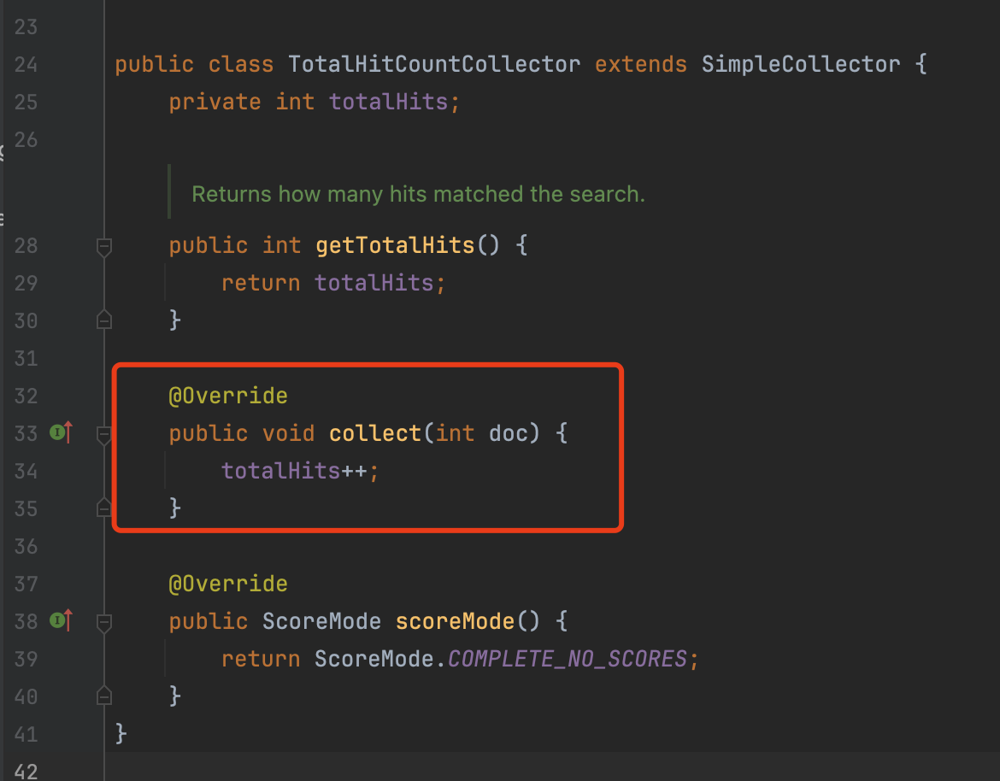
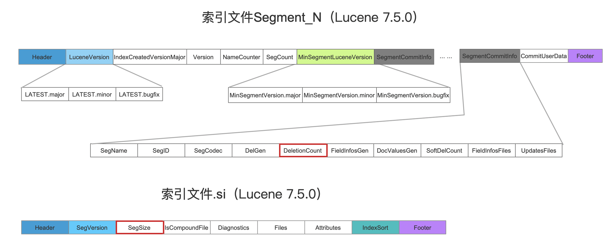
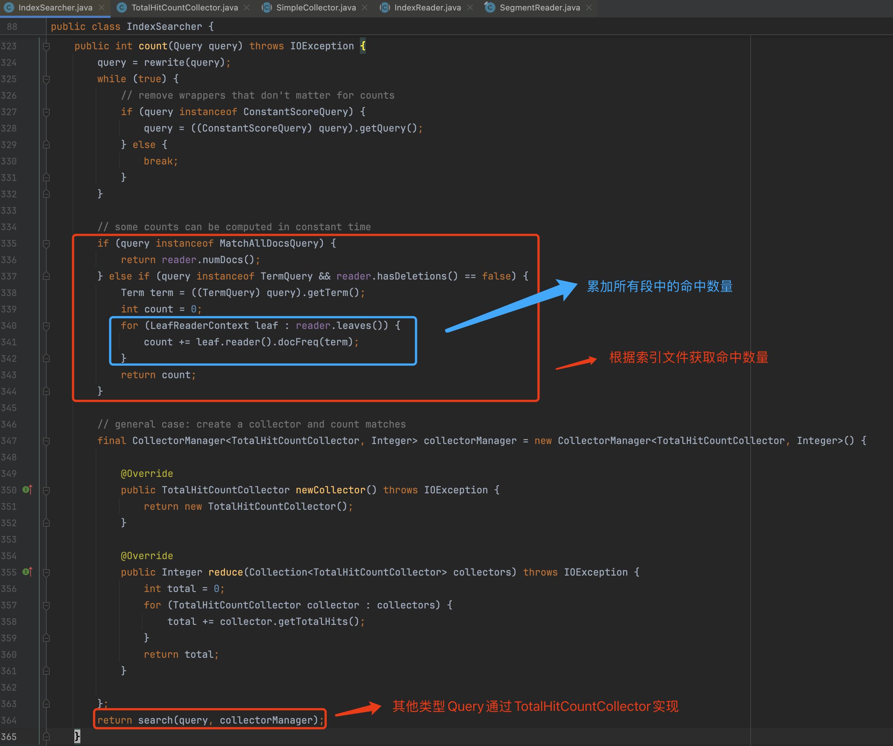
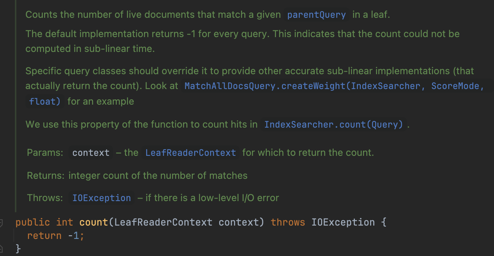
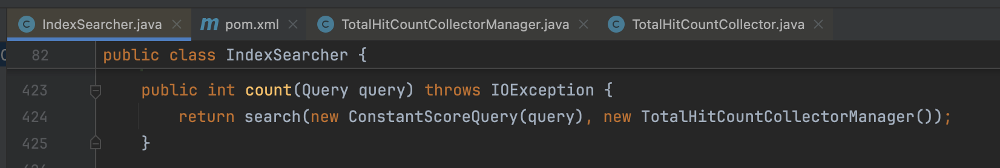
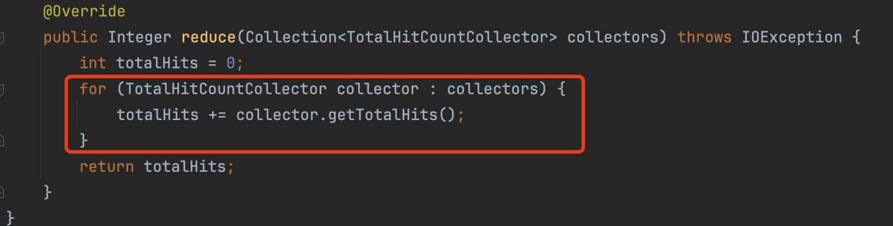
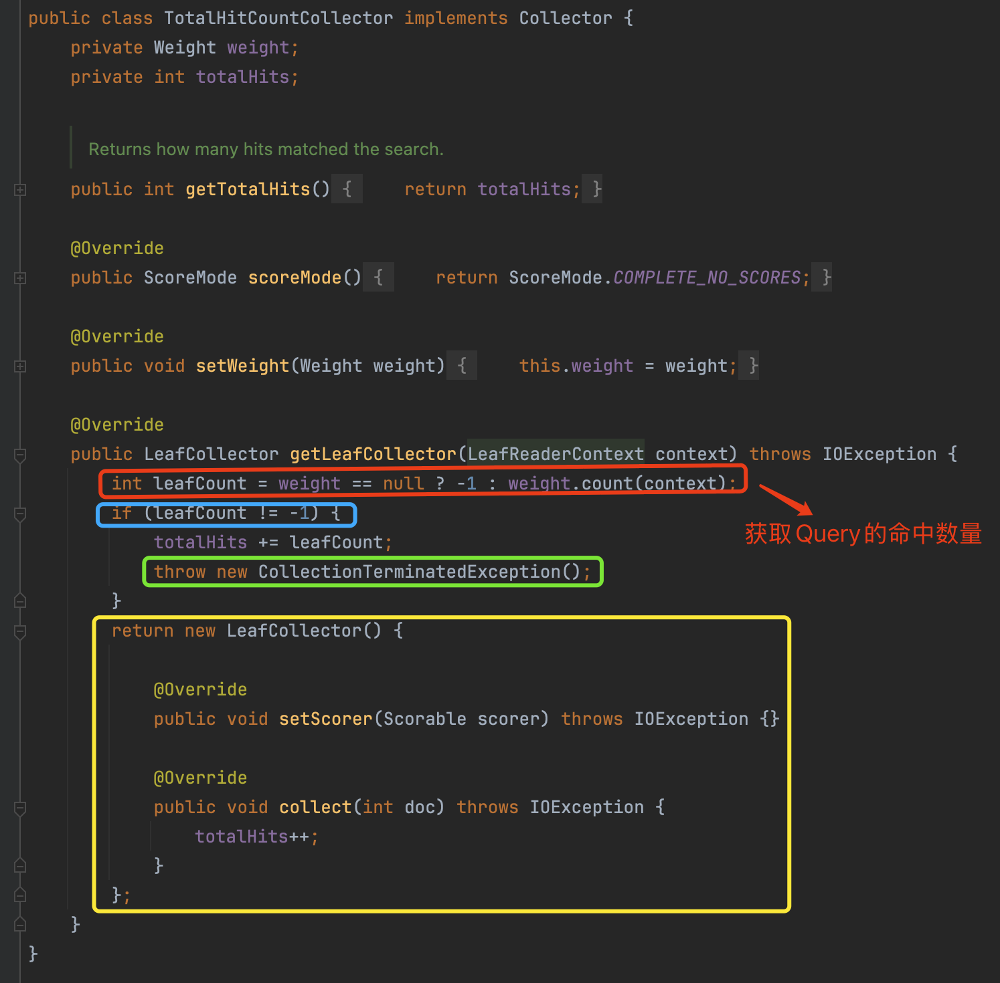

# [Count](https://www.amazingkoala.com.cn/Lucene/Search/)（Lucene 9.11.0）

## 概述

在OLAP系统，尤其在大数据分析和决策支持系统中，获取某个查询对应的命中数量（也称为查询结果的计数，即`count`是一个非常重要的指标。本篇文章将介绍Lucene中`count`功能的实现原理，以及该功能的部分演进历程。

Lucene中通过`IndexSearcher#count(Query query)`方法来获取某个查询的`count`，实现方式即在收集器[Collector](https://www.amazingkoala.com.cn/Lucene/Search/2019/0812/Collector%EF%BC%88%E4%B8%80%EF%BC%89/)（具体实现为`TotalHitCountCollector`）中累加匹配到的文档数量。

## TotalHitCountCollector（Lucene 8.10.0）

TotalHitCountCollector专门用来统计命中的文档数量，它不会处理任何其他事情。实现非常简单，所以我们直接贴出代码：

图1：

然而累加匹配这种方式存在一个问题：获取`count`的响应时间与命中的文档数量成正比，因为在`Collector`中，它是逐个处理文档的（见图1中红框方法）。但是有些Query，例如`MatchAllDocsQuery`、`TermQuery`，它们获取`count`的时间不会受到数据量的影响，能在一个相对固定时间（constant time）内计算出`count`。因为`count`的信息被记录在索引文件中，因此直接读取索引文件对应的字段就行了。

### TermQuery

通过[索引文件.tim](https://www.amazingkoala.com.cn/Lucene/suoyinwenjian/2019/0401/%E7%B4%A2%E5%BC%95%E6%96%87%E4%BB%B6%E4%B9%8Btim&&tip/)中`DocFreq`字段获取`count`，如下所示。

图2：

图1中`DocFreq`描述的是某一个段的`count`，因此如果索引中有多个段，那么需要累加所有段中的`DocFreq`。

**注意的是，如果段中存在被删除的文档，那么就不能通过`DocFreq`获取`count`，因为不能确定当前`term`是不是属于被删除的文档中**。

### MatchAllDocsQuery

这个Query分别通过[索引文件segments_N](https://www.amazingkoala.com.cn/Lucene/suoyinwenjian/2019/0610/%E7%B4%A2%E5%BC%95%E6%96%87%E4%BB%B6%E4%B9%8Bsegments_N/)中的`DeletionCount`字段以及[索引文件.si](https://www.amazingkoala.com.cn/Lucene/suoyinwenjian/2019/0605/%E7%B4%A2%E5%BC%95%E6%96%87%E4%BB%B6%E4%B9%8Bsi/)中的`SegSize`字段来获取`count`。其中`DeletionCount`描述的是某一个段中被标记为删除的文档数量，`SegSize`描述的是某一个段中文档总数。因此这两个字段的差值即命中数量`count`

图3：

`IndexSearcher#count(Query query)`方法中实现了`TermQuery`以及`MatchAllDocsQuery`快速获取命中数量的逻辑，也就是说它不需要通过`Collector`来逐个累加命中的文档数量：

图4：

## TotalHitCountCollector（Lucene 9.2.0）

Lucene后续提交了两个变更：[LUCENE-9620](https://issues.apache.org/jira/browse/LUCENE-9620)以及[LUCENE-10620](https://issues.apache.org/jira/browse/LUCENE-10620)，进一步增强了`count`功能：

- **LUCENE-9620**：在`Weight`中新增了`int count(LeafReaderContext context)`，它为每一种Query提供了一个抽象方法，如果这个Query能以次线性时间复杂度（sub-linear）计算出`count`，则不需要通过`TotalHitCountCollector`这种需要线性时间复杂度的计算方式。很明显上文中提到`TermQuery`跟`MatchAllDocsQuery`是能做到的，然后还有一些Query在**某些条件**下也是能做到的，在下面的文章中会介绍这些Query的实现方式。下面顺便贴出这个方法的注释：

图5：

- **LUCENE-10620**：这个变更将`Weight`传入到`Collector`中，其变更原因大家自行看下这个链接，但其中一个跟本篇文章相关的理由就是可以统一所有类型Query计算`count`的逻辑，也就是在`TotalHitCountCollector`中统一处理，并且不影响原有的时间复杂度

对比图4中`IndexSearcher#count(Query query)`的实现方式，变更后的代码如下所示：

图6：

顺便简单介绍下图6中`TotalHitCountCollectorManager，它只有一个作用：累加在所有段中的命中数量：

图7：

图7中，每一个段通过`TotalHitCountCollector`统计`count`，累加后的`totalHits`就是某个Query在索引中的命中数量

### TotalHitCountCollector的变更

**这段没有查询原理的知识可能会看不懂，可以跳过**

接下来我们看下TotalHitCountCollector的变化：

图8：

- **红框标注**：通过`Weight#count(LeafReaderContext context)`方法尝试获取`count`
- **蓝框标注**：如果返回值为`-1`，说明这个Query不能以次线性复杂度········计算`count`
- **绿框标注：**：由于我们已经获取到`count`，通过抛出一个异常的方式，结束这个段的处理，也就是不需要进行后续的`Collector`阶段（如果看不明白就算了，需要一些前置知识，可以简单）
- **黄框标注：**：提供8.10.0版本的`TotalHitCountCollector`，通过累加匹配到的文档数量计算`count`

## 次线性时间复杂度的Query

上文中我们提到，`Weight`为每个Query提供了`int count(LeafReaderContext context)`的抽象方法，如果能在次线性时间复杂度实现这个方法，那么计算Query的`count`时就不需要通过累加匹配到的文档数量。除了`TermQuery`以及`MatchAllDocsQuery`，接下来介绍下几个能实现次线性时间复杂度的一些Query。

### BooleanQuery

BooleanQuery由一个或多个子Query组成，并且每个子Query可以有`SHOULD`、`MUST`、`MUST_NOT`、`FILTER`这种四种属性的任意组合，所以这个BooleanQuery只能在部分场景下以次线性时间复杂度统计`count`。出于篇幅考虑，我们只介绍所有子Query都是`SHOULD`的情况：

- 所有子Query都是`SHOULD`
  - 如果所有的子Query都没有匹配到文档，那么BooleanQuery的`count == 0`
  - 如果至少有一个子Query能匹配到段中所有的文档，那么BooleanQuery的`count = ALL`（不包含被删除的文档）
  - 如果有一个子Query匹配到`N`，其中`0 < N < ALL`，并且其他所有的子Query都没有匹配到文档，那么BooleanQuery的`count == N`

其他情况因为实现代码量很少，可以自行阅读`BooleanWeight#count(LeafReaderContext context)`的源码。

### PointRangeQuery

