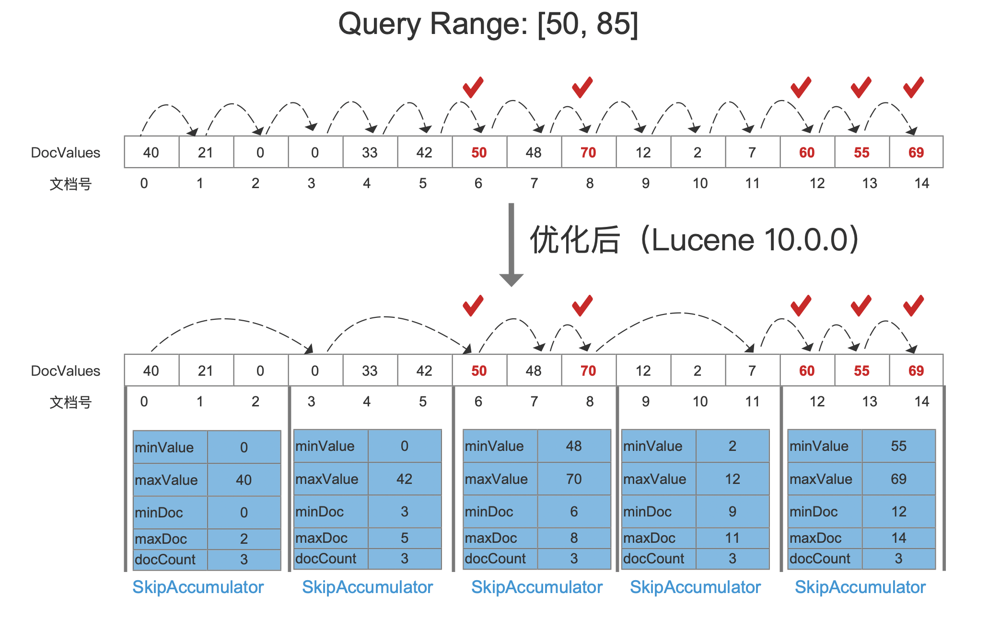
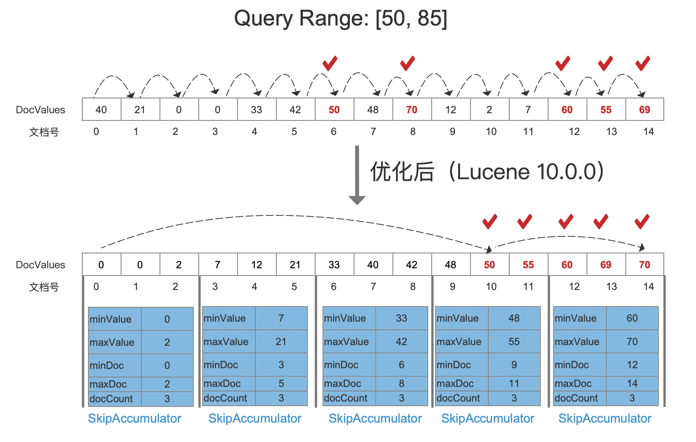
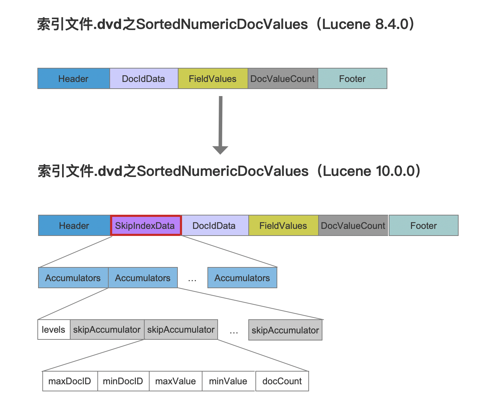

# DocValuesSkipper（Lucene 10.0.0）

从Lucene 10.0.0开始，新增了DocValuesSkipper功能，用来提高正排索引DocValues类型范围查询（[SortedNumericDocValuesRangeQuery](https://github.com/apache/lucene/blob/main/lucene/core/src/java/org/apache/lucene/document/SortedNumericDocValuesRangeQuery.java)、[SortedSetDocValuesRangeQuery](https://github.com/apache/lucene/blob/main/lucene/core/src/java/org/apache/lucene/document/SortedSetDocValuesRangeQuery.java)）的遍历文档号的能力。

提出该优化的issue见：[LUCENE-10396](https://github.com/apache/lucene/issues/11432)。

## 概述

我们以`SortedNumericDocValuesRangeQuery`的范围查询为例，比较下优化前后遍历文档的差异：

### 未使用IndexSort

图1：

[查看大图]()

- 优化前：`SortedNumericDocValuesRangeQuery`通过逐个遍历文档，然后判断每一篇文档的DocValues值是否在`[50, 70]`中。

- 优化后：在索引期间，每处理N（源码中为`DEFAULT_SKIP_INDEX_INTERVAL_SIZE = 4096`）个DocValues生成一个`SkipAccumulator`的数据结构。为了便于描述，图1中每3篇文档就生一个`SkipAccumulator`。
  - 在查询期间，通过`SkipAccumulator`中的`minxValue`和`maxValue`与查询范围`[50, 70]`比较，不在范围内的`SkipAccumulator`则跳过，否则就逐个遍历`SkipAccumulator`中的文档，判断对应的DocValues值是否在`[50, 70]`中

### 使用IndexSort

#### 没有缺失值

根据DocValus排序的前提下，如果没有缺失值（每篇文档中都有DocValues），那么只需要根据Query Range的上下界找到对应的文档号即可。

意味着文档号按照DocValues排序：

图2：

[查看大图]()

图1中，根据Query Range的上下界，分别找到对应的文档号`10`、`14`那么满足查询提交的文档号集合为[10, 14]。

#### 存在缺失值

该场景的处理方式跟图1一致。

## IndexSkip

上文中优化后的正排索引通过跳跃（Skip）实现了次线性时间复杂度的文档遍历。其原理依赖在索引期间构建的`IndexSkip`。我们先看下优化后的索引文件数据结构：

图3：

