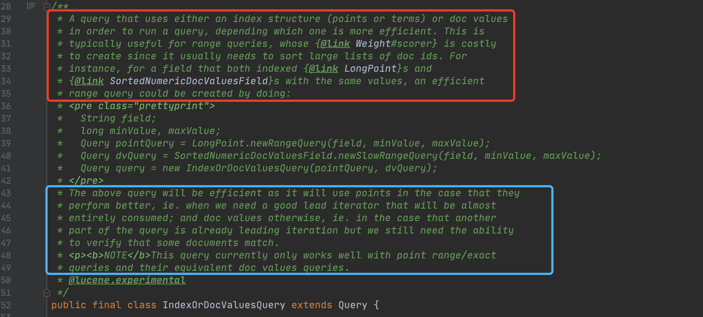
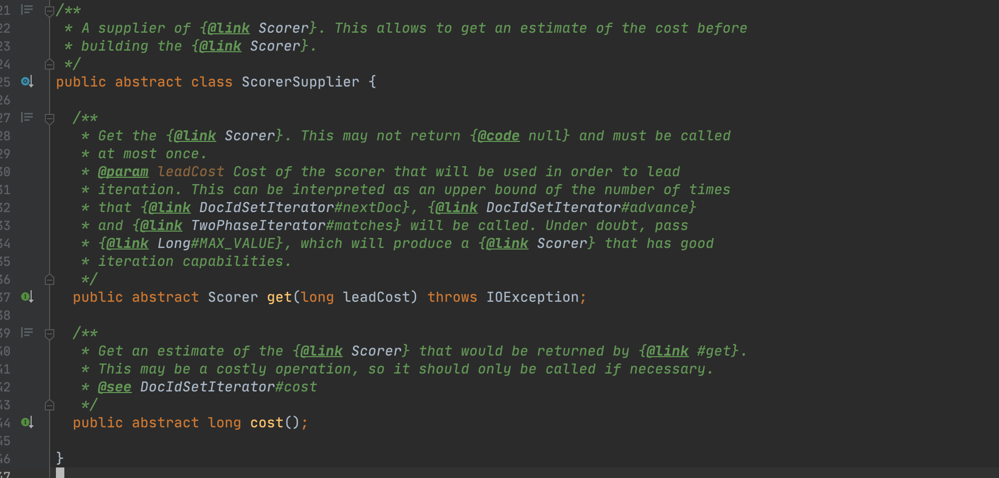
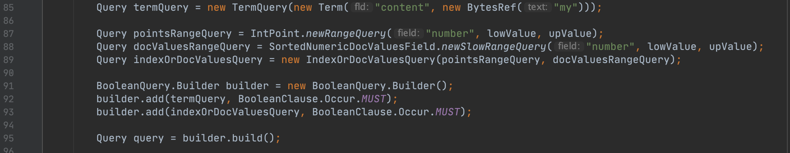

# [IndexOrDocValuesQuery](https://www.amazingkoala.com.cn/Lucene/Search/)（Lucene 8.9.0）

&emsp;&emsp;本篇文章介绍下Lucene中用于优化范围（数值类型point或者term类型）查询的Query：IndexOrDocValuesQuery。

&emsp;&emsp;我们先通过这篇[BLOG](https://www.elastic.co/cn/blog/better-query-planning-for-range-queries-in-elasticsearch)（如果链接失效，可以查看附件中的PDF）来概述下为什么会设计IndexOrDocValuesQuery。

## 求交集的问题

&emsp;&emsp;在文章[多个MUST的Query的文档号合并](https://www.amazingkoala.com.cn/Lucene/Search/2018/1218/27.html)中我们说到，执行一个由多个子Query组成，并且它们的关系为MUST的BooleanQuery时，其过程是先根据每个子Query获取一个**有序的文档号集合**，然后基于**开销最小的子Query**对应的文档号集合（我们称这个集合为leader iteration，其他的集合成为follow iteration）依次遍历这个集合，每次取出一个该集合中的文档号后，去其他集合中判断是否存在该文档号，当所有集合都存在相同的文档号，那么该文档号满足查询条件。

### 如何计算Query的开销

&emsp;&emsp;基于不同类型的Query，计算方式各不相同，但大部分情况下描述的是满足Query条件的文档数量。

&emsp;&emsp;例如在文章[查询TopN的优化之NumericDocValues（二）](https://www.amazingkoala.com.cn/Lucene/Search/2021/0629/195.html)中介绍了查询BKD树的开销的方法（见该文章中`如何估算新的迭代器中的文档号数量`的介绍）。

&emsp;&emsp;例如在TermQuery中，该查询的开销为包含term的文档数量，而该值保存在[索引文件.tim、.tip](https://www.amazingkoala.com.cn/Lucene/suoyinwenjian/2019/0401/43.html)中，如下图所示：

图3：


&emsp;&emsp;图3中，<font color=red>红框</font>标注的DocFreq字段描述的是包含某个term的文档数量。

&emsp;&emsp;上述的处理方式存在这么一个问题，为了便于介绍，我们假设只有两个文档号集合求交集，即只有一个leader iteration，一个follow iteration。如果leader iteration中只包含2个文档号，而follow iteration中包含海量的文档号。

- 问题一：构建follow iteration占用了不必要的额外内存开销，因为follow iteration中最多只有2篇文档号是满足查询条件的
- 问题二：极端情况下需要遍历follow iteration中所有的文档号才能判断是否存在交集

## 解决方案

&emsp;&emsp;[BLOG](https://www.elastic.co/cn/blog/better-query-planning-for-range-queries-in-elasticsearch)中首先给出了一个解决的方向，或者说给出了一个查询计划（query plan）的设计方式：

- 遍历所有的文档号：使用倒排（term或者point）
  - 由于在DocValues的数据结构中，正排值是按照文档号顺序先后存储的，如果通过正排值获取包含它的所有的文档号，其时间复杂度是线性的，相当的慢。比如说如果10篇文档中包含相同的正排值，那么通过这个正排值找到包含它的文档号集合需要查找5次。而在倒排中，包含某个term的所有文档号是集中存储的（见文章[索引文件之doc](https://www.amazingkoala.com.cn/Lucene/suoyinwenjian/2019/0324/42.html)、[索引文件.tim、.tip](https://www.amazingkoala.com.cn/Lucene/suoyinwenjian/2019/0401/43.html)介绍）
- 匹配指定的文档号：使用正排
  - 正排能根据文档号随机访问正排值（见文章[索引文件的读取（五）之dvd&&dvm](https://www.amazingkoala.com.cn/Lucene/Search/2020/0714/154.html)的介绍），能解决问题一跟二。points对应的BKD树是按照值（点数据）有序存储的，根据文档号查找是否存在某个值意味着需要先根据该值找到包含该值的文档号集合，即会出现上文中提到的问题二

## IndexOrDocValuesQuery

&emsp;&emsp;接着我们根据IndexOrDocValuesQuery来介绍上文中的解决方案的具体实现方式。首先看下这个Query的注释简单了解下：

图1：



&emsp;&emsp;图1中<font color=red>红框</font>标注的注释说的是：IndexOrDocValuesQuery封装了两个分别通过倒排（points或者terms）跟正排实现查询的Query，根据这两个Query的查询性能会选出一个去执行真正的查询（这个过程即执行查询计划）。IndexOrDocValuesQuery特别适用于范围查询，因为在执行范围查询时，当根据term或者point value找到包含它的文档号集合后，需要对这个集合进行排序操作，而这个过程的开销可能会很大，使用IndexOrDocValuesQuery**可能**（见下文`开销的比较`小节的介绍）可以避免这个开销。

&emsp;&emsp;另外在注释中还给出了使用IndexOrDocValuesQuery的例子，即构建了两个范围查询的Query，他们的查询条件是相同（范围查询的上下界以及查询的域名是相同）。其中一个使用BKD树进行查询，另一个使用DocValues，即正排数据结构，进行查询。注意的是要想使用IndexOrDocValuesQuery，必须在索引阶段**同时**使用DocValues跟Points对相同的数据生成索引信息。

&emsp;&emsp;图1中<font color=blue>蓝框</font>标注的注释说的是：注释中的例子的查询性能在两种场景中性能比较好。

- 场景一：IndexOrDocValuesQuery作为leader iteration，基于BKD树找出所有满足条件的文档集合的场景（不过文档号的排序开销仍然没法消除）
- 场景二：IndexOrDocValuesQuery作为follow iteration，通过leader iteration指定的文档号来匹配IndexOrDocValuesQuery对应的文档集合是否存在的场景（基于DocValues）

### ScorerSupplier（可跳过）

&emsp;&emsp;在继续介绍IndexOrDocValuesQuery之前，我们先介绍下ScorerSupplier类，该类就是因为设计IndexOrDocValuesQuery而新增的。

&emsp;&emsp;当然这个小结如果看的不是很明白也不会影响对IndexOrDocValuesQuery的理解，可以直接跳过，因为理解ScorerSupplier需要一些其他知识点，比如Scorer对象，在本文中不会做出介绍。

图2：



&emsp;&emsp;图2中该类的注释中说到：ScorerSupplier用来提供Scorer对象，会先进行开销计算来决定生成哪种Scorer。结合本文介绍的IndexOrDocValuesQuery，下文中我们将会知道，在IndexOrDocValuesQuery中是如何选择哪个Query对应的Scorer。图2中的get(long leadCost)方法的参数leadCost，当前Query作为follow iteration时，leadCost为lead iteration的开销值。

### 两个Query的选择

&emsp;&emsp;我们通过一个例子来介绍IndexOrDocValuesQuery如何选择它封装的两个Query。

图4：



&emsp;&emsp;图4中，代码第89行的IndexOrDocValuesQuery封装了两个Query，PointRangeQuery（我们称之为**主Query**，对应源码中的indexQuery）跟DocValuesRangeQuery（我们称之为**副Query**，对应源码中的dvQuery），随后IndexOrDocValuesQuery跟代码第85行的TermQuery组成一个BooleanQuery，并且它们的关系为MUST。

&emsp;&emsp;主Query跟副Query的选择逻辑中如下所示：

```java
if (threshold <= leadCost) {
    return 主Query;
} else {
    return 副Query;
}
```

##### leafCost

&emsp;&emsp;本文的开头介绍了leader iteration的概念，leader iteration对应的Query的开销即leafCost。

**如何选择TermQuery还是IndexOrDocValuesQuery对应的文档号集合作为leader iteration？**

&emsp;&emsp;选择方式很简单，即比较两个Query的开销，开销小的即胜出。这里想要着重说明的是IndexOrDocValuesQuery是如何计算开销的：主Query的开销作为IndexOrDocValuesQuery的开销。以图4为例，PointRangeQuery的开销将作为IndexOrDocValuesQuery的开销。

##### threshold 

&emsp;&emsp;threshold的计算方式为：

```java
    final long threshold = cost() >>> 3;
```

&emsp;&emsp;其中cost方法返回的是主Query的开销。以图4为例，即cost()方法返回的就是PointRangeQuery的开销。

## 结语

&emsp;&emsp;简单的总结：IndexOrDocValuesQuery即利用了倒排实现了包含某个term的所有文档号的快速收集，又利用了正排实现了通过文档号能随机访问某个term。

[点击](http://www.amazingkoala.com.cn/attachment/Lucene/Search/IndexOrDocValuesQuery/IndexOrDocValuesQuery.zip)下载附件


