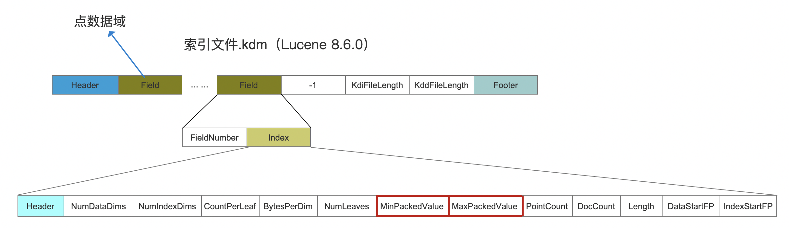
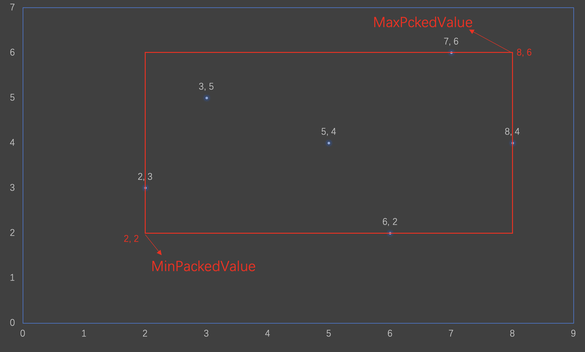
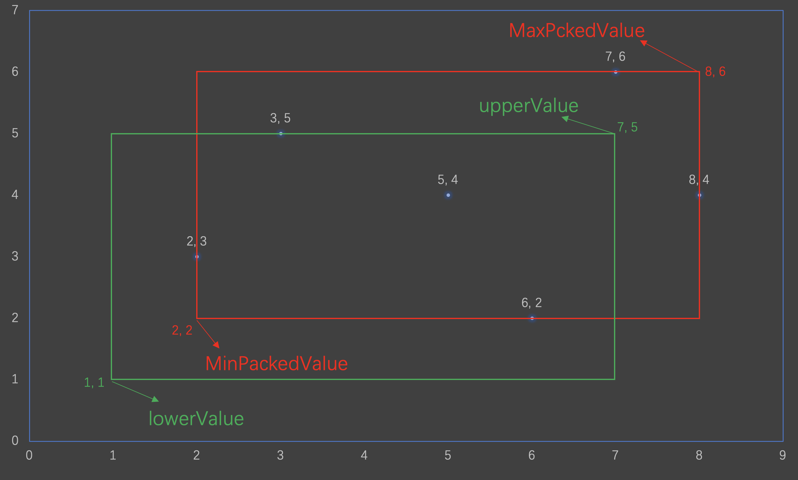
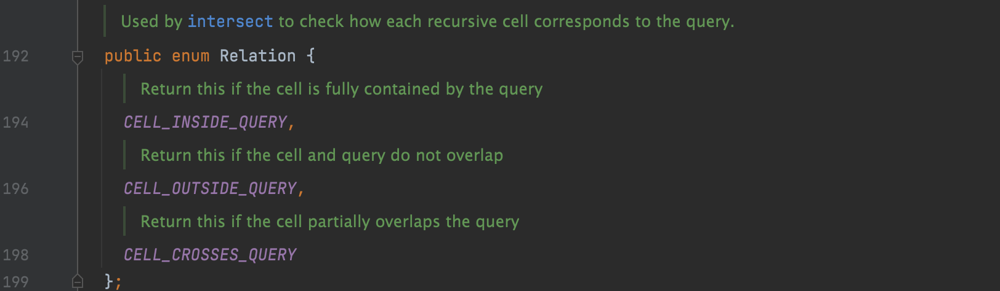
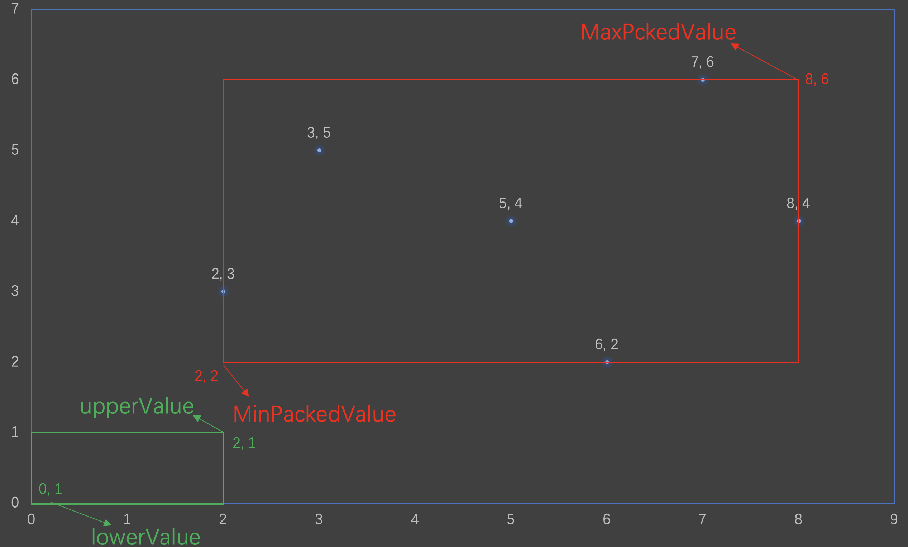
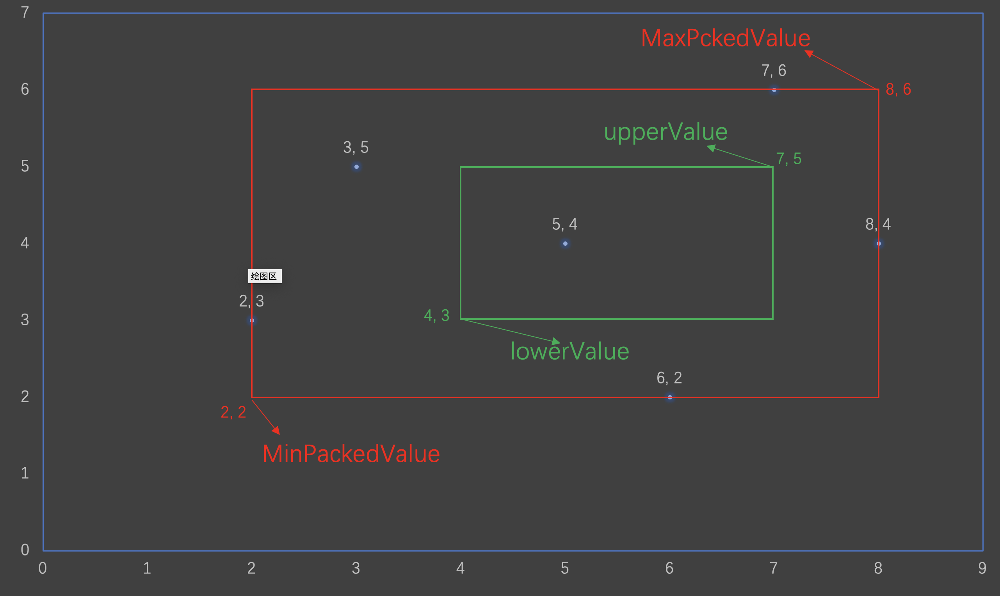
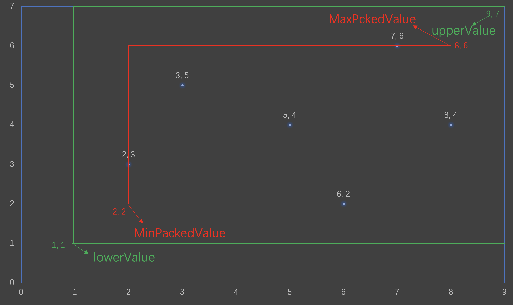
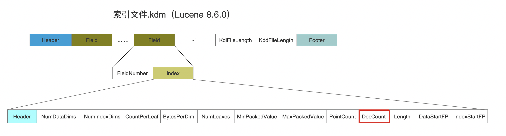
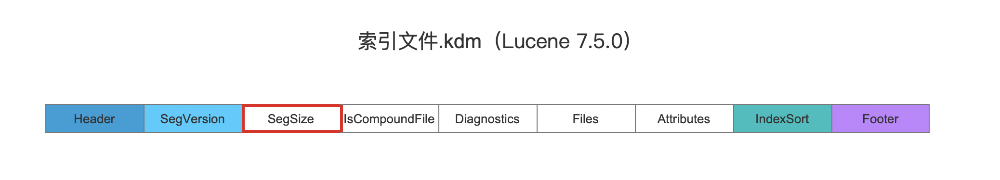

# [PointRangeQuery（一）](https://www.amazingkoala.com.cn/Lucene/Search/)（Lucene 8.11.0）

&emsp;&emsp;该系列文章开始介绍数值类型的范围查询PointRangeQuery，该类数据在Lucene中被称为点数据Point Value。

&emsp;&emsp;点数据按照基本类型（primitive type）可以划分IntPoint、LongPoint、FloatPoint、DoublePoint。点数据可以是多维度的，即一个点数据可以用多个维度值来描述。下图中我们分别定义了一维、二维、三维的点数据。可以理解为oneDim是直线上的一个点，twoDim是平面上的一个点，而threeDim是一个三维空间中的一个点。

图1：


## 相关文章

&emsp;&emsp;在文章[索引文件之dim&&dii](https://www.amazingkoala.com.cn/Lucene/suoyinwenjian/2019/0424/53.html)、[索引文件之kdd&kdi&kdm](https://www.amazingkoala.com.cn/Lucene/suoyinwenjian/2020/1027/172.html)中介绍了存储点数据对应的索引文件；在文章[索引文件的生成（八）之dim&&dii](https://www.amazingkoala.com.cn/Lucene/Index/2020/0329/128.html)到[索引文件的生成（十四）之dim&&dii](https://www.amazingkoala.com.cn/Lucene/Index/2020/0424/134.html)以及[索引文件的读取（一）之dim&&dii](https://www.amazingkoala.com.cn/Lucene/Search/2020/0427/135.html)到[索引文件的读取（四）之dim&&dii](https://www.amazingkoala.com.cn/Lucene/Search/2020/0506/138.html)中分别介绍了索引文件的生成、读取过程。另外在文章[Bkd-Tree](https://www.amazingkoala.com.cn/Lucene/gongjulei/2019/0422/52.html)中介绍存储点数据使用的数据结构以及通过一个例子概述了生成一颗BKD树的过程。

## Relation

### MinPackedValue、MaxPackedValue

&emsp;&emsp;在一个段Segment中，所有的点数据按照**点数据域**（Point Field，即图1中的oneDim、twoDim、threeDim）进行划分，对于某个点数据域，在[索引文件.kdm](https://www.amazingkoala.com.cn/Lucene/suoyinwenjian/2020/1027/172.html)中会存储下面两个字段MinPackedValue、MaxPackedValue：

图2：



&emsp;&emsp;MinPackedValue描述的是这个点数据域中**每个维度**的最小值，同理MaxPackedValue描述的是这个点数据域中每个维度的最大值。例如有某个点数据域中包含如下的二维点数据：

```java
{2, 3}, {6, 2}, {7, 6}, {8, 4}, {5, 4}, {3, 5}
```

&emsp;&emsp;可以看出在这个点数据集合中，第一个维度的最小值是2，第二个维度最小值是2，故MinPackedValue的值为{2, 2}，同理，第一个维度的最大值是8，第二个维度的最大值是6，故MaxPackedValue的值为{8, 6}。

&emsp;&emsp;如果我们把这个点数据集放到一个平面上，如下所示：

图3：



&emsp;&emsp;由图3可知，MinPackedValue、MaxPackedValue**不一定**是索引中的数据。同时可以看出，Lucene使用这两个值生成一个矩形，索引中所有的点数据都在这个矩形内。

### lowerValue、upperValue

&emsp;&emsp;我们在定义一个PointRangeQuery时，需要指定两个参数lowerValue、upperValue，分别表示我们这次范围查询的上界跟下界。

&emsp;&emsp;如果设定的查询条件为：

```java
lowerValue = {1, 1}
upperValue = {7, 5}
```

&emsp;&emsp;同MinPackedValue、MaxPackedValue一样，lowerValue、upperValue这两个点也可以形成一个矩形：

图4：



&emsp;&emsp;所以从图4可以看出，对于二维的点数据，PointRangeQuery的查询核心原理即：找出两个矩形相交（重叠）部分的所有点数据。

&emsp;&emsp;这两个矩形的相交关系在源码中使用Relation定义，它描述了三种相交关系：

图5：



### CELL_OUTSIDE_QUERY

&emsp;&emsp;CELL_OUTSIDE_QUERY描述的是查询条件跟索引中点数据的数值范围没有交集，即没有重叠（overlap），如下所示：

图6：



### CELL_CROSSES_QUERY

&emsp;&emsp;CELL_CROSSES_QUERY描述的是查询条件跟索引中点数据的数值范围部分重叠（partially overlaps）。

图7：


图8：



### CELL_INSIDE_QUERY

&emsp;&emsp;CELL_INSIDE_QUERY描述的是查询条件的数值范围包含索引中所有的点数据。

图9：



### 基于Relation访问节点

&emsp;&emsp;在文章[索引文件的生成（十一）之dim&&dii](https://www.amazingkoala.com.cn/Lucene/Index/2020/0410/131.html)中我们说到，在生成BKD树的过程中，每次生成一个内部节点（inner node），都需要计算这个节点对应的MinPackedValue、MaxPackedValue，他们描述了这个内部节点对应的所有叶子节点（leave node）中的点数据都在MinPackedValue、MaxPackedValue对应的矩形内。

&emsp;&emsp;那么当我们从根节点开始深度遍历后，查询条件跟每一个内部节点的MinPackedValue、MaxPackedValue在计算Relation后，会采取不同的方式访问其子节点。

- CELL_OUTSIDE_QUERY：说明当前内部节点下的所有叶子节点都不满足查询条件，那么就不用再处理这个内部节点下的所有子节点了。
- CELL_INSIDE_QUERY：说明当前内部节点下的所有叶子节点中的点数据都满足查询条件，那么随后只从当前内部节点出发执行深度遍历，并且不需要再对内部节点进行Relation的计算，直到访问到叶子节点，并读取其包含的文档号。
- CELL_CROSSES_QUERY：说明当前内部节点下的所有叶子节点只有部分满足查询条件，那么在分别访问内部节点的左右子节点（内部节点）时，都需要计算Relation。

## 收集文档号集合的策略

&emsp;&emsp;在深度遍历BKD树的过程中，在读取叶子节点后，文档号会被收集。在PointRangeQuery中，遍历之前会根据索引中的一些信息执行不同的收集策略：

### 策略一：根据段中的最大文档号生成文档号集合

&emsp;&emsp;执行策略一需要同时满足两个条件：

-	条件一：段中每一篇文档都包含某个域的点数据
-	条件二：索引中某个域的点数据都满足查询条件

#### 条件一

&emsp;&emsp;如果[索引文件.kdm](https://www.amazingkoala.com.cn/Lucene/suoyinwenjian/2020/1027/172.html)中的DocCount字段的值跟**段中的文档数量segSize**相同，那么满足条件一：段中每一篇文档都包含某个域的点数据。

图10：



&emsp;&emsp;在生成索引文件.kdm期间，会使用[FixedBitSet](https://www.amazingkoala.com.cn/Lucene/gongjulei/2019/0404/45.html)来收集文档号，FixedBitSet使用类似bitmap原理存储文档号，所以它不会重复存储相同的文档号。DocCount字段描述的是包含某个点数据域的文档数量，所以即使一篇文档中定义了多个相同域名的点数据域，对于DocCount只会执行+1操作。

图11：



&emsp;&emsp;另外，段中的文档号数量segSize通过[索引文件.si](https://www.amazingkoala.com.cn/Lucene/Search/2020/0428/136.html)获得，在代码中可以通过reader.maxDoc()方法获得。

#### 条件二

&emsp;&emsp;通过比较图10中的MinPackedValue、MaxPackedValue与查询条件的上下界进行比较，如果他们的Relation为CELL_INSIDE_QUERY，那么满足条件二：索引中某个域的点数据都满足查询条件。

&emsp;&emsp;执行策略一后，我们就可以在不遍历BKD树的情况下收集到满足查询条件的结果，即[0, reader.maxDoc()]这个区间的文档集合。

### 策略二：反向收集文档号信息

&emsp;&emsp;执行策略一需要同时满足三个条件：

- 条件一：段中每一篇文档都包含某个域的点数据
  - 同策略一中的条件一，不赘述

- 条件二：每篇文档中只包含一个某个点数据域的点数据
  - 如果[索引文件.kdm](https://www.amazingkoala.com.cn/Lucene/suoyinwenjian/2020/1027/172.html)中的PointCount字段（见图10）的值跟DocCount相同，那么满足条件二
  - PointCount字段描述的是所有文档中的所有某个点数据的点数据的数量，比如一篇文档中定义了3个相同域名的点数据域，对于PointCount会执行+3操作，而DocCount只会执行+1操作
  
- 条件三：满足查询条件的点数据数量（估算值cost，下一篇文章中会介绍cost的计算方式）占段中的文档数量的一半以上（> 50%）

&emsp;&emsp;这三个条件针对的是对于这类索引数据的优化：如果所有文档中**有且只有一个**某个点数据域的点数据，如果cost大于文档数量的一半，那么就收集不满足查询条件的文档号。见源码中的注释：

```text
If all docs have exactly one value and the cost is greater than half the leaf size then maybe we can make things faster by computing the set of documents that do NOT match the range.
```

&emsp;&emsp;执行策略二后，在随后遍历BKD树的过程中，我们只收集那些不满足查询条件的文档号。

### 策略三：收集满足查询条件的文档号

&emsp;&emsp;在无法满足策略一跟策略二的条件，那么就执行默认的策略三，即在随后遍历BKD树的过程中，我们收集那些满足查询条件的文档号。

### 节点访问规则IntersectVisitor

&emsp;&emsp;上文说道，对于策略二，它获取的是不满足查询条件的文档号，而对于策略三，它则是获取满足查询条件的文档号。不管哪一种策略，他们的**相同点都是使用深度遍历读取BKD树，不同点则是访问内部节点跟叶子节点的规则，这个规则即IntersectVisitor**。

## 结语

&emsp;&emsp;基于篇幅，我们将在下一篇文章中介绍节点访问规则IntersectVisitor以及策略二中条件三的cost的计算过程。 

[点击](http://www.amazingkoala.com.cn/attachment/Lucene/Search/PointRangeQuery/PointRangeQuery（一）.zip)下载附件
