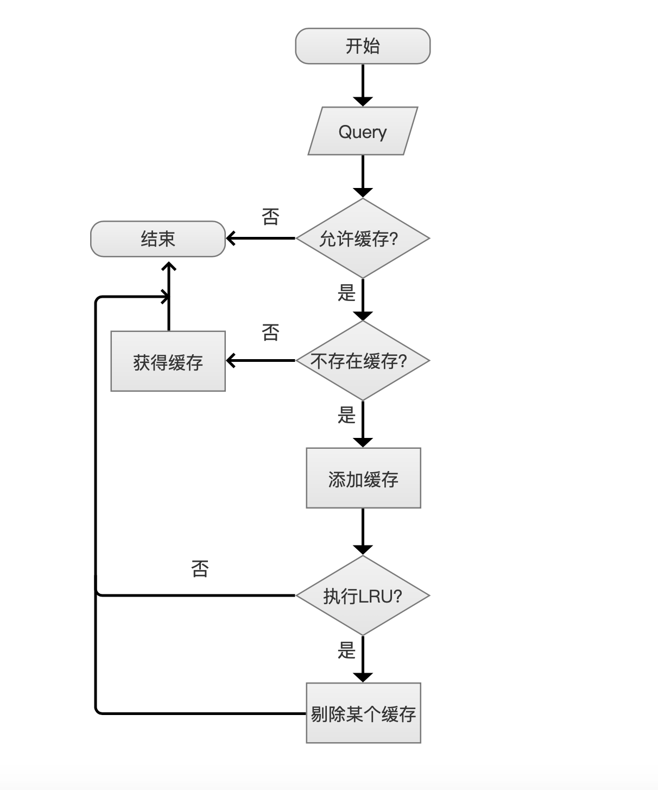
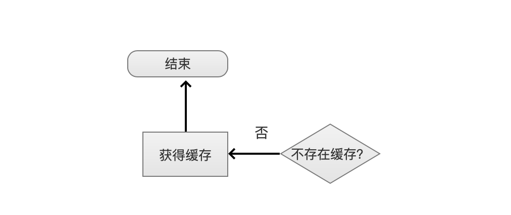
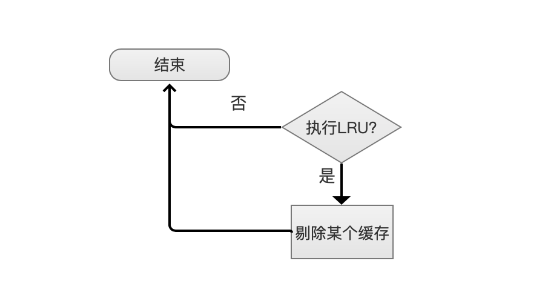

# [LRUQueryCache](https://www.amazingkoala.com.cn/Lucene/Search/)（Lucene 7.5.0）
&emsp;&emsp; LRUQueryCache用来对一个Query查询的结果进行缓存，缓存的内容仅仅是文档号集，由于不会缓存文档的打分（Score），所以只有不需要打分的收集器（Collector）才可以使用LRUQueryCache，比如说TotalHitCountCollector收集器，另外缓存的文档号集使用BitDocIdSet对象进行存储，在BitDocIdSet中实际使用了[FixedBitSet](https://www.amazingkoala.com.cn/Lucene/gongjulei/2019/0404/45.html)对象进行存储。
&emsp;&emsp;即使使用了不需要打分的收集器，也不一定对所有的查询结果进行缓存，有诸多苛刻的条件，在下文中会详细介绍。
&emsp;&emsp;LRUQueryCache中缓存的Query结果是有上限限制的，在每次添加一个缓存时，根据两种阈值来判断是否需要将某个已经缓存的数据剔除，使用的算法为LRU：

- maxCachedQueries：缓存的结果数量，默认值1000
- maxRamBytesUsed：缓存占用的内存量，默认值32MB或可分配内存的5%中的较小值

当然，我们可以自定义maxCachedQueries跟maxRamBytesUsed的值。

# LRUQueryCache流程图
图1：

## 开始
图2：

在执行查询时，如果我们使用了一个不需要打分的Collector，那么该Query就可以进入LRUQueryCache的流程之中，比如说TermsCollector、TotalHitCountCollector等等。默认的查询使用的是TopScoreDocCollector，他需要打分，所以无法使用LRUQueryCache的功能。

## Query
图3：

查询定义的Query对象。
## 允许缓存？
图4：

允许缓存受限于诸多条件，下面一一列出：

### Query条件
有些Query不需要缓存：

- TermQuery：TermQuery作为最常用的Query，源码中给出不需要缓存的理由是这种查询已经足够快(plenty fast)了。
- MatchAllDocsQuery：此Query是获得IndexReader中的所有文档号，在不使用cache的情况下获取所有结果的逻辑是从0开始遍历到IndexReader中的最大的文档号(因为每一篇文档都是满足要求的)，如果缓存这个结果的话，由于使用[FixedBitSet](https://www.amazingkoala.com.cn/Lucene/gongjulei/2019/0404/45.html)存储了cache，在生成缓存的过程中需要编码，并且读取cache还需要解码，查询性能肯定是相比较大的。
- MatchNoDocsQuery：此Query不会匹配任何文档，所以没有缓存的必要
- BooleanQuery：BooleanQuery中没有任何子Query是不用缓存的
- DisjunctionMaxQuery：DisjunctionMaxQuery中没有任何子Query是不用缓存的

满足了Query条件后，会将当前Query（Query对象的HashCode）添加到LRU算法中，并且当前Query为cache中最近最新使用，为了后面执行LRU算法做准备。
### 索引文件条件
根据当前的索引文件条件决定是否允许缓存，比如说存放[DocValues](https://www.amazingkoala.com.cn/Lucene/DocValues/2019/0218/33.html)的[.dvm、.dvd](https://www.amazingkoala.com.cn/Lucene/DocValues/)文件在更新后，那么就不允许缓存。
### 段（Segment）条件
即使满足Query条件、索引文件条件，还要考虑当前段中的条件，条件跟当前段中包含的文档数量相关：
- 最坏的情况下缓存所有子IndexReader中所有的文档号需要的内存量（worstCaseRamUsage）、目前最大可使用的内存量（totalRamAvailable：），这个值即上文中的maxRamBytesUsed，当满足(worstCaseRamUsage * 5) < totalRamAvailable时就允许缓存
- 当前子IndexReader中包含的文档号数量 perReaderDocNum ≥ minSize(默认值10000)，并且 perReaderDocNum占所有子IndexReader的文档总量totalDocNum满足 (perReaderDocNum / totalDocNum ≥ minSizeRatio (默认值0.03))， 其中minSize跟minSizeRatio可配
### 子IndexReader条件
不是所有的IndexReader都适合缓存，比如说facet中读取taxonomy的OrdinalMappingLeafReader，在以后的文章中介绍facet会给出原因。
### 线程竞争条件
当多个线程使用同一个IndexSearcher对象，那么cache就会成为临界区，当前线程如果访问cache发现已被其他线程占用，源码中的处理方式是不等待锁资源，即不使用LRUQueryCache，原因是在高并发下，查询被阻塞的时间可能跟查询个数成正比，反而降低了查询性能。锁资源被占用的情况有以下几种：
- 其他线程正在添加一个cache，并且这个cache有可能不是当前线程的Query的cache
- 其他线程正在读取一个cache，源码中使用的不是读写锁，所以即使当前线程可能也是读操作，也无法访问cache

## 不存在缓存？
当满足缓存条件后，继续下面的流程
图5：

如果存在缓存，那么直接取出缓存就可以退出了，需要重复的是，返回的结果只是文档号集。
图6：

如果不存在缓存，那么我们需要增加缓存，但是增加缓存还存在一些额外条件：

### 允许增加缓存条件
#### Query条件
这里的Query条件跟上文中的Query条件是一样的，这里还要继续检查一遍当前的Query是否需要缓存，因为如果某个Query使用多线程在多个子IndexReader中并行查询，由于这些线程使用同一个Weight对象，并且在上文中的Query条件检查中会将当前Query添加到LRU算法中，为了避免重复添加造成错误的计数(相同Query的历史查询计数，下文会介绍)，所以在上文中的Query条件除了第一个线程，其他线程会跳过这一步骤，故在这里需要检查Query条件。
#### 历史查询条件
在满足Query条件的前提下，并且同时满足历史查询计数打到阈值，才允许增加缓存，不同的Query对象的阈值是不同的，目前Lucene 7.5.0版本中域值根据Query对象有以下几种数值：

- 2：如果是MultiTermQuery、MultiTermQueryConstantScoreWrapper、TermInSetQuery、PointQuery(点数据类型的所有查询)，那么这些Query在历史查询中出现过2次，就允许增加缓存
- 4：如果是BooleanQuery、DisjunctionMaxQuery，那么这些Query在历史查询中出现过4次，就允许增加缓存
- 5：其他类型的Query

### 执行查询，保存结果
当满足允许增加缓存条件后，就可以执行一次常规的查询，获得查询结果后，即文档号集，存放到[FixedBitSet](https://www.amazingkoala.com.cn/Lucene/gongjulei/2019/0404/45.html)，即缓存。
## 执行LRU?
图7：

上文中提到，缓存的个数跟占用内存量是有上限限制的，每当添加一个缓存后，会判断是否需要执行LRU算法来剔除某个旧的缓存或者直接添加新的缓存。在随后的文章中会详细介绍在Lucene中LRU算法的实现，因为这不是LRUQueryCache专有的功能，它属于一个Util类，出于正确分类目的，会另外写一篇文章。
# 结语
文章中一些细节并没有详细介绍，比如说 为什么有些IndexReader不允许缓存、哪些IndexReader不允许缓存、为什么段文件更新后不允许缓存，在后面的文章中会解释这些问题。
[点击下载](http://www.amazingkoala.com.cn/attachment/Lucene/Search/QueryCache/LRUQueryCache/LRUQueryCache.zip)Markdown文件