# [RangeField（一）](https://www.amazingkoala.com.cn/Lucene/Search/)（Lucene 8.4.0）

&emsp;&emsp;本文将介绍Lucene中提供的范围域（RangeField），以及基于该域实现的范围查询。

## 范围域（RangeField）

&emsp;&emsp;RangeField使得一个域有了空间的概念，并且最多支持到四维（4 dimensions）：

-  1 dimensions：该维度的域描述了一条直线上的一段长度，如果有如下的定义：

图1：

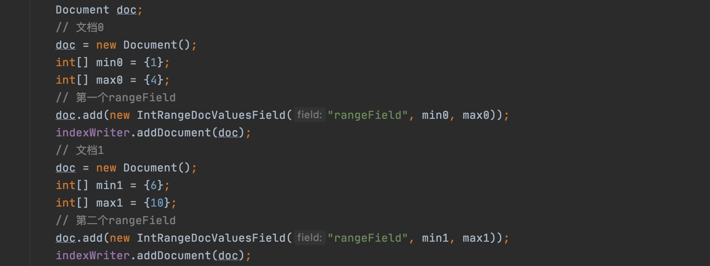

&emsp;&emsp;用图形来描述这个域的话如下所示：

图2：

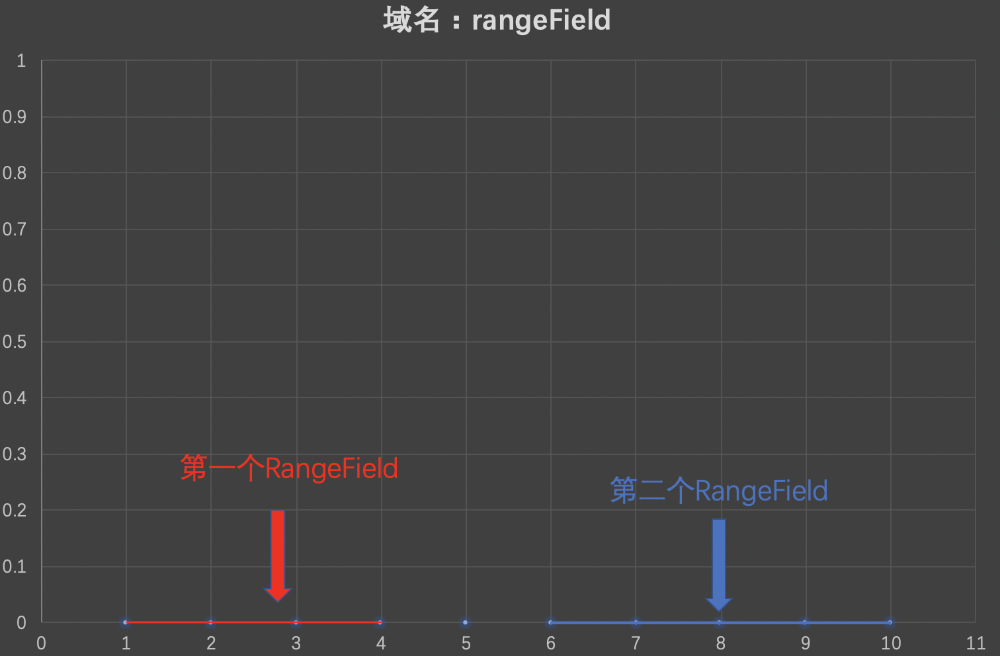

-  2 dimensions：该维度的域描述了平面上的一个矩形，如果有如下的定义：

图3：

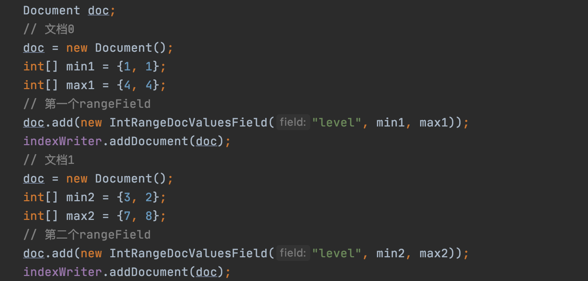

&emsp;&emsp;用图形来描述这个域的话如下所示：

图4：

- 3 dimensions：该维度的域描述了空间中的一个立方体

- 4 dimensions：该维度的域描述了四次元立方体（tesseract）

&emsp;&emsp;为了便于描述，我们将以2 dimensions为例，继续下文的介绍。

## BinaryRangeDocValuesField

&emsp;&emsp;在Lucene 8.2.0版本中，新增了[BinaryRangeDocValuesField](https://issues.apache.org/jira/browse/LUCENE-8362)，使得能根据范围域实现范围查找，在之前的版本中，已经提供了一些跟范围域的相关操作，即IntRange、DoubleRange、FloatRange类中相关的方法，在后面的文章中，将会介绍这几个类，并且将介绍它们与BinaryRangeDocValuesField在存储，查询上的差异。

### 实现类

图5：

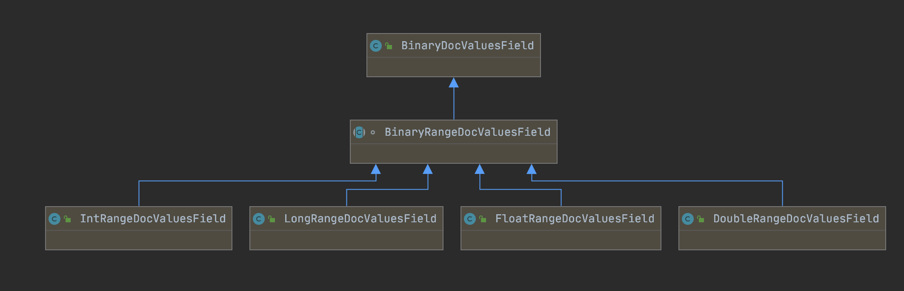

&emsp;&emsp;图5中BinaryRangeDocValuesField继承了BinaryDocValuesField，同时有四个实现类，故可以了解到，通过BinaryRangeDocValuesField存储的范围域的信息最终使用DocValues存储，即索引信息存储在索引文件.dvd&&.dvm中。

### 域值编码（encode）

&emsp;&emsp;以图3为例，域名为"level"，域值为两个int类型数组min1、max1，Lucene中所有数值类型的域值都会被重新编码为一个字节数组，并且该字节数组可以用于排序，同时字节数组之间的排序关系跟对应数值之间的排序关系是一致的，编码的过程在文章[索引文件的生成（八）之dim&&dii](https://www.amazingkoala.com.cn/Lucene/Index/2020/0329/128.html)中已经介绍过了，不赘述。

&emsp;&emsp;域值在转化为字节数组后，其写入到索引文件的过程跟使用BinaryDocValues是一致的，写入跟读取BinaryDocValues的过程分别见文章[索引文件的生成（二十一）之dvm&&dvd](https://www.amazingkoala.com.cn/Lucene/Index/2020/0605/147.html)跟[索引文件的读取（六）之dvd&&dvm](https://www.amazingkoala.com.cn/Lucene/Search/2020/0715/155.html)的介绍。

### 范围查询

&emsp;&emsp;以图3中的IntRangeDocValuesField为例，通过调用IntRangeDocValuesField类中的newSlowIntersectsQuery方法生成一个Query，我们看下源码中该方法的注释：

图6：

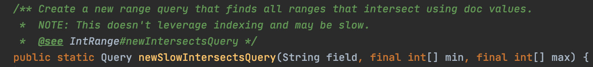

&emsp;&emsp;图6的注释大意为：使用DocValues找到所有与查询条件（查询条件也是一个范围域）相交（intersect）的范围域，在下文的图16中我们会介绍如何相交的判定方式。

&emsp;&emsp;最后使用IndexSearcher.search()方法实现范围查询，其核心的流程图如下所示：

图7：

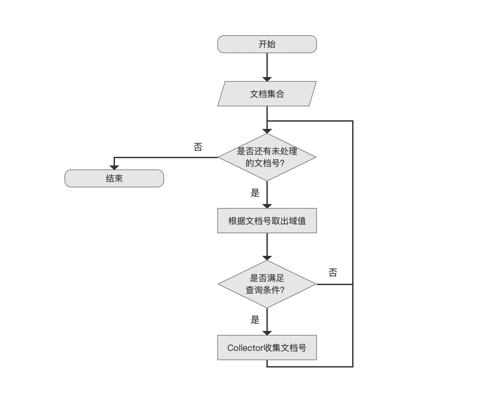

#### 两阶段遍历（TwoPhaseIterator）

&emsp;&emsp;在介绍图6的流程图之前，先介绍下Lucene中的两阶段遍历TwoPhaseIterator，我们先看下源码中关于两阶段遍历的注释：

图8：

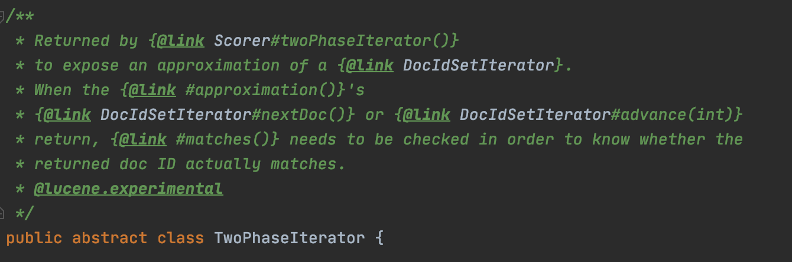

&emsp;&emsp;图7的注释大意为：先通过DocIdSetIterator对象获取一个文档号集合，该集合中不一定都满足查询条件，即所谓的approximation，通过nextDoc()或者advance()方法遍历该文档号集合（第一阶段），将每一个文档通过matches()方法（第二阶段），在该方法中能真正的确定文档号是否满足查询条件。

&emsp;&emsp;图6的流程中正是使用了两阶段遍历的方式，**其中流程点`文档集合`即通过DocIdSetIterator对象获得，流程点`是否还有未处理的文档号？`中为两阶段遍历的第一个阶段，接着在流程点`是否满足查询条件？`通过matches()方法判断是否满足查询条件进行所谓的两阶段遍历的第二个阶段**。

&emsp;&emsp;当前版本中，无论是哪种类型的查询，都是通过遍历DocIdSetIterator对象中的文档号来获取满足查询条件的文档号，但是当DocIdSetIterator对象中的文档集合只是所谓的approximation，那么就需要使用两阶段遍历来处理了。

&emsp;&emsp;如果我们有以下的查询条件：

图9：

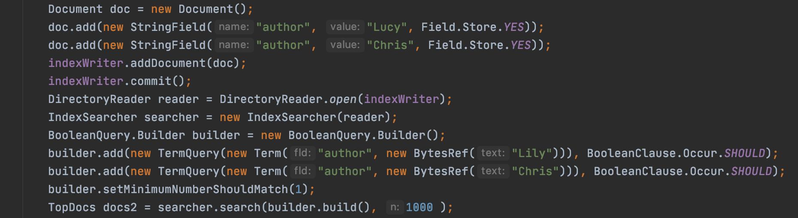

&emsp;&emsp;图9中查询条件为两个TermQuery的组合，在系列文章[索引文件的生成（一）](https://www.amazingkoala.com.cn/Lucene/Index/2019/1226/121.html)中我们知道，通过域名"author"跟域值能直接在索引文件中准确的定位到满足条件的文档号，那么上图中的这种查询就能获得一个DocIdSetIterator对象，并且它包含的文档号不是所谓的approximation，故就不要两阶段遍历的处理方式了。

#### 两阶段遍历的第一个阶段

图10：

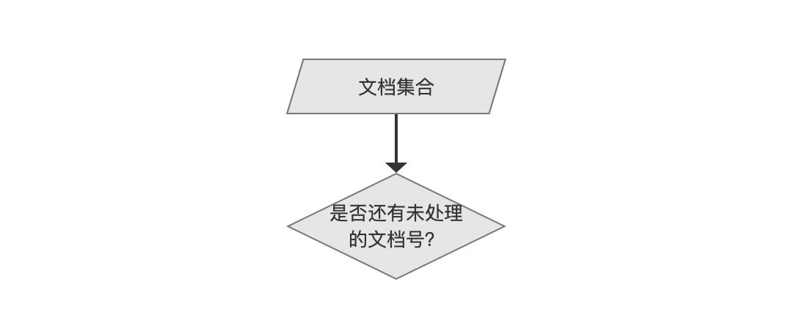

&emsp;&emsp;由于BinaryRangeDocValuesField使用DocValues存储，故跟其他DocValues一样，以图3为例，包含域名为"level"的所有BinaryRangeDocValuesField的文档号存储在索引文件.dvd的DocIdData字段，如下所示：

图11：

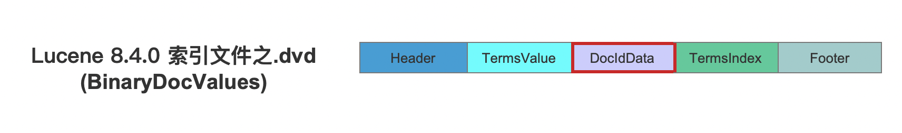

&emsp;&emsp;DocIdData字段在内存中用IndexedDISI来描述，而[IndexedDISI](https://www.amazingkoala.com.cn/Lucene/gongjulei/2020/0511/140.html)是继承DocIdSetIterator的子类，如下所示，故流程点`文档集合`中的文档集合即上文中我们提到的DocIdSetIterator对象中的文档集合，随后开始每一个文档号，执行两阶段遍历的第一个阶段。

图12：

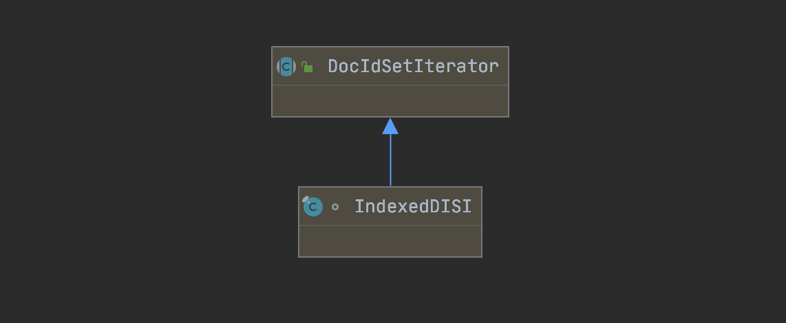

&emsp;&emsp;另外读取图10的DocIdData字段的过程可以阅读文章[引文件的读取（五）之dvd&&dvm](https://www.amazingkoala.com.cn/Lucene/Search/2020/0714/154.html)，而如何从IndexedDISI获取文档号可以阅读文章[IndexedDISI（一）](https://www.amazingkoala.com.cn/Lucene/gongjulei/2020/0511/140.html)、[IndexedDISI（二）](https://www.amazingkoala.com.cn/Lucene/gongjulei/2020/0514/141.html)。

#### 根据文档号取出域值

图13：

&emsp;&emsp;从IndexedDISI中获取了一个文档号之后，我们需要根据这个文档号找到对应的域值，以图3为例，即域名"level"对应的域值，在文章[索引文件的读取（六）之dvd&&dvm](https://www.amazingkoala.com.cn/Lucene/Search/2020/0715/155.html)中我们详细的介绍了如何根据文档号从图10的索引文件中找到对应的域值，这里不赘述。

#### 两阶段遍历的第二个阶段

图14：

&emsp;&emsp;我们通过一个例子来说明流程点`是否满足查询条件`的判断过程，该例子的完整demo见 https://github.com/LuXugang/Lucene-7.5.0/blob/master/LuceneDemo8.4.0/src/main/java/io/lucene/DcoValues/rangeField/IntRangeDocValuesFieldTest.java ：

图15：

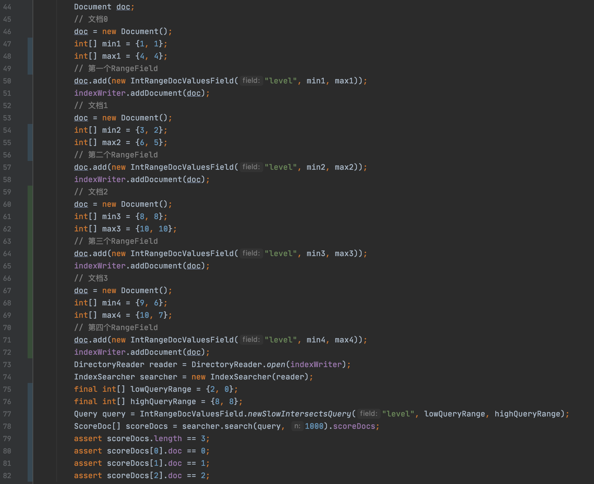

&emsp;&emsp;图形化图14中的范围域以及查询条件后如下所示：

图16：

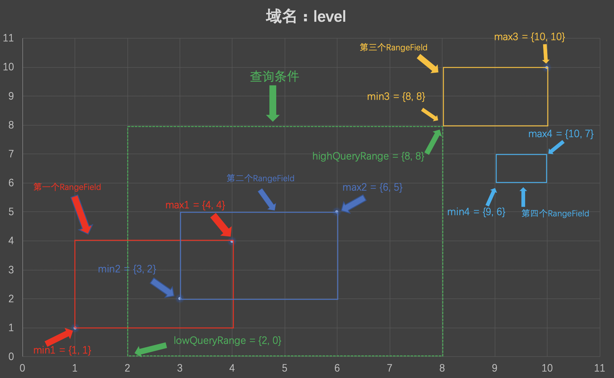

&emsp;&emsp;在上文中我们说到，图15中第77行的newSlowIntersectsQuery方法会找到所有与查询条件（查询条件也是一个范围域）相交（intersect）的范围域，图15中第75、76行定义了查询条件的范围域，即图16中根据lowQueryRange跟highQueryRange围成的一个绿色的框，另外图16中红框、蓝框、黄框、天蓝色分别对应图15中的四篇文章中的范围域，显而易见，红框、蓝框、黄框跟绿框的是相交的，意味着文档0、文档1、文档2满足查询条件。

&emsp;&emsp;图16中，第三个RangeField跟查询条件也是相交的，相交部分为一个点。

&emsp;&emsp;上文中通过图形很容易看出是否相交，接着我们介绍在代码中是如何判断相交的，判断是否相交的代码在matches()方法中实现，即两阶段遍历的第二个阶段。

&emsp;&emsp;由于判断相交的代码比较简单，故我们直接贴出来：

图17：

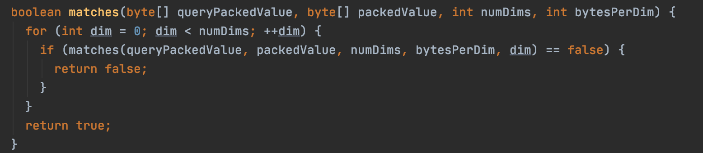

&emsp;&emsp;可以看出，判断方式为逐个比较每个维度，当**所有维度**都满足**某个条件**，那么就认为是相交的，对于图15的例子，有两个维度，即图16中X、Y轴，这里的**某个条件**描述是两个子条件的组合，并且它们需要同时满足：

- 子条件1：某个维度下，查询条件在该维度下的最大值必须**大约等于**范围域在该维度下的最小值
- 子条件2：某个维度下，查询条件在该维度下的最小值必须**小于等于**范围域在该维度下的最大值

&emsp;&emsp;在同时满足上述两个子条件后，那么范围域必定是跟查询条件相交的，我们以图16中的第三个RangeField为例，在X轴的维度上，查询条件在这个维度上的最大值为8，范围域在这个维度的最小值为8，满足大于等于的关系，在Y轴的维度上，查询条件在这个维度上的最小值为0，范围域在这个维度上的最大值为10，满足小于等于的关系，故第三个RangeField跟查询提交是相交的，即图15中包含第三个RangeField的文档2满足查询条件。

&emsp;&emsp;在流程点`是否满足查询条件？`完成两阶段遍历的第二个阶段，最后文档号将被Collector收集。

&emsp;&emsp;基于上文中判断相交的逻辑，使得在定义一个RangeField的min跟max数组时会有一定的限制，该要求就是在每一个维度上，min数组在这个维度上的值必须**小于**max数组在这个维度上的值，否则在索引阶段会抛出下面的异常：

图18：

## 结语

&emsp;&emsp;在下一篇文章中，我们将介绍IntRange、DoubleRange、FloatRange类中跟范围域相关的内容。

[点击](http://www.amazingkoala.com.cn/attachment/Lucene/Search/RangeField/RangeField（一）/RangeField（一）.zip)下载附件

