# [Scorer](https://www.amazingkoala.com.cn/Lucene/Search/)（Lucene 9.6.0）

&emsp;&emsp;阅读文本之前，建议先看下文章[ImpactsDISI](https://www.amazingkoala.com.cn/Lucene/Search/2023/0804/209.html)，有助于理解。先直接给出Scorer在Lucene中的注释：

图1：

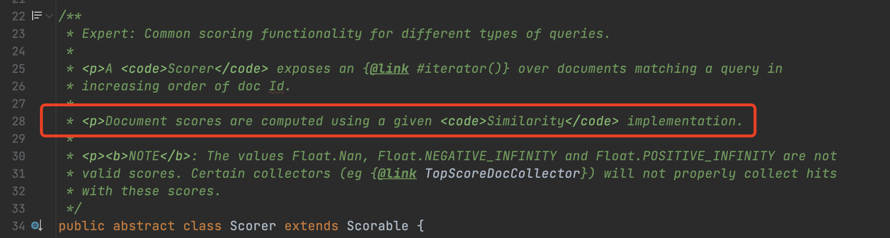

&emsp;&emsp;图1中的注释已经几乎不能完全用于理解Scorer类，因为这个类经过十几年的迭代，注释却没有保持更新，甚至部分描述还不准确。例如红框标注的注释说到：使用给定的[Similarity](https://www.amazingkoala.com.cn/Lucene/Search/2019/0827/89.html)对文档进行打分。由于在早期Scorer的构造函数的参数中需要提供Similarity对象，但在十年前提交的[LUCENE-2876](https://issues.apache.org/jira/browse/LUCENE-2876)中移除了该参数。该[PR merge](https://github.com/apache/lucene/pull/12494)后会更新这些注释。见旧版的Scorer类：

图2：

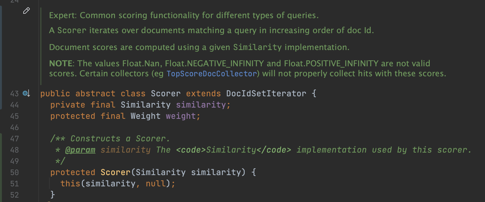

&emsp;&emsp;因此我想通过直接介绍Scorer中的方法，让大家直观的了解Scorer在目前版本（Lucene 9.6.0）中定位。

## Scorer的抽象方法

图3：

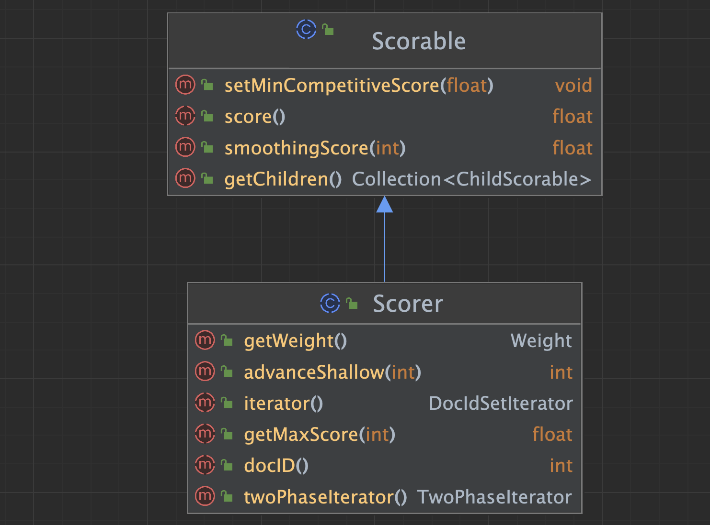

&emsp;&emsp;Scorer类继承Scorable类，因此同样会介绍父类中的方法。

### 方法一

图4：

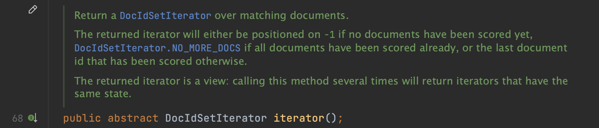

&emsp;&emsp;Scorer的Iterator()方法说的是，它能提供一个文档号迭代器，即[DocIdSetIterator](https://www.amazingkoala.com.cn/Lucene/Search/2023/0707/207.html)对象。

&emsp;&emsp;DocIdSetIterator中包含了满足查询条件（部分实现可能不满足查询条件，比如DocValuesIterator，下文会介绍）的文档号集合，以及遍历这些文档号的方式。在文章[BulkScorer（一）](https://www.amazingkoala.com.cn/Lucene/Search/2023/0707/207.html)中介绍了DocIdSetIterator的概念，并且在文章[ImpactsDISI](https://www.amazingkoala.com.cn/Lucene/Search/2023/0804/209.html)中介绍了DocIdSetIterator的一种实现方式，并且说到ImpactsDISI可以利用[Impact](https://www.amazingkoala.com.cn/Lucene/Search/2020/0904/165.html)信息来实现特殊的文档号遍历方式。

### 方法二

图5：

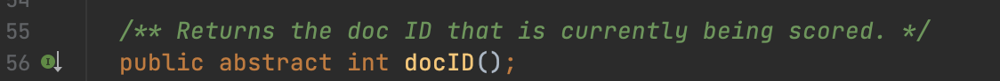

&emsp;&emsp;通过这个方法可以看出，Scorer对象中含有状态值，即当前正在进行打分的文档号。

&emsp;&emsp;我们在文章[BulkScorer（一）](https://www.amazingkoala.com.cn/Lucene/Search/2023/0707/207.html)也提到了DocIdSetIterator对象也含有状态值。没错，Scorer对象中的状态值在很多子类实现中就是DocIdSetIterator对象中的状态值。下图是Scorer的TermScorer的部分实现：

图6：

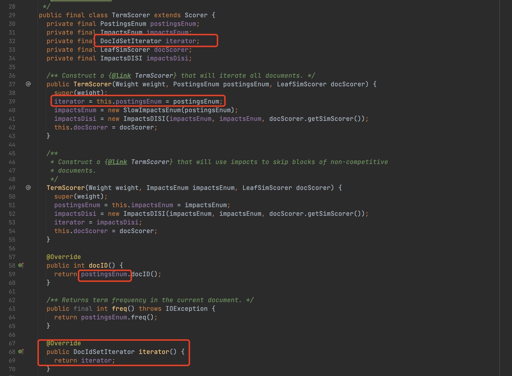

&emsp;&emsp;图6中，从第39行的代码可以看出，Iterator跟postingEnum是同一个对象，第68、59行代码分别是上文中[方法一](###方法一)、[方法二](###方法二)的实现。

### 方法三

图7：

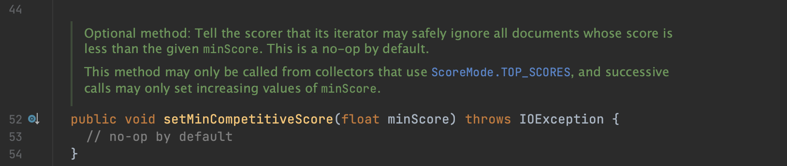

&emsp;&emsp;该方法用于通知Scorer对象，目前已收集到的文档中最小的打分值（历史最低打分值）。

&emsp;&emsp;通常在执行TopN查询并且使用文档打分值作为排序规则时会调用该方法。比如我们在收集器[Collector](https://www.amazingkoala.com.cn/Lucene/Search/2019/0812/82.html)中收集到N篇文档后，可以通过一个排序规则为打分值的优先级队列获取堆中最小的打分值minCompetitiveScore，意思是后续的文档的打分值只有大于minCompetitiveScore才是具有竞争力的。此时收集器就会通过调用该方法通知Scorer对象：目前具有竞争力的文档的打分值必须大于minCompetitiveScore。使得一些Scorer的子类可以基于这个minCompetitiveScore实现优化。优化的方向其实就是对满足查询条件的待遍历的文档号集合进行"瘦身"，跳过掉那些打分值小于等于minCompetitiveScore的文档号，或者说筛选出高于minCompetitiveScore的文档号集合。

&emsp;&emsp;我们还是以TermScorer为例，对于该方法的实现逻辑如下所示：

图8：

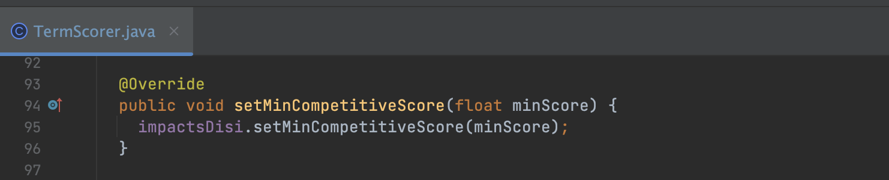

&emsp;&emsp;图8中，TermScorer对象将minCompetitiveScore信息告知了ImpactsDISI对象。至于ImpactsDISI如何基于minCompetitiveScore实现文档号集合的"瘦身"，见文章[ImpactsDISI](https://www.amazingkoala.com.cn/Lucene/Search/2023/0804/209.html)。

### 方法四

图9：

&emsp;&emsp;上文的[方法二](###方法二)中描述的是当前正在进行打分的文档号，那么调用方法四就是对这篇文档进行打分。

&emsp;&emsp;下图是TermScorer中的实现方式：

图10：

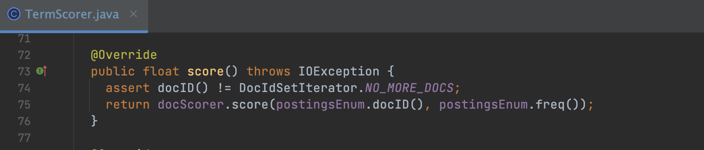

&emsp;&emsp;图10中，`docScorer`是封装了Similarity的LeafSimScorer对象，只需要提供文档号（可以根据文档号获取到[标准化值](https://www.amazingkoala.com.cn/Lucene/suoyinwenjian/2019/0305/39.html)）以及在这篇文档中的词频就可以进行打分（见文章[ImpactsDISI](https://www.amazingkoala.com.cn/Lucene/Search/2023/0804/209.html)中关于打分公式的介绍）。

### 方法五

图11：

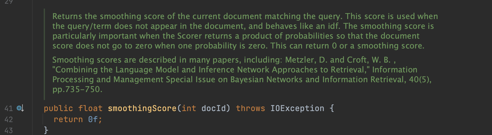

&emsp;&emsp;该方法是为了避免数据稀疏和零概率问题而使用的平滑技术，使得查询文档中不存在的term也可以进行打分。

&emsp;&emsp;下图是TermScorer中的实现方式：

图12：

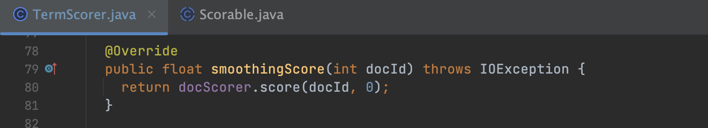

&emsp;&emsp;图12中，Lucene的打分公式支持计算平滑值，只需要将词频值设置为0即可。

### 方法六

图13：

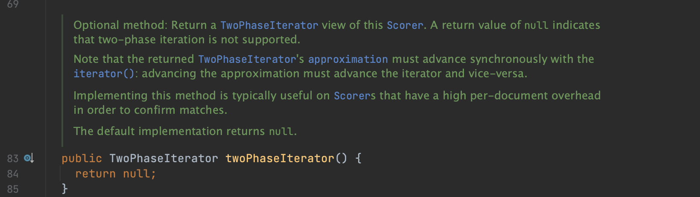

&emsp;&emsp;Scorer不仅仅提供[方法一](###方法一)中的DocIdSetIterator对象，还会根据具体的子类需要同时实现TwoPhaseIterator，当DocIdSetIterator中的文档号集合**不全部**满足查询条件时，即所谓的接近（approximation）满足查询结果，这时候就可以用TwoPhaseIterator进行准确的判断某个文档号对应的文档是否满足查询条件。

#### TwoPhaseIterator

&emsp;&emsp;我们通过SortedNumericDocValuesSetQuery来介绍下使用TwoPhaseIterator对接近（approximation）满足查询结果的文档号集合如何进行准确匹配。

图14：

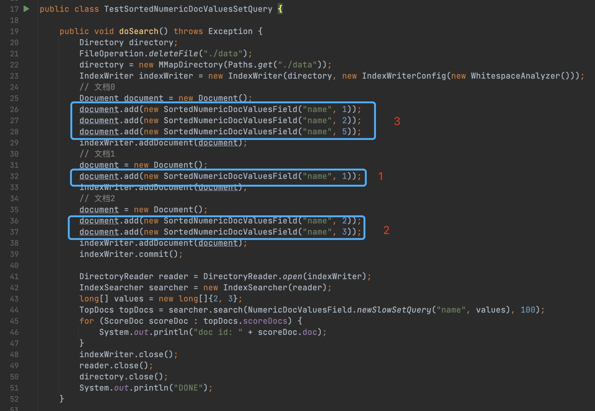

&emsp;&emsp;代码第44行，使用NumericDocValuesField.newSlowSetQuery进行查询，查询条件是代码43行中包含数值至少包含2或者3的文档。

&emsp;&emsp;由于文档中只使用了[DocValues](https://www.amazingkoala.com.cn/Lucene/DocValues/)，因此不支持通过term（即例子中的2跟3两个数值）查询文档号，因此对于NumericDocValuesField.newSlowSetQuery，**只能遍历所有的文档**，随后每处理一篇文档就使用TwoPhaseIterator中的matches方法判断文档中是否包含2、3这两个正排值中的一个。下面给出matches的实现方式：

图15：

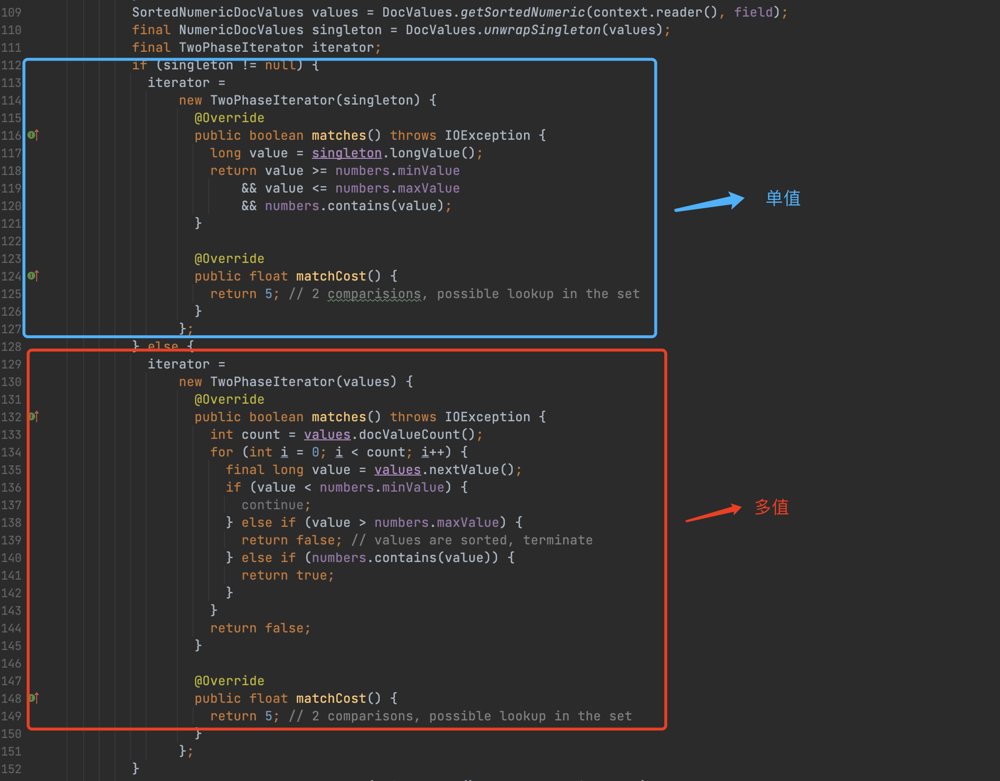

&emsp;&emsp;由于图14中我们使用了SortedNumericDocValuesField，它属于多值的情况，即一篇文档中，某个域的正排值可以是多个。图15中代码第133行的count计算的是当前处理的文档中的正排值的数量。对于图14中的三篇文档，他们的count值分别是：3、1、2。

&emsp;&emsp;图15中的numbers是一个包含了查询条件，即图14中代码第43行的对象。代码第134行的for循环描述的是依次读取当前文档中的正排值，判断numbers是否包含，如果包含，说明当前文档满足查询条件。

### 方法七

图16：

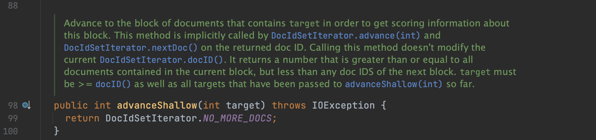

&emsp;&emsp;注释中说到调用该方法能到达文档号target所在的block，目的是获取到打分信息。

&emsp;&emsp;该方法跟[方法八](###方法八)一样都是为了实现[block-max WAND](https://www.amazingkoala.com.cn/Lucene/Search/2020/0916/167.html)算法在[LUCENE-8135](https://issues.apache.org/jira/browse/LUCENE-8135)中出现的。尽管在本篇文章发布之前还未全部完成block-max WAND算法的介绍，但我们可以通过文章[ImpactsDISI](https://www.amazingkoala.com.cn/Lucene/Search/2023/0804/209.html)了解该方法以及[方法八](###方法八)，在本篇文章中，只概述下这两个方法：

- 文档号在[索引文件.doc](https://www.amazingkoala.com.cn/Lucene/Search/2020/0904/165.html)中是按block进行划分存储的，默认每128篇文档号作为一个block，`advanceShallow`方法中会通过[跳表](https://www.amazingkoala.com.cn/Lucene/Index/2020/0106/124.html)找到target所在block
- 当跳到所在block后，就可以通过调用[方法八 getMaxScore](###方法八)计算该block中所有文档中最大的打分值。至于为什么要获取maxScore，以及计算方式，请查看文章[ImpactsDISI](https://www.amazingkoala.com.cn/Lucene/Search/2023/0804/209.html)

### 方法八

图17：

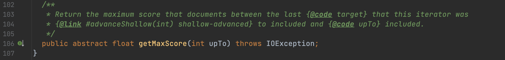

&emsp;&emsp;见[方法七](###方法七)中的介绍。

## 结语

&emsp;&emsp;至此，图3中的所有方法除了 `getChildren`和`getWeight`方法都已经介绍完毕。可以看出Scorer类型提供下面的功能：

- 对文档进行打分
  - 打分逻辑取决于不同子类中定义的[Similarity](https://www.amazingkoala.com.cn/Lucene/Search/2019/0827/89.html)对象
- 提供用于遍历的文档号集合
  - 该集合在大部分实现中是一个满足查询条件的文档号集合，如果不是，那么会额外提供一个TwoPhaseIterator实现准确匹配
- 记录历史最低打分值，用于doc skip
  - 用于在TopN的查询中，结合跳表、文档分块存储特点，不对那些低于历史最低分值的文档进行处理

[点击](https://www.amazingkoala.com.cn/attachment/Lucene/Search/Scorer/Scorer.zip)下载附件