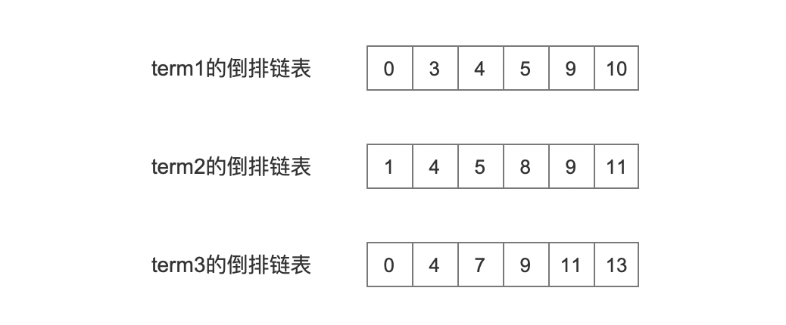

# [block-max WAND](https://www.amazingkoala.com.cn/Lucene/Search/)（Lucene 9.10.0）

Block-max WAND结合了[WAND](https://dl.acm.org/doi/10.1145/956863.956944)和[Block-max](http://engineering.nyu.edu/~suel/papers/bmw.pdf)这两个算法用来加速Top-K查询。在Lucene中用来优化关键字之间只有OR关系，并且minShouldMatch >1 时的查询。比如有查询条件为：`term1 OR term2 OR term3`，那么文档中至少包含其中两个`term`就认为是满足查询条件。

## 前置知识

在深入探讨该算法之前，有必要先了解 Lucene 中的其他关键知识点。这是因为本文的重点不在于算法的理论介绍，而是具体的实现细节。通过掌握这些前置知识，才能够更全面地理解和应用本文中讨论的算法。

### minCompetitiveScore

在查询阶段收集了Top-k个文档号后，会计算出这k个文档中的最小值，也就是minCompetitiveScore，意味着后续收集的文档如果打分值小于该值则进不了Top-k。

### MaxScore

Lucene提供了[Impact](https://amazingkoala.com.cn/Lucene/Search/2020/0904/%E7%B4%A2%E5%BC%95%E6%96%87%E4%BB%B6%E7%9A%84%E8%AF%BB%E5%8F%96%EF%BC%88%E5%8D%81%E4%BA%8C%EF%BC%89%E4%B9%8Bdoc&&pos&&pay/#impact)机制，通过在索引阶段记录**部分**打分因子，使得在查询阶段可以快速计算某个区间内文档最大打分值MaxScore。

如果某个区间的MaxScore小于minCompetitiveScore，意味着可以不需要遍历这个区间内的文档，实现skip。

### Scorer

在文章[Scorer（Lucene 9.6.0）](https://amazingkoala.com.cn/Lucene/Search/2023/0814/Scorer/)中详细的介绍了该知识点，每一个term都对应一个Scorer，它可以提供倒排链表、用于计算某个区间内的maxScore。

## 算法概述

图1：

正如注释中说到，该实现使用了3个数据结构存储查询term对应的Scorer：lead、head、tail。

- **lead**：当前处理的目标文档号，拥有目标文档号的Scorer会使用lead存储
- **head**：Scorer中未被访问的文档号都大于目标文档号，它是一个优先级队列，根据Scorer中未被访问的最小文档号排序，文档号越小越靠前
- **tail**：Scorer中未被访问的文档号都小于目标文档号，根据maxScore排序，maxScore越高越靠前
  - 图1的注释中说到tail根据cost排序，这个cost即maxScore

三者之间的关系如下图所示：

图2：

## 算法实现
