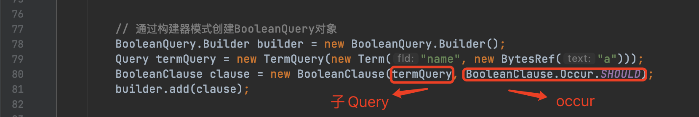

# [BooleanQuery中的rewrite](https://www.amazingkoala.com.cn/Lucene/Search/)（Lucene 9.5.0）

&emsp;&emsp;当我们定义了一个Query后，在读取索引文件前Lucene会尝试对Query进行重写，使得得到一个优化后的Query，其优化方式根据不同类型的Query有不同的实现。本文先介绍BooleanQuery中的重写实现方式。

## 术语约定

&emsp;&emsp;为了更好的介绍本文内容，我们先约定下文章中出现的一些名词以及含义。

### Occur

&emsp;&emsp;BooleanQuery描述的是一个或多个其他类型（也可以是BooleanQuery）Query的组合查询，我们称之为BooleanQuery的子Query。每一个子Query在匹配到的文档（matched document）中的"出现方式"即**Occur**。一共有四种出现方式：**MUST**、**FILTER**、**SHOULD**、**MUST_NOT**。

- MUST：匹配到的文档必须满足子Query的条件
- FILTER：匹配到的文档必须满足子Query的条件，但是这个子Query不会参与这篇文档的打分
- SHOULD：匹配到的文档中可能满足子Query的条件，如果满足，这个子Query会给于这篇文档额外的分数
- MUST_NOT：匹配到的文档不可以满足子Query的条件

### clause

&emsp;&emsp;定义BooleanQuery的子Query时，需要给每一个子Query指定一个occur。带有occur属性的子Query即BooleanQuery中的一个clause。

图1：

&emsp;&emsp;图1中，第79行中定义了一个名为termQuery的子Query，第80行子Query以及其**SHOULD**的occur属性作为BooleanQuery的一个clause。

## rewrite实现

&emsp;&emsp;BooleanQuery中有以下多种重写规则：

- 单个clause
- 重写所有子Query
- 移除多余的FILTER和MUST_NOT类型的clause
- 检查是否存在子Query相同，但是同时包含MUST和MUST_NOT的clause
- 对子Query相同，包含MUST和FILTER的clause进行去重
- 