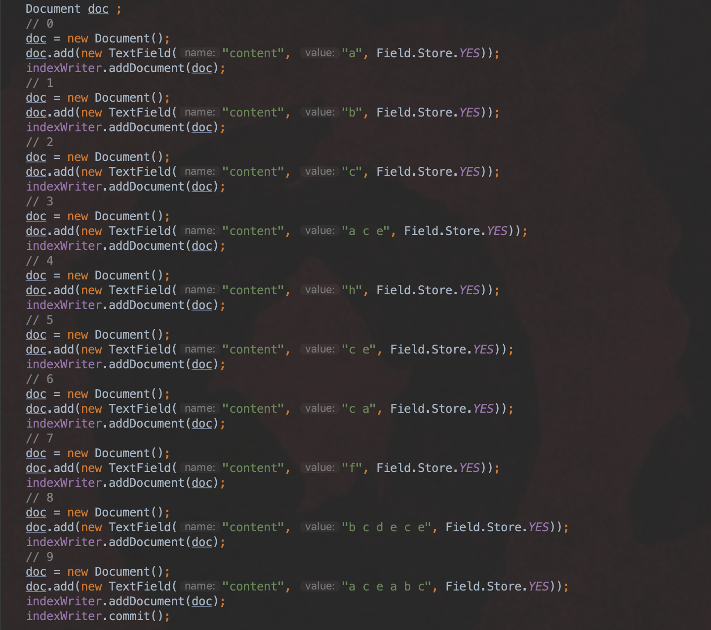
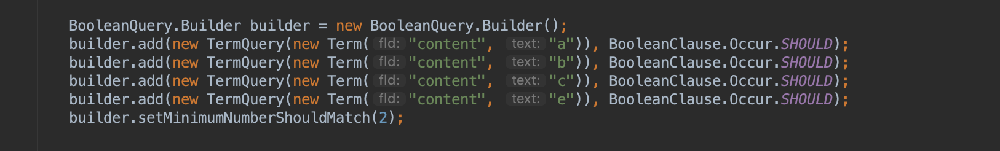
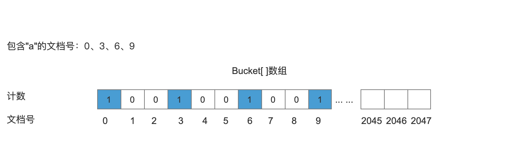
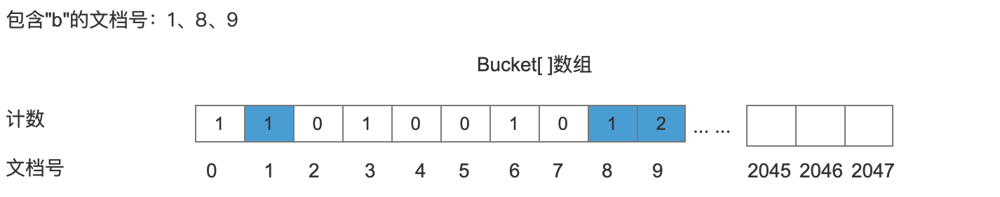
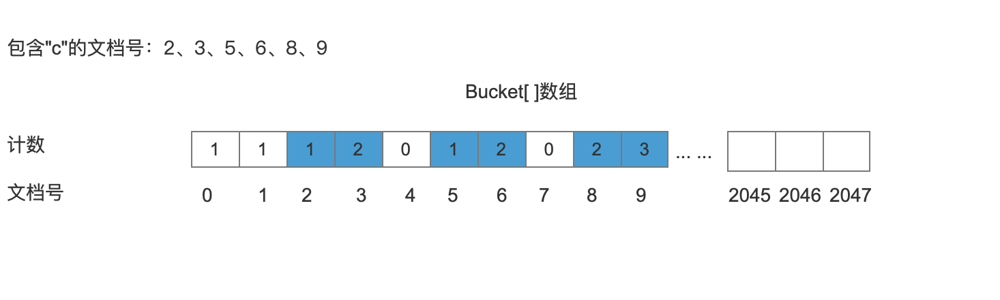
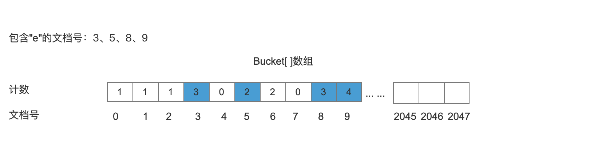
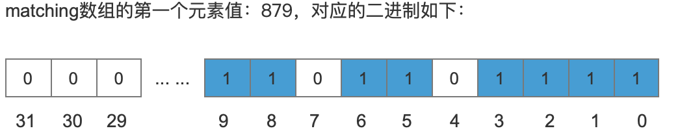
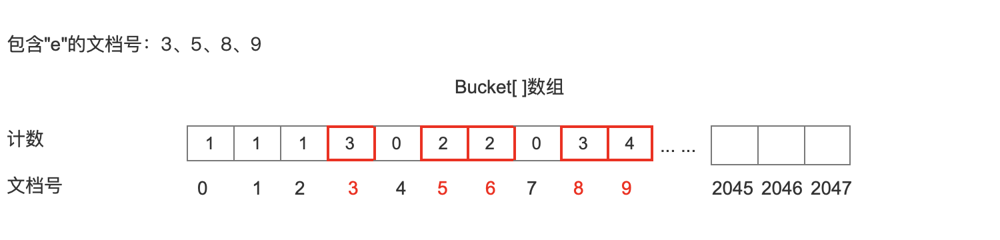

## 多个SHOULD的Query的文档号合并
本篇文章通过一个例子介绍如何对满足搜索要求的文档进行合并（筛选），详细的合并过程可以看我的源码注释，GitHub地址是：https://github.com/luxugang/Lucene-7.5.0/blob/master/solr-7.5.0/lucene/core/src/java/org/apache/lucene/search/BooleanScorer.java。
## 例子
添加10篇文档到索引中。如下图：
图1：

使用WhiteSpaceAnalyzer进行分词。
查询条件如下图。**MinimumNumberShouldMatch的值为2，表示满足查询条件的文档中必须至少包含"a"、"b"、"c"、"e"中的任意两个。**
图2：


## 文档号合并
本篇文章中不会介绍如何根据关键字找到对应文档的过程，只介绍了如何合并(筛选)文档号的过程。
首先给出一个Bucket[]数组，Bucket[]数组下标为文档号，数组元素为文档出现的频率，然后分别统计包含"a"、"b"、"c"、"e"的文档数，将文档出现的次数写入到Bucket[]数组。

### 处理包含关键字“a”的文档
将包含“a”的文档号记录到Bucket[]数组中。
图3：


### 处理包含关键字“b”的文档
将包含“b”的文档号记录到Bucket[]数组中，文档号9第二次出现，所以计数加1。
图4：


### 处理包含关键字“c”的文档
将包含“c”的文档号记录到Bucket[]数组中，文档号3、6、8再次出现，所以对应计数都分别加1；
图5：


### 处理包含关键字“e”的文档
将包含“e”的文档号记录到Bucket[]数组中
图6：


### 统计文档号
在Bucket数组中，下标值代表了文档号，当我们处理所有关键字后，我们需要遍历文档号，然后判断每一个文档号出现的次数是否满足MinimumNumberShouldMatch，为了使得只对出现的文档号进行遍历，Lucene使用了一个matching数组记录了上面出现的文档号。matching数组记录文档号的原理跟[FixedBitSet](http://www.amazingkoala.com.cn/Lucene/gongjulei/2019/0404/45.html)一样，都是用一个bit位来记录文档号。不赘述。

在当前的例子中，我们只要用到matching[]的第一个元素，第一个元素的值是879(为什么只要用到第一个元素跟第一个元素的是怎么得来的，在BooleanScorer类中我加了详细的注释，这里省略)
图7：

根据二进制中bit位的值为1，这个bit位的位置来记录包含查询关键字的文档号，包含查询关键字的文档号只有0，1，2，3，5，6，8，9一共8篇文档，接着根据这些文档号，把他们作为bucket[]数组的下标，去找到每一个数组元素中的值，如果元素的值大于等于minShouldMatch，对应的文档就是我们最终的结果，我们的例子中

```java
builder.setMinimumNumberShouldMatch(2);
```
所以根据最终的bucket[]
图8：

只有文档号3，文档号5，文档6，文档8，文档9对应元素值大于minShouldMatch，满足查询要求。

## 结语
本文介绍了使用BooleanQuery并且所有的TermQuery之间是SHOULD关系的文档号合并原理，在后面的文章中会依次介绍 SHOULD、MUST、MUST_NOT、FILTER的TermQuery的文档号合并原理。


