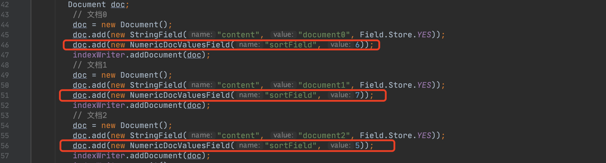
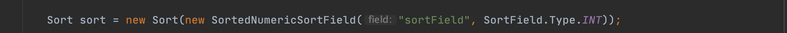
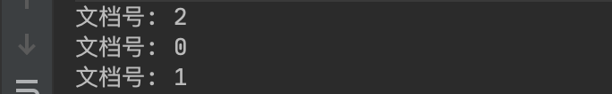
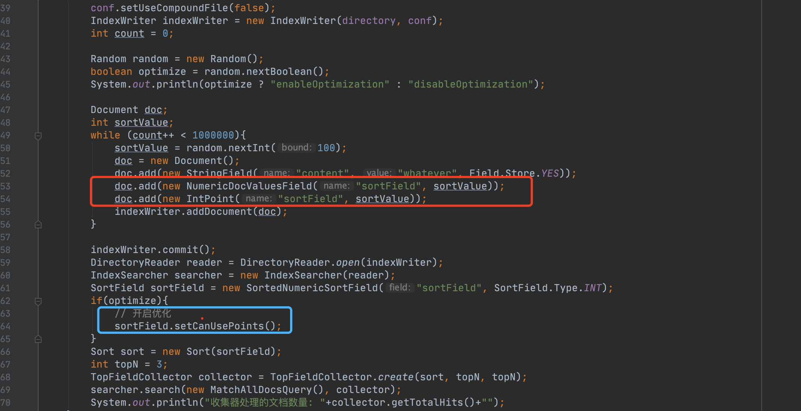
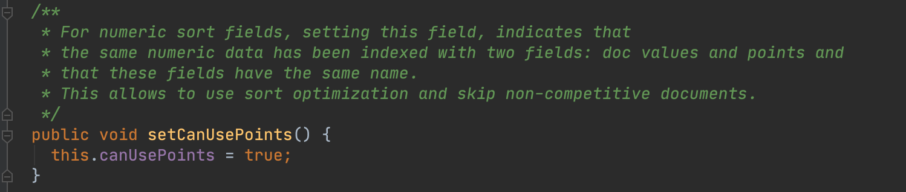

# [查询TopN的优化之NumericDocValues（一）](https://www.amazingkoala.com.cn/Lucene/Search/)（Lucene 8.9.0）

&emsp;&emsp;在索引阶段，我们可以在每一篇文档中添加一条或多条DocValues信息（正排），使得在查询阶段，当收集器[Collector](https://www.amazingkoala.com.cn/Lucene/Search/2019/0812/82.html)收集到满足查询条件的文档号后，可以根据文档号找到对应的正排信息，并依据正排信息对查询结果进行排序。

图1：



&emsp;&emsp;图1中添加了3篇文档，<font color=red>红框</font>标注即正排信息，我们在查询条件中设置一个排序规则：

图2：



&emsp;&emsp;在图2的排序规则下，返回的结果为：

图3：



## 查询TopN的性能（优化前）

&emsp;&emsp;基于目前Lucene的查询模块设计，整个查询过程可以按照`获取迭代器`和`收集器处理文档`的这两个大的功能块进行划分。

### 获取迭代器

&emsp;&emsp;获取迭代器描述的是从倒排信息中或者存储数值类型的[BKD树](https://www.amazingkoala.com.cn/Lucene/suoyinwenjian/2019/0424/53.html)中找到满足查询条件的文档号集合，该集合用于生一个迭代器。随后迭代器会按照文档号从小到大的顺序（在设置了段的排序IndexSort后，顺序可能会发生变化，见文章[Collector（三）](https://www.amazingkoala.com.cn/Lucene/Search/2019/0814/84.html)中的**预备知识**的介绍）依次取出每一个文档号，并将文档号送到收集器Collector中。

#### 收集器处理文档

&emsp;&emsp;收集器Collector会从迭代器中依次的获得有序的文档号，执行排序、过滤等操作。

### 问题

&emsp;&emsp;上文介绍的查询模块设计会存在这个问题（为了便于介绍，我们暂时不考虑设置了段排序的情况）：假设我们有10000篇文档号，排序方式为按照**正排值升序**，并且文档0中的正排值为0，文档1中的正排值为1，剩余的9998篇文档的正排值都大于1。如果我们只要Top2的结果，那么很明显，最好的期望的处理方式应该是收集器Collector在处理完文档0跟文档1后就不再处理剩余的其他文档了。然而在优化之前，由于依次传入到收集器Collector的文档号是从小到大是**有序的**，但是文档号对应的正排值是**无法保证有序的**，意味着收集器Collector只有处理完所有的文档号才能实现正确的Top2。在文章[Collector（三）](https://www.amazingkoala.com.cn/Lucene/Search/)中详细介绍了优化前利用NumericDocValues获取TopN的过程，可以先行阅读下。

## 查询TopN的性能（优化后）

&emsp;&emsp;在Lucene8.6.0后，当使用NumericDocValues实现TopN的查询时，可以跳过那些没有竞争力（uncompetitive）的文档集合，快速实现TopN的查询。我们先给出一个例子，比较下优化前后的性能差别，demo的地址：https://github.com/LuXugang/Lucene-7.5.0/blob/master/LuceneDemo8.9.0/src/main/java/index/NumericDocValuesTopNOptimization.java。

图4：



图5：


## 开启优化

&emsp;&emsp;开启优化需要满足以下两点：定义相同域名的PointValues、显示指定开启优化

- 定义相同域名的PointValues：图4中，我们在文档中定义了一个域名为"sortField"的NumericDocValues，那么需要同时定义一个具有相同域名的PointValues，即图4中<font color=red>红框</font>标注
- 显示指定开启优化：在图4中的第64行，该方法描述的是允许使用排序优化，具体内容看图6中的注释

图6：



&emsp;&emsp;图6的注释说到：使用域名相同的doc values跟points存储相同的数值，就可以使用排序优化。图4中的第53、54行的代码IntPoint跟NumericDocValuesField存储了相同的数值sortValue。

## 优化

&emsp;&emsp;注意的是，当search sort（图2所以）跟indexSort一样或者被包含时，那么就不会开启本文介绍的优化，原因可见下面的注释：

```java
 /**
   * Informs the comparator that the skipping of documents should be disabled. This function is
   * called by TopFieldCollector in cases when the skipping functionality should not be applied or
   * not necessary. An example could be when search sort is a part of the index sort, and can be
   * already efficiently handled by TopFieldCollector, and doing extra work for skipping in the
   * comparator is redundant.
   */
  public void disableSkipping() {}
```


&emsp;&emsp;从图5的比较中可以看到，大大的减少了在收集器中处理的文档数量，意味着查询性能得到了很大的提高。

&emsp;&emsp;其优化过程可以用一句话来概括：**利用PointValues实现正排信息的排序，通过PointValues更新迭代器，最新的迭代器中的文档对应的正排信息都是有竞争力的（competitive）**。

&emsp;&emsp;正如上文**开启优化**中介绍的那样，需要在文档中增加一个与NumericDocValues相同域名的PointValues。因为从存储NumericDocValues的数据结构中可以看出，正排信息的值以及对应的文档号在[索引文件.dvd、.dvm](https://www.amazingkoala.com.cn/Lucene/Index/2020/0507/139.html)中是按照文档号从小到大存储的，而在PointValues中，在生成一棵BKD树过程期间，节点划分前先会对点数据进行排序，然后根据中位数，将点数据集合划分为两块，用于构建左右子节点（见文章[索引文件的生成（九）](https://www.amazingkoala.com.cn/Lucene/Index/2020/0408/130.html)的介绍），故最终生成的BKD树的所有叶子节点从左到右是按照点数据有序存储的。

&emsp;&emsp;我们假设查询TopN的排序规则为按照正排值从小大小的顺序，即正排值越小，优先级越高。故在开启优化后，当收集器收到一个文档号，先根据文档号从正排索引中拿到正排值，在满足某些条件后，根据正排值，通过查询BKD树获取所有小于该正排值的文档集合，该文档集合用于生成一个新的迭代器。随后每次传入到收集器的文档号将会从新的迭代器中获取，达到所谓的skip non-competitive documents的效果。

## 结语

&emsp;&emsp;基于篇幅，我们将在下一篇文章中，继续介绍如何更新迭代器，在哪些情况下触发迭代器的更新等内容。

[点击](http://www.amazingkoala.com.cn/attachment/Lucene/Search/block-max-WAND/block-max-WAND（一）/block-max-WAND（一）.zip)下载附件


