# [查询原理（三）](https://www.amazingkoala.com.cn/Lucene/Search/)

&emsp;&emsp;本文承接[查询原理（二）](https://www.amazingkoala.com.cn/Lucene/Search/2019/0821/87.html)，继续介绍查询原理。

# 查询原理流程图

图1：


[点击]()查看大图

## 是否使用多线程

图2：

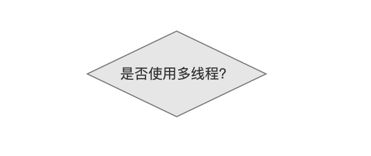

&emsp;&emsp;在生成IndexSearcher对象时，用户可以提供参数[ExecutorService](https://docs.oracle.com/javase/8/docs/api/java/util/concurrent/ExecutorService.html)，调用下面的[构造函数](https://github.com/LuXugang/Lucene-7.5.0/blob/master/solr-7.5.0/lucene/core/src/java/org/apache/lucene/search/IndexSearcher.java)，来实现多线程搜索：

```java
public IndexSearcher(IndexReader r, ExecutorService executor) {
    ... ...
}
```

&emsp;&emsp;当索引目录中有多个段时，把对一个段的搜索（search by segment）作为一个任务（task）交给线程池，最后在合并（reduce）所有线程的查询结果后退出；如果不使用多线程，那么单线程顺序的对每一个段进行搜索，在遍历完所有的段后退出。

&emsp;&emsp;无论是否使用多线程，其核心流程是对一个段进行处理，故下文中我们只介绍单线程的流程，并且在最后介绍图1中的流程点`合并查询结果`。

## 是否还有未查询的段

图3：

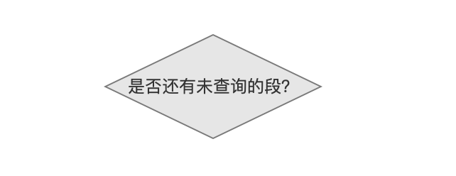

&emsp;&emsp;当索引目录中有多个段，那么每次从一个段中查询数据，直到所有的段都处理结束。

## 生成BulkScorer

图4：


&emsp;&emsp;该流程点将会获得查询对应的文档和词频，这些信息被封装在BulkScorer中。

&emsp;&emsp;如图5所示，不同的查询方式（见[查询原理（一）](https://www.amazingkoala.com.cn/Lucene/Search/2019/0820/86.html)）有不一样BulkScorer对象（通过装饰者模式层层包装BulkScorer来实现多样的BulkScorer），在本篇文章中只根据图6、图7的中的BooleanQuery对应的BulkScorer展开介绍，其生成的BulkScorer对象为ReqExclBulkScorer。

&emsp;&emsp;图5中是BulkScorer的类图：

图5

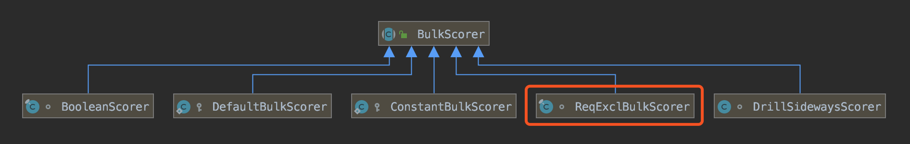

图6，索引阶段的内容：


图7，查询阶段的内容：

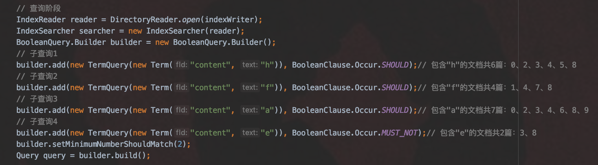

&emsp;&emsp;注意的是本文中的例子跟[查询原理（一）](https://www.amazingkoala.com.cn/Lucene/Search/2019/0820/86.html)中的BooleanQuery例子是不同的。

### ReqExclBulkScorer

&emsp;&emsp;图8中描述的是ReqExclBulkScorer中包含的两个对象，其中BooleanScorer描述了**BooleanClause.Occure.SHOULD**的TermQuery的信息，BlockDocsEnum描述了**BooleanClause.Occure.MUST_NOT**的TermQuery的信息。

图8

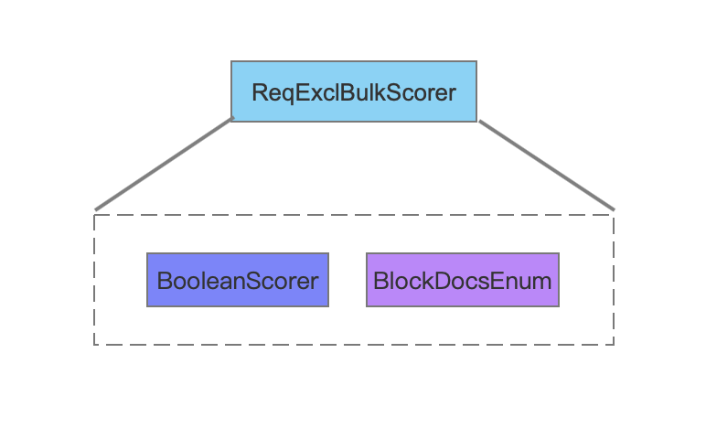

#### BooleanScorer

图9

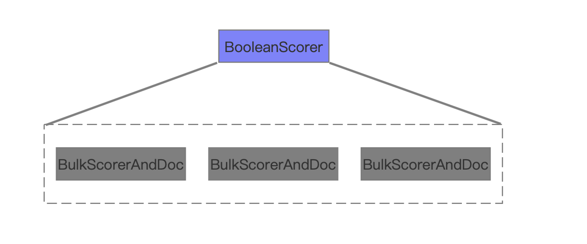

&emsp;&emsp;图9中描述的是BooleanScorer中的主要信息，**其包含的BulkScorerAndDoc的个数跟图7中BooleanClause.Occure.SHOULD的TermQuery的个数一致**。

图10

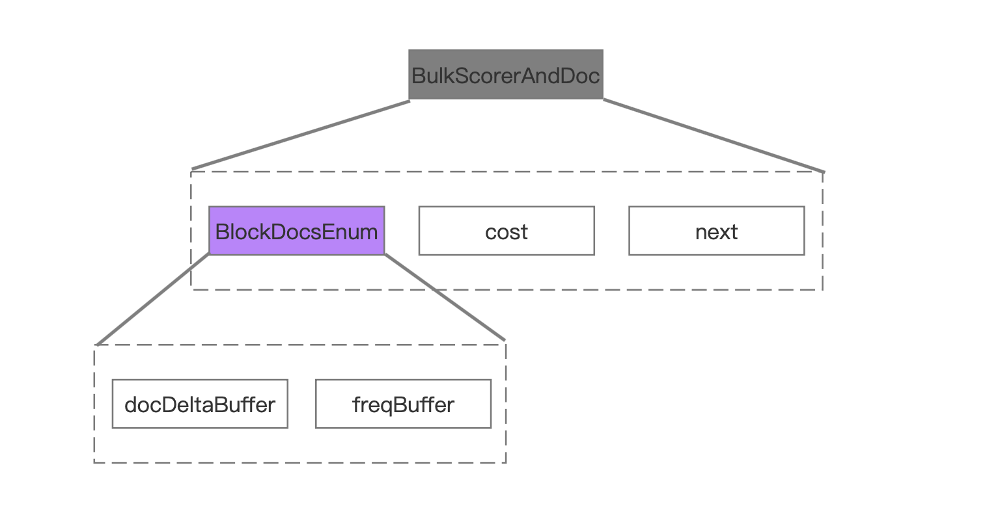

&emsp;&emsp;图10中描述的是BulkScorerAndDoc中包含的主要信息。

##### cost、next

&emsp;&emsp;这两个值在这里我先暂时不给出解释，因为在下一篇文章中才会使用到这两个值。

##### docDeltaBuffer、freqBuffer

&emsp;&emsp;docDeltaBuffer、freqBuffer都是int数组类型，其中docDeltaBuffer中存放的是文档号，freqBuffer中存放的是词频

&emsp;&emsp;按照图7中的例子，4个子查询对应的BlockDocsEnum中包含的两个数组docDeltaBuffer、freqBuffer如下所示：

###### 子查询1

图11

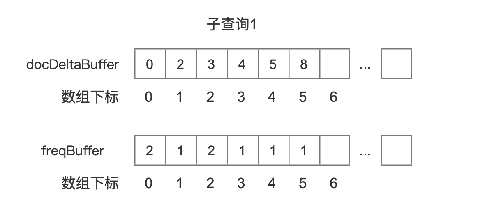

###### 子查询2

图12

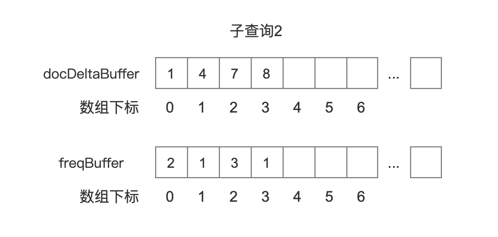

###### 子查询3

图13

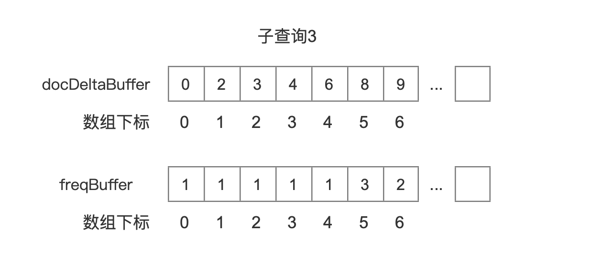

###### 子查询4

图14

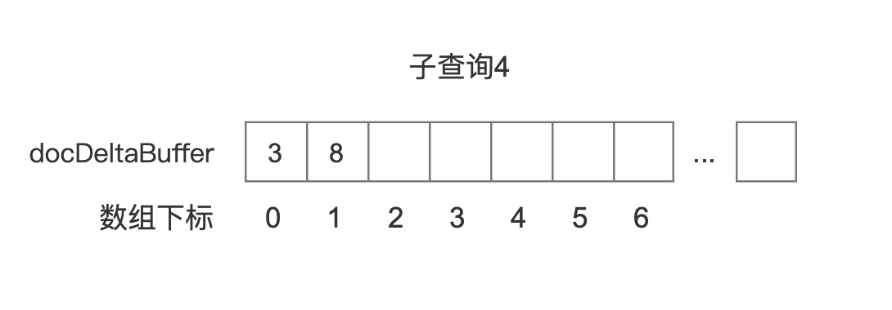

&emsp;&emsp;图14中我们没有列出该查询对应的freqBuffer，原因是图7中子查询4属于BooleanClause.Occure.MUST_NOT，我们只关心这个查询对应的文档号。

##### docDeltaBuffer、freqBuffer的关系

&emsp;&emsp;两个数组的同一个数组下标值对应的数组元素描述的是域值在文档号中的词频，如图15所示：

图15

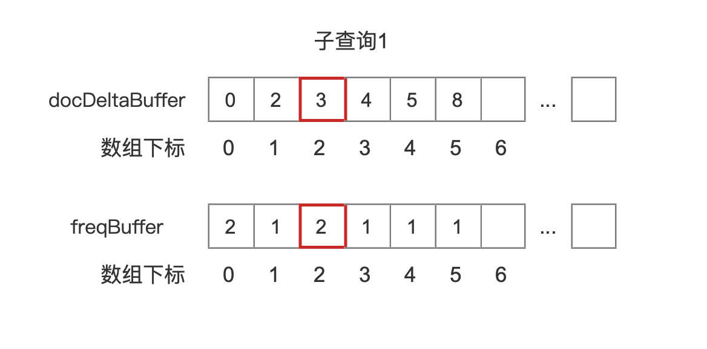

&emsp;&emsp;在图15中，结合图6，描述的是域值"h"在文档3中的词频是2。

&emsp;&emsp;docDeltaBuffer、freqBuffer数组的信息是通过读取索引文件[.doc](https://www.amazingkoala.com.cn/Lucene/suoyinwenjian/2019/0324/42.html)获得的。

图16

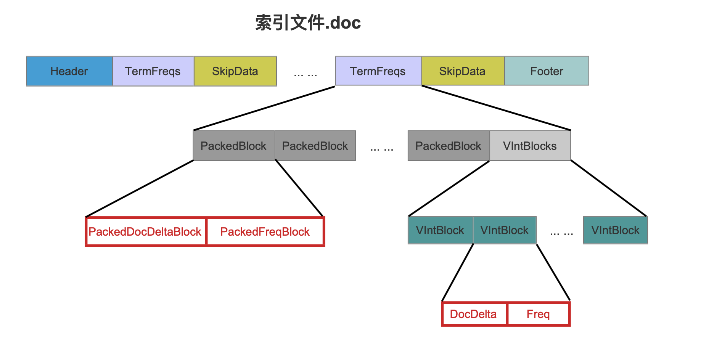

&emsp;&emsp;docDeltaBuffer、freqBuffer数组的信息要么分别从图16中红框标注的PackedDocDeltaBlock跟PackedFreqBlock中获取，要么分别从DocDelta跟Freq获得，其选择方式和读取索引文件[.doc](https://www.amazingkoala.com.cn/Lucene/suoyinwenjian/2019/0324/42.html)的过程不在本篇文章中介绍，本人不想介绍的原因是，只要了解索引文件的数据结构（见[索引文件数据结构](https://www.amazingkoala.com.cn/Lucene/suoyinwenjian/) ）是如何生成的，自然就明白如何读取索引文件~~

&emsp;&emsp;在[索引文件之doc](https://www.amazingkoala.com.cn/Lucene/suoyinwenjian/2019/0324/42.html)文章中我们提到，文档号使用差值存储，所以实际在搜索阶段，我们获得的docDeltaBuffer数组中的数组元素都是差值，还是以图7中的子查询1为例，它获得真正的docDeltaBuffer数组如下所示：

图17

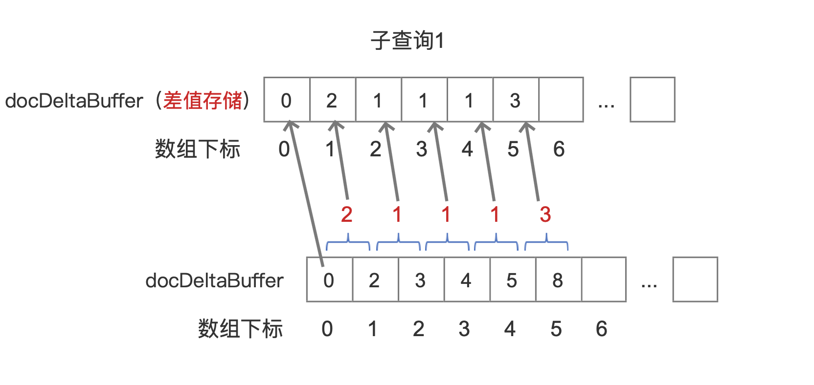

&emsp;&emsp;注意的是图17中使用差值存储的docDeltaBuffer数组，**它的第一个数组元素是原始值**。


&emsp;&emsp;**为什么要使用差值存储：**

- 压缩数据，减少内存/磁盘占用

&emsp;&emsp;[去重编码(dedupAndEncode)](https://www.amazingkoala.com.cn/Lucene/yasuocunchu/2019/0130/29.html)的文章中详细介绍了差值存储，感兴趣的可以了解下。

### 关于BulkScorer

&emsp;&emsp;在[查询原理（二）](https://www.amazingkoala.com.cn/Lucene/Search/2019/0821/87.html)的文章中我们提到，在生成Weight的阶段，除了文档号跟term在文档中的词频这两个参数，我们已经获得了计算文档打分的其他条件，而在生成BulkScorer的过程中，我们获得了每一个子查询对应的文档号跟词频，所以在图1的`生成Weight`跟`生成BulkScorer`两个流程后，我们获得了一个段中文档打分需要的所有条件。

&emsp;&emsp;最后给出完整ReqExclBulkScorer包含的主要信息：

图18

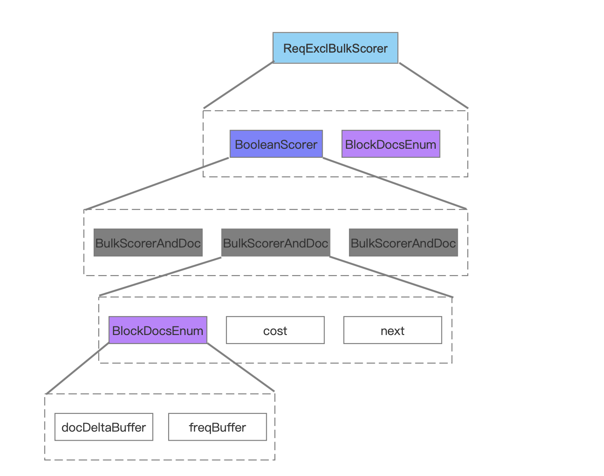

# 结语

&emsp;&emsp;本篇文章中我们只介绍了在生成BulkScorer的过程中，我们获得了每一个子查询对应的文档号跟词频，实际上还有几个重要的内容没有讲述，这些内容用来描述在`Collector处理查询结果`的流程中如何对每一个子查询的文档号进行遍历筛选（即上文中为介绍的 next、cost的信息），基于篇幅，这些内容在下一篇文章中展开介绍。

[点击](http://www.amazingkoala.com.cn/attachment/Lucene/Search/查询原理/查询原理（二）/查询原理（二）.zip)下载附件


