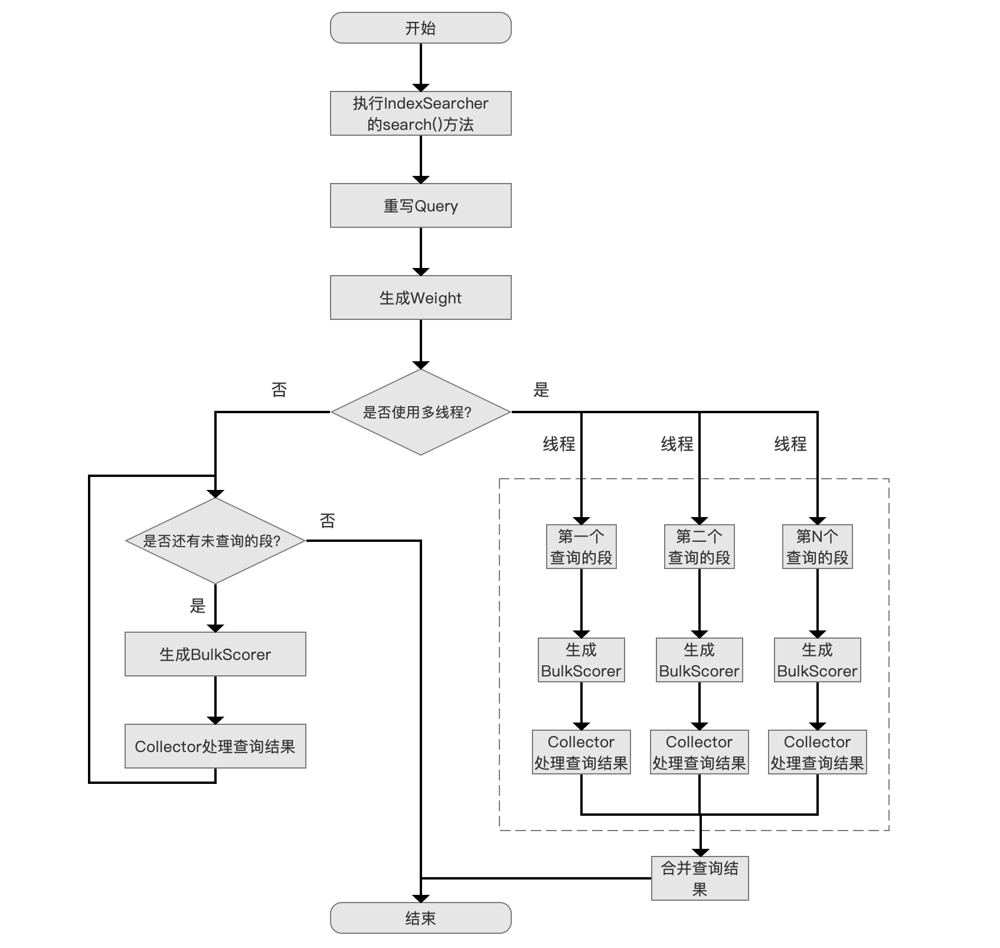
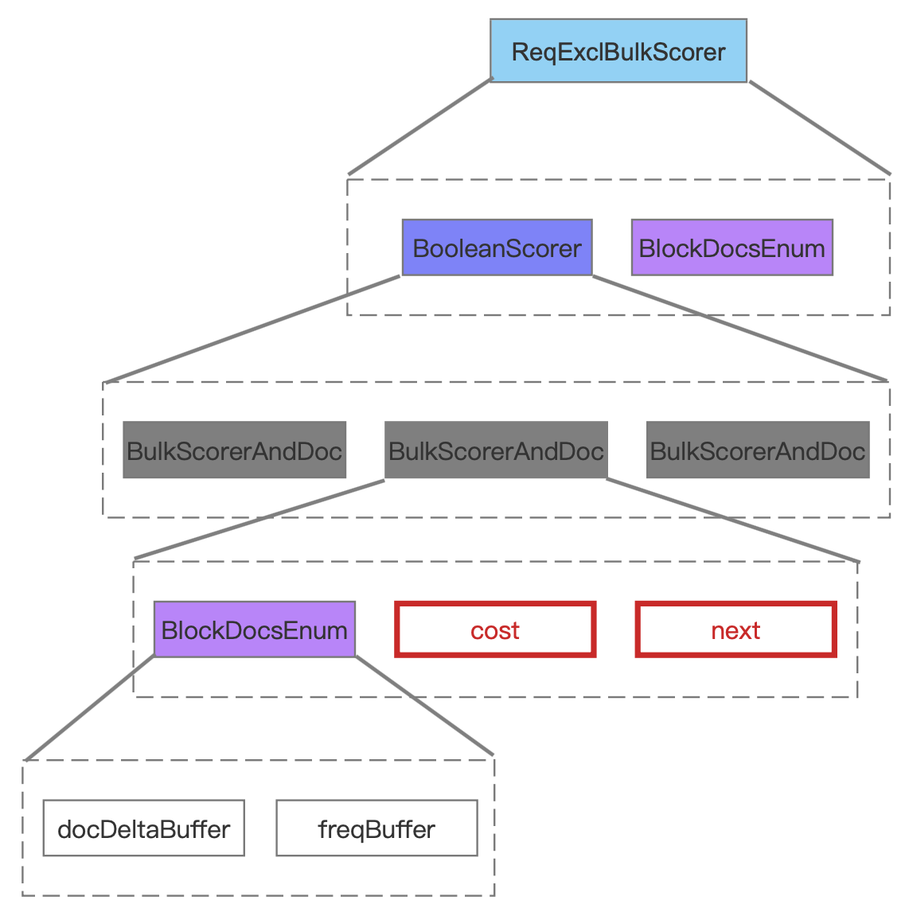
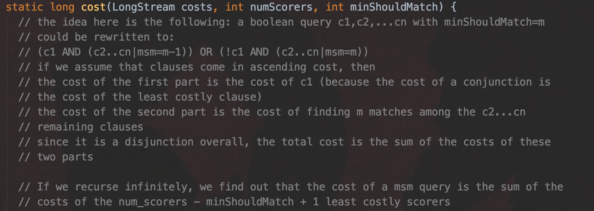
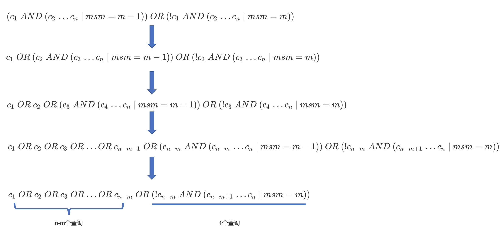

# [查询原理（五）终](https://www.amazingkoala.com.cn/Lucene/Search/)

&emsp;&emsp;本文承接[查询原理（四）](https://www.amazingkoala.com.cn/Lucene/Search/2019/0827/89.html)，继续介绍查询原理。

# 查询原理流程图

图1：



[点击]()查看大图

## 合并查询结果

&emsp;&emsp;该流程点遍历所有子收集器的结果，对这些进行结果进行合并，合并过程比较简单，即利用优先级队列，由于太过简单，故不详细展开了。

# 遗留问题

&emsp;&emsp;在介绍这个遗留问题前，我们先说下在[查询原理（三）](https://www.amazingkoala.com.cn/Lucene/Search/2019/0823/88.html)的文章中，我们在介绍ReqExclBulkScorer时，有两个信息没有介绍，即cost、next，这两个信息用来选择哪些子查询进行处理。

图2：



图3：


- cost：该值描述的是满足子查询的文档个数，例如图3中的子查询3，因为docDeltaBuffer数组有7个数组元素（数组元素为满足子查询的文档号），故它的cost值为7
- next：该值描述的是下一次处理的文档号，每当处理一篇文档，即更新到**Bucket数组**（见[查询原理（四）](https://www.amazingkoala.com.cn/Lucene/Search/2019/0827/89.html)），那么next被更新为下一个要处理的文档号，next的值是 一个递增值

&emsp;&emsp;在[查询原理（四）](https://www.amazingkoala.com.cn/Lucene/Search/2019/0827/89.html)的文章中，我们介绍了单线程下的查询原理的所有流程点，但还有一个很重要的逻辑没有介绍，那就是我们并没有介绍在还有未处理的子查询的情况下，如何选择哪个子查询进行处理，这个逻辑实际是个优化的过程，可能可以减少**遍历区间**（见[查询原理（四）](https://www.amazingkoala.com.cn/Lucene/Search/2019/0827/89.html)）的处理，下面将填补这个坑。

&emsp;&emsp;上文的描述可以拆分两个问题，以图3为例：

- 问题一：我们从子查询1、子查询2、子查询3中的哪个docDeltaBuffer开始遍历（选择子查询）
- 问题二：是不是所有的docDeltaBuffer的每一篇文档号都要遍历（减少遍历区间）？

&emsp;&emsp;这两个问题可以转化为一道面试算法题，来了解面试者对Lucene的熟悉程度：有N个int类型数组，其中所有数组的数组元素都是有序（升序）的，同一个数组内的数组元素都是不重复的，设计一种方法，从这N个数组中找出所有重复（minShouldMatch 大于等于2）的数组元素。

&emsp;&emsp;对于上述的算法题，以图3为例，对于子查询1、子查询2、子查询3，总的时间复杂度至少为3个子查询的开销的和（子查询的开销即上文中的cost），即我们需要遍历每一个子查询对应的文档号。

&emsp;&emsp;**Lucene是如何处理的：**

- 下图给出Lucene中处理方式的注释，原注释可以看这里：https://github.com/LuXugang/Lucene-7.5.0/blob/master/solr-7.5.0/lucene/core/src/java/org/apache/lucene/search/MinShouldMatchSumScorer.java中cost( )方法的注释

图4：



- 图4中描述了这么一个结论：如果BooleanQuery有n个子查询，它们之间为[BooleanClause.Occur.SHOULD](https://www.amazingkoala.com.cn/Lucene/Search/2018/1211/25.html)的关系，并且minShouldMatch为m，那么BooleanQuery的开销最少可以是( numScores - minShouldMatch + 1)个子查询的开销和，也就说在某些情况下我们不用遍历所有子查询对应的文档集合
  - numScores：子查询的个数n
  - minShouldMatch：文档必须同时满足BooleanQuery中的至少m个子查询的查询条件

&emsp;&emsp;**BooleanQuery的开销最少可以是( numScores - minShouldMatch + 1)个子查询的开销和是怎么推算出来的：**

- 包含n个子查询c1，c2，... cn且minShouldMatch为m的BooleanQuery，它可以转化为

```text
(c1 AND (c2..cn | msm = m - 1)) OR (!c1 AND (c2..cn | msm = m))，两块部分通过"或的关系"（OR）组合而成：
```

- (c1 AND (c2..cn|msm=m-1)) ：第一块部分描述了满足BooleanQuery查询要求的文档，如果**满足**子查询c1，那么必须至少满足c2..cn中任意m-1个子查询
-  (!c1 AND (c2..cn|msm=m))：第二块部分描述了满足BooleanQuery查询要求的文档，如果**不满足**子查询c1，那么必须至少满足c2..cn中任意m个子查询
	- 根据两块部分的组合关系，**BooleanQuery的开销是这两部分的开销和**
- 假设子查询c1，c2，... cn是按照cost（上文中已经介绍）**升序排序**的，那么对于第一块部分(c1 AND (c2..cn|msm=m-1)) ，由于c1的cost最小，并且必须满足c1的查询条件，**所以第一块部分的开销就是c1的开销**
- 对于第二块部分(!c1 AND (c2..cn|msm=m))，它相当于一个包含 n -1 个子查询c2，... cn且minShouldMatch为m的**子BooleanQuery**，所以它又可以转化为(c2 AND (c3..cn|msm=m-1)) OR (!c2 AND (c3..cn|msm=m))
- 以此类推如下所示

图5：



[点击]()查看大图

&emsp;&emsp;在图5中，最后推导出BooleanQuery的总开销为 n-m+1个查询的开销，所以在Lucene中，它使用优先级队列head（大小为n-m+1）、tail（大小为m - 1）来存放子查询的信息（即[查询原理（三）](https://www.amazingkoala.com.cn/Lucene/Search/2019/0823/88.html)中的BulkScorerAndDoc），优先级队列的排序规则如下：

- head：按照cost升序
- tail：按照next升序

&emsp;&emsp;当head中优先级最低的BulkScorerAndDoc的文档号不在遍历区间内，那么就可以跳过这个遍历区间，即使此时tail中还有其他的BulkScorerAndDoc。

&emsp;&emsp;这里提供一个demo：https://github.com/LuXugang/Lucene-7.5.0/blob/master/LuceneDemo/src/main/java/lucene/query/BooleanQuerySHOULDNOTTEST.java，这个demo对应图3的内容，根据子查询4，我们会获得3个遍历区间（见[查询原理（四）](https://www.amazingkoala.com.cn/Lucene/Search/2019/0827/89.html)）， 即[0，3)、[4，8)、[9，2147483647)，但是实际只需要遍历[0，3)、[4，8)，因为子查询1、子查询2会被放到head中，而这满足这两个查询的最大文档号为8，故不用处理[9，2147483647)的遍历区间，所以能降低时间复杂度，并且m的值越大，查询开销越小。

# 结语

&emsp;&emsp;至此，BooleanQuery的其中一种组合模式介绍完毕，其他的组合方式在后面不会详细展开，只介绍文档合并的逻辑，比如[文档号合并（SHOULD）](https://www.amazingkoala.com.cn/Lucene/Search/2018/1217/26.html)、[文档号合并（MUST）](https://www.amazingkoala.com.cn/Lucene/Search/2018/1218/27.html)。

[点击](http://www.amazingkoala.com.cn/attachment/Lucene/Search/查询原理/查询原理（五）终/查询原理（五）终.zip)下载附件