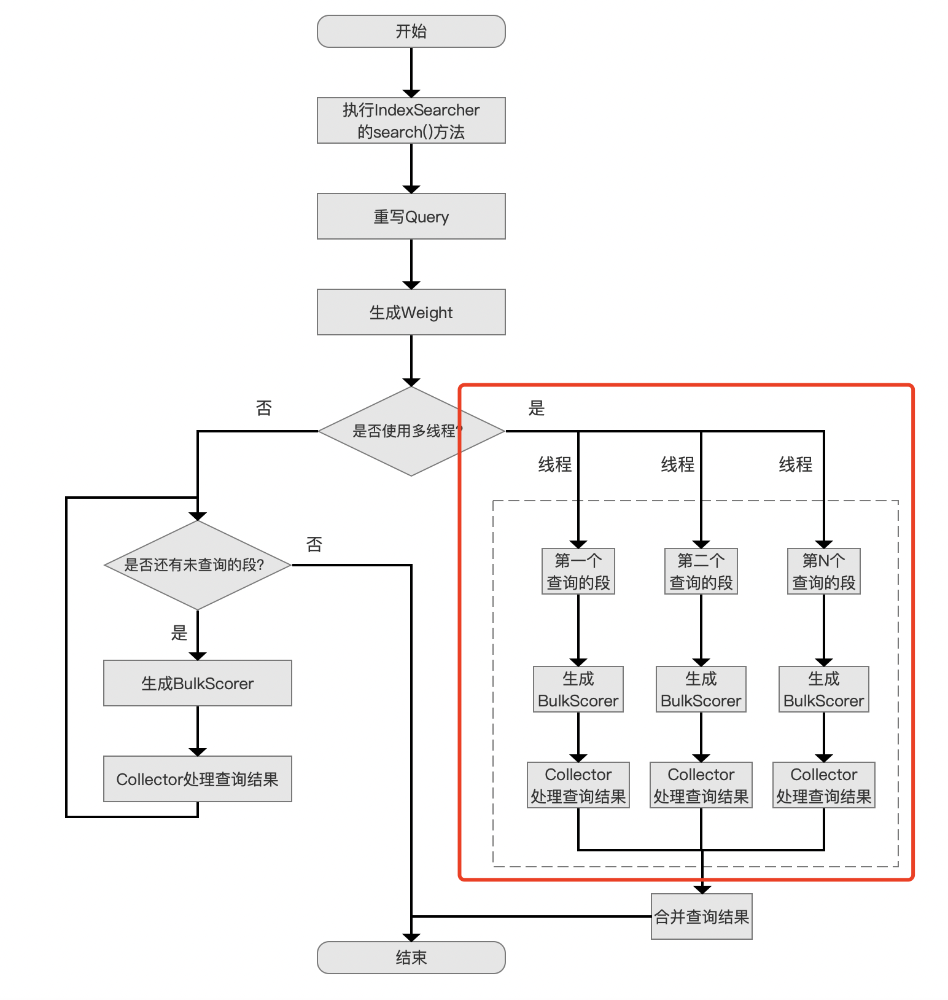
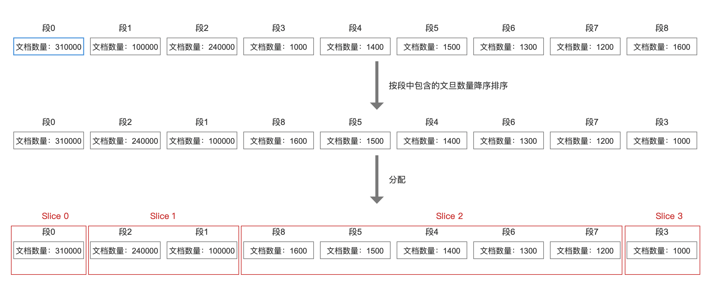
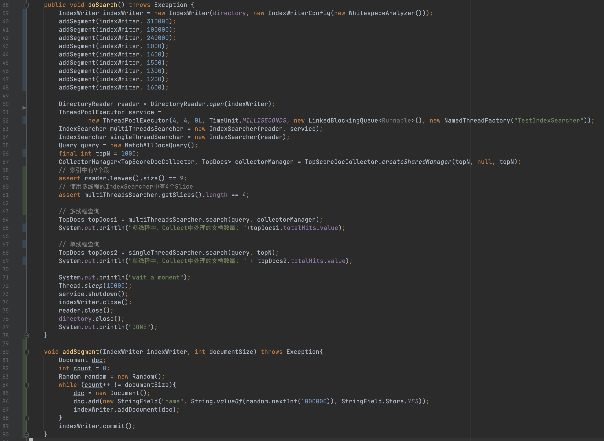
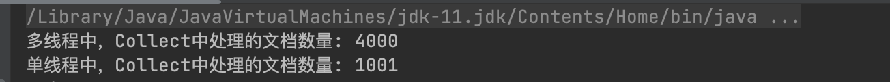

# [段的多线程查询（一）](https://www.amazingkoala.com.cn/Lucene/Search/)（Lucene 9.6.0）

&emsp;&emsp;前段时间有个朋友问到我：对多个段进行查询时，为什么在定义IndexSearcher时使用了[Executor](https://docs.oracle.com/javase/8/docs/api/java/util/concurrent/Executors.html)后，相比较单个线程轮询方式查询相同的多个段，查询速度并没有提升，有时候还下降了？本篇文章会介绍多线程查询中的一些知识点，给与大家在解决性能问题时提供一些思路。

## 查询流程图

图1：



&emsp;&emsp;图1中的[查询流程图](https://www.amazingkoala.com.cn/Lucene/Search/2019/0821/87.html)中，如果未使用多线程，那么Lucene将依次处理每一个段，否则每个线程会负责查询某个段，并在所有线程执行结束后对结果进行合并。

## Slice

&emsp;&emsp;图1中的描述说到每个线程会负责一个段的查询工作，这其实只是一种特例（下文会介绍）。实际上，在初始化IndexSearcher对象阶段会所有的段进行划分，一个或者多个段根据**划分规则**被分配不同的Slice中，随后每一个Slice会被分配一个线程进行查询。

### 划分规则

- 排序：首先将所有段根据段中包含的文档数量降序排序。
- 分配：从包含文档数量最大的段开始，依次处理每一个段，将段分配到Slice中。每一个Slice需要同时满足下面的条件：
  - 如果段中的文档数量大于250000（该值为源码中的`MAX_DOCS_PER_SLICE`），则分配到一个新的Slice中，并且不再将更多的段分配到这个Slice中
  - 如果某个段分配到一个Slice后，Slice中的**所有段的的文档总数**大于等于250000（该值为源码中的`MAX_DOCS_PER_SLICE`），那么不再将更多的段分配到这个Slice中
  - Slice中**段的数量**必须小于等于5（该值为源码中的`MAX_SEGMENTS_PER_SLICE`）

### 例子

&emsp;&emsp;如果索引文件中有以下9个段，即图3中的demo：

图2：



&emsp;&emsp;图2中，段0中的文档数量超过了250000（`MAX_DOCS_PER_SLICE`），所以Slice 0中只有这一个段；段2中的文档数量小于250000，所以它被分配到Slice 1后，Slice 1还可以被分配其他的段，由于段1被分配到Slice 1后，Slice 1中的文档数量超过了250000，所以不再分配更多的段到Slice 1中；Slice 2中被分配段4~段8这5个段后，尽管此时Slice 2中的文档数量未超过250000，但是Slice 2中段的数量已经达到了5（`MAX_DOCS_PER_SLICE`），所以不再分配更多的段到Slice 2中。

&emsp;&emsp;上文中说到，每个线程负责一个Slice的查询工作。因此每个线程负责的Slice实际上处理的段的数量是不一样的。

## 查询性能差异

&emsp;&emsp;接下来介绍下一个多线程查询不及单线程的[例子](https://github.com/LuXugang/Lucene-7.x-9.x/blob/master/LuceneDemo9.6.0/src/main/java/TestEarlyTerminal.java)

图3：



&emsp;&emsp;这个例子中，索引文件内有9个段，一共658000篇文档。查询条件是获取Top 1000的文档号，分别使用多线程跟单线程，查看[Collector](https://www.amazingkoala.com.cn/Lucene/Search/2019/0812/82.html)中分别处理的文档数量，如下所示：

图4：



&emsp;&emsp;可见使用多线程查询需要处理的文档数量（totalHits）反而比单线程多，那性能当然是不及单线程的。

### early termination机制

&emsp;&emsp;Lucene中，会使用totalHits（图3中第65、69行代码）来统计Collector处理的文档数量，注意的是，由于在查询条件中定义了TopN，所以在Collector的处理逻辑中，收集完TopN篇文档后，如果能确定剩余满足查询条件的文档相比较已收集的TopN中的文档都不具备竞争力（competitive），那么就可以提前退出Collector，即**early termination机制**，直接返回TopN中的文档即可。

&emsp;&emsp;图3中使用单线程的查询条件是`MatchAllDocsQuery`，那么在Collector中，文档号越小的文档越具备竞争力（基于`MatchAllDocsQuery`对应的`ConstantScoreWeight`，这里不展开介绍），所以Collector中收集完文档号区间为0~999的文档后，就可以提前结束查询，而不需要全量处理索引中的658000篇文档。

&emsp;&emsp;对于使用多线程查询，根据图2的介绍，会对4个Slice进行并发查询。early termination机制只能作用在每一个Slice中，这个例子中每个Slice都分别实现了early termination，也就是每个Slice的Collector在收集完TopN后就提前退出，因此对于4个Slice，总的totalHits为4000（4 * topN）。

#### early termination的实现原理

&emsp;&emsp;因为篇幅原因就不在本文中展开了，简单的提一下。尽管每个Collector的实现原理各不相同，但early termination的核心内容都是通过调整[DocIdSetIterator](https://www.amazingkoala.com.cn/Lucene/gongjulei/2021/0623/194.html)来减少后续待处理的文档集合的大小，比如在`TopScoreDocCollector`中，当收集了TopN篇文档后并且确定剩余的文档不具备竞争力后，就会将DISI调整为空的DISI，即`DocIdSetIterator.empty()`。

## 合并Slice的查询结果

&emsp;&emsp;这个过程可以简单的描述为将多个Slice中的TopN根据排序规则，以及比较规则来获得最终的TopN。

- 排序规则：例如我们在查询阶段定义了Sort对象，那么在合并查询结果时会使用该Sort对象，如果没有排序规则，或者该排序规则无法用于比较出优先级，则接着使用比较规则。
- 比较规则：Lucene提供了两个内置的比较规则，对应源码中的`SHARD_INDEX_TIE_BREAKER`和`DOC_ID_TIE_BREAKER`，以及这两个比较规则的组合使用，即默认的比较规则`DEFAULT_TIE_BREAKER`，直接给出源码：

```java
/** Internal comparator with shardIndex */
private static final Comparator<ScoreDoc> SHARD_INDEX_TIE_BREAKER =
  Comparator.comparingInt(d -> d.shardIndex);

/** Internal comparator with docID */
private static final Comparator<ScoreDoc> DOC_ID_TIE_BREAKER =
  Comparator.comparingInt(d -> d.doc);

/** Default comparator */
private static final Comparator<ScoreDoc> DEFAULT_TIE_BREAKER =
  SHARD_INDEX_TIE_BREAKER.thenComparing(DOC_ID_TIE_BREAKER);
```

## 结语

&emsp;&emsp;基于篇幅，剩余的内容将在下一篇文章中展开介绍。

[点击](http://www.amazingkoala.com.cn/attachment/Lucene/Search/段的多线程查询/段的多线程查询（一）/段的多线程查询（一）.zip)下载附件