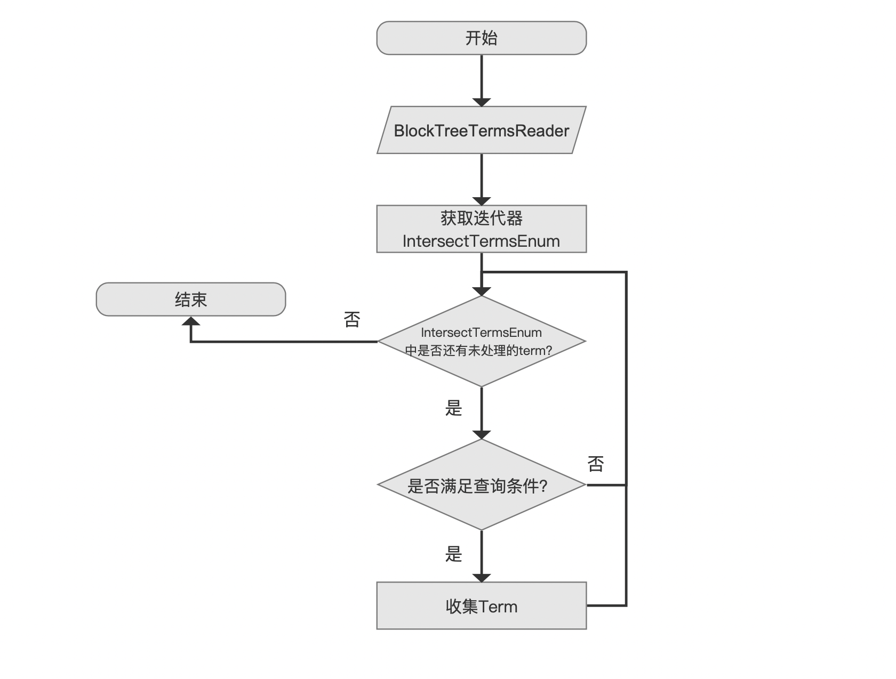
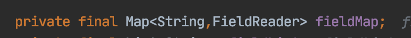
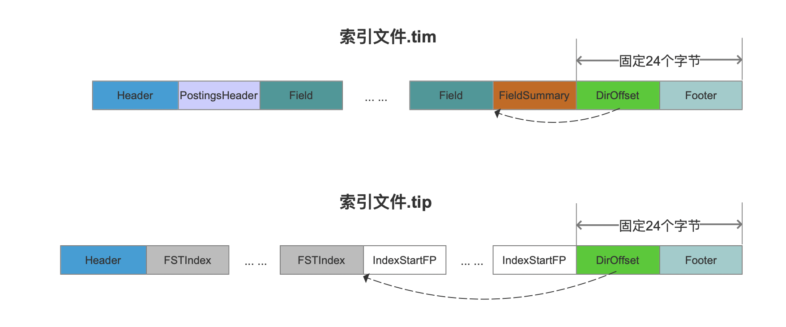
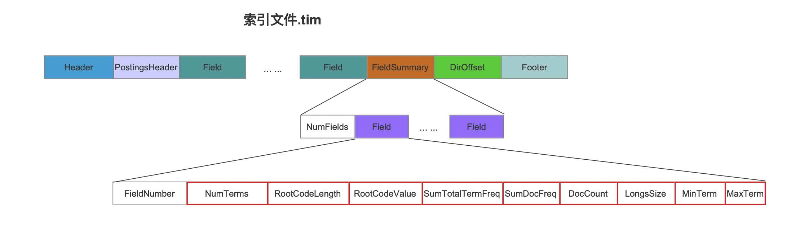
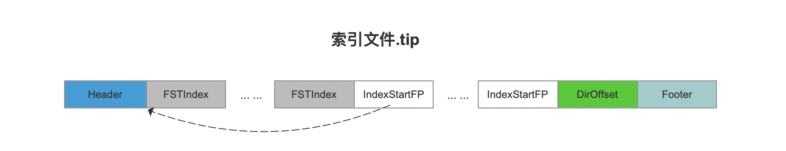
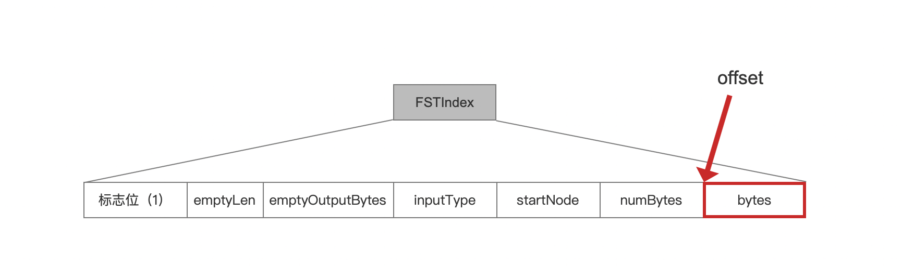
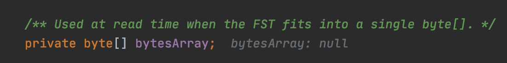
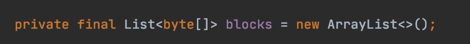

# [索引文件的读取（七）](https://www.amazingkoala.com.cn/Lucene/Search/)（Lucene 8.4.0）

&emsp;&emsp;本篇文章开始介绍[索引文件tim&&tip](https://www.amazingkoala.com.cn/Lucene/suoyinwenjian/2019/0401/43.html)的读取，通过TermRangeQuery的例子来介绍如何从索引文件.tim&&.tip中获取满足查询条件的所有term。

&emsp;&emsp;为了便于介绍，使用了文章[Automaton（二）](https://www.amazingkoala.com.cn/Lucene/gongjulei/2020/0727/157.html)中提供的例子：

图1：

&emsp;&emsp;结合图1的例子，获取满足查询条件（第79行代码）的所有term的过程可以简单的用一句话来描述：**根据域名"content"，从索引文件.tim&&.tip中获取该域对应的term集合，随后遍历集合中的每一个term，使用DFA（见文章[Automaton（二）](https://www.amazingkoala.com.cn/Lucene/gongjulei/2020/0727/157.html)）筛选出满足条件的term**，流程图如下所示：

## 获取满足TermRangeQuery查询条件的term集合的流程图

图2：

### BlockTreeTermsReader

图3：

&emsp;&emsp;在介绍BlockTreeTermsReader的概念或者说包含的信息之前，我们先简单的介绍下该对象的生成时机点，在生成[StandardDirectoryReader](https://www.amazingkoala.com.cn/Lucene/Index/2019/0916/93.html)对象期间，会生成[SegmentReader](https://www.amazingkoala.com.cn/Lucene/Index/2019/1014/99.html)对象，该对象中的FieldsProducer信息描述了[索引文件tim&&tip](https://www.amazingkoala.com.cn/Lucene/suoyinwenjian/2019/0401/43.html)、[索引文件doc](https://www.amazingkoala.com.cn/Lucene/suoyinwenjian/2019/0324/42.html)、[索引文件pos&&pay](https://www.amazingkoala.com.cn/Lucene/suoyinwenjian/2019/0324/41.html)中所有域的索引信息，而BlockTreeTermsReader作为FieldsProducer信息的成员之一，作为[索引文件tim&&tip](https://www.amazingkoala.com.cn/Lucene/suoyinwenjian/2019/0401/43.html)在内存中的描述方式。

&emsp;&emsp;BlockTreeTermsReader对象中，最重要也是我们唯一关心的信息就是一个名为fieldMap的Map容器，定义如下所示：

图4：

&emsp;&emsp;fieldMap容器中，key为域名，value，即FieldReader对象，为该域名对应一些信息，在生成BlockTreeTermsReader对象的过程中，**所有域**的信息将用FieldReader对象来描述，接着我们介绍哪些信息会被用于生成FieldReader对象中。

#### 获取索引文件.tip&&tim中数据的起始读取位置

&emsp;&emsp;通过读取索引文件.tip&&tim来获得生成FieldReader对象的信息， 两个索引文件都是通过各自的DirOffset字段来获取数据的起始读取位置，先给出这两个索引文件的数据结构：

图5：

&emsp;&emsp;在当前版本Lucene 8.4.0中，由于DirOffset跟Footer字段分别占用固定的8、16个字节，共24个字节，故这两个索引文件可以从后往前定位到DirOffset字段的起始读取位置，然后根据DirOffset字段的值再获取数据的读取位置，最后相关信息写入到FieldReader中，如图4所示。

##### FieldSummary

&emsp;&emsp;对于索引文件.tim，它包含的FieldSummary字段中包含了所有域的一些MetaData，如下所示：

图6：

&emsp;&emsp;图6中，除了FieldNumber字段，其他字段都会被写入到FIeldReader对象中，简单了解这些字段的介绍可以看文章[索引文件之tim&&tip](https://www.amazingkoala.com.cn/Lucene/suoyinwenjian/2019/0401/43.html)，详细了解这些字段的生成过程可以阅读文章[索引文件的生成（五）之tim&&tip](https://www.amazingkoala.com.cn/Lucene/Index/2020/0110/125.html)、[索引文件的生成（六）之tim&&tip](https://www.amazingkoala.com.cn/Lucene/Index/2020/0115/126.html)以及[索引文件的生成（七）之tim&&tip](https://www.amazingkoala.com.cn/Lucene/Index/2020/0117/127.html)。

##### IndexStartFP

&emsp;&emsp;对于索引文件.tip，IndexStartFP描述了每个域对应的第一个**读取**的NodeBlock在索引文件.tim中的起始读取位置，如下所示：

图7：

&emsp;&emsp;FSTIndex字段描述了该域的第一个**读取**NodeBlock对应的FST信息，介绍见文章[索引文件的生成（七）之tim&&tip](https://www.amazingkoala.com.cn/Lucene/Index/2020/0117/127.html)。

#### FieldReader

&emsp;&emsp;在生成FieldReader对象的过程中，我们着重关心[FST](https://www.amazingkoala.com.cn/Lucene/yasuocunchu/2019/0220/35.html)的导入模式（load Mode），目前有两种模式可选择：

- off-heap：该模式可以简单理解为使用时载入，载入动作为磁盘I/O操作，只将需要使用的信息读入到内存中
- on-heap：该模式为一次性载入，直接将所有信息读入内存

&emsp;&emsp;在文章[索引文件的生成（六）之tim&&tip](https://www.amazingkoala.com.cn/Lucene/Index/2020/0115/126.html)中我们说到，在合并了PendingBlock之后，会生成一个FST，其中第一个PendingBlock中的prefix将作为FST的inputValue，合并的信息作为FST的outValue。

&emsp;&emsp;通过图7中的FSTIndex中的信息来生成FST，该字段的结构如下所示，各个字段的含义在文章[索引文件的生成（七）之tim&&tip](https://www.amazingkoala.com.cn/Lucene/Index/2020/0117/127.html)已经介绍，不赘述：

图8：

&emsp;&emsp;图8中bytes字段记录了FST的主要信息，意味着这个字段占用的字节是最大的，它包含的信息就是在文章[FST（一）](https://www.amazingkoala.com.cn/Lucene/yasuocunchu/2019/0220/35.html)中，文章结尾最终生成的current[ ]数组。

##### off-heap

&emsp;&emsp;当导入模式为off-heap时，只会保存图8中的offset的值，它描述了bytes的读取位置，由于当前流程点处在`BlockTreeTermsReader`，还没有到查询阶段，目前是不知道查询条件中会对哪个域名进行查询，故使用off-heap后就不用载入**所有域**的FST的主要信息，在图2的流程点`获取迭代器IntersectTermsEnum`根据查询条件获取**某个域**的迭代器（查询阶段）时才会真正的去磁盘读取该域的FST的主要信息，换个说法就是在当前流程点只是获取所有域的FST主要信息的一个"句柄"跟文件指针（offset），并没有获得完整的FST信息。

##### on-heap

&emsp;&emsp;当导入模式为on-heap时，则会从磁盘读取所有域的FST的主要信息，即读取所有域的FSTIndex字段的bytes字段。

&emsp;&emsp;上述的导入模式在Lucene 8.0.0才加入，在之前的版本中，只使用on-heap，该issue地址：https://issues.apache.org/jira/browse/LUCENE-8635?jql=project%20%3D%20LUCENE%20AND%20text%20~%20%22FST%20BytesStore%22 。

&emsp;&emsp;在使用on-heap一次性载入所有域的FST信息时还会根据FST信息的大小使用不用数据结构存储，原因在于Java中的byte[ ]数组大小存在上限，Lucene通过图8中的numBytes字段判断出bytes字段的大小，分别使用下面两个数据结构存储：

- byte[ ]数组：如果numBytes小于等于1GB，那么直接使用byte[ ]数组存储

图9：

- BytesStore对象：如果numBytes大于1GB，那么使用该数据结构
  - 该对象中使用了多个byte[ ] 存储bytes字段的信息，定义如下：

图10：

&emsp;&emsp;该对象中定义了一个链表：

图11：

## 结语

&emsp;&emsp;至此，图1的流程点`BlockTreeTermsReader`介绍结束，基于篇幅，剩余的内容将在下一篇文章中展开。

[点击](http://www.amazingkoala.com.cn/attachment/Lucene/Search/索引文件的读取（七）/索引文件的读取（七）.zip)下载附件

