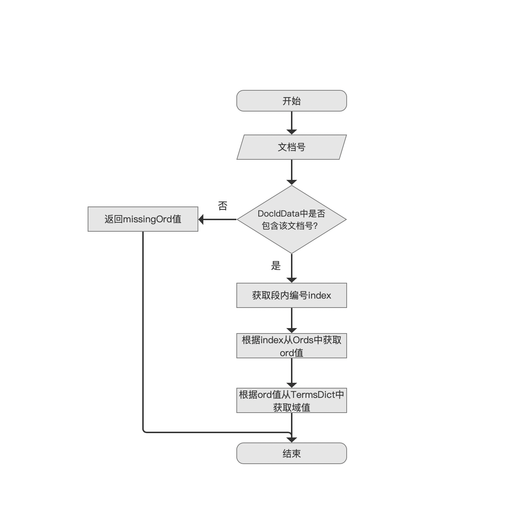
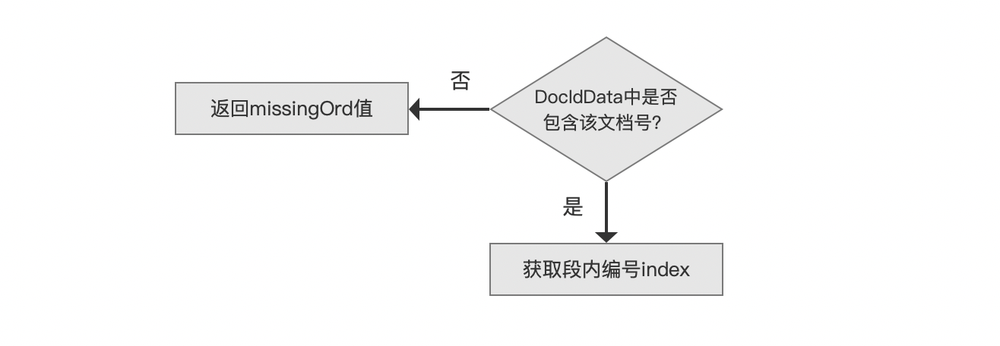
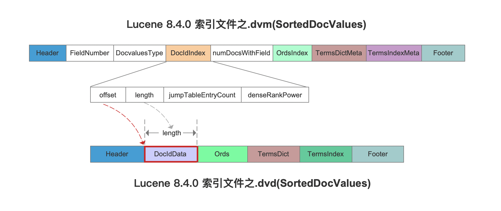
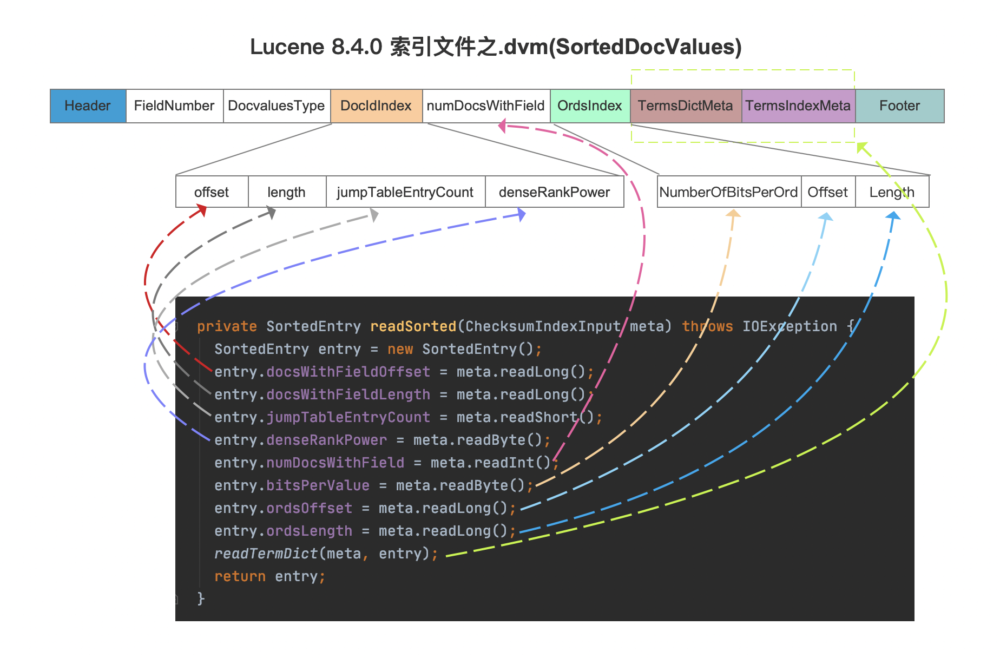
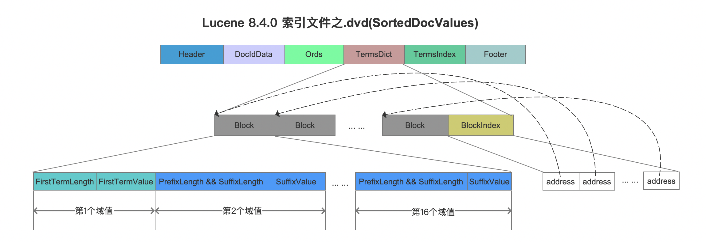
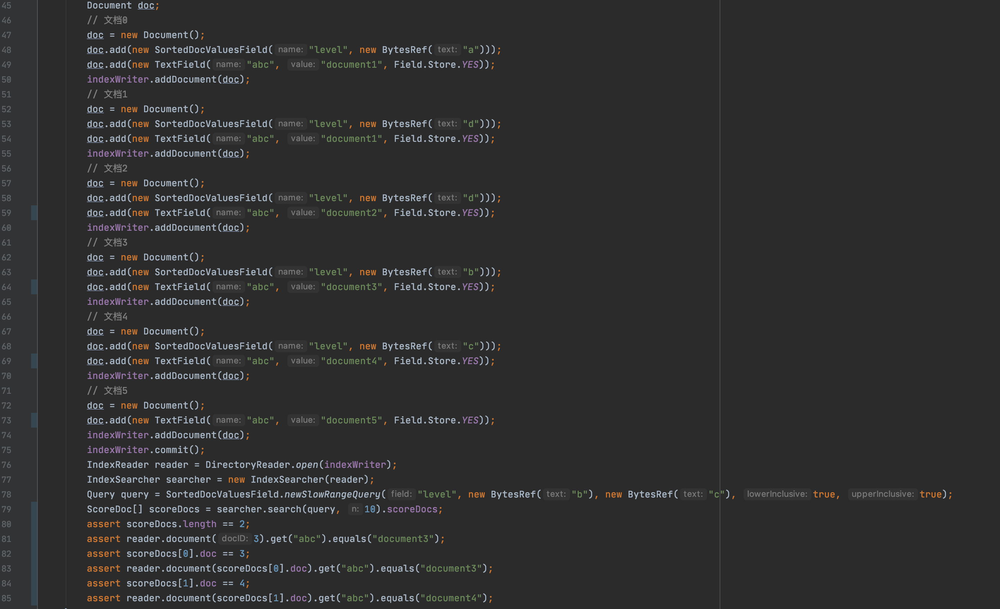
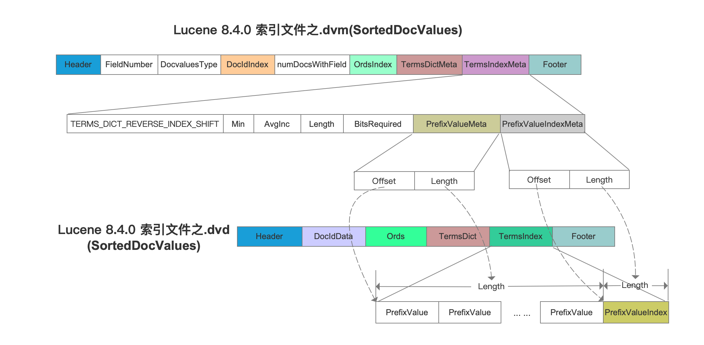
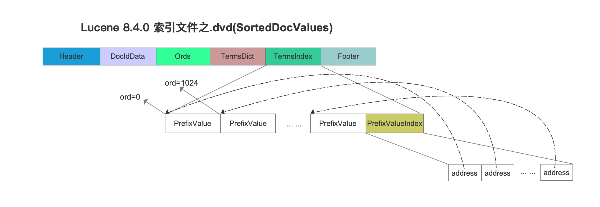
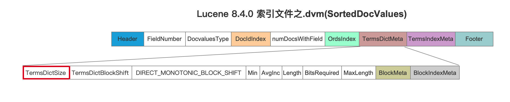

# [索引文件的读取（五）](https://www.amazingkoala.com.cn/Lucene/Search/)（Lucene 8.4.0）

&emsp;&emsp;本篇文章开始介绍索引文件.dvm&&dvd的读取，阅读本系列文章建议先看下文章[索引文件的生成（十八）之dvm&&dvd](https://www.amazingkoala.com.cn/Lucene/Index/2020/0528/144.html)、[索引文件的生成（十九）之dvm&&dvd](https://www.amazingkoala.com.cn/Lucene/Index/2020/0531/145.html)、[IndexedDISI（一）](https://www.amazingkoala.com.cn/Lucene/gongjulei/2020/0511/140.html)、[IndexedDISI（二）](https://www.amazingkoala.com.cn/Lucene/gongjulei/2020/0514/141.html)，了解写入的过程能快的理解读取的逻辑。

&emsp;&emsp;DocValues的其中一个用途用于对查询结果的进行排序，在搜索阶段，当获取了满足查询条件的文档号之后，它会交给[Collector](https://www.amazingkoala.com.cn/Lucene/Search/2019/0812/82.html)实现收集功能，并且在收集过程中实现文档的排序。本文先介绍在使用SortedDocValues或者SortedSetDocValues的情况下，如何获取文档之间的排序关系，而通过读取索引文件.dvm&&dvd的过程即获取排序关系的过程：

## 通过索引文件.dvd、.dvm之SortedDocValues、SortedSetDocValues获取排序关系的流程图

图1：



### 文档号

图2：


&emsp;&emsp;流程图的准备数据为一个文档号，Collector收集器只接受满足查询条件的文档号。

### DocIdData中是否包含该文档号？

图3：



&emsp;&emsp;DocIdData中存储了所有包含用于排序的DocValues的文档的文档号，如下红框所示所示：

图4：



&emsp;&emsp;图4中，通过读取索引文件.dvm的DocIdIndex字段，根据字段中的offset跟length来确定DocIdData在索引文件.dvd中的数据区间，而对于索引文件.dvm中的DocIdIndex以及其他字段的信息，则是根据索引文件.dvm的**固定的数据结构**依次轮流读取，如下所示：

图5：



&emsp;&emsp;图5中，meta.readLong()描述的是读取一个long类型大小的字节数量，另外readTermDict的方法的逻辑也是类似的，即读取TermsDictMeta、TermsIndexMeta的信息。不详细展示了。

&emsp;&emsp;在获取了DocIdData的信息之后就可以判断是否包含图2提供的文档号，包含意味着这篇文档中包含正在用于排序的DocValues信息。

&emsp;&emsp;**如何判断DocIdData中是否包含该文档号**

&emsp;&emsp;在文章[IndexedDISI（一）](https://www.amazingkoala.com.cn/Lucene/gongjulei/2020/0511/140.html)、[IndexedDISI（二）](https://www.amazingkoala.com.cn/Lucene/gongjulei/2020/0514/141.html)中我们介绍了详细的读取过程，这里不赘述。

#### DocIdData中包含该文档号

&emsp;&emsp;如果包含，那么返回一个段内编号index，index的概念在文章[IndexedDISI（一）](https://www.amazingkoala.com.cn/Lucene/gongjulei/2020/0511/140.html)中已经介绍过了，我们这里再次说明下：

```text
段内编号index：index是一个从0开始递增的值，index的值描述的是在生成索引文件.dvd阶段，依次处理的第index个文档号。
```

&emsp;&emsp;index实际上跟currentValue\[ \]数组的下标值是同一个意思，见文章[索引文件的生成（十八）之dvm&&dvd](https://www.amazingkoala.com.cn/Lucene/Index/2020/0528/144.html)的介绍。

#### DocIdData中不包含该文档号

&emsp;&emsp;如果不包含，那么返回的missingOrd值可以为 -1 或者 Integer.MAX_VALUE，至于missingOrd值的用途在下文中我们再介绍。

### 根据index从Ords中获取ord值

图6：


&emsp;&emsp;Ords即图4中索引文件.dvd的Ords字段的信息，Ords的写入过程见文章[索引文件的生成（十九）之dvm&&dvd](https://www.amazingkoala.com.cn/Lucene/Index/2020/0531/145.html)，这里可以简单的将Ords理解为一个数组，其中数组下标为上文中的index、数组元素为ord值（具有相同用于排序的DocValues域值的文档对应的ord值是相同的），其中ord描述了文档之间的排序关系，如果是递增排序，那么ord越小，文档排序越靠前，如果某篇文档不包含当前用于排序的DocValues，那么上文中的missingOrd就作为这篇文档的ord值参与排序。至于为什么ord值描述了文档文档之间的排序关系，相信在读完文章[索引文件的生成（十八）之dvm&&dvd](https://www.amazingkoala.com.cn/Lucene/Index/2020/0528/144.html)之后能明白。

&emsp;&emsp;从上文的内容可以看出，如果用SortedValues/SortedSetValues来排序， 并不是比较SortedValues/SortedSetValues对应的域值的字典序，而是在生成索引文件.dvd阶段将域值映射为一个ord值，通过比较int类型的ord值就能得出排序关系，性能上明显是大于字典序的比较方式，特别是较长的域值。当然ord值的用途不仅仅如此，下文中我们会继续介绍其他的用途。

&emsp;&emsp;到此流程，我们已经获得了文档之间的关系，如果还要取出每篇文档中参与排序的域值，即DocValues的域值，那么可以根据ord获得。

### 根据ord值从TermsDict中获取域值

图7：


&emsp;&emsp;在生成索引文件.dvm&&.dvd阶段，会将有序的并且去重的域值依次写入，并且每处理16个域值就生成一个block、同时生成一个address用来描述这个block在索引文件.dvd中的起始位置，随后在block中找到对应的域值：

图8：




&emsp;&emsp;当获得了ord值后，需要三步才能找到对应的域值：

- 步骤一：计算出在BlockIndex的哪一个块中，计算方式为 ord >> 16，获取块中的address的值
- 步骤二：根据address的值，找到Block在索引文件.dvd中的起始位置
- 步骤三：依次读取Block中的每一个域值，并且判断该域值对应的ord值是否为我们期望的ord，如果不是，那么读取下一个域值，直到找到我们期望的ord

&emsp;&emsp;在步骤三中，相邻term的前缀存储，即如果需要读取第n个域值的完整值，需要知道第n-1个域值的完整值，故Block中第一个域值存储的是完整的域值（见文章[SortedDocValues](https://www.amazingkoala.com.cn/Lucene/DocValues/2019/0219/34.html)的介绍）。

&emsp;&emsp;至此流程点介绍完毕，可以看出，根据文档号我们能获得用于排序的DocValues的域值以及文档的排序关系，注意到的是索引文件.dvd中的TermsIndex在上文中没有涉及，我们接下来介绍该字段的用途。

## 读取TermsIndex

&emsp;&emsp;通过TermsIndex字段，可以用来判断为DocValues中是否包含某个域值，其中一个应用场景为利用DocValues来实现范围查询，demo如下：

图9：



&emsp;&emsp;图9的demo完整代码见：https://github.com/LuXugang/Lucene-7.5.0/blob/master/LuceneDemo8.4.0/src/main/java/io/lucene/DcoValues/SortedDocValuesTest4Test.java 。

&emsp;&emsp;图9中，使用了SortedDocValuesField.newSlowRangeQuery(...)方法执行范围查询，查询条件为包含域名为"level"、域值范围为[b, c]的SortedDocValues的文档，可见文档3、文档4满足查询条件，故代码第88行的查询结果数量为2。

&emsp;&emsp;我们先给出TermsIndex的数据结构，然后介绍如何通过实现图9的范围查询。

&emsp;&emsp;同图4一样，要读取索引文件.dvd中的TermsIndex字段数据，需要通过索引文件.dvm中的TermsIndexMeta，如下所示：

图10：



&emsp;&emsp;接着我们看索引文件.dvd中TermsIndex字段的数据结构：

图11：



&emsp;&emsp;在生成索引文件.dvd的TermsIndex期间，每处理1024个域值，就生成一个PrefixValue，它描述的是在区间\[0, 1023\]的ord值对应的域值都小于PrefixValue（字典序，详细的介绍见文章[索引文件的生成（二十）之dvm&&dvd](https://www.amazingkoala.com.cn/Lucene/Index/2020/0602/146.html)）。

&emsp;&emsp;如果判断SortedDocValues是否包含某个域值，分为以下的步骤：

- 步骤一：获取域值的数量termsDictSize，然后执行 termsDictSize - 1 >>> 10获得一个ordHigh，这个操作计算的是TermsIndex中PrefixValue的数量，可见ordHigh是一个1024的倍数，例如0、1024、2048等，另外termsDictSize的值通过索引文件.dvm中TermsDict字段的TermsDictSize，下图<font color=red>红框</font>标注：

图12：



- 步骤二：根据ordLow == 0跟ordHigh做二分查询，实际就是对图11中的TermsIndex中的PrefixValue进行二分查询，最后获得PrefixValue对应的blockLo跟blockHi，即找到一个ord区间
- 步骤三：随后根据上个步骤计算出的ord区间，对区间内的ord继续做二分查找，实际就是对图8中TermsDict的Block中的第一个term进行二分查找（Block中的第一个term是一个完整的域值），最后确定待查找的域值所属的block
- 步骤四：遍历block中的每一个域值，跟待查找的域值进行字节比较，如果相同说明DocValues中包含待查找的域值，并且返回该域值对应的ord值

&emsp;&emsp;对于图9中的范围查找，实际的过程为尝试找到第78行域值"b"、"c"分别对应的ord值，注意的是：如果没有找到域值"b"对应的ord值，那么ord值为下一个block的第一个term对应的ord值，如果没有找到域值"c"对应的ord值，那么ord值为当前block的最后一个term，最后遍历域名为"level"中包含的所有文档号（DocIdData字段），并且找出文档号对应的ord值（上文中已经介绍如何通过文档号找到对应的ord值），如果ord值在"b"、"c"对应的ord值区间，那么就认为该文档是满足查询条件的。

&emsp;&emsp;上述的内容查找"b"、"c"对应的ord只是介绍了部分的情况，其他一些边界的情况就不展开，相信你已经能了解如何通过DocValues实现范围查找。

## 结语

&emsp;&emsp;尽管本文中没有对SortedSetDocValues进行额外的介绍，实际上原理跟SortDocValue是一致的，故不赘述。

[点击](http://www.amazingkoala.com.cn/attachment/Lucene/Search/索引文件的读取（四）/索引文件的读取（四）.zip)下载附件


