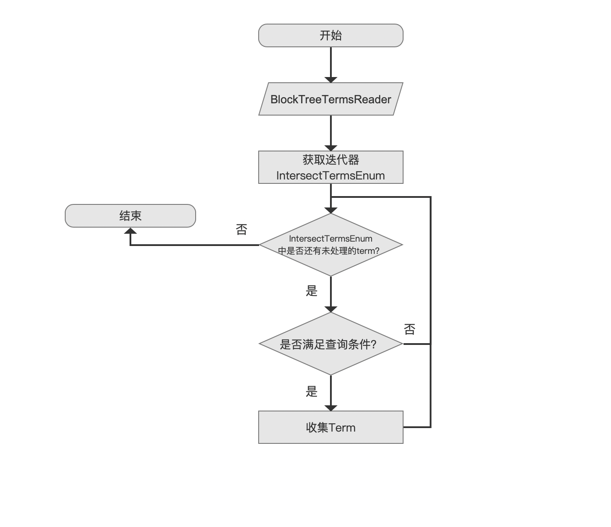
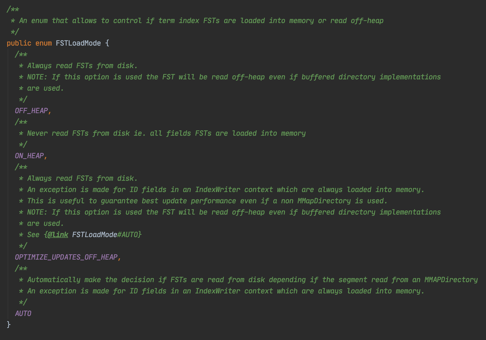
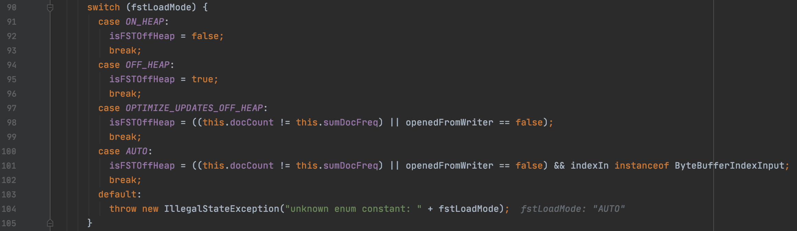
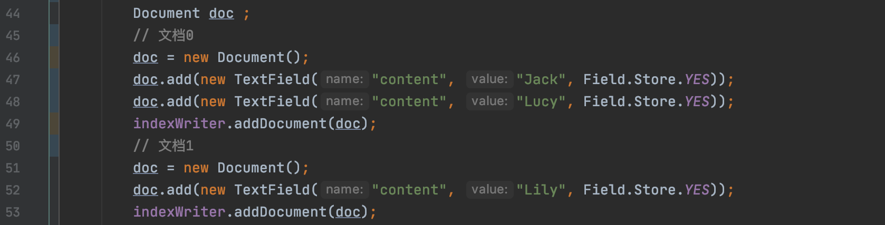
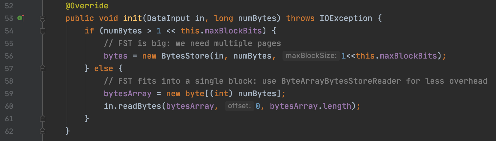
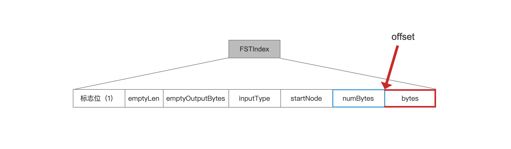
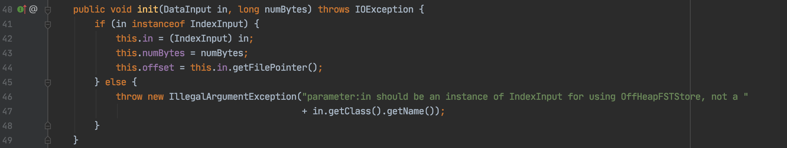

# [索引文件的读取（八）](https://www.amazingkoala.com.cn/Lucene/Search/)（Lucene 8.4.0）

&emsp;&emsp;本文承接文章[索引文件的读取（七）之tim&&tip](https://www.amazingkoala.com.cn/Lucene/Search/2020/0804/158.html)，继续介绍剩余的流程点，先给出流程图：

## 获取满足TermRangeQuery查询条件的term集合的流程图

图1：



### BlockTreeTermsReader

&emsp;&emsp;在上一篇文章中，我们已经介绍了当前流程点`BlockTreeTermsReader`，并且提到在生成FieldReader期间，会采用on-heap/off-heap两种导入模式（loadMode）来获取所有域的FST的主要信息，但是没有说明Lucene是如何选择这两种导入模式的，在Lucene 8.4.0的版本中，Lucene提供以下的**导入模式参数**，在生成FieldReader期间，根据导入模式参数进行对应的逻辑判断，最后选择on-heap/off-heap中的一种，另外注意的是，在[Lucene8.1.0](https://issues.apache.org/jira/browse/LUCENE-8671?jql=project%20%3D%20LUCENE%20AND%20text%20~%20%22FST%20heap%22)之后，允许用户自定义的对不同的域设置不同的导入模式参数，设置的方法在下文中会介绍：

#### 导入模式参数

图2：



&emsp;&emsp;导入模式参数对应的处理逻辑如下：

图3：




##### OFF_HEAP

&emsp;&emsp;无论索引文件.tip是以何种方式打开（见文章[Directory（上）](https://www.amazingkoala.com.cn/Lucene/Store/2019/0613/66.html)），总是使用时才从磁盘读取（lazy load），但是这个参数未考虑索引文件.tip的打开方式，使用off-heap如果不结合合适的打开方式在I/O方面的性能表现不一，见下文中关于AUTO中的介绍。

##### ON_HEAP

&emsp;&emsp;总是将所有域的FST的主要信息写入到内存。

##### OPTIMIZE_UPDATES_OFF_HEAP

&emsp;&emsp;我们先看下图2中关于这个参数的注释：总是使用时才从磁盘读取（lazy load），即off-heap为true，但是有一个例外，如果域的类型为ID Field, 那么这种域的FST的主要信息总是全部都写入到内存。

&emsp;&emsp;**什么是ID Field？**

&emsp;&emsp;可以用来描述文档的唯一性的域就是ID Field，可以理解为数据库中的 primary key，图3中可以通过下面的代码来判断域是否为ID Field：

```java
this.docCount != this.sumDocFreq
```

- docCount：包含某个域的文档数量
- sumDocFreq：某个域在每一篇文档中出现的次数的总和

&emsp;&emsp;如果上述两个字段的值是相同的，那么这个域就被认为是ID Field，例如在索引期间添加了这篇两篇文档：

图4：



&emsp;&emsp;图4的例子中，域名为"content"的域的docCount为2，sumDocFreq的值为3。

&emsp;&emsp;**为什么ID Field就不使用off-heap呢**

&emsp;&emsp;其原因是新增或者更新一篇文档时，这篇文档中如果也有这个ID Field，那么需要先通过查询的方式确保ID Field的域值是否被占用，故使用了off-heap会降低新增或者更新文档的性能。

&emsp;&emsp;具体的介绍可以看这篇文章：https://www.easyice.cn/archives/346 。

&emsp;&emsp;我们继续看图3中对于参数OPTIMIZE_UPDATES_OFF_HEAP的处理逻辑，可见如果当前域为ID Field，但同时openedFromWriter为false的话，还是会使用off-heap，跟参数**OFF_HEAP**一样，这个参数也未考虑索引文件.tip的打开方式，使用off-heap如果不结合合适的打开方式未必能获得较好的I/O性能，见下文中的介绍。

##### AUTO

&emsp;&emsp;该参数实际是对参数OPTIMIZE_UPDATES_OFF_HEAP对应的模式加强，即在按照参数OPTIMIZE_UPDATES_OFF_HEAP的逻辑选择使用off-heap后，还需要满足索引文件.tip是使用[MMapDirectory](https://www.amazingkoala.com.cn/Lucene/Store/2019/0613/66.html)的方式打开的的条件才能使用off-heap，原因是使用内存映射I/O比[FileChannel.open](https://docs.oracle.com/javase/8/docs/api/java/nio/channels/FileChannel.html)有更好的读写性能：

图5：


&emsp;&emsp;图5中，用户空间缓冲区即Channel，上述内容内容选自**<<Linux/UNIX系统编程手册(下册)>>**。

#### 自定义域的导入模式参数

&emsp;&emsp;从Lucene 8.0.1版本开始，可以通过IndexWriter的配置对象IndexWriterConfig为每一种域设置导入模式参数，没有设置的话则默认值为AUTO。

#### 初始化FST

&emsp;&emsp;我们在文章[索引文件的读取（七）之tim&&tip](https://www.amazingkoala.com.cn/Lucene/Search/2020/0804/158.html)中简单的说明了下在off-heap跟on-heap不同导入模式下存储FST的主要信息的数据结构，这里为了加深理解，我们贴出代码来进一步介绍，这两种模式在代码中使用了不同逻辑实现了init()方法。

##### on-heap

图6：



&emsp;&emsp;图6中第54行代码判断FST的主要信息的大小是否超过1G，其中maxBlockBits的值为默认值30，numBytes的值描述的是FST的主要信息的大小，如下所示：

图7：



&emsp;&emsp;当大于1G时，使用BytesStore对象存储，否则使用byte\[ \] bytesArray存储存储，BytesStore跟bytesArray在文章[索引文件的读取（七）之tim&&tip](https://www.amazingkoala.com.cn/Lucene/Search/2020/0804/158.html)已经介绍过了，不赘述。

##### off-heap

图8：



&emsp;&emsp;图8中可以看出，off-heap下，只存储了numBytes字段跟offset字段，offset指向了FST的主要信息（bytes子弹）在FSTIndex中的起始读取位置。

## 结语

&emsp;&emsp;基于篇幅，剩余的内容将在下一篇文章中展开。

[点击](http://www.amazingkoala.com.cn/attachment/Lucene/Search/索引文件的读取（八）/索引文件的读取（八）.zip)下载附件