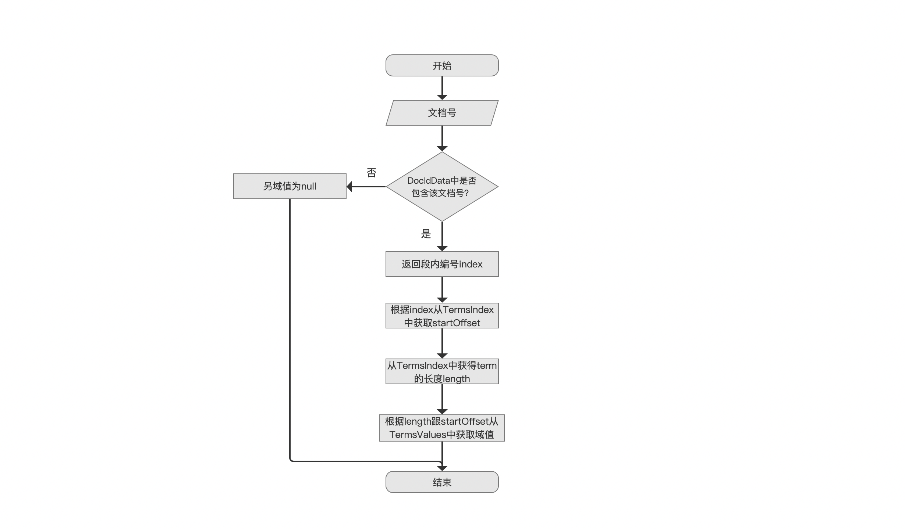
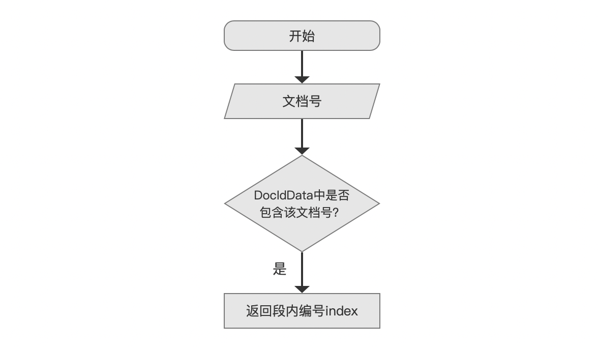
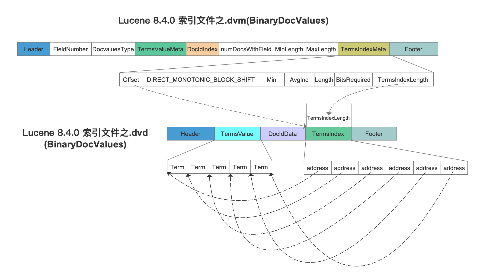
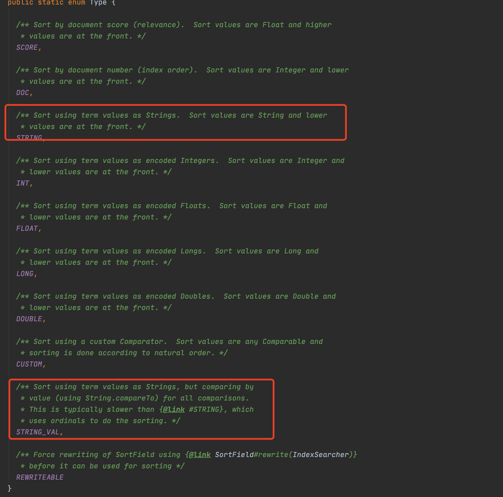
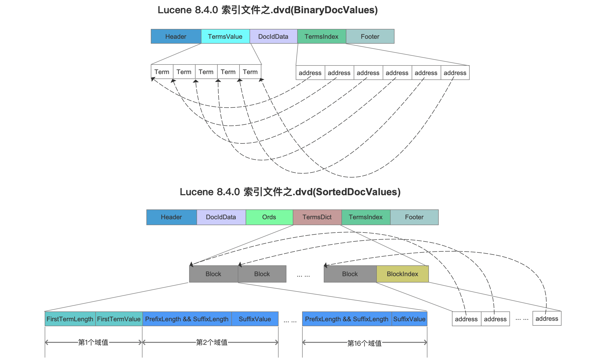

# [索引文件的读取（六）](https://www.amazingkoala.com.cn/Lucene/Search/)（Lucene 8.4.0）

&emsp;&emsp;本文接着介绍索引文件.dvd、.dvm之BinaryDocValues的读取，它同SortedValues一样，其中一个用途用于对查询结果的进行排序，在搜索阶段，当获取了满足查询条件的文档号之后，它会交给[Collector](https://www.amazingkoala.com.cn/Lucene/Search/2019/0812/82.html)实现收集功能，并且在收集过程中实现文档的排序，我们通过一个例子来介绍如何实现排序。

## 通过索引文件.dvd、.dvm之BinaryDocValues获取排序关系的流程图

&emsp;&emsp;获取文档之间的排序关系的过程实际就是根据文档号，通过索引文件.dvm&&dvd读取DocValues的域值，域值之间排序关系来描述文档之间的排序关系，流程图如下：

图1：

### 返回段内编号index

图2：

&emsp;&emsp;图2的流程跟SortedDocValues是一致的，本文不赘述这几个流程点的内容，详细过程见文章[引文件的读取（五）之dvd&&dvm](https://www.amazingkoala.com.cn/Lucene/Search/2020/0714/154.html)。

### 根据index从TermsIndex中获取startOffset

图3：

&emsp;&emsp;先给出索引文件.dvm、dvd之BinaryDocValues的数据结构：

图4：

&emsp;&emsp;为了便于描述，我们这里可以简单的将图4中的TermsIndex字段认为是一个数组，在图2的流程中获得的index（段内编号）就是这个数组的下标值，接着根据index在TermsIndex中获得address的值，**address的值即startOffset**，它描述了域值信息TermsValue中的起始读取位置，但是至此我们还无法获得域值，因为读取一个域值需要域值在TermsValue的起始读取位置以及域值的长度length。

### 从TermsIndex中获得term的长度length

图5：

&emsp;&emsp;在文章[索引文件的生成（二十一）之dvm&&dvd](https://www.amazingkoala.com.cn/Lucene/Index/2020/0605/147.html)中我们知道，在TermsIndex中相邻两个address的差值就是term的长度，故只需要获得段内编号index + 1和段内编号index对应的两个address，它们的差值就是段内编号index对应的域值的长度。

### 根据length跟startOffset从TermsValues中获取域值

图6：

&emsp;&emsp;在当前流程点，根据图3、图5获得的startOffset跟length，就可以在TermsValue确定一个数据区间，该区间中的内容就是域值。

&emsp;&emsp;在Collector中，获得了用于排序的DocValues的域值后，接着使用字典序就可以比较出排序关系，即文档的排序关系。

&emsp;&emsp;至此我们可以发现，BinaryDocValues通过域值的字典序进行排序，而SortedDocValues/SortedSetDocValues则是通过ord值的数值大小进行比较，根据源码中的注释，通过BinaryDocValues实现排序的性能通常较差：

图7：

## BinaryDocValues VS SortedDocValues

&emsp;&emsp;虽然通过BinaryDocValues进行排序的性能相比较SortedValues/SortedSetDocValues通常情况下较差，但是通过比较两者的数据结构，可以看出BinaryDocValues的优点：

图8：

### 根据文档号获得域值

&emsp;&emsp;图8可以看出，对于SortedDocValues，通过address只能确定域值属于某个block，在block中获得该域值则必须从第一个域值开始遍历，直到对应的ord，即最坏的情况下需要在block遍历16次才能找到对应域值，并且需要"拼接"出前15个域值（前缀存储），而对于BinaryDocValues，只需要获得两个address就能获得域值，可见通过文档号找DocValues对应的域值，BinaryDocValues性能通常较好。

### 判断DocValues中是否包含某个域值

&emsp;&emsp;BinaryDocValues无法判断DocValues中是否包含某个域值，而SortedDocValues通过TermsIndex字段，则可以实现，并且可以实现DocValues的范围查询（见文章[引文件的读取（五）之dvd&&dvm](https://www.amazingkoala.com.cn/Lucene/Search/2020/0714/154.html)）。

### 存储性能

&emsp;&emsp;BinaryDocValues的TermsValue字段中存储了每个域值的完整值，而SortedDocValues通过前缀存储，存储性能通常优于BinaryDocValues。

### 写入性能

&emsp;&emsp;使用BinaryDocValues存储域值时，在收集阶段，我们不需要对Term进行排序（意味着无法判断DocValues中是否包含某个域值），在生成索引文件.dvd阶段，不需要前缀存储，写入更少的字段，相比较SortedDocValues写入性能通常较高。

## 结语

&emsp;&emsp;下一篇文章中，我们将介绍如何通过BinaryDocValues实现范围域（RangeField）的查询。

[点击](http://www.amazingkoala.com.cn/attachment/Lucene/Search/索引文件的读取（六）/索引文件的读取（六）.zip)下载附件