# [索引文件的读取（十一）](https://www.amazingkoala.com.cn/Lucene/Search/)（Lucene 8.4.0）

&emsp;&emsp;在上一篇文章[索引文件的读取（十）之tim&&tip](https://www.amazingkoala.com.cn/Lucene/Search/2020/0812/161.html)中我们遗留了一个问题：

&emsp;&emsp;**为什么要根据是否达到阈值使用不同的处理方式：**

&emsp;&emsp;这个问题可以分解为两个小问题：

- 问题一：为什么达到阈值后不使用BooleanQuery的方式做文档号的收集
- 问题二：为什么未达到阈值使用BooleanQuery的方式做文档号的收集

## 处理方式

&emsp;&emsp;这两种处理方式的不同之处就在于如何根据每个term对应的文档号集合，并从这些集合中获取满足查询条件的文档号集合。

### 未达到阈值

&emsp;&emsp;未达到阈值的情况下，会根据每个term从[索引文件.doc](https://www.amazingkoala.com.cn/Lucene/suoyinwenjian/2019/0324/42.html)中获取包含这个term的文档号集合，并且用一个long类型的数组docBuffer\[ \]来存储文档号集合。**注意的是，数组docBuffer\[ \]实际上只会存储一个block（见文章[索引文件之doc](https://www.amazingkoala.com.cn/Lucene/suoyinwenjian/2019/0324/42.html)）中的文档号集合，当这个block中的文档号信息读取结束后，会载入下一个block的文档号信息，并写入到数组docBuffer[ ]中，这里为了便于描述，我们假设数组docBuffer[ ]中存储了所有的文档号**。

&emsp;&emsp;接着使用一个优先级队列[DisiPriorityQueue](https://github.com/LuXugang/Lucene-7.5.0/blob/master/solr-8.4.0/lucene/core/src/java/org/apache/lucene/search/DisiPriorityQueue.java)来存储每个term对应的**正在被读取**的文档号，该队列的排序规则为比较文档号的大小，在执行了排序后，堆顶元素的文档号是最小的，通过排序，更新term对应**正在被读取**的文档号，直到所有term对应的正在被读取的文档号为Integer.MAX_VALUE，最终文档号按照从小到大的顺序都被取出，我们这里通过一个例子简单介绍下该原理。

图1：

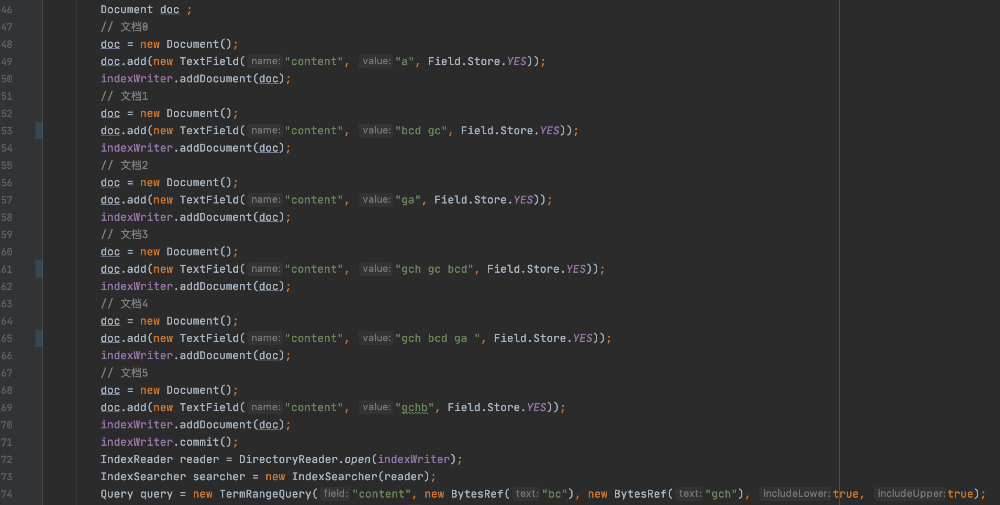

&emsp;&emsp;根据图1中74行的查询条件**肉眼可知**，域值bcd、ga、gc、gch满足查询条件，这几个term对应的文档号集合，如下所示：

图2：


&emsp;&emsp;获取过程：

图3：

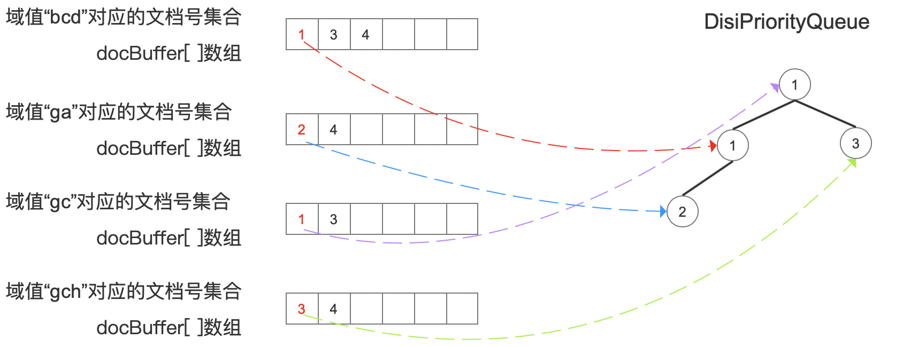

&emsp;&emsp;在最开始，四个docBuffer[ ]数组的第一个数组元素作为每个term正在被读取的文档号存储到优先级队列中，调整堆后如上所示，此时堆顶元素1为满足查询的文档号，它是域值"gc"对应docBuffer[ ]的第一个元素（**这里由于域值"bcd"对应的文档号数量多，在源码中用cost来描述，当元素相同时，cost越小，排序位置就越靠前，故尽管它对应的docBuff[ ]的第一个元素也是1，但是堆顶元素选择了域值"gc"对应docBuffer[ ]的第一个元素**），随后域值"gc"对应的正在被读取的文档号**更新**为dcoBuff[ ]数组的下一个数组元素，即文档号3，**替换**当前的堆顶元素，如下所示：

图4：

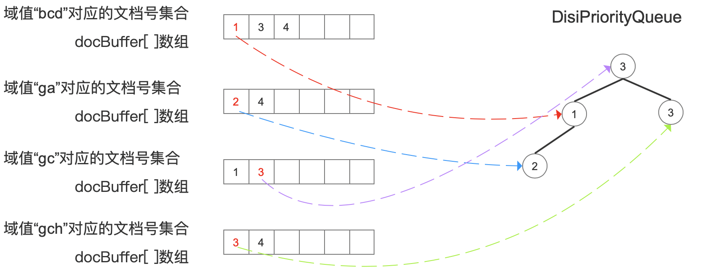

&emsp;&emsp;由于栈顶元素被更新了，故需要执行调整堆的操作，调整后的堆如下所示：

图5：

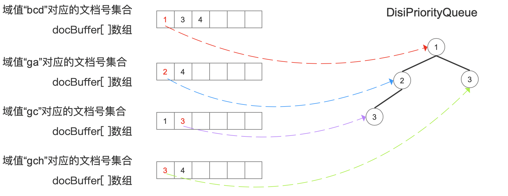

&emsp;&emsp;调整堆之后，堆顶元素为文档号1，由于在图3中，我们已经收集了该文档号，故不需要重复收集。接着域值"bcd"对应的正在被读取的文档号**更新**为dcoBuff[ ]数组的下一个数组元素，即文档号3，**替换**当前的堆顶元素1，如图6所示，由于栈顶元素被更新了，故需要执行调整堆的操作，如图7所示：

图6：

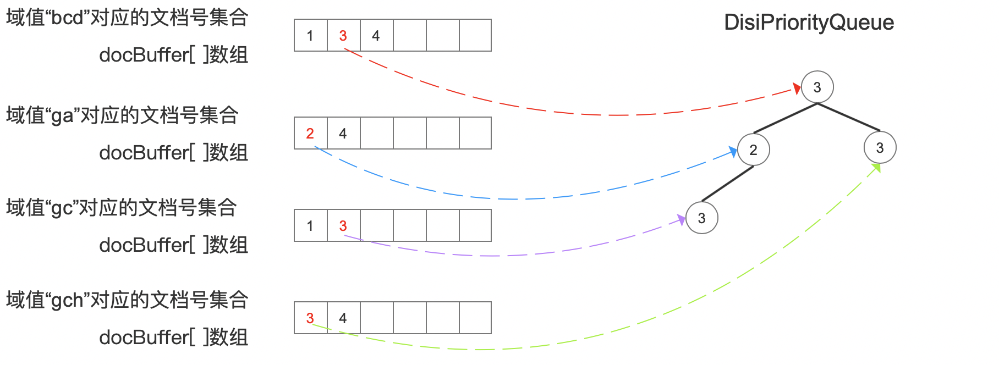

图7：

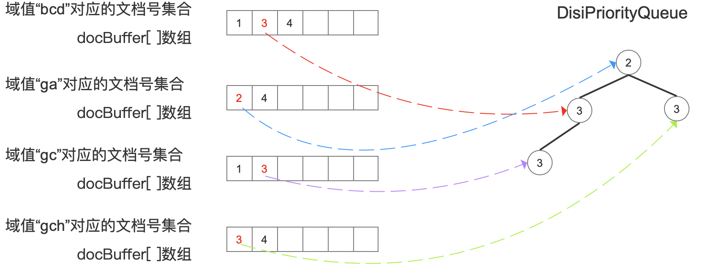

&emsp;&emsp;调整堆以后，堆顶元素为文档号2，并且该文档号还没有被处理过，故它为满足查询的文档号。

&emsp;&emsp;至此相信大家已经理解了其原理，下面直接给出下一次执行了调整堆操作以后的状态：

图8：

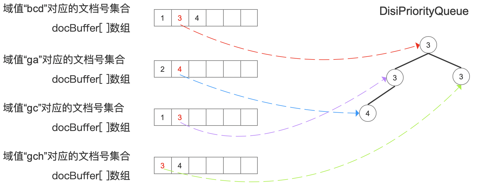

&emsp;&emsp;图8中，堆顶元素文档号3为满足查询的文档号，接着更新、调整堆的操作，如下所示：

图9：

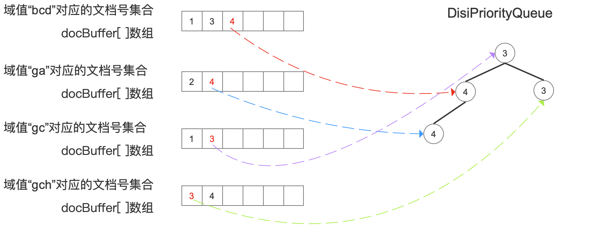

&emsp;&emsp;按照上文描述的处理逻辑，下一步应该更新域值"gc"对应的正在被读取的文档号，由于它对应的文档号都已经取出，故在源码中通过另下一个正在被读取的文档号为Integer.MAX_VALUE，在排序之后如下所示：

图10：

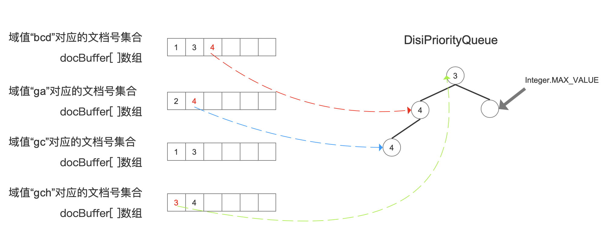

&emsp;&emsp;接着我们直接给出剩下的更新、堆排序后的状态：

图11：

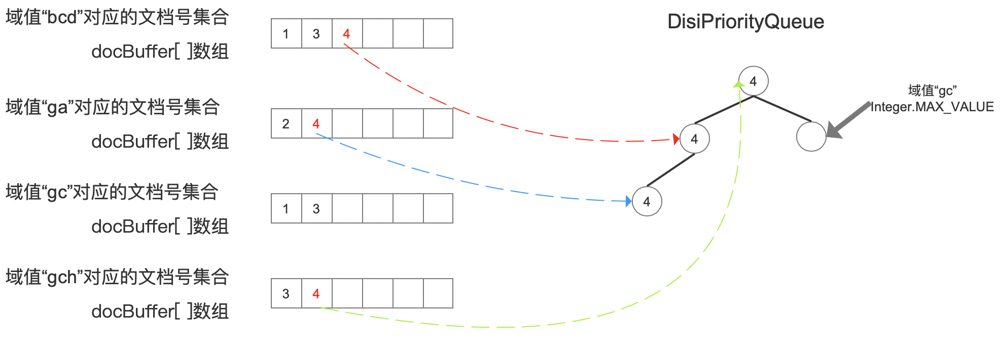

图12：

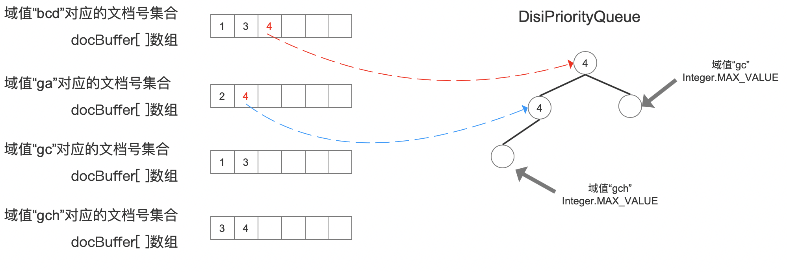

图13：

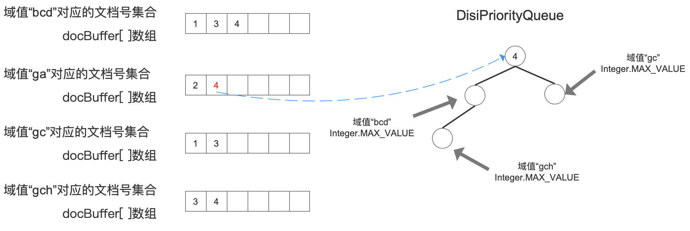

图14：

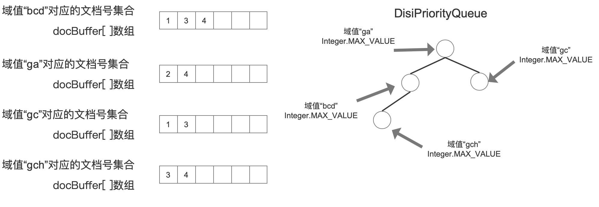

&emsp;&emsp;在图14中，直到所有term对应的正在被读取的文档号的值为Integer.MAX_VALUE，那么获取满足查询条件的文档号集合的过程就完成了。

&emsp;&emsp;上文中的逻辑可以简单的用更新堆顶元素、调整堆两个步骤来归纳，源码中的核心实现位于[DisjunctionDISIApproximation](https://github.com/LuXugang/Lucene-7.5.0/blob/master/solr-8.4.0/lucene/core/src/java/org/apache/lucene/search/DisjunctionDISIApproximation.java)类中的nextDoc()方法，如下所示：

图15：

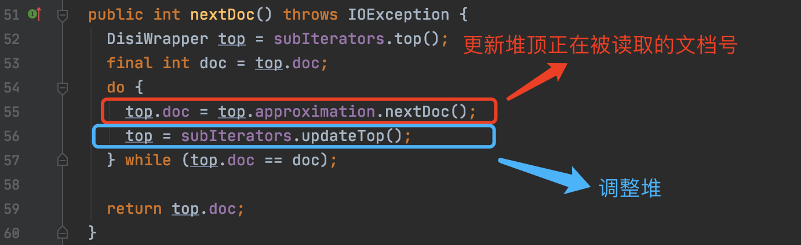

### 达到阈值

&emsp;&emsp;达到阈值的情况下，在文章[索引文件的读取（十）之tim&&tip](https://www.amazingkoala.com.cn/Lucene/Search/2020/0812/161.html)中我们说到，所有term对应的文档号总是优先使用数组存储（数组中可能会有重复的文档号），当达到某个阈值后，会使用[FixedBitSet](https://www.amazingkoala.com.cn/Lucene/gongjulei/2019/0404/45.html)存储，如果最终使用数组存储，那么在收集结束后对数组进行排序、去重操作后就能获取满足查询条件的文档号集合即可，我们详细的介绍下使用[FixedBitSet](https://www.amazingkoala.com.cn/Lucene/gongjulei/2019/0404/45.html)存储时，如何收集以及读取文档号。

&emsp;&emsp;为了便于描述我们还是以图1的例子为例，每个term对应的文档号集合如下所示：

图16：

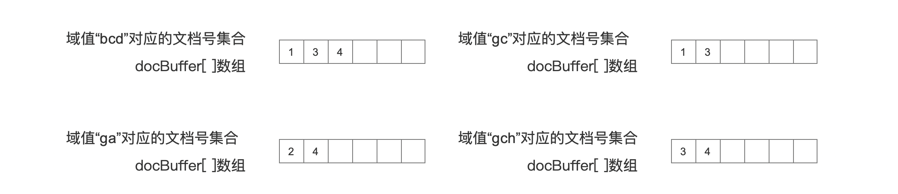

#### 构造FixedBitSet对象

&emsp;&emsp;我们首先了解下FixedBitSet是如何存储文档号的，这块内容在文章[工具类之FixedBitSet](https://www.amazingkoala.com.cn/Lucene/gongjulei/2019/0404/45.html)已经介绍过了，我们这里再简单的说明下：该对象中包含一个long类型的数组bits[ ]，其中每一个数组元素，即一个long类型的值，使用该值的每个bit用来代表一篇文档号，那么一个long类型的值可以用来描述64篇文档号，故bits[ ]数组的第一个数组元素描述的是文档号0~63，第二个数组元素描述的是文档号64~127，以此类推。

&emsp;&emsp;例如我们有以下的文档号，用bits[ ]数组存储后如下所示：

图17：

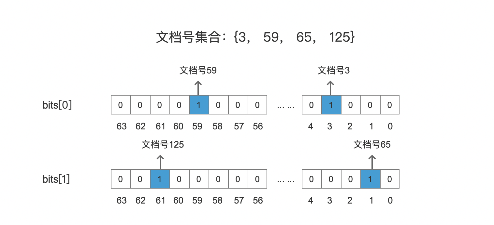

&emsp;&emsp;图17中，bit为1描述了存储了对应的文档号，文档号跟bit的映射关系通过下面的公式来描述：

```java
int wordNum = docId >> 6;      // 步骤一
long bitmask = 1L << docId;    // 步骤二
bits[wordNum] |= bitmask;      // 步骤三
```
- 步骤一：docId右移6位，即除以64，计算出该文档号所属数组元素对应bits[ ]的下标值，图17中，以文档号125为例， 执行 125 >> 6 = 1, 说明文档号125将用bits[ ]数组中下标值为1的数组元素来存储
- 步骤二：通过左移操作，找到在当前数组元素，即在long类型的数值的bit位置，以文档号125为例，执行 1L << 125 的二进制结果为：0b00<font color=red>1</font>00000_00000000_00000000_00000000_00000000_00000000_00000000_00000000
- 步骤三：执行或操作，更新bits[1]的值

&emsp;&emsp;由上述的操作可以知道，**bits[ ]数组的大小取决于文档号集合中最大的文档号**。所以由于不知道满足查询的最大文档号是多少，构造FixedBitSet对象时候**只能**根据段中的文档总数来确定bits[ ]数组的大小。

##### FixedBitSet存储文档号

&emsp;&emsp;存储文档号的总流程可以用一句话概括：依次处理每一个term，将每一个term对应的文档号写入到FixedBitSet中，对于图16的例子，term的处理顺序为："bcd" ---> "ga" ---> "gc" ---> "gch"。

图18：

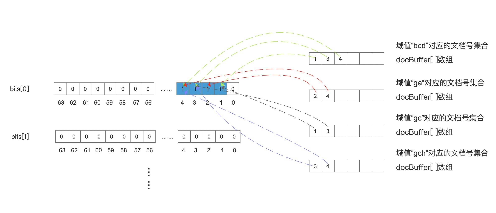

&emsp;&emsp;bits[ ]数组的最大长度为 ((maxDoc - 1) >> 6) + 1。

##### FixedBitSet读取文档号

&emsp;&emsp;获取某个文档号的值，需要上一个文档号的值target才能获取，target的初始值为0，由于代码比较简单，我们直接给出：

```java
public int nextSetBit(int target) {
    // Depends on the ghost bits being clear!
    // 获取target所属的数组元素在bits[]数组中的下标值
    int i = target >> 6;
    // 判断下一个文档号是不是跟target在同一个long类型的数值word中
    long word = bits[i] >> target;  // skip all the bits to the right of index
    if (word!=0) { // 下一个文档号跟target在同一个long类型的数值中
      // Long.numberOfTrailingZeros(word)的结果为 target跟下一个文档号bit位置的差值
      return target + Long.numberOfTrailingZeros(word);
    }
    // numWords为bits[]数组的元素数量
    while(++i < numWords) {// 下一个文档号跟target不在同一个long类型的数值中
      // 尝试从下一个long类型的数值word中查找
      word = bits[i];
      if (word != 0) {// word不为0，说明word中至少有一个bit位的值为1，最低位并且不为0的bit即对应下一个文档号
        return (i<<6) + Long.numberOfTrailingZeros(word);
      }
    }
    return DocIdSetIterator.NO_MORE_DOCS;
}
```

&emsp;&emsp;从上述代码可以看出，获取一个文档号的性能取决于相邻的文档号的数值大小，相邻的文档号差值越大，查找速度越慢。

&emsp;&emsp;**为什么未达到阈值使用BooleanQuery的方式做文档号的收集**

- 最多只有16个（默认阈值BOOLEAN_REWRITE_TERM_COUNT_THRESHOLD，见文章[索引文件的读取（九）之tim&&tip](https://www.amazingkoala.com.cn/Lucene/Search/2020/0810/160.html)）的term的文档信息作为DisiPriorityQueue的元素进行堆的排序，内存开销，排序开销很低
- 避免匹配了少量term仍可能会占用较大内存存储文档号的问题，例如term对应的文档号的数值差值很大，使用FixedBitSet存储会有无用的内存开销，内存开销取决于段中的文档总数，而docBuffer\[ \]的数组是固定，大小为一个block（[索引文件.doc](https://www.amazingkoala.com.cn/Lucene/suoyinwenjian/2019/0324/42.html)中的block）中包含的文档数量，默认值为128，

&emsp;&emsp;**为什么达到阈值后不使用BooleanQuery的方式做文档号的收集**

- 达到阈值后，term的数量无法确定，DisiPriorityQueue的排序，内存开销取决于term的数量
- 每个term都会生成一个TermQuery作为BooleanQuery的子查询，导致更容易抛出TooManyClauses的异常，BooleanQuery所能包含的子查询数量是有上限限制的，取决于BooleanQuery中的maxClauseCount参数，默认值为1024
- 当满足查询的term的数量较大时，通过FixedBitSet对象只记录文档号相比通过BooleanQuery的方式（使用PostingsEnum对象存储，每个term都有自己的PostingsEnum对象）会占用更少的内存，在获取到满足查询的文档号集合之前（堆排序），PostingsEnum对象会常驻内存，它至少包含了文档号的信息以及其他信息（在以后介绍索引文件.doc的读取的文章中会展开介绍），而在TermRangeQuery中，我们只关心文档号，使用FixedBitSet对象存储文档号的期间，也会获取每一个term对应的PostingsEnum对象，但当获取了term对应的文档号集合之后，该对象能及时的释放。

&emsp;&emsp;在执行TermRangeQuery时，获取满足查询的文档号的时机点是不同的，取决于满足查询的term数量是否达到阈值，时机点如下图所示，该流程图的介绍见系列文章[查询原理（一）](https://www.amazingkoala.com.cn/Lucene/Search/2019/0820/86.html)：

图19：

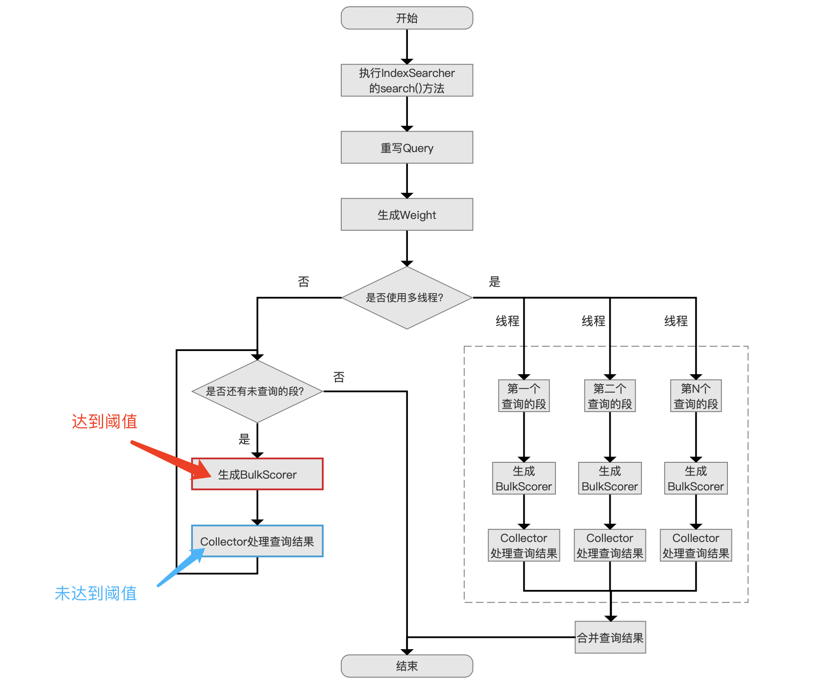

## 结语

&emsp;&emsp;无

[点击](http://www.amazingkoala.com.cn/attachment/Lucene/Search/索引文件的读取（十一）/索引文件的读取（十一）.zip)下载附件

