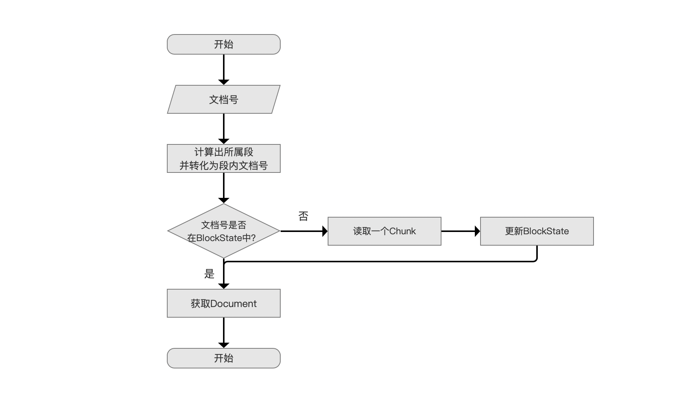
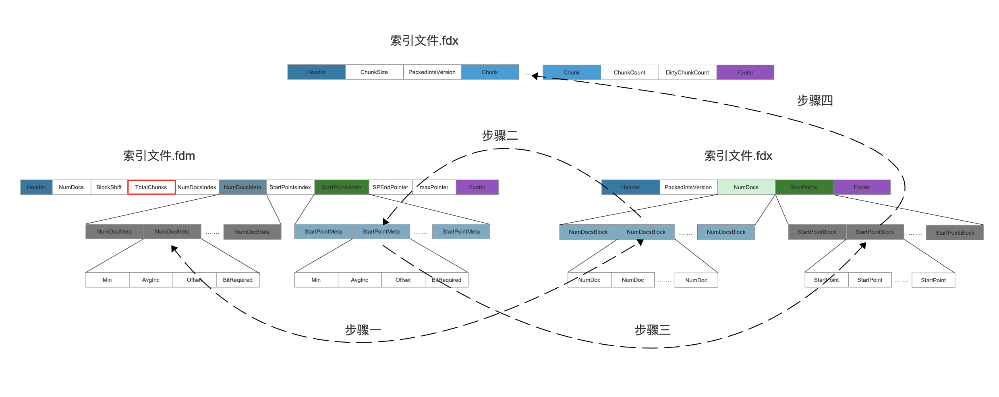

# [索引文件的读取（十五）](https://www.amazingkoala.com.cn/Lucene/Search/)（Lucene 8.6.0）

&emsp;&emsp;本文承接文章[索引文件的读取（十四）之fdx&&fdt&&fdm](https://www.amazingkoala.com.cn/Lucene/Search/2020/1102/174.html)，继续介绍剩余的内容。为了更好的理解下文中的内容，建议先阅读文章[DirectMonotonicWriter&&Reader](https://www.amazingkoala.com.cn/Lucene/yasuocunchu/2020/1030/173.html)。下面先给出读取索引文件fdx&&fdt&&fdm的流程图。

## 读取索引文件fdx&&fdt&&fdm的流程图

图1：



### 读取一个Chunk

图2：


&emsp;&emsp;当图1的流程点`文档号是否在BlockState`不满足条件后，需要根据文档号（段内文档号）重新找到文档号所属的chunk，大致分为四个步骤：

图3：



[点击]()查看大图

&emsp;&emsp;在介绍每个步骤之前， 我们先回顾下文章[索引文件的读取（十四）之fdx&&fdt&&fdm](https://www.amazingkoala.com.cn/Lucene/Search/2020/1102/174.html)中很重要的内容，即索引文件.fdm中的信息在生成reader阶段就已经被全量读取到内存的，而索引文件.fdx的NumDocBlock字段以及StartPointBlock字段则是off-heap方式读取。

#### 步骤一

&emsp;&emsp;执行步骤一的目的是找出一个index，该index描述的是第index个chunk，因为在文章[索引文件的生成（二十四）之fdx&&fdt&&fdm](https://www.amazingkoala.com.cn/Lucene/Index/2020/1016/171.html)我们说到，在flush阶段，每1024（2<< BlockShitf）个chunk就会生成一个NumDoc**s**Meta，所以通过索引文件.fdm的TotalChunks得到chunk的数量以及二分法，随后通过下面的代码一判断出属于哪一个NumDocMeta，随后通过代码二判断出NumDocMeta这个block中的块内索引blockIndex

代码一：

```java
(index >>> blockShift)
```

代码二：

```java
blockIndex = index & ((1 << blockShift) - 1)
```

&emsp;&emsp;获得了blockIndex之后，就可以根据Min、AngInc获得一个存放文档号最大跟最小的区间bounds，最后判断段内文档号是否在这个区间中，如果存在那么就进一步去索引文件.fdx中的NumDocsBlock中读取对应的NumDoc，最终获得一个index，即第index 个chunk中包含段内文档号，但是到这一步我们无法知道第index个chunk在索引文件.fdx中的起始读取位置，所以我们需要执行后面的步骤才能获得。

&emsp;&emsp;如果你看阅读过文章[DirectMonotonicWriter&&Reader](https://www.amazingkoala.com.cn/Lucene/yasuocunchu/2020/1030/173.html)就会知道，根据NumDocMeta中的四个编码元数据**只能**获得一个粗略的文档号的区间，要获得准确的文档号信息，需要去NumDocsBlock中获取（I/O操作）。

#### 步骤二、步骤三、步骤四

&emsp;&emsp;在步骤一中我们获得了段内文档号所在的chunk是第index个chunk，那么通过上文中的代码一跟代码二在步骤二中获得索引文件.fdm中的StartPointMeta以及在步骤三中获得索引文件.fdx中的StartPointBlock中的StartPoint 就可以获得一个pointer，根据该pointer执行步骤四之后就获得了索引文件.fdx中某个chunk的起始读取位置。

### 更新BlockState

图4：


&emsp;&emsp;在上一个流程点获得一个chunk的信息后，那么读取该chunk中的内容用于更新BlockState。读取的过程就是将索引文件.fdx中chunk中的内容写入到内存中。

## 结语

&emsp;&emsp;从上文中的介绍可以看出，当随机读取某个文档中的存储域信息时，会导致频繁的读取一个Chunk的值，意味着更多的I/O操作，所以顺序读取才能保证性能最大化。

[点击](http://www.amazingkoala.com.cn/attachment/Lucene/Search/索引文件的读取（十五）/索引文件的读取（十五）.zip)下载附件