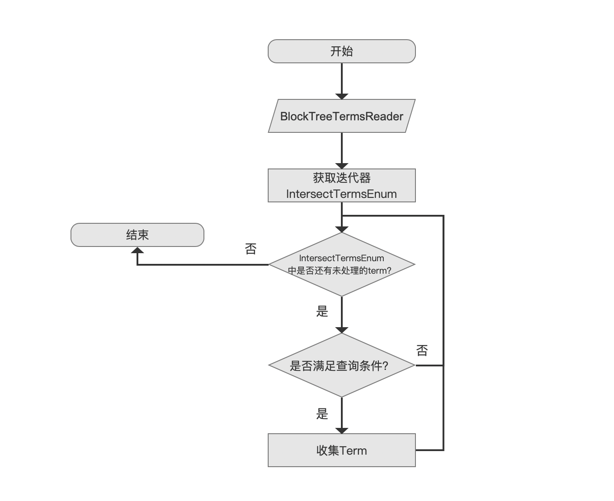
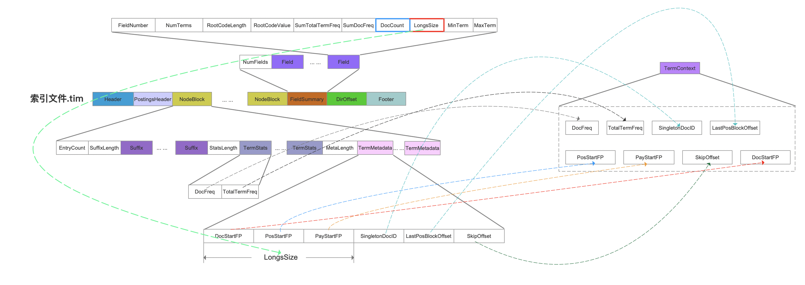
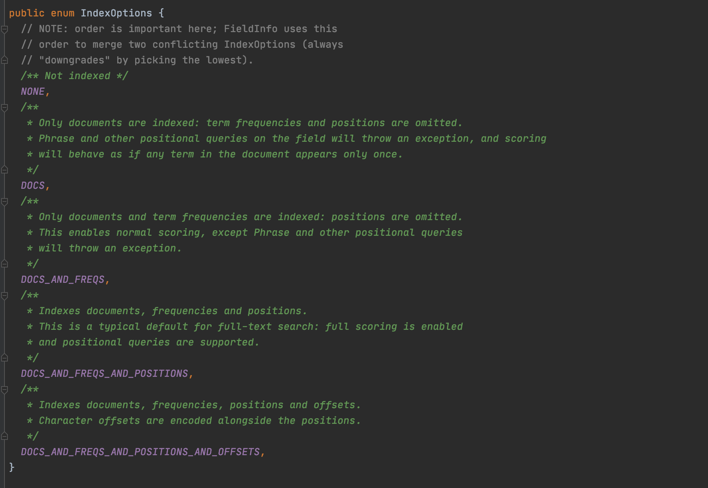
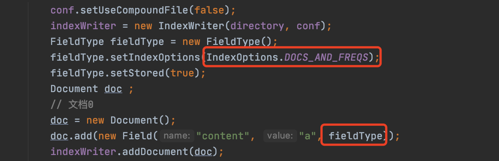
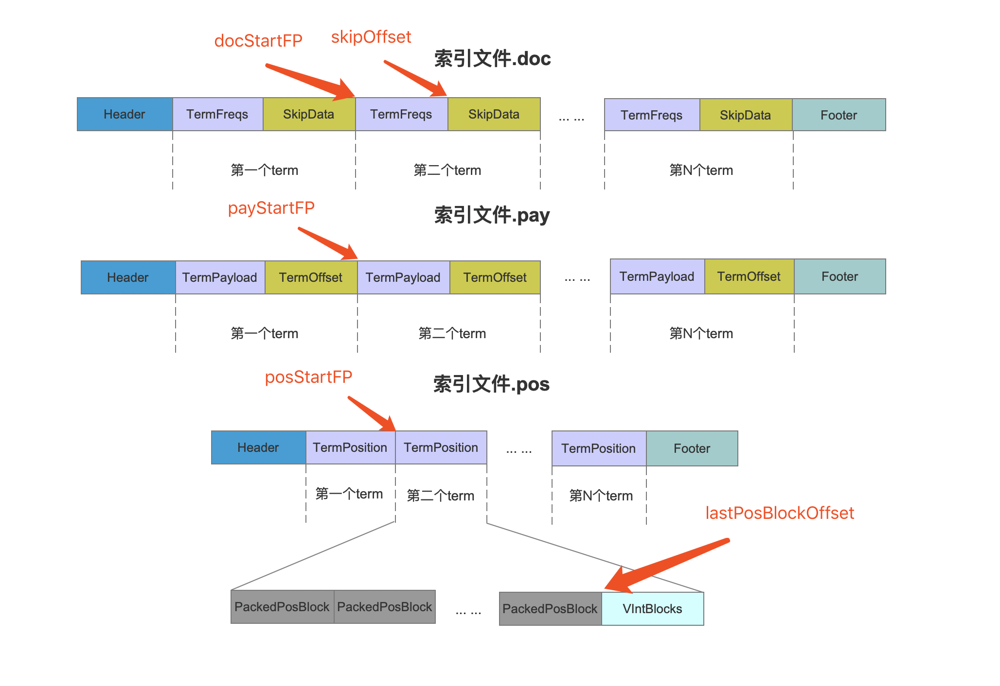

# [索引文件的读取（十）](https://www.amazingkoala.com.cn/Lucene/Search/)（Lucene 8.4.0）

&emsp;&emsp;本文承接文章[索引文件的读取（九）之tim&&tip](https://www.amazingkoala.com.cn/Lucene/Search/2020/0810/160.html)，继续介绍剩余的流程点，先给出流程图：

## 获取满足TermRangeQuery查询条件的term集合的流程图

图1：



### 收集Term

图2：


&emsp;&emsp;在文章[索引文件的读取（九）之tim&&tip](https://www.amazingkoala.com.cn/Lucene/Search/2020/0810/160.html)中我们说到，在查询期间，满足查询条件的term数量**未达到**阈值（默认值16）跟**达到**阈值后的处理方式是不同的。

#### 未达到阈值

&emsp;&emsp;当满足查询条件的term数量**未达到**阈值（默认值16），会将TermRangeQuery转变为BooleanQuery，其中每个term生成一个TermQuery，作为BooleanQuery的子查询，并且TermQuery之间的关系为[SHOULD](https://www.amazingkoala.com.cn/Lucene/Search/2018/1211/25.html)，其后续的查询过程可以阅读[查询原理](https://www.amazingkoala.com.cn/Lucene/Search/2019/0821/87.html)系列文章，不过在文章[查询原理（二）](https://www.amazingkoala.com.cn/Lucene/Search/2019/0821/87.html)中，我们只是简单的介绍TermContext对象（Lucene 7.5.0）中包含的信息，这里我们详细的介绍下TermContext中的信息是在**何时生成**、**如何获取**、**为什么要获取**。

##### 何时生成

&emsp;&emsp;在执行完图1的流程点`是否满足查询条件`后，如果term满足查询条件，那么接着马上去索引文件.tim中获取该term的信息，即TermContext中包含的信息：

##### 如何获取

图3：



[点击]()查看大图

&emsp;&emsp;由图3可见TermContext所需要的信息都在索引文件.tim的TermStat跟TermMetaData字段中，另外需要注意的是，TermMetadata字段的不总是包含上述六个字段，我们这里看下DocStartFP、PosStartFP、以及PayStartFP这三个字段，其中PosStartFP、以及PayStartFP是否存在取决与在索引期间某个域的IndexOptions属性，如下所示：

图4：



&emsp;&emsp;假设我们有以下的例子：

图5：



&emsp;&emsp;图5中， 对于"content"域来说，设置了IndexOptions.DOCS_AND_FREQS意味着不用存储term的位置position跟offset信息，即不会生成索引文件.pos、索引文件.pay，那么在TermMetadata字段中就不需要PosStartFP、以及PayStartFP字段，因为TermMetadata字段中的信息描述了该term的信息在索引文件.doc、索引文件.pay、索引文件.pos中起始读取位置，如下所示：

图6：



&emsp;&emsp;图3中<font color=red>红框</font>标注的字段longSize描述了在读取阶段应该读取几个FP，以图5为例，由于"content"域的TermMetadata只存在DocStartFP，故longSize的值为1，根据上文的描述也可以知道longSize的可选的值区间为[1, 3]。

&emsp;&emsp;**为什么要获取**

&emsp;&emsp;回顾图1的流程点，整个流程结束后，我们得到的是term以及term的相关信息（Lucene 8.4.0的源码中用TermStates对象描述），但查询的最终目的是找到满足查询条件的文档号，从上文中我们知道，我们获得了满足查询的term的TermMetadata，它包含了DocStarFP，使得我们能后续的流程中能通过DocStarFP在索引文件.doc中找到包含这个term的文档号。

#### 达到阈值

&emsp;&emsp;当达到阈值后，会继续查找，直到所有满足查询条件的term都被找到，并同时获取每个term的信息，这些信息即上文中介绍的索引文件.tim中的TermStats、TermMetadata字段，不同的是，这些term不会生成TermQuery，而是每一个term根据TermMetadata字段中的DocStartFP从索引文件.doc中找到包含它的文档号，而这些文档号正是满足查询条件的。

##### 收集文档号

&emsp;&emsp;基于满足查询条件的文档数量，会使用不同的数据结构存储，首先通过下面的公式计算出阈值，在收集的过程中，**总是先用一个数组收集文档号**，当文档数量超过阈值后，再改为使用[FixedBitSet](https://www.amazingkoala.com.cn/Lucene/gongjulei/2019/0404/45.html)存储：

```java
threshold = maxDoc >>> 7
```

&emsp;&emsp;上述公式中，maxDoc指的是**当前段中的文档总数**（记住这个maxDoc，下一篇文章中将会介绍**为什么要根据是否达到阈值使用不同的处理方式**，这个变量是其中的原因之一），另外上述公式的设计原则在源码中也给出了注释：

```text
For ridiculously small sets, we'll just use a sorted int[], maxDoc >>> 7 is a good value if you want to save memory, lower values such as maxDoc >>> 11 should provide faster building but at the expense of using a full bitset even for quite sparse data
```
&emsp;&emsp;注释大意：如果阈值设置的太小，并且文档数量稀疏（比如说文档号的值跨度很大，但是文档数量很少）的情况下可能会造成使用一个全量的[FixedBitSet](https://www.amazingkoala.com.cn/Lucene/gongjulei/2019/0404/45.html)存储，会造成内存的浪费，全量的概念、内存浪费的原因在阅读[FixedBitSet](https://www.amazingkoala.com.cn/Lucene/gongjulei/2019/0404/45.html)就能明白，这里不赘述，阈值设置的太大，那么可能会用数组来存储，但是收集的性能没有FixedBitSet高，原因见下文。

&emsp;&emsp;使用数组在收集的文档号过程中，是可能收集到重复的文档号，处理办法为在收集结束后，对数组先进行排序，然后去重，最后输出的数组中的数组元素是有序并且唯一（去重）的，如果使用[FixedBitSet](https://www.amazingkoala.com.cn/Lucene/gongjulei/2019/0404/45.html)就不会有这个困扰，收集到相同的文档号后只会对bit位重复赋值为1而已，并且不需要排序操作。

#### 疑问

&emsp;&emsp;**为什么要根据是否达到阈值使用不同的处理方式：**

&emsp;&emsp;这个问题可以分解为两个小问题：

- 问题一：为什么达到阈值后不使用BooleanQuery的方式做文档号的收集
- 问题二：为什么未达到阈值使用BooleanQuery的方式做文档号的收集

&emsp;&emsp;基于篇幅原因，下一篇文章我们在作出解释。

## 结语

&emsp;&emsp;无

[点击](http://www.amazingkoala.com.cn/attachment/Lucene/Search/索引文件的读取（十）/索引文件的读取（十）.zip)下载附件


