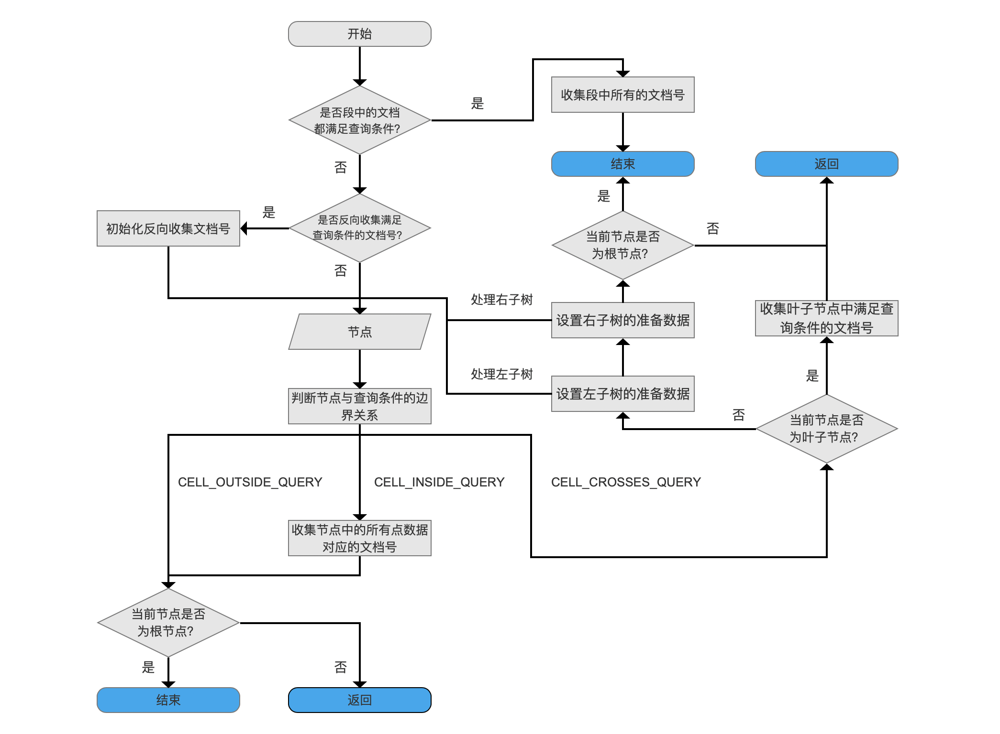
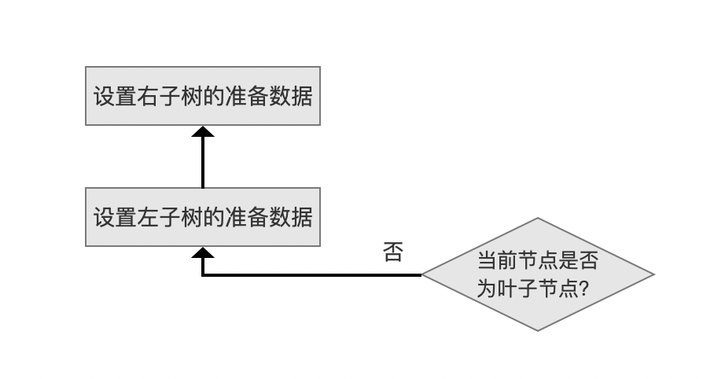
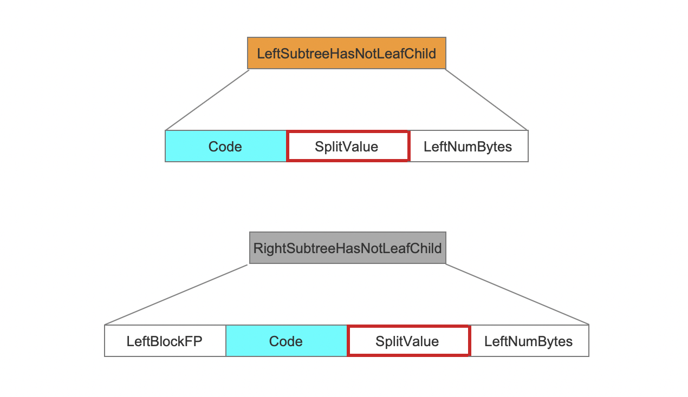
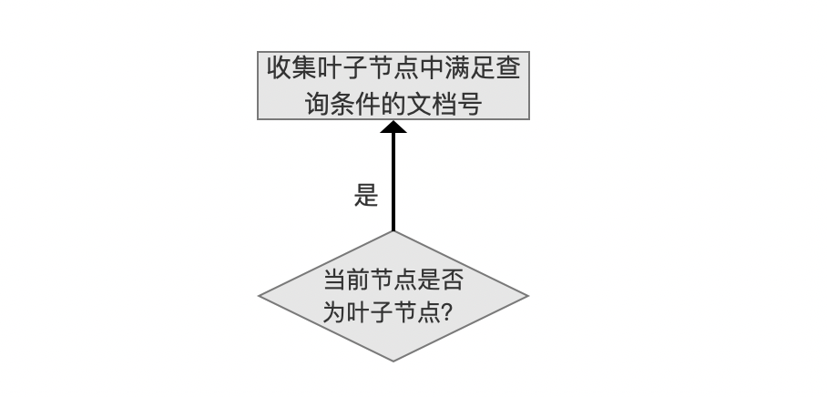
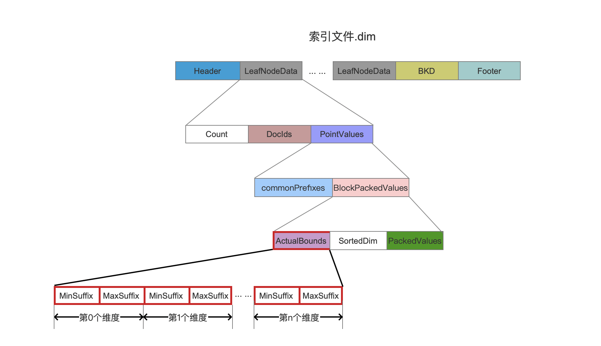
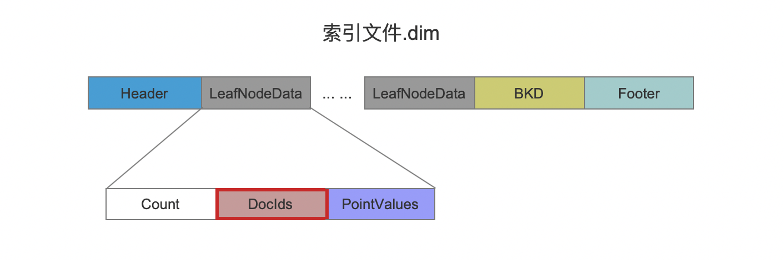
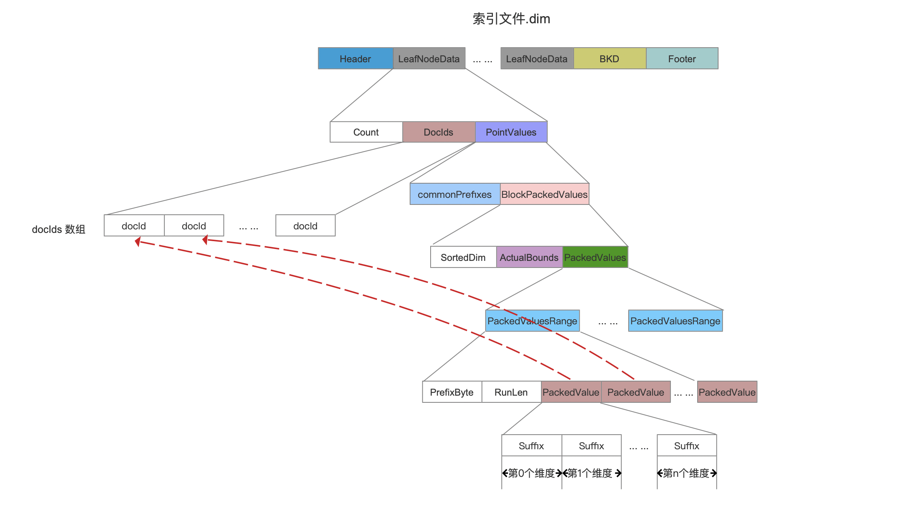

# [索引文件的读取（四）](https://www.amazingkoala.com.cn/Lucene/Search/)（Lucene 8.4.0）

&emsp;&emsp;本文承接[索引文件的读取（三）之dim&&dii](https://www.amazingkoala.com.cn/Lucene/Search/2020/0430/137.html)继续介绍剩余的内容，下面先给出读取索引文件.dim&&dii的流程图：

图1：

[点击]()查看大图

## 设置左子树、右子树的准备数据

图2：

&emsp;&emsp;在图1的流程点`判断节点与查询条件的边界关系`中，如果当前节点中的点数据的数值范围跟查询条件的数值范围的边界关系为CELL_CROSSES_QUERY（见文章[索引文件的读取（一）之dim&&dii](https://www.amazingkoala.com.cn/Lucene/Search/2020/0427/135.html)），说明查询条件的数值范围跟节点中的点数据的数值范围部分重叠（partially overlaps），如果当前节点是内部节点（非叶节点），那么我们需要为左右子树设置准备数据，递归处理。

&emsp;&emsp;当前节点需要为子树设置多个准备数据，我们主要关心splitPackedValue，当前节点的minPackedValue和splitPackedValue将作为左子树的minPackedValue和maxPackedValue，同理，splitPackedValue和当前节点的maxPackedValue将作为右子树的minPackedValue和maxPackedValue。

&emsp;&emsp;当前节点由于是内部节点，那么根据内部节点的不同数据结构（见文章[索引文件的读取（三）之dim&&dii](https://www.amazingkoala.com.cn/Lucene/Search/2020/0430/137.html)），splitPackedValue的获取方式如下红框标注：

图3：

## 收集叶子节点中满足查询条件的文档号

图4：

&emsp;&emsp;由于当前叶子节点中的点数据的数值范围跟查询条件的数值范围边界关系为CELL_CROSSES_QUERY，那么我们只能通过依次判断每一个点数据，找出满足查询条件的点数据对应的文档号，这个处理过程主要分为两步：重新计算边界关系、取出满足查询条件的文档号。

### 重新计算边界关系

&emsp;&emsp;在图2中的流程中，我们知道，叶子节点的父节点会设置准备数据minPackedValue和maxPackedValue，其中minPackedValue描述的是叶子节点中每个维度的最小值，maxPackedValue描述的是叶子节点中每个维度的最大值。

&emsp;&emsp;在文章[索引文件的生成（十一）之dim&&dii](https://www.amazingkoala.com.cn/Lucene/Index/2020/0410/131.html)中我们知道，父节点提供的minPackedValue和maxPackedValue对应的数值范围实际是大于或等于叶子节点中真正的数值范围，使得在图1的流程点`判断节点与查询条件的边界关系`中计算出的结果（**使用的是父节点提供的minPackedValue和maxPackedValue**）并不能准确的反映叶子节点的点数据数值范围跟查询条件的数值范围的边界关系，所以我们需要重新边界关系，叶子节点的minPackedValue和maxPackedValue通过读取下面的字段获得：

图5：

&emsp;&emsp;在生成索引文件.dim的过程中，节点的minPackedValue跟maxPackedValue基于一定条件可能需要重新计算，不直接使用父节点提供的minPackedValue跟maxPackedValue，这块内容请阅读文章[索引文件的生成（十一）之dim&&dii](https://www.amazingkoala.com.cn/Lucene/Index/2020/0410/131.html)中`设置左子树的准备数据、设置右子树的准备数据`的章节。

&emsp;&emsp;重新计算后的边界关系依然是存在三种情况：CELL_INSIDE_QUERY、CELL_OUTSIDE_QUERY、CELL_CROSSES_QUERY。

#### CELL_OUTSIDE_QUERY

&emsp;&emsp;说明叶子节点中没有任何点数据满足查询条件，那么直接返回。

#### CELL_INSIDE_QUERY

&emsp;&emsp;说明叶子节点中所有点数据满足查询条件，那么读取叶子节点中所有的文档号，从下图红框标注的字段获取所有的文档号：

图6：

#### CELL_CROSSES_QUERY

&emsp;&emsp;如果仍然是CELL_CROSSES_QUERY，那么就需要读取每一点数据的域值，通过字典序比较，找出满足查询条件的点数据对应的文档号。

### 取出满足查询条件的文档号

&emsp;&emsp;读取域值的过程就不详细介绍， 如果你阅读了索引文件.dim的生成过程，那么自然会了解，这里主要讲下，如果某个点数据满足查询条件，是如何找到对应的文档号的。

&emsp;&emsp;在重新计算边界关系前，Lucene就先读取了叶子节点中的文档号信息，并将文档号写入到数组docIDs中，该数组的大小即点数据的数量，又因为每个点数据同样连续的存储到一块连续的空间中，那么点数据域值跟文档号的对应关系如下所示，我们以highCardinalityCost（见文章[索引文件的生成（十三）之dim&&dii](https://www.amazingkoala.com.cn/Lucene/Index/2020/0418/133.html)）为例：

图7：

[点击]()查看大图

## 结语

&emsp;&emsp;至此，[索引文件.dim&&dii](https://www.amazingkoala.com.cn/Lucene/suoyinwenjian/2019/0424/53.html)的读取过程介绍完毕。

[点击](http://www.amazingkoala.com.cn/attachment/Lucene/Search/索引文件的读取（四）/索引文件的读取（四）.zip)下载附件