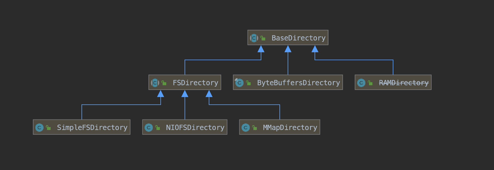
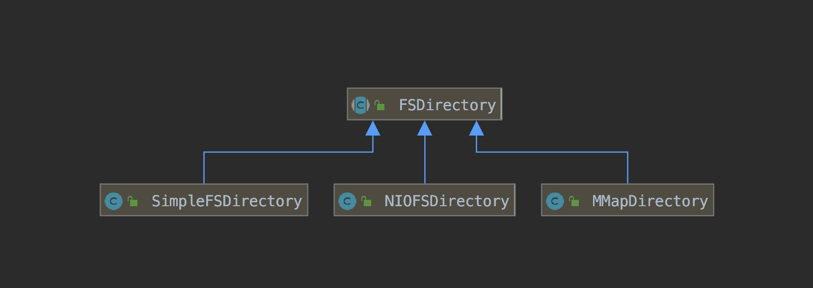
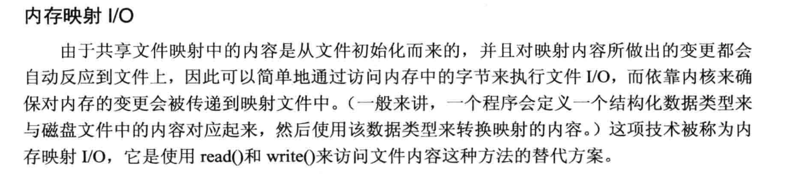
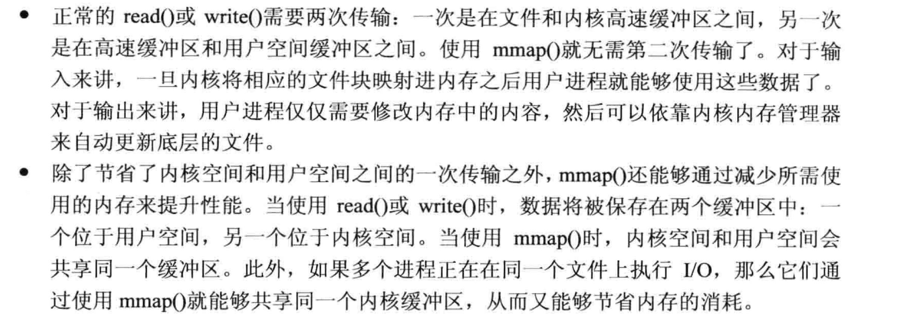
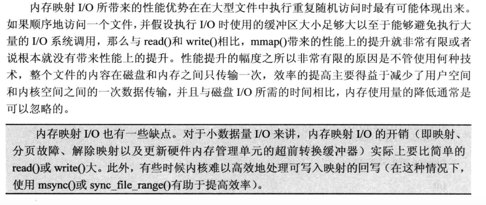

# [Directory](https://www.amazingkoala.com.cn/Lucene/Store/)(上)（Lucene 7.5.0）

&emsp;&emsp;Directory类用来维护索引目录中的索引文件，定义了`创建`、`打开`、`删除`、`读取`、`重命名`、`同步`(持久化索引文件至磁盘)、`校验和`（checksum computing）等抽象方法。

&emsp;&emsp;索引目录中不存在多级目录，即不存在子文件夹的层次结构(no sub-folder hierarchy)。

&emsp;&emsp;其子类如下图所示，**另外下图中只列出了Lucene7.5.0的core模块中的子类，在其他模块，比如在misc模块中还有很多其他的子类**：

图1：


点击查看[大图]()

&emsp;&emsp;接下来一一介绍其子类。

## BaseDirectory
&emsp;&emsp;BaseDirectory同样是一个抽象类，提供了其子类共有的`获取索引文件锁`的方法，即维护了一个LockFactory对象，[索引文件锁](https://www.amazingkoala.com.cn/Lucene/Store/2019/0604/62.html)的概念已经在前面的文章中介绍，这里不赘述。
&emsp;&emsp;下图中为BaseDirectory类的子类：

图2：



## FSDirectory

图3：



&emsp;&emsp;FSDirectory作为一个抽象类，提供了其子类共有的`创建`、`删除`、`重命名`、`同步`(持久化索引文件至磁盘)、`校验和`（checksum computing）等方法，这些方法在介绍完三个子类后再叙述。

&emsp;&emsp;FSDirectory的三个子类主要的不同点在于它们各自实现了`打开`、`读取`索引文件的方法。

### SimpleFSDirectory

- 打开索引文件：使用Files的[newByteChannel](https://docs.oracle.com/javase/8/docs/api/java/nio/file/Files.html)方法来`打开`一个索引文件，比如说通过DirectoryReader.open(IndexWriter)读取索引文件信息会调用此方法
- 读取索引文件：使用FileChannelImpl`读取`索引文件，使得可以随机访问索引文件的一块连续数据。

&emsp;&emsp;随机访问索引文件的一块连续数据在Lucene中是很重要的，例如图4中画出了.doc索引文件的数据结构，索引文件按照域（field）划分，在读取阶段，Lucene总是按域逐个处理，所以需要获取每一个域在.doc索引文件中的数据区域。

图4：


&emsp;&emsp;使用SimpleFSDirectory有以下注意点：

- 该类不支持并发读取同一个索引文件，多线程读取时候会被处理为顺序访问（synchronized(FileChannelImpl)）如果业务有这方面的需求，那么最好使用NIOFSDirectory或者MMapDirectory
- 如果有多个线程读取同一个索引文件，当执行线程被打断(Thread.interrupt()或Future.cancel())后，该索引文件的文件描述符(file descriptor)会被关闭，那么阻塞的线程随后读取该索引文件时会抛出[ClosedChannelException](https://docs.oracle.com/javase/8/docs/api/java/nio/channels/ClosedChannelException.html)的异常，不过可以使用RAFDirectory来代替SimpleFSDirectory，它使用了[RandomAccessFile](https://docs.oracle.com/javase/8/docs/api/java/io/RandomAccessFile.html)来`读取`索引文件，因为它是不可打断的(not interruptible)。RAFDirectory已经作为一个旧的API(legacy API)被丢到了misc模块中，它同样不支持并发读取索引文件，所以跟SimpleFSDirectory很类似，不展开介绍

### NIOFSDirectory

- 打开索引文件：使用Files的[FileChannel.open](https://docs.oracle.com/javase/8/docs/api/java/nio/channels/FileChannel.html)方法来`打开`一个索引文件
- 读取索引文件：使用FileChannelImpl`读取`索引文件，使得可以随机访问索引文件的一块连续数据。

&emsp;&emsp;使用NIOFSDirectory有以下注意点：

- 该类支持并发读取同一个索引文件，但是它存在跟SimpleFSDirectory一样的多线程下执行线程被打断的问题，如果业务中存在这个情况，那么可以使用RAFDirectory来代替NIOFSDirectory
- 另外如果Lucene是运行在Windows操作系统上，那么需要注意在SUN's JRE下的一个[BUG](https://bugs.java.com/bugdatabase/view_bug.do?bug_id=6265734)

### MMapDirectory

- 打开索引文件：使用内存映射(memory mapping)功能来`打开`一个索引文件，例如初始化MMapDirectory时，如果索引目录中已存在合法的索引文件，那么将这些文件尽可能的都映射到内存中，或者通过DirectoryReader.open(IndexWriter)读取索引文件信息会打开IndexWriter收集的索引文件数据
- 读取索引文件：将索引文件全部读取到内存中(如果索引文件在磁盘上)

&emsp;&emsp;如果内存映射失败，导致的原因可能是内存中连续的虚拟地址空间的数量（unfragmented virtual address space）不足、操作系统的内存映射大小限制等，更多的原因可以看这里[MapFailed](http://blog.thetaphi.de/2012/07/use-lucenes-mmapdirectory-on-64bit.html)，Lucene7.5.0中根据不同的情况提供了下面几种出错信息：

- 非64位的JVM：MMapDirectory should only be used on 64bit platforms, because the address space on 32bit operating systems is too small
- Windows操作系统：Windows is unfortunately very limited on virtual address space. If your index size is several hundred Gigabytes, consider changing to Linux
- Linux操作系统：Please review 'ulimit -v', 'ulimit -m' (both should return 'unlimited'), and 'sysctl vm.max_map_count'
- 内存不足：Map failed。JVM传递过来的内存不足的堆栈信息是各种嵌套OOM信息(nested OOM)，容易让使用者困惑，所以Lucene将复杂的堆栈信息替换为一条简单的信息，即"Map failed"

#### 内存映射I/O技术
&emsp;&emsp;以下内容选自<<**Linux/UNIX系统编程手册(下册)**>>，文字太多，直接上个截图吧：

图5：



&emsp;&emsp;内存映射I/O之所以能够带来性能优势的原因如下：

图6：



&emsp;&emsp;内存映射I/O优缺点：

图7：



#### 取消映射(unmap)
&emsp;&emsp;由于JVM的限制，并没有提供取消映射的方法，故在某些JDK版本会存在这么一个问题，即用户调用了FileChannel的close()方法，但是无法关闭操作系统层面的该文件的文件描述符，直到GC回收才能关闭。这样的情况会导致以下的问题，调用了FileChannel的close()方法并且在GC回收前的时间区间内，执行了删除或者覆盖文件的操作，如果是Windows平台，那么会导致抛出异常，不过在其他的平台，基于"delete on last close"的语义，还是能正确的执行，不过会有短暂的额外的磁盘开销(该文件还未被删除)，虽然不会有影响但是还要需要知晓这个问题，上述描述的问题可以查看这个[BUG](https://bugs.java.com/bugdatabase/view_bug.do?bug_id=4724038)。

&emsp;&emsp;针对无法通过JDK提供的显示方法来取消映射的问题，Lucene提供了一个替代方法（workaround），即unmapHackImpl()方法， 使得可以用户在调用了FileChannel的close()方法后能通过一个native的invokeExact方法来取消映射，unmapHackImpl()的实现不展开，感兴趣的可以[点击这里](http://lucene.apache.org/core/7_5_0/core/org/apache/lucene/store/MMapDirectory.html)查看实现逻辑。

&emsp;&emsp;使用unmapHackImpl()方法有以下必须满足的要求：

- JVM必须是Oracle Java或者 OpenJDK 8或更高的版本
- lucene-core.jar必须有相关的权限(策略文件中保证)，即permission java.lang.reflect.ReflectPermission "suppressAccessChecks"，以及permission java.lang.RuntimePermission "accessClassInPackage.sun.misc"

&emsp;&emsp;最后如果出于某些原因，不需要使用unmapHackImpl()方法，那么可以通过setUseUnmap()来取消该功能。

&emsp;&emsp;使用MMapDirectory有以下注意点：

- 该类支持并发读取同一个索引文件，但是它存在跟SimpleFSDirectory一样的多线程下执行线程被打断的问题，如果业务中存在这个情况，那么可以使用RAFDirectory来代替MMapDirectory
- 可以使用setPreload()方法来设置是否提前将文件映射到物理内存中

### 如何选择FSDirectory
&emsp;&emsp;由于操作系统的多样性，Lucene无法用一个FSDirectory类来满足所有的平台要求，因此在FSDirectory类中提供了open()方法，让Lucene根据当前的运行平台来选择一个合适的FSDirectory对象，即为用户从SimpleFSDirectory、MMapDirectory、NIOFSDirectory中选出一个合适的FSDirectory对象，当然用户可以通过new的方式直接使用这些FSDirectory对象。

&emsp;&emsp;根据不同的条件使用对应的FSDirectory对象：

- JRE环境是64位并且支持unmapHackImpl()方法：使用MMapDirectory，例如Linux、MacOSX、Solaris、Windows 64-bit JREs。(判断是否支持unmapHackImpl()方法的逻辑见[MMapDirectory](http://lucene.apache.org/core/7_5_0/core/org/apache/lucene/store/MMapDirectory.html))
- 如果上面的条件都不满足并且当前平台是Windows：使用SimpleFSDirectory，例如Windows上其他的JREs
- 如果上面的条件都不满足：使用NIOFSDirectory

### FSDirectory类中的方法
&emsp;&emsp;FSDirectory提供了其子类共有的`创建`、`删除`、`重命名`、`同步`(持久化索引文件至磁盘)、`校验和`（checksum computing）等方法。

#### 创建
&emsp;&emsp;创建一个用来存放某个索引文件信息的对象，核心部分即使用[BufferedOutputStream](https://docs.oracle.com/javase/8/docs/api/java/io/BufferedOutputStream.html)对象来存放数据。

#### 删除
&emsp;&emsp;在一些情况下需要删除索引文件，至少包括以下情况：

- 索引合并：即[段合并](https://www.amazingkoala.com.cn/Lucene/Index/2019/0516/59.html)，被合并的段中的索引文件会被删除
- 删除旧的commit()：如果是IndexWriter使用了KeepOnlyLastCommitDeletionPolicy策略，那么每当有新的commit()操作，就会生成一个新的[Segment_N](https://www.amazingkoala.com.cn/Lucene/suoyinwenjian/2019/0610/65.html)文件，并且随后删除上一个，即Segment_N-1文件

&emsp;&emsp;另外有一个pendingDeletes的Set对象，当索引文件无法被删除时，pendingDeletes会记录该文件，并且在执行`创建`、`删除`、`重命名`、`同步`时会尝试再次删除这些文件，本该被删除的索引文件如果还留在索引目录中，可能会导致一些问题，比如被错误的合并、被错误的重命名(下文会介绍)。

&emsp;&emsp;当删除该索引文件并且失败后，此索引文件会被添加到pendingDeletes中，导致无法被删除的原因，至少包括以下情况：

- 在Windows平台，当删除一个索引文件，并且该索引文件的句柄仍然被打开着，那么就会抛出异常，同时在Catch语句中将该文件名添加到pendingDeletes

#### 重命名
&emsp;&emsp;使用[Files.move()](https://docs.oracle.com/javase/8/docs/api/java/nio/file/Files.html)方法实现重命名。

#### 同步
&emsp;&emsp;将内存中的索引文件同步(持久化)到磁盘，使用FileChannel.force()方法，如果同步某个文件抛出I/O异常，那么往上传递，如果同步的是目录，捕获异常，这样区分的目的由于篇幅原因不展开叙述，感兴趣请看这篇[博客](http://blog.httrack.com/blog/2013/11/15/everything-you-always-wanted-to-know-about-fsync/)，这篇博客是Lucene源码中的推荐，博客内容介绍了同步磁盘的知识点。如果链接失效，在附件中可以看到对应的PDF。

#### 校验和
&emsp;&emsp;校验和的内容在后面介绍CodeUtil类时会详细介绍。

## ByteBuffersDirectory
&emsp;&emsp;ByteBuffersDirectory使用堆，即通过一个ConcurrentHashMap来存储所有存储索引文件，其实key是索引文件名。

```java
  private final ConcurrentHashMap<String, FileEntry> files = new ConcurrentHashMap<>();
```

&emsp;&emsp;ByteBuffersDirectory适合用于存储体积较小，不需要持久化的临时索引文件，在这种情况下比MMapDirectory更有优势，因为它没有磁盘同步的开销。

## RAMDirectory
&emsp;&emsp;RAMDirectory使用自定义的byte[]数组来存储索引文件信息，并且该数组最多存放1024个字节，所以如果索引大小为indexSize个字节，那么内存中就会有( indexSize / 1024 )个byte[]数组，当indexSize超过hundred megabytes后时会造成资源浪费，比如回收周期(GC cycles)问题。

&emsp;&emsp;RAMDirectory已经被置为@Deprecated，所以不详细展开。

# 结语
&emsp;&emsp;本文介绍Lucene7.5.0的core模块中的BaseDirectory类及其子类。

[点击下载](http://www.amazingkoala.com.cn/attachment/Lucene/Store/Directory/Directory%EF%BC%88%E4%B8%8A%EF%BC%89/Directory%EF%BC%88%E4%B8%8A%EF%BC%89.zip)Markdown文档


