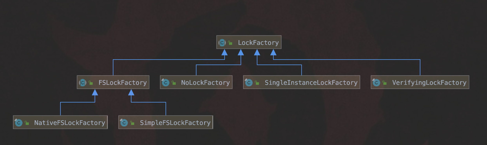

# 索引文件锁LockFactory（Lucene 7.5.0）

&emsp;&emsp;LockFactory在Lucene中用来对索引文件所在的目录进行加锁，使得同一时间总是只有一个IndexWriter对象可以更改索引文件，即保证单进程内(single in-process)多个不同IndexWriter对象互斥更改（多线程持有相同引用的IndexWriter对象视为一个IndexWriter不会受制于LockFactory，而是受制于对象锁（synchronized(this)）、多进程内(multi-processes)多个对象互斥更改。

# LockFactory的具体实现类

&emsp;&emsp;LockFactory是一个抽象类，提供了以下几种子类，即NoLockFactory、SingleInstanceLockFactory、SimpleFSLockFactory、NativeFSLockFactory、VerifyingLockFactory，下面一一介绍。

图1：


## NoLockFactory

&emsp;&emsp;该类的功能同类名一样，即不会对索引文件进行加锁，如果使用者有把握（certain）使得IndexWriter对象总是能互斥更改索引文件，那么可以不对索引文件所在的目录进行加锁。

## SingleInstanceLockFactory

&emsp;&emsp;该类是RAMDirectory默认使用的索引文件锁，RAMDirectory属于Directory类的子类，Directory类描述了索引文件所在目录的一些信息，以后会有文章介绍Directory类。

&emsp;&emsp;对于拥有相同RAMDirectory对象的多个IndexWriter对象，实现不同IndexWriter之间对索引文件的互斥更改。

### 获得索引文件锁
&emsp;&emsp;该过程十分的简单，故给出完整的代码：
```java
  final HashSet<String> locks = new HashSet<>();

  // 尝试获得索引文件锁，如果已经占用则抛出异常
  public Lock obtainLock(Directory dir, String lockName) throws IOException {
    synchronized (locks) {
      if (locks.add(lockName)) {
        return new SingleInstanceLock(lockName);
      } else {
        throw new LockObtainFailedException("lock instance already obtained: (dir=" + dir + ", lockName=" + lockName + ")");
      }
    }
  }
```
&emsp;&emsp;在IndexWriter类中，定义了一个不可更改的lockName，使得无论哪个线程通过IndexWriter来获得索引文件锁时，lockName的值都是相同的，这样就能通过判断该lockName是否在locks容器中来实现互斥，lockName在IndexWriter类中的定义如下：

图2：


### 释放索引文件锁
&emsp;&emsp;释放锁的过程即从locks容器(HashSet对象)中移除键值为write.lock的元素。

## FSLockFactory
&emsp;&emsp;FSLockFactory是一个抽象类，它有两个子类分别是SimpleFSLockFactory，NativeFSLockFactory，用来专门指定给FSDirectory类提供索引文件锁(can only be used with FSDirectory subclasses)。

### SimpleFSLockFactory

&emsp;&emsp;该类只能用于FSDirectory，FSDirectory跟RAMDirectory一样是Directory的子类。

&emsp;&emsp;该类通过在索引文件所在目录创建一个名为`write.lock`文件的方式来实现索引文件锁，该方法的缺点在于如果JVM异常退出，那么索引文件锁可能无法被释放，即没有删除`write.lock`文件。

&emsp;&emsp;解决的方法只能是通过手动删除`write.lock`文件，注意是，手动删除前用户得自己保证(certain)目前没有IndexWriter正在写入，否则非常容易破坏（corrupt）索引文件，比如说由于删除了`write.lock`文件，使得多个IndexWriter对象同时更改了索引文件。


#### 获得索引文件锁

&emsp;&emsp;在索引文件所在目录生成一个`write.lock`文件，并且记录该文件的创建时间，目的是在任意阶段可以检查该文件是否被外在力量（external force）篡改了，从而判定该锁的合法性(valid)，在该类中，如果发现被篡改，那么就抛出异常。

&emsp;&emsp;比如每次添加一篇文档（Document）后，将该Document的信息写入索引文件之前会做检查（调用该类的ensureValid( )方法），如果此时发现`write.lock`被篡改了（比如说被删除了），那么这次写入就会失败，后续的处理会在以后介绍IndexWriter时详细介绍。

#### 释放索引文件锁

&emsp;&emsp;释放锁的过程即删除`write.lock`文件，如果发现`write.lock`文件的创建时间跟获得该锁的时间不同，那么就抛出异常来让用户决定如何处理这种情况，使用Files.delete(Path path)的方法来尝试删除`write.lock`文件，如果出错了，那么同样地抛出异常让用户决定如何处理这种情况。

### NativeFSLockFactory

&emsp;&emsp;NativeFSLockFactory同SimpleFSLockFactory一样，只能用于FSDirectory，它是Directory**默认使用的LockFactory**的，同样的通过在索引文件所在目录生成一个`write.lock`文件，但是该类还使用了[FileChannel](https://docs.oracle.com/javase/8/docs/api/java/nio/channels/FileChannel.html)来管理`write.lock`文件。

#### 获得索引文件锁

&emsp;&emsp;NativeFSLockFactory获得索引文件锁的过程分为两步：

- 第一步：判断`write.lock`文件是否已经被**进程内(in-process)**的其他线程的不同IndexWriter对象占有，通过一个线程安全的同步Set容器(Collection.synchronizedSet())实现，最先到的(first come)的线程会将`write.lock`文件的绝对路径写入到同步Set容器中，后来的线程尝试添加路径时会抛出异常
- 第二步：使用[FileChannel](https://docs.oracle.com/javase/8/docs/api/java/nio/channels/FileChannel.html)来尝试获得**进程间（inter-process）**级别的文件锁[FileLock](https://docs.oracle.com/javase/7/docs/api/java/nio/channels/FileLock.html)，即判断`write.lock`文件是否被其他进程占用，如果占用则直接抛出异常。

&emsp;&emsp;另外也会记录`write.lock`文件的创建时间，用法跟SimpleFSLockFactory一样。

&emsp;&emsp;同SimpleFSLockFactory一样，在运行过程中，当更改索引文件时（添加文档、更新、commit、flush等变更索引文件的操作），依次判断下面的条件，任意一个条件不满足时说明当前索引文件锁是不合法的：

- 条件1：进程内的某个线程调用了close()，如果该线程继续执行更改索引操作，会抛出异常
- 条件2：如果同步Set容器不包含`write.lock`文件的绝对路径，会抛出异常
- 条件3：FileChannel的锁FileLock是不合法的状态，这种情况是未知的外部力量（external force）导致的， 会抛出异常
- 条件4：FileChannel中的channel的值不是0，Lucene不会对write.lock文件写入任何数据，所以如果发现该文件中被添加了数据则抛出异常
- 条件5：当前`write.lock`文件的创建时间跟获得锁时的创建时间不一致，说明被未知的（external force）修改了，会抛出异常

#### 释放索引文件锁
&emsp;&emsp;该类释放锁的过程分两步走：

- 释放`write.lock`文件的FileLock
- 清空同步Set容器中的内容

### SimpleFSLockFactory与NativeFSLockFactory各自的特点
&emsp;&emsp;尽管NativeFSLockFactory是默认的FSDirectory的索引文件锁，但基于实际场景，有时候使用SimpleFSLockFactory能更好的工作(work perfectly)。

- NativeFSLockFactory基于 java.nio.*来获得FileLock，但在某些文件系统下可能会受限，比如说在NFS下可能无法获得FileLock(the lock can incorrectly be double acquired)，此时使用SimpleFSLockFactory就不会有这个问题
- 当JVM异常退出时，残留的（leftover）write.lock文件无法删除，如果使用SimpleFSLockFactory需要手动的去删除该文件，否则尝试获得索引文件锁时就直接抛出异常，而使用NativeFSLockFactory时，不用关心当前write.lock文件是否被正确删除，因为它只关心write.lock是否被其他进程占用，而JVM异常退出后，会自动释放FileLock(操作系统会释放FileLock)，所以不能通过判断write.lock文件在索引文件的目录中就认为索引文件被锁定了(locked)，Lucene从不会因为异常去删除write.lock文件

## VerifyingLockFactory

&emsp;&emsp;该类不同于上面提到的NoLockFactory、SingleInstanceLockFactory、SimpleFSLockFactory、NativeFSLockFactory，如果上述这些索引文件锁在实际业务还是无法正确的工作(not working properly)，那么可以使用VerifyingLockFactory封装上述的LockFactory，通过一个开启一个LockVerifyServer（单独的服务）来实现认证(verify)，保证不会发生同一时间两个进程同时获得锁的情况。

### 认证方法
&emsp;&emsp;Lucene7.5.0中通过Socket向LockVerifyServer发送特定的字节来尝试获得锁，同样的通过发送特定字节来释放锁，由于源码中的实现过于简单，一般不会直接使用，故不详细介绍。

# 结语
&emsp;&emsp;本文介绍了实现互斥访问索引文件的索引文件锁LockFactory。

[点击下载](http://www.amazingkoala.com.cn/attachment/Lucene/Store/LockFactory/LockFactory.zip)Markdown文件


