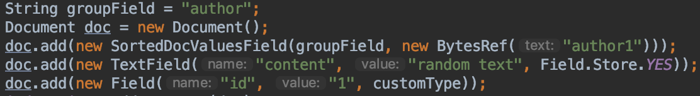
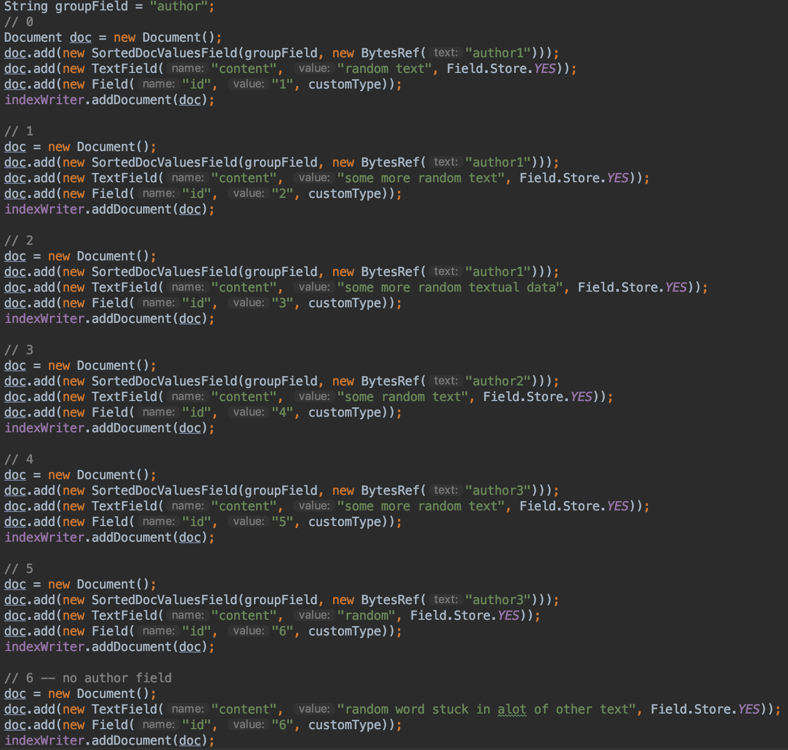

## Grouping介绍
Grouping是Lucene提供的一个分组统计的功能，分组统计最基本的功能描述的是根据组名(group field), 对拥有相同组名的不同组值(group value)进行组间分组，并且对具有相同组值进行组内排序。一个简单的例子：我们可以根据省份将不同的城市进行分组(组间分组)，并且对同一个省的所有城市根据城市人口进行排序(组内排序)。

Grouping通过实现Collector类来实现分组的逻辑，所以本篇博客主要两个Collector类。完整的分组过程通过两个阶段来实现，第一个阶段根据一个或者多个排序规则收集TopN个组值(group value)的信息。第二个阶段根据收集到这TopN的不同组值，对每一个组值的数据(具有相同groupValue的文档)进行排序。

第一个阶段的逻辑实现在FirstPassGroupingCollector类中实现，第二阶段的逻辑实现在SecondPassGroupingCollector类中实现。这两个类的源码的详细注释(超详细^_^)看GitHub的地址：https://github.com/luxugang/Lucene-7.5.0/tree/master/solr-7.5.0/lucene/grouping/src

## 使用Grouping的一些说明
#### Grouping中分组名必须使用DocValue(以后有专栏介绍DocValue)存储
&ensp;&ensp; 在索引阶段，我们必须显式的指定一个document属于哪个分组，分组名跟分组值可以只用DocValue存储
   
&ensp;&ensp; 上图中 "author" 就是我们的分组名，并且这里给出了一个分组值，即"author1", "author1"必须使用DocValue进行索引(后面会解释)，这里使用了SortedDocValues。如果没有指定分组，那么即使这个document满足搜索的条件，它也会跟其他满足搜索条件并且没有被指定分组的document归为一个分组(后面会解释)。
#### 分组的规则可以传入一个或多个排序规则
&ensp;&ensp; 使用Sort对象来定义排序规则，Sort对象中有SortField[]数组，它用来存放多个排序规则，多个排序规则怎么使用会在后面解释
## 索引期间的代码

我们添加了7篇文档，其中文档6(文档编号从0开始)是没有指定分组的，即没有添加SortedDocValuesField对象。其他文档都有各自的分组，所以例子中对于组名“author”，一共有三组，即“author1”，“author2”，“author3”。
要说明的是，Grouping这个功能实际是对搜索结果进行分组处理，所以Grouping的查询过程跟普通的查询没有大的区别，见下图生成一个查询对象：

建立这样的查询目的是使上面的所有document都能被搜索到。
## 尴尬
写到这里我不想再写了。。。因为觉得没有必要。。。感兴趣的朋友去我的GitHub地址看这两个类的源码注释吧。。。非常的详细，详细到我觉得没有必要在这个博客中赘述。。。我在下面的两个类中仅仅说下一些关键点。
## FirstPassGroupingCollector类
在这个类中实现组间排序(不同的groupValue的排序)，选出TopN个groupValue。基于上面的例子，我们设置TopN的值为2，那么收集工作（ collect(int) 方法 ）结束后，我们会得到最具有competitive的两个groupValue，在这个例子中，我们会获得“author1”跟"author3"的结果，至于他们是如何得到的。。大家看我的注释吧。
## SecondPassGroupingCollector类
在这个类中实现组内排序(同一个groupValue的不同document之间的排序)，基于上面的结果，在这个阶段，我们对“author1”， “author3”进行组内排序，对于“author1”，也就是对上图中 文档0，文档1，文档2进行组内排序，对于“author3”，也就是对上图中 文档4，文档5进行排序。
## 弥补我的懒惰
我通过举对 城市进行分类的例子，解释下Grouping的逻辑。
下面是部分城市2018年的GDP，我们希望通过城市所属的省进行分组，然后对同一个省的城市依据GDP进行排序
|文档号| 省名 | 城市 | GDP（亿元） |
|----| ---- | ---- | ----------- |
|0| 广东 | 深圳 | 24400       |
|1| 江苏 | 苏州 | 18500 |
|2| 贵州 | 贵阳 | 3800  |
|3| 江苏 | 南京 | 12700   |
|4| 广东 | 东莞 | 8300        |
|5| 江苏 | 南通 | 8300 |
|6| 山东 | 烟台 | 7900    |
|7| 山东 | 临沂 | 4750        |
|8| 贵州 | 淄博 |  5000     |
|9| 湖南 | 岳阳 | 3490        |
组间排序跟组内排序都是可以自定义各自的排序规则的。我们这里出于简单考虑，两个的排序规则都是按照GDP排序。并且我们要求只要Top3的数据。我们根据文档号从小到大的顺序写入索引中，意味着我们搜索结果的顺序也是按照编号大小传给collect(int)方法的，并假定我们的搜索结果能包含这10条数据，毕竟我们关心的只是Grouping如何处理这十条结果的逻辑。
## 第一阶段：组间排序
第一阶段的结果会被保存到TreeSet对象中，并且TreeSet的元素个数最多是3(前面我们约定的TopN的值为3)，并且TreeSet的排序规则是比较GDP(TreeSet的排序规则跟组间排序的排序规则是一样的)。这三条数据是不同的groupValue，会涉及下面两种情况的对比：
#### 相同groupValue的比较
&ensp;&ensp;  TreeSet对象存放了文档1的数据，那么当处理文档3时，会根据排序规则来判断是否将文档1从TreeSet中移除，并用文档3替换，在这个例子中，因为排序规则是根据GDP的大小，所以不会执行替换的操作。
#### 不同groupValue的比较
&ensp;&ensp; 我们在TreeSet对中存放了文档0，文档1，文档2的数据以后，当处理文档6时，由于TreeSet已经满了，那么我们需要跟TreeSet中的最小值进行比较，判断是否能替换掉最小值。根据上面的例子，最小值是文档3(GDP最小)，所以文档6就会替换文档2。
按照上面的逻辑，当处理完这十篇文档后，TreeSet中保存的3条数据是 文档0，文档1，文档6。
## 第二阶段：组内排序
第二阶段的处理过程依赖第一阶段的结果，在第一阶段，我们获得3篇文档，即文档0，文档1，文档6。依次处理三篇文档。再次强调的是，第二阶段的排序规则可以自定义，不是一定要跟第一阶段的排序规则一致。我是出于简单，才另第二阶段的排序规则为比较GDP的大小。
#### 处理文档0
跟文档0具有相同省会的文档是 文档4。 
排序后的结果是 文档0 > 文档4。
#### 处理文档1
跟文档1具有相同省会的文档是 文档3，文档5。
排序后的结果是 文档1 > 文档3 > 文档5。
#### 处理文档2
跟文档6具有相同省会的文档是 文档7。
排序后的结果是 文档6 > 文档7。
## 结语
本篇文章介绍了Grouping的最基本的功能，即两个阶段实现的分组。逻辑相对简单易懂，希望深入理解的还是推荐看两个Collect类的具体实现。本文中并没有说明为什么分组值需要用SortedDocValueField索引，在看完我对DocValue的介绍后自然会明白。另外上面的例子中组间排序只用了一个排序规则，当这个排序规则无法区分时，你可以提供多个排序规则来进行区分，如果运气很差，你所有的排序规则都不能区分，那么最后会按照文档号进行区分，文档号大的不具备competitive。还有就是具体的比较逻辑没有介绍，这一块的话会在以后介绍FieldComparator类时候跟大家分享。
