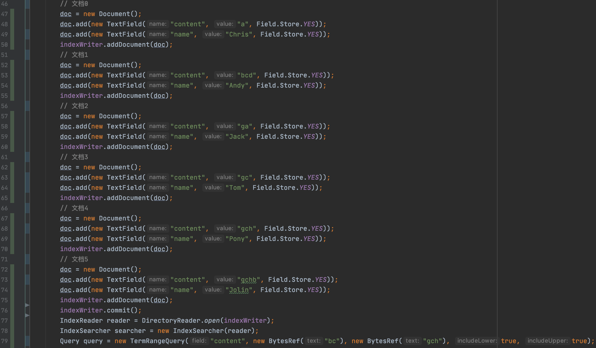
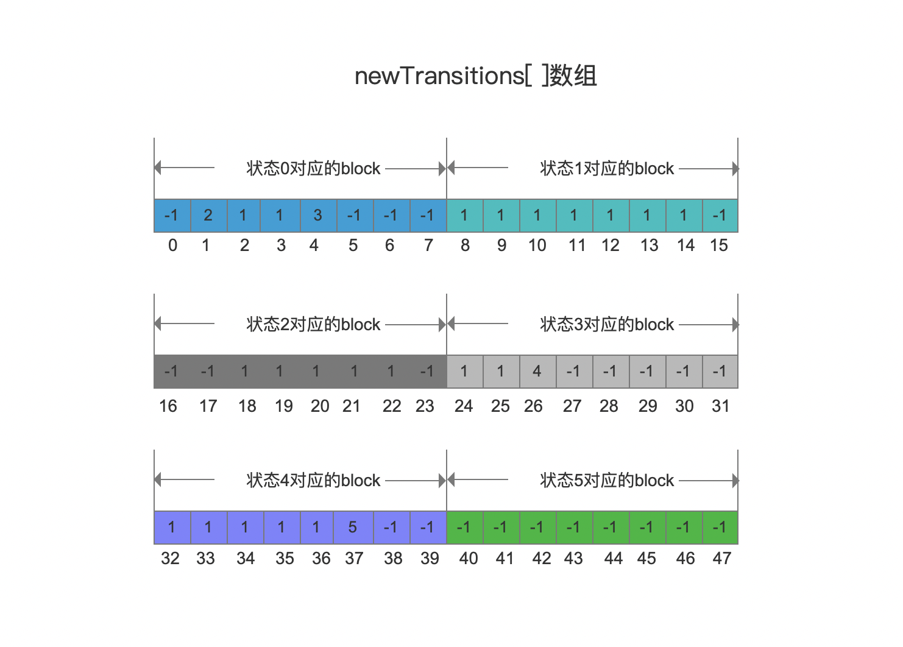
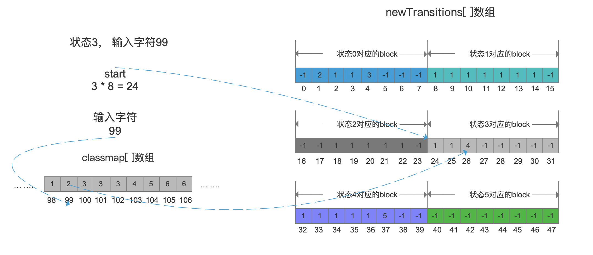

# [Automaton（三）](https://www.amazingkoala.com.cn/Lucene/gongjulei/)（Lucene 8.4.0）

&emsp;&emsp;在文章[Automaton（二）](https://www.amazingkoala.com.cn/Lucene/gongjulei/2020/0727/157.html)中我们根据图1的例子生成了图2的转移图以及转移图对应在源码中的描述方式，即状态（state）、转移（transition）函数两个数组，如图3所示：

图1：



图2：


图3：


&emsp;&emsp;如果给定一个term，它的最后一个字符作为**输入字符**，随后在某个**状态**下，能根据某个**转移函数**找到下一个状态，并且该状态为可接受状态，那么term是被DFA接受的，其中输入字符、状态、转移函数、DFA的概念见文章[Automaton](https://www.amazingkoala.com.cn/Lucene/gongjulei/2019/0417/51.html)的介绍。

&emsp;&emsp;根据图3的两个数据结构，用肉眼已经可以判断出一个term能否被DFA接受，但是源码中基于这两个数组还会进一步处理，使得能更快速的判断term是否被DFS接受，处理的结果为生成一个新的transitions[ ]数组，使得根据**状态**、**输入字符**两个条件能在该数组中找到下一个状态。由于源码中该数组与图3中的数组名重名了，为了便于描述，下文将称呼这个新的transitions[ ]数组为newTransitions[ ]数组。

## 生成newTransitions[ ]数组

&emsp;&emsp;介绍newTransitions[ ]数组之前，我们先介绍下startPoint的概念。

### startPoint

&emsp;&emsp;对于某一个状态，如果它至少存在一个转移函数， 输入字符根据转移函数能找到下一个状态的条件是处于某个字符范围内，该字符范围的最小值被称为startPoint，另外如果某个字符范围无法找到下一个状态，该范围的最小值也是startPoint。

&emsp;&emsp;以图2中的状态3为例，它存在三个字符范围，分别为[0, 98]、[99, 99]、[100,  256]，其中[0, 98]、[99, 99]这两个字符范围的输入字符能找到下一个状态，分别为转态1跟状态4，那么这两个字符范围的最小值0、99即startPoint，另外[100, 256]这个字符范围无法找到下一个状态，那么100也会作为startPoint，下面列出每一个状态的startPoint：

- 状态0：98、99、103、104
- 状态1：0，256
- 状态2：99、256
- 状态3：0、99、100
- 状态4：0、104、105
- 状态5：不存在任何转移函数，故不存在startPoint

### points数组

&emsp;&emsp;每个状态的startPoint在去重后被写入到points[ ]数组中，最后执行排序操作，如下所示：

```java
points[] = {0, 98, 99, 100, 103, 104, 105, 256}
```

&emsp;&emsp;

### newTransitions[ ]数组

&emsp;&emsp;newTransitions[ ]数组的数组元素描述的是某个状态下，points数组中的某个输入字符startPoint对应的下一个状态，数组中连续的数组元素组成一个block，该block描述的是在同一个状态的下，points数组中所有的startPoint的下一个状态的集合，block的数量为状态的数量，故newTransitions[ ]数组的长度为 $状态数量 * points数组的长度$。

&emsp;&emsp;以图2为例，一共存在6种状态，对应的newTransitions[ ]数组如下所示：

图4：



&emsp;&emsp;图4中，状态的数量为6，points数组的长度为8，故newTransitions[ ]数组的长度为48。

&emsp;&emsp;以状态0对应的block为例，下标值0~7对应的数组元素分别为pointsp[ ]数组中的8个startPoint在状态0可转移的下一个状态，数组元素-1表示输入字符无法在状态0找到下一个可转移的状态，意味着不会被DFS接受，可以对比图2更容易理解：

图5：


&emsp;&emsp;图5中，startPoint为98的输入字符，它对应在newTransitions[ ]中的数组元素为2，描述的是，处于状态0下时，输入字符98将会转移到下一个状态，该状态为2。

&emsp;&emsp;至此同学们可能会有两个疑问：

- 疑问一：startPoint的输入字符如何在newTransitions[ ]数组中找到对应的数组元素
- 疑问二：不是startPoint的输入字符如何判断在某个状态时是否存在下一个状态值

&emsp;&emsp;我们接着介绍来解释上述两个疑问。

### classmap[ ]数组

&emsp;&emsp;classmap[ ]数组的长度为256（基于图2的例子），输入字符对应的ASCII码即该数组的下标值，数组元素为points[ ]数组的下标值。我们直接给出下标值区间为98~106的classmap[ ]数组的部分数组元素再给出介绍：

图6：


&emsp;&emsp;由于生成classmap[ ]数组代码相对简单，我们直接给出：

```java
for (int j = 0; j < classmap.length; j++) {
    if (i + 1 < points.length && j == points[i + 1]) {
        i++;
    }
    classmap[j] = i;
}
```
&emsp;&emsp;上述代码描述的是，当遍历到某个输入字符（输入字符跟下标值是一个含义，即代码中的j），如果能在points[ ]数组中存在这个输入字符，那么该值在points[ ]数组中的下标值就作为classmap[ ]数组中的数组元素。如果不存在，那么数组元素的值置为上一个数组元素的值。

&emsp;&emsp;例如图6中，输入字符为100，即下标值为100，在points[ ]数组（图5）中存在该值，并且该值对应的下标值为3，那么就将这个下标值3存放到classmap[ ]中下标值为100的位置，接着当处理输入字符为101时，由于points[ ]数组中不存在该值，故classmap[ ]中下标值为101的数组元素为上一个数组元素的值，即3。

## 读取newTransitions[ ]数组

&emsp;&emsp;在文章的开始部分我们说到，根据**状态**、**输入字符**两个条件能在newTransitions数组中找到下一个状态，其实是通过状态、输入字符的信息计算出newTransitions[ ]数组的一个下标值index，最后获得下一个状态，计算公式如下：

```java
index = state * points.length + classmap[c]
```

&emsp;&emsp;上述公式中，state为状态值，例如状态0的状态值为0、状态1的状态值为1，由于在newTransitions[ ]数组中，每个状态对应的block大小是固定的，即points[ ]数组的长度，所以通过 $state * point.length$就能获得block在newTransitions[ ]数组中的起始读取位置start，随后根据classmap[ ]数组获得输入字符对应在block中的偏移offset，start + offset的和值作为newTransitions[ ]数组的下标值，就可以获得下一个转态。

&emsp;&emsp;例如在状态3，如果输入字符为c，ASCII为99：

图7：



&emsp;&emsp;图7中，先根据状态值3，计算出状态对应的block在newTransitions[ ]数组中的起始读取位置start为 $3 * 8 = 24$，接着将输入字符99作为classmap[ ]数组的下标值，找到对应的数组元素为2，该值为在block中的偏移值offset，根据start + offset的和值计算出newTransitions[ ]数组的下标值，该下标值对应的数组元素为4，即在状态3，如果输入字符为c，那么下一个状态的状态值为4，正如图2所示。

## 结语

&emsp;&emsp;至此，TermRangeQuery中使用确定型有穷自动机的相关内容介绍结束。

[点击](http://www.amazingkoala.com.cn/attachment/Lucene/utils/Automaton/Automaton（三）/Automaton（三）.zip)下载附件