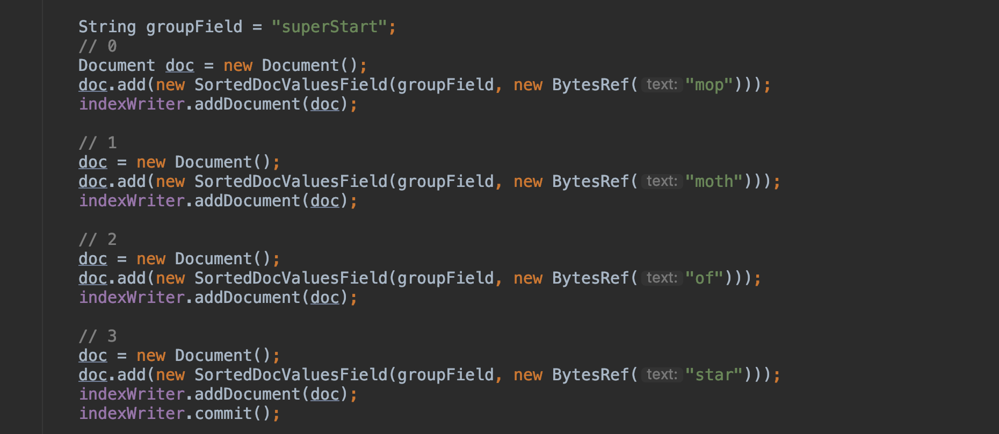
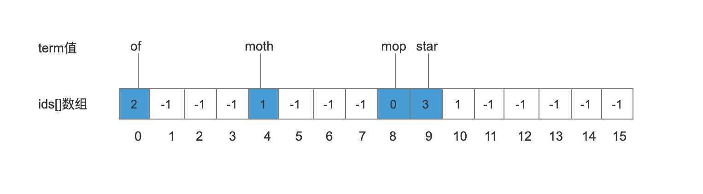
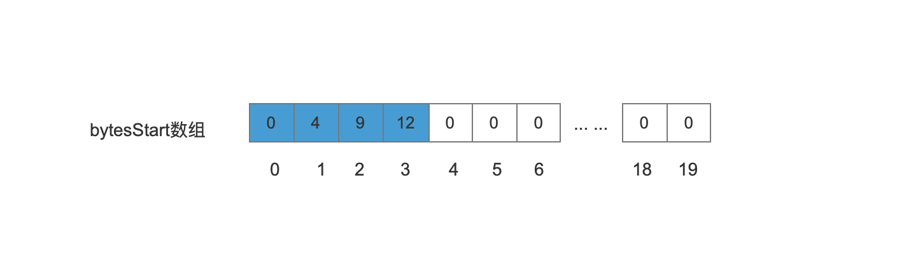
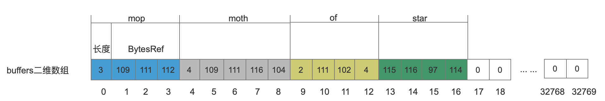
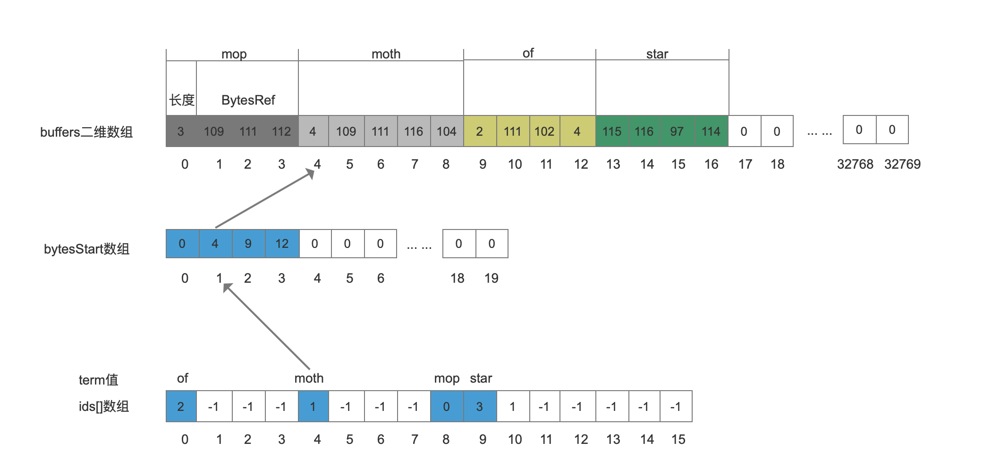

## BytesRefHash
BytesRefHash类是专门为BytesRef对象作优化的一种类似hashMap的数据结构，该类的主要用途就是将所有的BytesRef对象存储到一个连续的存储空间中，并且使得能在查询阶段达到 0(1)的时间复杂度。
## BytesRefHash的一些变量
#### byte[] [] buffers;
```text
二维数组buffers[][]用来存储ByteRef对象，所有的BytesRef对象都连续的存储在buffers[][]数组中
```
#### int termID;
```text
termID是从0开始的一个递增的值，每个BytesRef根据它存储到buffers[][]的先后顺序获得一个唯一的termID
```
#### int[] ids;
```text
ids[]数组下标是BytesRef对利用MurmurHash算法计算出的hash值，ids[]数组元素则是termID
```
#### int[] bytesStart;
```text
bytesStart[]数组下标是termID，数组元素是termID对应的BytesRef值在buffers[][]中的起始位置
```
## 例子
这里用一个例子来描述上文中介绍的BytesRefHash的那些变量之间的关系，存储的内容如下


上图中所有BytesRef对象通过MurmurHash算法计 算出的hash值通过公式 hash & hashMask散落到ids[]数组后的情况如下图。其中hashMask的值为15，即当前ids[]数组大小减1，另外ids[]数组中的元素初始值为 -1。
#### ids[]数组
```text
ids[]数组初始值大小为16，数组元素(termID)用来作为bytesStart[]数组的索引
```

#### bytesStart[]数组
```text
bytesStart[]数组元素用来作为buffers[][]二维数组的索引
```

#### buffers[] []二维数组
```text
buffers[][]数组中存放了 BytesRef对象的原始值，每一个BytesRef对象按块(block)连续的存放，每一个block中包含了BytesRef对象的长度跟原始值，存放长度的作用用来在读取阶段描述应该读取数组中多长的数据，注意的是存储长度占用的字节根据BytesRef的大小可能占用1个或者2个字节，下面的例子中，存储所有的BytesRef对象的长度只需要1个字节
```
term值与BytesRef对象的关系
| Term | BytesRef(十六进制) |BytesRef(十进制)| 长度 |
| :--: | :-----: |:-----:|:--: |
| mop  | [6d, 6f, 70] |[109, 111, 112]| 3 |
| moth | [6d, 6f, 74, 68] |[109, 111, 116, 104]| 4 |
|  of  | [6f, 66] |[111, 102]| 2 |
| star | [73, 74, 61, 72] |[115, 116, 97, 114]| 4 |

#### 三个数组的映射关系
三个数组之间的关系如下图


## 结语
本篇博客通过例子介绍了 BytesRefHash类如何存储BytesRef对象，但并没有以代码的形式给出，要理解BytesRefHash这个类中实现逻辑，其类中最重要的一个方法就是 add(BytesRef bytes)，这个方法中的源码详细注释大家可以看我的GitHub：https://github.com/luxugang/Lucene-7.5.0/blob/master/solr-7.5.0/lucene/core/src/java/org/apache/lucene/util/BytesRefHash.java ，对应的demo在这里：https://github.com/luxugang/Lucene-7.5.0/blob/master/LuceneDemo/src/main/java/lucene/utils/BytesRefHashTest.java