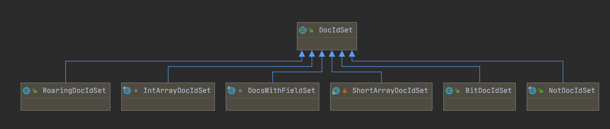
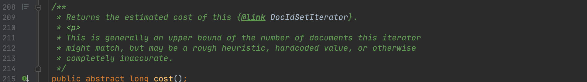
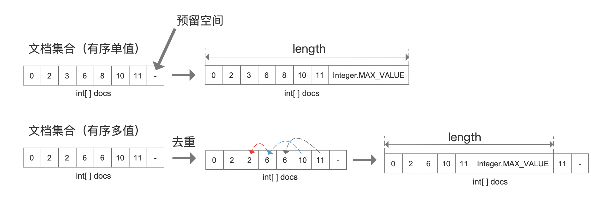
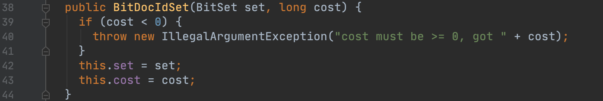
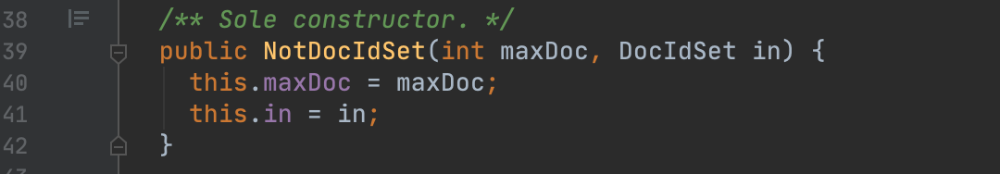
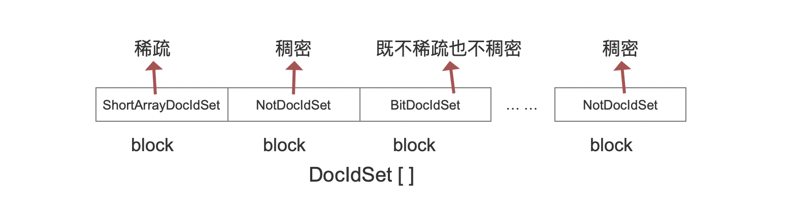

# [DocIdSet](https://www.amazingkoala.com.cn/Lucene/gongjulei/)（Lucene 8.9.0）

&emsp;&emsp;本篇文章将介绍Lucene中用于存储文档号的数据结构DocIdSet，该抽象类的具体实现有以下几种，我们将一一介绍。

图1：

&emsp;&emsp;图1中，[DocsWithFieldSet](https://www.amazingkoala.com.cn/Lucene/Index/2020/0507/139.html)跟[RoaringDocIdSet](https://www.amazingkoala.com.cn/Lucene/gongjulei/2019/1008/98.html)已经介绍过了。建议先看下文章[RoaringDocIdSet](https://www.amazingkoala.com.cn/Lucene/gongjulei/2019/1008/98.html)，因为该实现中会使用到图1中的其他DocIdSet对象，有助于理解。

&emsp;&emsp;无论在索引阶段还是搜索阶段，都会用到DocIdSet来存储文档号。例如在索引阶段，使用[DocsWithFieldSet](https://www.amazingkoala.com.cn/Lucene/Index/2020/0507/139.html)收集正排信息对应的文档号、使用[RoaringDocIdSet](https://www.amazingkoala.com.cn/Lucene/gongjulei/2019/1008/98.html)存储查询缓存；在查询阶段，使用IntArrayDocIdSet或者BitDocIdSet来存储满足数值范围查询（PointRangeQuery）条件的文档号等等。

&emsp;&emsp;DocIdSet不仅定义了存储文档号集合使用的数据结构，还定义了如何读取文档号集合的功能，即迭代器。

## 迭代器

&emsp;&emsp;这里说的迭代器即源码中的DocIdSetIterator类，该类定义了四个抽象方法描述了迭代器所能提供的功能。

### 第一个方法：获取下一个文档号

图2：

&emsp;&emsp;当我们使用迭代器遍历文档号集合时，调用该方法会返回一个**合法**的文档号，如果返回的文档号的值为Integer.MAX_VALUE，说明迭代器中合法的文档号已经读取结束。

**上文中的"合法"是什么意思**

&emsp;&emsp;"**下一个**"的含义在不同的子类有不同的定义方式，如果某个子类根据自身规则能返回一个文档号，说明这个文档号是合法的。

### 第二个方法：获取某个文档号的下一个文档号

图3：

&emsp;&emsp;文档号集合中的文档号是有前后关系的，该方法通过指定一个参数target，该参数指定了一个文档号，返回这个文档号的下一个文档号。同样的，文档号之间的前后关系也是因不同的子类实现而异。

### 第三个方法：获取当前的文档号

图4：

&emsp;&emsp;在调用了第一个跟第二个方法后会获得一个文档号，那么通过调用第三个方法可以获得这个文档号。

### 第四个方法：获取迭代器的开销

图5：

&emsp;&emsp;正如这个方法注释描述那样，一般情况下（即一般的子类实现）迭代器的开销描述的是迭代器中的文档号集合中的文档数量，但还是取决于不同的子类如何定义开销的计算方式。

## DocIdSet的子类实现

&emsp;&emsp;接着我们开始介绍图1中的各个子类，介绍每一个子类使用哪种数据结构存储文档号集合以及如何实现迭代器的功能。

### IntArrayDocIdSet

&emsp;&emsp;从这个子类的命名方式就可以大致了解存储文档号集合的数据结构的类型了，即Int类型数组：

图6：

&emsp;&emsp;由于目前IntArrayDocIdSet只有在**DocIdSetBuilder**（根据文档号集合的疏密程度，构建不同DocIdSet对象的类，在写完这篇文章后会介绍它）中使用，所以IntArrayDocIdSet的设计不具有通用性，这也是为什么构造函数没有用public修饰（图6代码第33行）。我们以一个例子来介绍在源码中该类是如何被使用的。

图7：

&emsp;&emsp;在DocIdSetBuilder中收集了一个文档号集合后，首先根据文档号从小到大排序，最终该集合有两种类型：有序单值、有序多值。

- 有序单值：docs数组中不存在重复的文档号。
- 有序多值：docs数组中存在重复的文档号。例如在TermRangeQuery中，会使用DocIdSetBuilder收集每个term对应的文档号，那么会出现这种情况。

&emsp;&emsp;为了实现docs数组的**复用**，通过length指定一个上界，描述docs数组中合法的文档号。

#### IntArrayDocIdSet的迭代器实现

&emsp;&emsp;简单的介绍下IntArrayDocIdSet的迭代器实现：

- 第一个方法：从docs数组中获取下一个数组元素
- 第二个方法：由于docs是有序的，故通过二分法先找到target在数组中的下标，然后获取下一个下标对应的数组元素
- 第三个方法：见上文中第三个方法的描述
- 第四个方法：返回docs数组中合法文档号的数量，即length的值

### BitDocIdSet

&emsp;&emsp;该子类实现使用BitSet对象存储文档号，FixedBitSet是BitSet的一种实现方式。可以阅读文章[FixedBitSet](https://www.amazingkoala.com.cn/Lucene/gongjulei/2019/0404/45.html)了解其存储文档号的方式。

图8：

#### BitDocIdSet的迭代器实现

&emsp;&emsp;简单的介绍下BitDocIdSet的迭代器实现：

- 第一个方法：如果当前文档号为doc，那么该方法会通过调用第二个方法实现，其参数为 doc + 1
- 第二个方法：见文章[FixedBitSet](https://www.amazingkoala.com.cn/Lucene/gongjulei/2019/0404/45.html)中关于nextSetBit(int index)方法的介绍
- 第三个方法：见上文中第三个方法的描述
- 第四个方法：图8中，BitDocIdSet的构造函数参数中cost即迭代器的开销，即取决于使用BitDocIdSet的调用方。例如在查询缓存中，会使用BitDocIdSet存储文档号，该场景中的开销为缓存的文档号数量；在文章[RoaringDocIdSet](https://www.amazingkoala.com.cn/Lucene/gongjulei/2019/1008/98.html)中说到，如果一个block中的文档号集合处于稀疏跟稠密之间，那么会使用BitDocIdSet存储文档号集合，该场景中的开销为block中的文档数量

### ShortArrayDocIdSet

&emsp;&emsp;同IntArrayDocIdSet一样，从这个子类的命名方式就可以大致了解存储文档号集合的数据结构的类型了，即short类型数组：

图9：

#### ShortArrayDocIdSet的迭代器实现

&emsp;&emsp;简单的介绍下ShortArrayDocIdSet的迭代器实现：

- 第一个方法：从docIDs数组中获取下一个数组元素
- 第二个方法：由于docIDs数组是有序的，故通过二分法先找到target在数组中的下标，然后获取下一个下标对应的数组元素
- 第三个方法：见上文中第三个方法的描述
- 第四个方法：返回docIDs数组的长度，即docIDs数组中的元素数量

&emsp;&emsp;该子类目前只在[RoaringDocIdSet](https://www.amazingkoala.com.cn/Lucene/gongjulei/2019/1008/98.html)中使用，**当block中的文档号集合稀疏时，会使用ShortArrayDocIdSet存储**。

&emsp;&emsp;由于在RoaringDocIdSet中，文档号的类型是int类型，即32位，其中利用文档号的高16位判断属于哪一个block，故只有低16位存储在block中，所以可以使用16位的short类型数组存储。

### NotDocIdSet

&emsp;&emsp;从图9的构造函数可以看出，该子类封装了一个DocIdSet，故该子类存储文档号集合的方式取决封装的DocIdSet。

&emsp;&emsp;NotDocIdSet中存储的文档号集合实际是一个"**反文档号集合**"。如果图10中的参数maxDoc的值为10000，并且**合法的文档号集合**为[0~9997]，那么图10中的参数DocIdSet中实际存放的只有9998、9999两个文档号。

&emsp;&emsp;该子类目前只在[RoaringDocIdSet](https://www.amazingkoala.com.cn/Lucene/gongjulei/2019/1008/98.html)中使用，**当block中的文档号集合稠密时，会使用ShortArrayDocIdSet存储"反文档号集合"，然后用NotDocIdSet封装**。由于每个block的空间为2^16此方法，故maxDoc的值为2^16。

图10：

#### NotDocIdSet的迭代器实现

&emsp;&emsp;简单的介绍下NotDocIdSet的迭代器实现：

- 第一个方法：如果当前文档号为doc，那么该方法会通过调用第二个方法实现，其参数为 doc + 1
- 第二个方法：根据参数target，从图10的参数DocIdSet中找到大于等于target的文档号，我们称之为nextSkippedDoc，如果nextSkippedDoc跟target相等，说明target属于"反文档号集合"。即不是合法的文档号，此时重复执行第二个方法，并且此时的参数设为target + 1，直到与方法返回的nextSkippedDoc不相等即找到合法的文档号
- 第三个方法：见上文中第三个方法的描述
- 第四个方法：开销即图10中构造函数的maxDoc

### RoaringDocIdSet

&emsp;&emsp;在文章[RoaringDocIdSet](https://www.amazingkoala.com.cn/Lucene/gongjulei/2019/1008/98.html)已经详细的介绍了RoaringDocIdSet。在本文内容的基础上，我们可以进一步更详细的介绍下RoaringDocIdSet存储文档号集合的方式。

图11：

&emsp;&emsp;在[RoaringDocIdSet](https://www.amazingkoala.com.cn/Lucene/gongjulei/2019/1008/98.html)中我们说到，存储方式按照block划分，int类型的文档号的前16bit用于判断属于哪个block，即前16bit用作图11中DocIdSet[ ]数组的下标值，然后根据block中文档号集合的稀疏/稠密类型会进一步使用不同的DocIdSet子类存储文档号的低16bit。

#### RoaringDocIdSet的迭代器实现

&emsp;&emsp;取决于每个block中的DocIdSet的子类类型。另外第四个方法，即迭代器的开销为文档号数量。

## 结语

&emsp;&emsp;下一篇文章中，我们将会介绍上文中提到的DocIdSetBuilder，即DocIdSet的构造器，它会根据一定的条件来选择不同的DocIdSet子类来存储文档号的集合。

[点击](http://www.amazingkoala.com.cn/attachment/Lucene/utils/DocIdSet/DocIdSet.zip)下载附件

