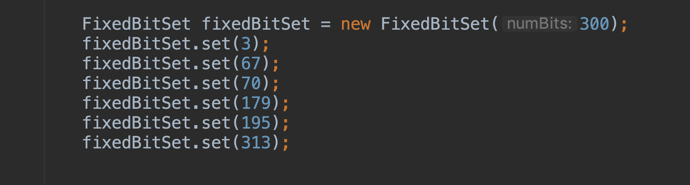
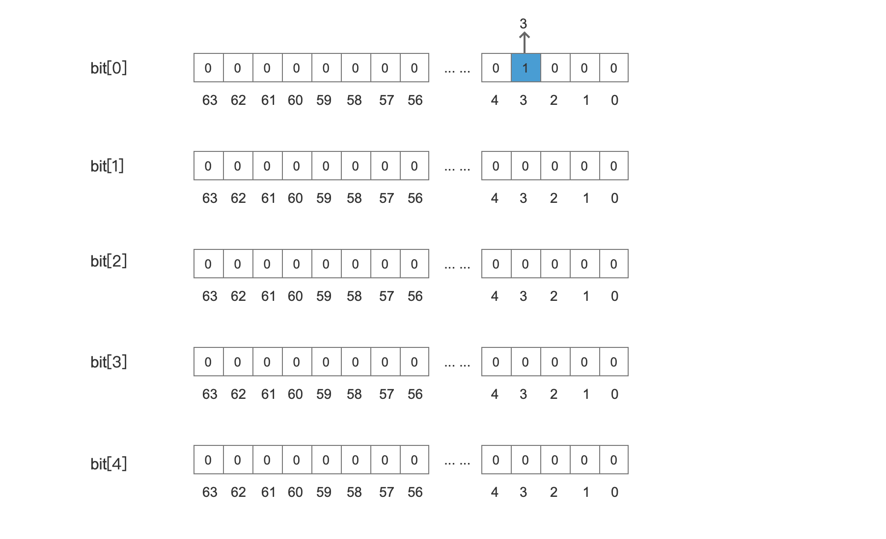
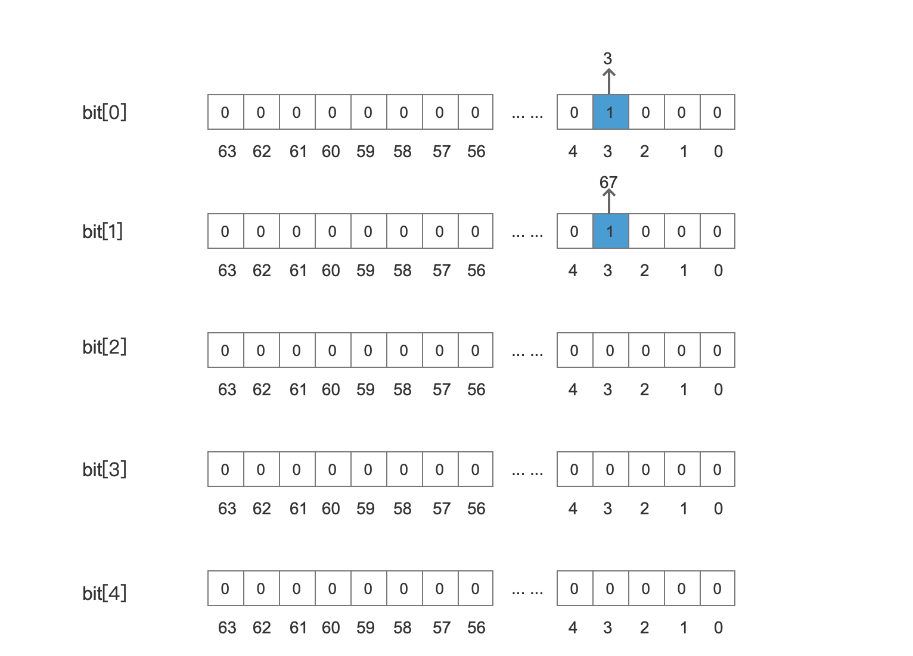
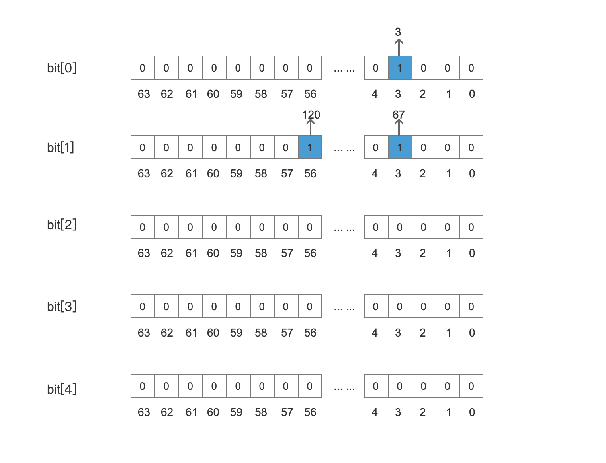
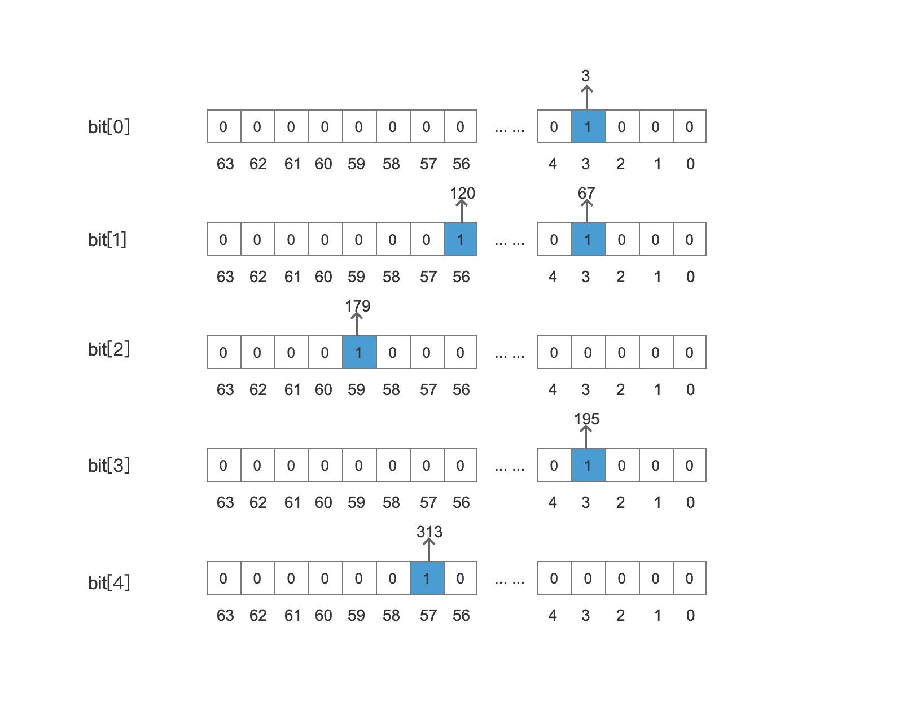

## FixedBitSet
FixBitSet类在Lucene中属于一个工具类（Util），它的其中一个用途用来存储文档号，用一个bit位来描述（存储）一个文档号。该类特别适合存储连续并且没有重复的int类型的数值。最好情况可以用8个字节来描述64个int类型的值。下面通过介绍几个FixBitSet类的方法来理解这个类的存储原理。本篇文章纯属充数。。。直接看源码的话不会花很多时间，写这篇文章的原因主要是出于总结，因为好几个月前我看过了这个类的源码，今天准备写关于NumericDocValues的文章时再次遇到这个类时，发现又忘了，囧。
## 构造函数
```java
public FixedBitSet(int numBits) {
  }
```
构造一个FixedBitSet对象，参数numBits用来确定需要多少bit位来存储我们的int数值。如果我们另numBits的值为300，实际会分配一个64的整数倍的bit位。因为比300大的第一个64的倍数是 320 (64 * 5)，所以实际上我们可以存储 [0 ~319]范围的数值。最终根据320的值，我们获得一个long类型的bit[]数组，并且bit[]数组初始化为大小5。在这里我们发现bit[]数组的每一个元素是long类型，即64bit，所以5个元素一共有 64 * 5 共 320个bit位。

## void set(int index)方法
```java
public void set(int index) {
        // 将index根据64进行划分，比如 0~63都属于一个wordNum, 64~127属于另一个wordNum
        int wordNum = index >> 6;      // div 64
        // 计算出当前文档号应该放到64个bit位(long类型)的哪一位
        long bitmask = 1L << index;
        // bits[]是个long类型的数据
        bits[wordNum] |= bitmask;
    }
```
### 例子：
图1：


#### 添加 3
```text
根据set()方法的逻辑：
1. 计算出wordNum的值：3 >> 6,即wordNum = 0，说明3应该存放在bit[]数组下标为0的元素中。
2. 计算出bitmask的值，即计算出在64个bit位中的偏移，bitmask = 0b1000。
3. 与bit[0]的值执行或操作。
```
图2：

#### 添加 67
```text
根据set()方法的逻辑：
1. 计算出wordNum的值：67 >> 6,即wordNum = 1，说明67应该存放在bit[]数组下标为1的元素中。
2. 计算出bitmask的值，即计算出在64个bit位中的偏移，bitmask = 0b1000。
3. 与bit[1]的值执行或操作。
```
图3：


#### 添加 120
```text
根据set()方法的逻辑：
1. 计算出wordNum的值：120 >> 6,即wordNum = 1，说明120应该存放在bit[]数组下标为1的元素中。
2. 计算出bitmask的值，即计算出在64个bit位中的偏移，bitmask = 0b00000001_00000000_00000000_00000000_00000000_00000000_00000000_00000000。
3. 与bit[1]的值执行或操作。
```
图4：

#### 添加179、195、313
```
不赘述，大家可以自己算下是不是跟下图中一致。
```
图5：


通过上面的例子可以看到，如果我们存储的是连续的值，那么压缩率是很高的。当然同时可以看出无法处理有相同值的问题。
## boolean get(int index)方法
get()方法可以实现随机访问，来确定index的值是否在bit[]数组中。
```java
public boolean get(int index) {
    int i = index >> 6;               // div 64
    long bitmask = 1L << index;
    // 如果bit为1，说明index在bit[]数组中。
    return (bits[i] & bitmask) != 0;
  }
```
## 结语
FixedBitSet类中还有一些其他的方法，比如说prevSetBit(int index)方法来找到第一个比index小的值和nextSetBit(int index)方法来找到第一个比index大的数，在Lucene中，常用FixedBitSet类来存储文档号，并且在通过prevSetBit(int index)或者nextSetBit(int index)来遍历文档号。