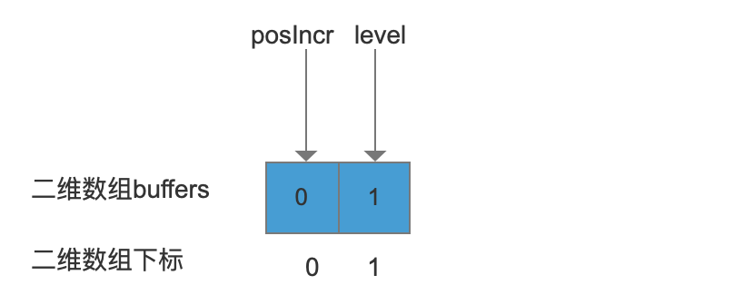
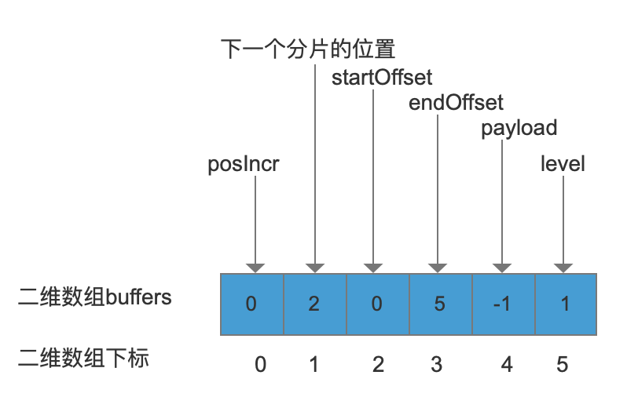
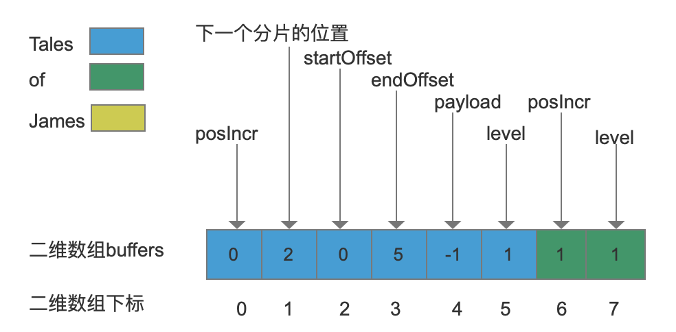
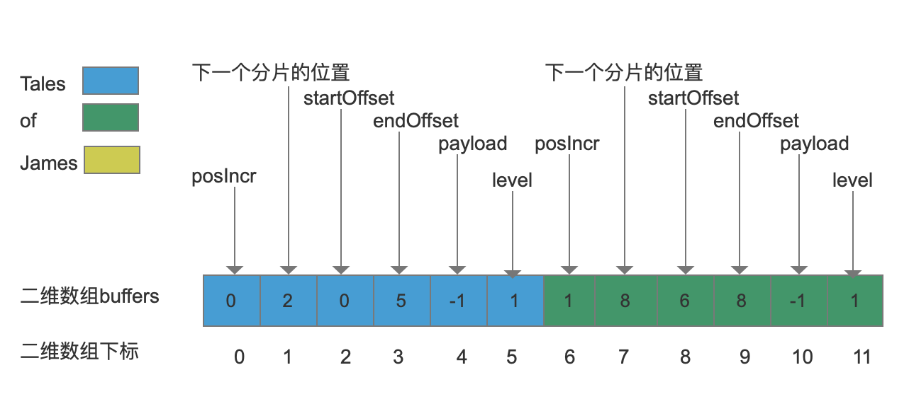
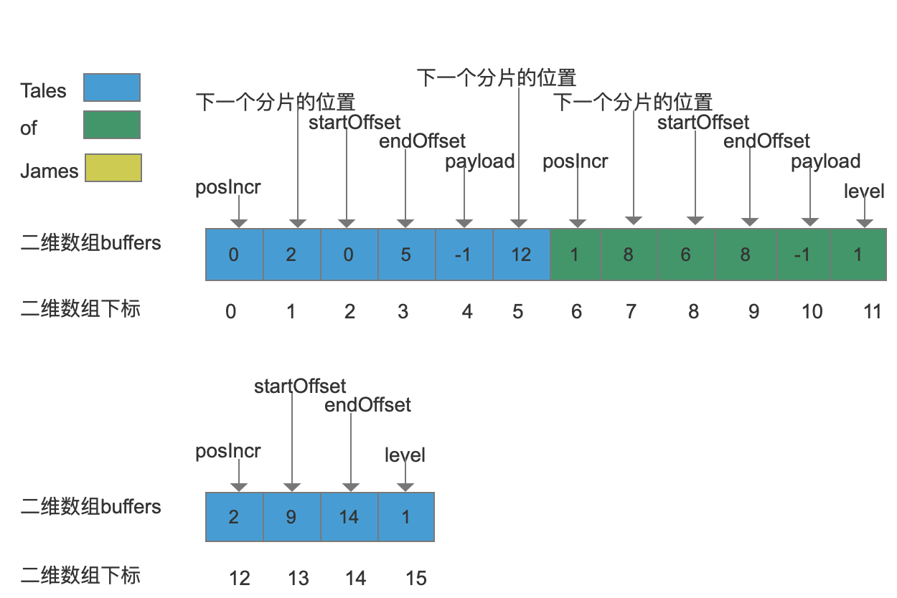
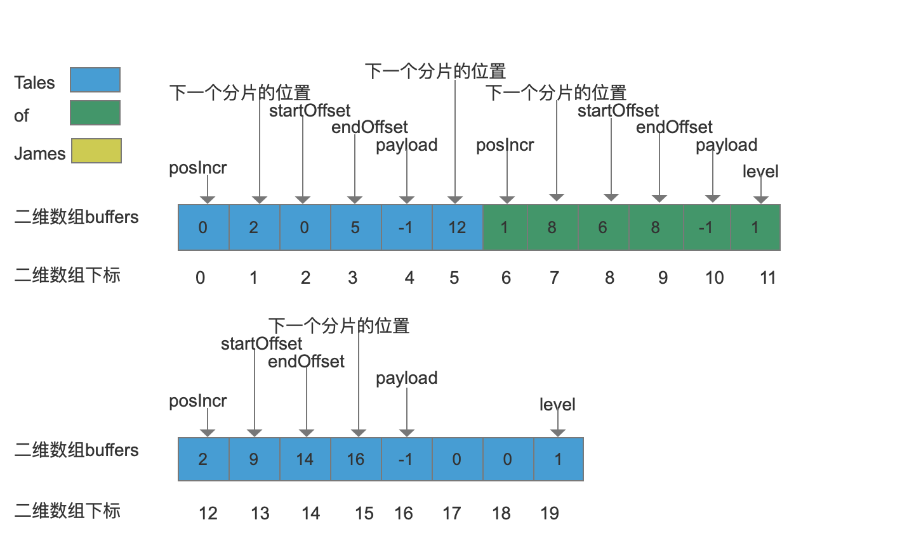
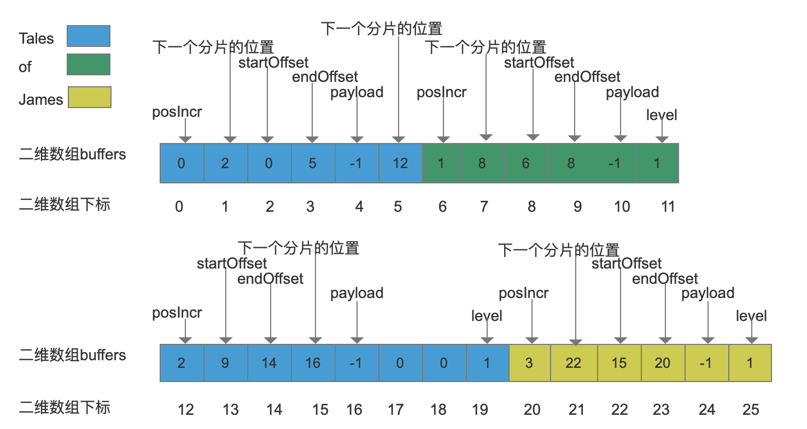

### IntBlockPool类
在索引阶段，使用IntBlockPool来存储term(域值)的信息，在MemoryIndex中，使用此类对term在文档中的位置、payload数据进行存储，它即MemoryIndex中的倒排表，它的数据就是用这个类的对象存储的。在介绍IntBlockPool类时，我们根据这个类在MemoryIndex中实际使用过程来讲解。

### 如何介绍IntBlockPool类
首先会贴出这个类中几个重要的方法，详细的说明方法中的逻辑过程，在讲解MemoryIndex类时，会使用图文方法来演示一个例子。IntBlockPool类的详细代码注释在这里：https://github.com/luxugang/Lucene-7.5.0/blob/master/solr-7.5.0/lucene/core/src/java/org/apache/lucene/util/IntBlockPool.java
### IntBlockPool的方法和变量

#### 几个基本的变量说明

```java
// 存储term的位置，词频，payload，默认是由10个大小为 INT_BLOCK_SIZE大小的一维数组组成的。
public int[][] buffers = new int[10][];
public final static int INT_BLOCK_SHIFT = 13;
// 一维数组的大小。
public final static int INT_BLOCK_SIZE = 1 << INT_BLOCK_SHIFT;
public final static int INT_BLOCK_MASK = INT_BLOCK_SIZE - 1;
// 用来表示我们正在使用第几个一维数组(前面定义了一个包含10个一维数组的二维数组)。
private int bufferUpto = -1;
// 用来表示一维数组中可以使用的位置(偏移)。
public int intUpto = INT_BLOCK_SIZE;
// 同一时刻只选取二维数组中的一个一维数组进行数据的存储跟读取，buffer用来表示我们正在使用的那个一维数组。
// 这个buffer又称为 head buffer。
public int[] buffer;
// 用来表示在二维数组中可以使用的位置(偏移)。
public int intOffset = -INT_BLOCK_SIZE;
// 分层的级别，代表下次分配新的分片(slice)的级别(层级)，数组元素越大，分片大小越大，数组元素用来作为LEVEL_SIZE_ARRAY[]数组的下标值。
private final static int[] NEXT_LEVEL_ARRAY = {1, 2, 3, 4, 5, 6, 7, 8, 9, 9};
// 数组元素表示新的分片的大小。
private final static int[] LEVEL_SIZE_ARRAY = {2, 4, 8, 16, 32, 64, 128, 256, 512, 1024};
```
### 获得新的分片(slice)
在MemoryIndex中，对于有相同域名的不同域值，这些域值的倒排表信息都是存放到同一个二维数组中，每个域值都会被分配一个固定大小的分片，用来存储域值(即term)的信息，并且相同的域值会被存储多次(因为在文档中的的位置不同导致偏移值和payload的不同)。另外多个相同的域值，他们的数据不是连续存放的，通过分层的方式分布在二维数组的不同位置(稍后会作出解释)。下面获取一个新的分片的方法。
``` java
// 需要分配size大小的分片。
private int newSlice(final int size) {
    // 判断当前的head buffer空间是否充足，如果不够的话，就用分配新的head buffer来存储。
    if (intUpto > INT_BLOCK_SIZE-size) {
      // 空间不足的话，分配一个新的一维数组。
      nextBuffer();
      assert assertSliceBuffer(buffer);
    }
    final int upto = intUpto;
    // 分配size个大小的数组空间给这次的存储,然后intUpto更新。
    intUpto += size;
    // 指定下次分片的级别。
    buffer[intUpto-1] = 1;
    return upto;
  }
public void nextBuffer() {
    // 判断二维数组是否存储已满，那么就扩容，并且扩容结束后，迁移数据。
    if (1+bufferUpto == buffers.length) {
      int[][] newBuffers = new int[(int) (buffers.length*1.5)][];
      System.arraycopy(buffers, 0, newBuffers, 0, buffers.length);
      buffers = newBuffers;
    }
    // 生成一个新的一维数组。
    buffer = buffers[1+bufferUpto] = allocator.getIntBlock();
    // 更新bufferUpto，这个值描述了我们当前正在使用第bufferUpto个一维数组。
    bufferUpto++;
    // head buffer数组的可使用位置(下标值)置为0。
    intUpto = 0;
    // 更新intOffset的值，表示在二维数组中可用的位置。
    intOffset += INT_BLOCK_SIZE;
  }
```
### 往分片(slice)中写数据
通过SliceWriter对象将数据写入到分片中。

#### SliceWriter类的部分方法和变量

```java
// 描述在二维数组中的位置。
 private int offset;
```
将value值写入到分片中，如果分片剩余空间不足，那么重写分配一个新的分片。
```java
public void writeInt(int value) {
        // 获得head buffer这个一维数组, offset >> INT_BLOCK_SHIFT的值就是head buffer在二维数组中的行数。
      int[] ints = pool.buffers[offset >> INT_BLOCK_SHIFT];
      assert ints != null;
      // 获得在head buffer这个一维数组组内的偏移。
      int relativeOffset = offset & INT_BLOCK_MASK;
      // if语句为真，说明分片剩余空间不足，我们需要分配新的分片(slice), 当前数组位置存储的是分片的层级。
      if (ints[relativeOffset] != 0) {
        //  分配一个新的分片，并且返回可以存放value的下标值。  
        relativeOffset = pool.allocSlice(ints, relativeOffset);
        // 更新下ints变量和offset变量，因为调用pool.allocSlice()后，head buffer发生了变化。
        ints = pool.buffer;
        offset = relativeOffset + pool.intOffset;
      }
      // 存储value的值。
      ints[relativeOffset] = value;
      offset++; 
    }
private int allocSlice(final int[] slice, final int sliceOffset) {
    // 取出分片的层级。
    final int level = slice[sliceOffset];
    // 获得新的分片的层级。
    final int newLevel = NEXT_LEVEL_ARRAY[level-1];
    // 根据新的分片的层级，获得新分片的大小。
    final int newSize = LEVEL_SIZE_ARRAY[newLevel];
    // 判断是否需要分配一个新的一维数组。
    if (intUpto > INT_BLOCK_SIZE-newSize) {
      nextBuffer();
      assert assertSliceBuffer(buffer);
    }
    // 获得当前在head buffer中下一个可以使用的位置。
    final int newUpto = intUpto;
    // 记录下一个数组下标位置(这个位置的值在二维数组中的位置)。
    final int offset = newUpto + intOffset;
    // 更新head buffer中下一个可以使用的位置。
    intUpto += newSize;
    // Write forwarding address at end of last slice:
    // 将sliceOffset位置的数组值替换为offset, 目的就是在读取数据时，被告知应该跳转到数组的哪一个位置继续找这个term的其他偏移值(在文本中的偏移量)跟payload值。
    // 换句话如果一篇文档的某个term出现多次，那么记录这个term的在文本中的所有偏移值跟payload并不是连续存储的。
    slice[sliceOffset] = offset;       
    // 记录新的分片层级。
    buffer[intUpto-1] = newLevel;
    // 返回可以写入数据的位置。
    return newUpto;
  }
```
存储一个新的域值时候需要调用下面的方法来分配一个分片(仅在MemoryIndex中会调用此方法,Lucene 7.5.0)。
```java
public int startNewSlice() {
      // offset的值是 head buffer这个一维数组组内的偏移量 + head buffer这个一维数组在二维数组中的偏移量。
      return offset = pool.newSlice(FIRST_LEVEL_SIZE) + pool.intOffset;
    }
```
写入的域值跟上一个处理的域值不一样，并且已经在分片存储过，那么写入之前需要调用下面方法另offset的值为这个域值上次在分片中的结束位置
```java
 public void reset(int sliceOffset) {
      this.offset = sliceOffset;
    }
```

### 从分片(slice)中读数据

通过SliceReader对象从分片中读取数据
#### SliceReader类的部分方法和变量
```java
    // 当前读取的位置。
    private int upto;
    // 指定了二维数组的某个一维数组。
    private int bufferUpto;
    // 一维数组的第一个元素在二维数组中的偏移量(位置)。
    private int bufferOffset;
    // 当前正在读取数据的一维数组。
    private int[] buffer;
    // limit作为下标描述了下一个存储当前term信息的位置。
    private int limit;
    // 获得分片的层级。
    private int level;
    // 这个term的最后一个信息的位置。
    private int end;
```
从当前分片中读取一个term的数据，如果没有完全读取，那么跳转到其他分片中继续读取。
```java
public int readInt() {
      assert !endOfSlice();
      assert upto <= limit;
      // if语句为真，那么去下一个分片中继续读取。
      if (upto == limit)
        nextSlice();
      return buffer[upto++];
    }
private void nextSlice() {
      // Skip to our next slice
      // 找到下一个存储term信息的位置。
      final int nextIndex = buffer[limit];
      // 获得分片的层级。
      level = NEXT_LEVEL_ARRAY[level-1];
      // 获得分片的大小。
      final int newSize = LEVEL_SIZE_ARRAY[level];
      // 计算出在二维数组中的第几层。
      bufferUpto = nextIndex / INT_BLOCK_SIZE;
      // 当前的一维数组的第一个元素在二维数组中的位置。
      bufferOffset = bufferUpto * INT_BLOCK_SIZE;
      // 取出 head buffer。
      buffer = pool.buffers[bufferUpto];
      // 计算出在head buffer中的起始位置。
      upto = nextIndex & INT_BLOCK_MASK;
      // 更新limit的值。
      if (nextIndex + newSize >= end) {
        // We are advancing to the final slice
        // 已经读到最后一个slice。
        assert end - nextIndex > 0;
        limit = end - bufferOffset;
      } else {
        // This is not the final slice (subtract 4 for the
        // forwarding address at the end of this new slice)
        // 还有其他的slice没有读取到, 将limit的值置为下一个slice的起始位置。
        limit = upto+newSize-1;
      }
    }
```
### 例子

在MemoryIndex的storeTerms(…)的方法中，其逻辑就是通过IntBlockPool类依次存储一篇文档中的每一个域值的在文档中的分词位置posIncr，域值的起始位置startOffset，结束为止endOffset，负载值payload，下面是名词解释。
```
文档A中包含的内容： “Tales of Tales James”， 分词器：WhiteSpaceAnalyzer，分词后的tokenStream中包含了下面4个term： “Tales”，“of”，“Tales”，“James”。
```
##### posIncr
&ensp;&ensp; term是tokenStream的第几个token。例如 ”of“ 的posIncr的值是1，”Tales“的posIncr是0跟2，”James“的posIncr是3。
##### startOffset 
&ensp;&ensp; term的第一个字符的位置。例如 "of" 的startOffset的值是6， ”James“的startOffset值是15。
##### endOffset
&ensp;&ensp; term的最后一个字符的位置的后一个位置。例如”of“的endOffset的值是8，endOffset与startOffset的差值就是term包含的字符个数。
##### payload
&ensp;&ensp; payload，负载值，这个值用来标注一个term，你可以给这个term标注任意信息，比如可以将业务数据作为payload。如果没有指定payload的值，那么payload的值为-1。在这个例子中，所有term的payload值都是-1。

---

文档A中的term需要保存的数据如下图
| term | poslncr | startOffset | endOffset | payload |
| :-: | :-: | :-: | :-: | :-: |
| Tales | 0| 0 | 5 | -1 |
| of | 1 | 6 | 8 | -1 |
| Tales | 2 | 9 | 14 | -1 |
| James | 3 | 15 | 20 | -1 |
##### 添加第一个term：Tales

“Tales” 第一次添加到二维数组 buffers中，那么先分配一个大小2的分片(slice)，并将posIncr添加到buffers中，由于在MemoryIndex中，存储startOffset，endOffset，payload是可选项，所以当只要存放posIncr时，只要分配2个数组元素大小的分片即可，如下图：



上图中，level的值指的是当需要继续添加“Tales”的其他数据时，我们需要再分配新的分片，并且下一个新分片的大小等级是1, 作为 LEVEL_SIZE_ARRAY[] 中的下标值，那么新的分片的大小就是4，我们继续添加“Tales”的其他数据。


上图中，数组下标值为1对应的元素值由1改成了2，表示新的分片起始位置是2(下标值)。由于同一个term的多个分片分散在二维数组的不同位置，在搜索阶段，当我们读取完一个分片后，通过这个分片的最后一个值来确定下一个分片在二维数组中的位置。接着依次把startOffset，endOffset，payload的值分别存放进去。新分片的最后一个值还是用来存放分片等级。

##### 添加第二个term：of

“of”同样是第一次添加，所以分配一个大小为2个的分片，然后将posIncr跟分片等级level写入分片中，如下图：


然后将“of”的其他数据继续写入， 同样的，需要分配新的分片，并且更改数组下标值7对应的元素值，由1变为8，表示新的分片从下标值8的位置开始，并且另新的分片的最后一个元素(下标值为11)值为1(分片层级)，如下图：


##### 添加第三个term：Tales

“Tales”已经存储过了，所以我们找到最后一个分片中最后一个使用的位置(在上图中就是下标值为5的位置)。这时候我们我们的分片没有剩余空间了，那么需要分配一个新的分片，并且这个新分配的位置是在下标值为12的地方，如下图：


当我们给“Tales”分配了一个新的分片，并且成功的将posIncr，startOffset，endOffset写入到分片中，但是没有多余的空间存储payload了，所以我们这时候还要再分配一个分片级别为1(大小为4)的新分片，如下图：


payload成功的存储到新的分片中，下标值17跟18位置的数组元素用来存放下一个“Tales”的数据(如果有的话)。

##### 添加第四个term：James

“James”同样是第一次添加，所以分配一个大小为2个的分片，然后由于要添加startOffset，endOffset，payload又要再分配大小为4的分片，过程跟添加“of”是一样的，所以最后一个term添加后的图如下：


##### 结语
上面的例子中，还有一些问题，如果感兴趣可以结合MemoryIndex的索引跟查询来了解，比如说，如何知道 “Tales of Tales James” 中的第一个“Tales”是第一次存储，如何知道第二个“Tales”已经存储过了，还有就是添加“of”跟“James”时，如何知道应该从二维数组中的哪个位置开始存储。

至于读取二维数组的过程就不通过例子赘述了，从写入的逻辑就很容易看出如何读取.


