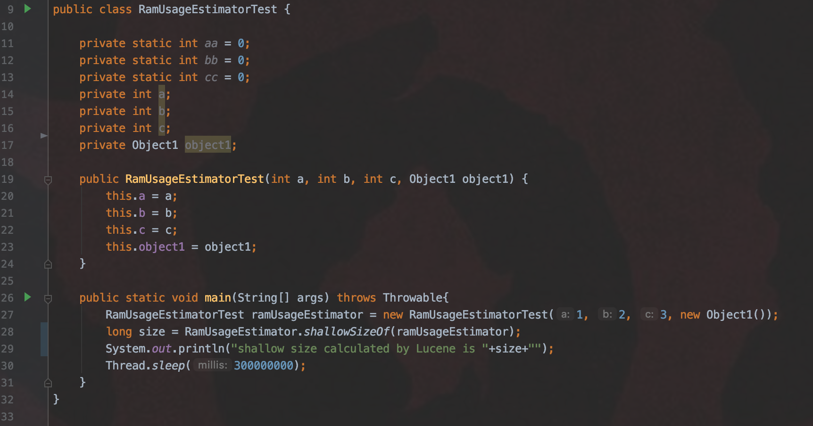
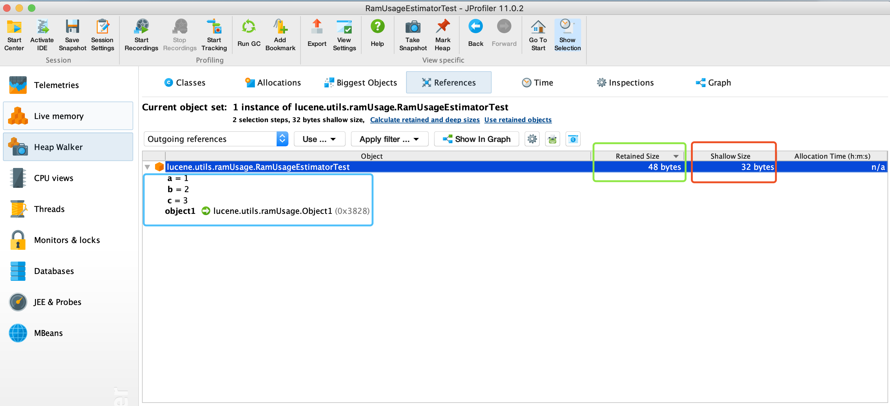
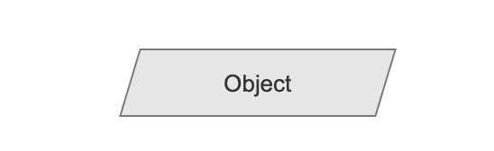
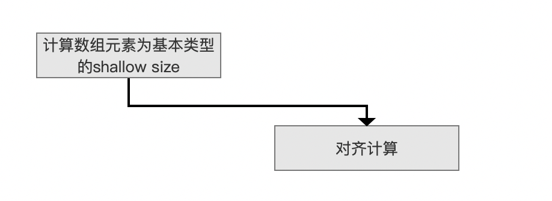
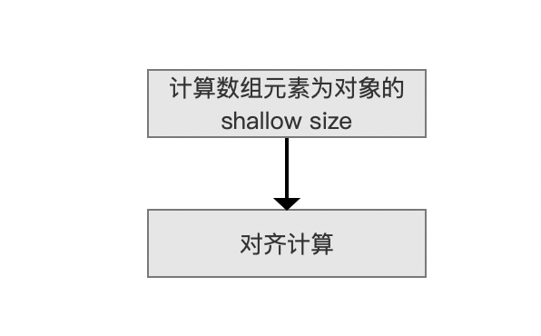
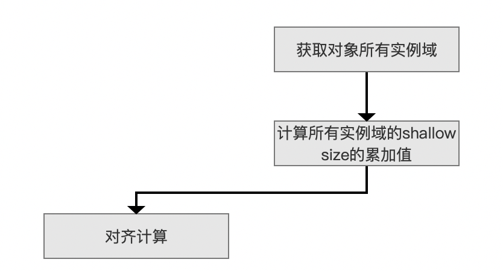
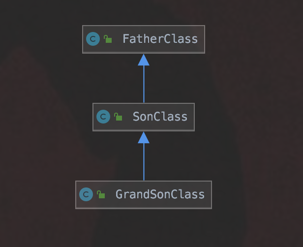
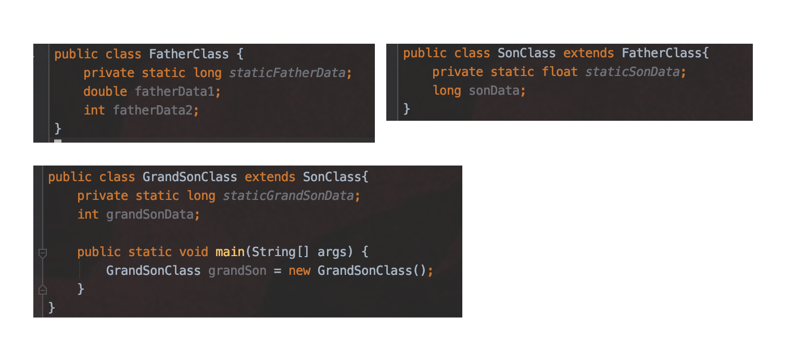
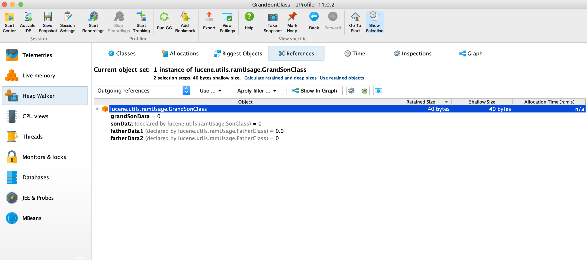

# [RamUsageEstimator](https://www.amazingkoala.com.cn/Lucene/gongjulei/)

&emsp;&emsp;Lucene通过RamUsageEstimator类提供的方法来粗略的（roughly）估算Java对象在内存中的大小。计算对象大小的主要目的是配合flush策略将内存中的索引信息同步到磁盘，flush策略的概念可以看文章[构造IndexWriter对象（二）](https://www.amazingkoala.com.cn/Lucene/Index/2019/1114/107.html)中关于MaxBufferedDocs、RAMBufferSizeMB的介绍以及文章[文档的增删改（中）](https://www.amazingkoala.com.cn/Lucene/Index/2019/0628/69.html)。

# 对象的计算方式

&emsp;&emsp;Lucene中通过对象中包含的基本类型、引用对象这两者对应的大小和值来粗略的计算该对象的大小。

## 基本类型（primitive type）

&emsp;&emsp;基本类型的大小，即占用的字节大小如下表所示：

表一：

| 基本类型 | 占用字节数量 |
| :------: | :----------: |
| boolean  |      1       |
|   byte   |      1       |
|   char   |      2       |
|  short   |      2       |
|   int    |      4       |
|  float   |      4       |
|  double  |      8       |
|   long   |      8       |


## 引用对象

&emsp;&emsp;引用对象对应的大小通过一些常量的组合值实现，这些常量通过虚拟机提供的信息来初始化，如下所示：

- COMPRESSED_REFS_ENABLED：布尔值，如果为true说明JVM开启了指针压缩（即启用了-XX:+UseCompressedOops）
- NUM_BYTES_OBJECT_ALIGNMENT：对齐值，一个对象通过填充值（padding value）使其对象大小为NUM_BYTES_OBJECT_ALIGNMENT的整数倍（最接近的）
- NUM_BYTES_OBJECT_REF：引用对象需要占用的大小
- NUM_BYTES_OBJECT_HEADER：对象头占用的大小
- NUM_BYTES_ARRAY_HEADER：数组头占用的大小
- LONG_CACHE_MIN_VALUE：由于LongCache的存在，缓存范围（cache range）内的数值会被缓存，LONG_CACHE_MIN_VALUE为这个范围的最小值，如果某个对象A中有一个Long对象，并且Long对象的值在缓存范围内，那么该Long对象的大小不会参与对象A的大小计算
- LONG_CACHE_MAX_VALUE：同上，LONG_CACHE_MAX_VALUE为缓存范围的最大值

&emsp;&emsp;由于上述的常量值基于使用的JVM平台以及JVM的参数，故无法给出具体的数值，这里我们只简单介绍下如何获取这些变量的值：

- 利用反射机制，获取两个java.lang.management.ManagementFactory以及com.sun.management.HotSpotDiagnosticMXBean中的信息来设置上述的常量
- 感兴趣的同学可以点击这个链接，查看具体的常量的初始化，共50行左右的代码量，简单易懂：https://github.com/LuXugang/Lucene-7.5.0/blob/master/solr-7.5.0/lucene/core/src/java/org/apache/lucene/util/RamUsageEstimator.java 

## 对齐计算

&emsp;&emsp;根据上文中获得的对齐值NUM_BYTES_OBJECT_ALIGNMENT计算对齐后的大小，计算逻辑如下：

```java
public static long alignObjectSize(long size) {
    size += (long) NUM_BYTES_OBJECT_ALIGNMENT - 1L;
    return size - (size % NUM_BYTES_OBJECT_ALIGNMENT);
  }
```
&emsp;&emsp;作者的环境获得的NUM_BYTES_OBJECT_ALIGNMENT的值为8，那么如果上述alignObjectSize方法的参数size的值为14，那么在对齐操作后，会获得一个比14大，并且是8的倍数的数值，即16。

## 数组大小计算

&emsp;&emsp;根据不同的数组元素类型计算方式各不相同。

### byte类型

```java
 public static long sizeOf(byte[] arr) {
    return alignObjectSize((long) NUM_BYTES_ARRAY_HEADER + arr.length);
}
```

### boolean类型

```java
public static long sizeOf(boolean[] arr) {
    return alignObjectSize((long) NUM_BYTES_ARRAY_HEADER + arr.length);
}
```

### char类型

```java
public static long sizeOf(char[] arr) {
    return alignObjectSize((long) NUM_BYTES_ARRAY_HEADER + (long) Character.BYTES * arr.length);
}
```

### short类型

```java
public static long sizeOf(short[] arr) {
    return alignObjectSize((long) NUM_BYTES_ARRAY_HEADER + (long) Short.BYTES * arr.length);
}
```

### int类型

```java
public static long sizeOf(int[] arr) {
    return alignObjectSize((long) NUM_BYTES_ARRAY_HEADER + (long) Integer.BYTES * arr.length);
}
```

### float类型

```java
 public static long sizeOf(float[] arr) {
    return alignObjectSize((long) NUM_BYTES_ARRAY_HEADER + (long) Float.BYTES * arr.length);
}
```

### long类型

```java
public static long sizeOf(long[] arr) {
    return alignObjectSize((long) NUM_BYTES_ARRAY_HEADER + (long) Long.BYTES * arr.length);
}
```

### double类型

```java
public static long sizeOf(double[] arr) {
    return alignObjectSize((long) NUM_BYTES_ARRAY_HEADER + (long) Double.BYTES * arr.length);
}
```

### 对象类型

```java
public static long shallowSizeOf(Object[] arr) {
    return alignObjectSize((long) NUM_BYTES_ARRAY_HEADER + (long) NUM_BYTES_OBJECT_REF * arr.length);
}
```

&emsp;&emsp;上述的代码过于简单，大家自行看下即可。

## 计算shallow size

&emsp;&emsp;shallow size描述的是对象自身占用的内存大小，我们先通过一个例子来介绍下通过JProfiler计算出的shallow size，然后再介绍在Lucene中的计算shallow size的逻辑 。

图1：



图2：


&emsp;&emsp;使用JProfiler后，我们观察下图1中第27行的RamUsageEstimatorTest对象ramUsageEstimator的shallow size是多少，如下所示：

图3：



&emsp;&emsp;由图3<font color=Blue>蓝色框</font>标注的内容可以看出RamUsageEstimatorTest类中参与shallow size计算的只有非静态变量，即实例域，<font color=Green>绿色框</font>标注的内容为Retained size，它将object1对象的大小也参与到ramUsageEstimator对象的大小计算中，而在shallow size中，只将引用object1的大小，即NUM_BYTES_OBJECT_REF的值纳入计算。

&emsp;&emsp;接下来我们看下Lucene中计算shallow size的逻辑：

### Lucene计算shallow size流程图

图4：


#### Object

图5：



&emsp;&emsp;该流程描述的是哪些准备数据可以用来计算shallow size，至少包含下面的种类：

- 种类一：基本类型的数组，例如整型数组int[ ]，浮点型数组floag[ ]
- 种类二：对象数组，例如图1中，定义一个RamUsageEstimatorTest[ ]对象数组。
- 种类三：对象，例如图1中，RamUsageEstimatorTest对象
- 种类四：基本类型，例如int、float的数值，注意的是他们会被自动装箱，故实际是计算的Integer、Float对象的shallow size，同种类三

&emsp;&emsp;另外通过Class.isArray()方法判断准备数据Object是属于array class还是普通对象，即not array class。

#### 计算数组元素为基本类型的shallow size

图6：



&emsp;&emsp;该计算方式在上文的**数组计算方式**章节已经介绍，不赘述。

#### 计算数组元素为对象的shallow size

图7：



&emsp;&emsp;该计算方式在上文的**数组计算方式**章节已经介绍，不赘述。

#### 获取对象所有实例域

图8：



&emsp;&emsp;这里所谓的"所有"实例域，指的是对象对应的类的继承链（inheritance chain）上实例域都参与shallow size计算。

&emsp;&emsp;例如这么一个类的继承链：

图9：



图10：



&emsp;&emsp;基于图10的例子，GrandSonClass对象grandSon的shallowSize的值如下所示：

```java
作者的运行环境中对齐值NUM_BYTES_OBJECT_ALIGNMENT为8，NUM_BYTES_OBJECT_HEADER为12

1. 对其计算前的和值 = NUM_BYTES_OBJECT_HEADER + fatherData1(8) + fatherData2(4) + sonData(8) + grandSonData(4) = 36

2. 对其计算后的和值 = 40，即找到比36大，且最小的NUM_BYTES_OBJECT_ALIGNMENT的倍数的值
```

图11：



&emsp;&emsp;图11给出的是通过JProfiler算出的GrandSonClass对象grandSon的shallowSize的值，同样为40。

&emsp;&emsp;另外我们可以看出，非实例域是不会参数shallow size的计算，例如图10中的几个静态域。


# Lucene中对象大小计算

&emsp;&emsp;如果仅仅用通过RamUsageEstimator类计算出来的shallow size来描述一个对象的大小就过于粗略（rough）了，故针对不同的类，结合shallow size，实现类似计算Retained size的功能。

## Accountable类

&emsp;&emsp;需要计算大小的对象对应的类都需要实现Accountable类的方法，来实现不同类的类似Retained size的功能，使得尽量接近一个对象真正占用的内存大小，该类是个接口类，代码简洁，故在此列出，该类的完整代码见：https://github.com/LuXugang/Lucene-7.5.0/blob/master/solr-7.5.0/lucene/core/src/java/org/apache/lucene/util/Accountable.java ：

```java
public interface Accountable {

    // Return the memory usage of this object in bytes. Negative values are illegal.
    long ramBytesUsed();
    ... ...
}
```

&emsp;&emsp;我们随意找一个实现了Accountable接口的类来介绍下如何实现类似计算Retained size的功能，例如SegmentMap类，该类的完整代码见：  https://github.com/LuXugang/Lucene-7.5.0/blob/master/solr-7.5.0/lucene/core/src/java/org/apache/lucene/index/OrdinalMap.java ：

```java
private static class SegmentMap implements Accountable {
    private static final long BASE_RAM_BYTES_USED = RamUsageEstimator.shallowSizeOfInstance(SegmentMap.class);

    private final int[] newToOld, oldToNew;
    
    ... ...
    
    @Override
    public long ramBytesUsed() {
        return BASE_RAM_BYTES_USED + RamUsageEstimator.sizeOf(newToOld) + RamUsageEstimator.sizeOf(oldToNew);
    }
}
```

&emsp;&emsp;通过观察SegmentMap类我们可以看出，该类先计算了SegmentMap对象shallow size，即BASE_RAM_BYTES_USED，然后在ramBytesUsed() 方法中继续计算两个数组的大小，即所谓的类似Retained size的功能。

# 结语

&emsp;&emsp;在Lucene中，计算一个对象大小的逻辑根据类中的实例域的数量以及类型而各不相同，想更进一步深入理解的同学可以自行看下这个类中的计算，想必会有更大的收获：https://github.com/LuXugang/Lucene-7.5.0/blob/master/solr-7.5.0/lucene/core/src/java/org/apache/lucene/index/BufferedUpdates.java 。

[点击](http://www.amazingkoala.com.cn/attachment/Lucene/utils/RoaringDocIdSet/RoaringDocIdSet.zip)下载附件