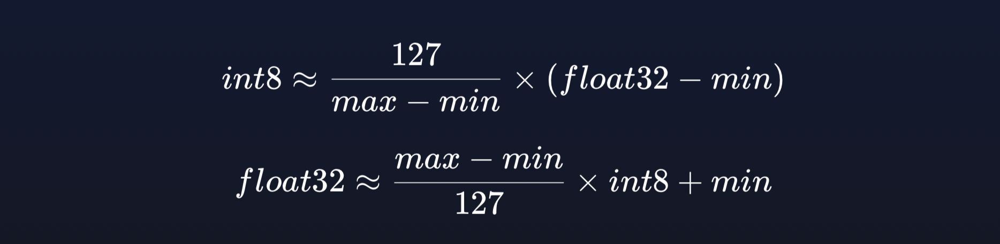
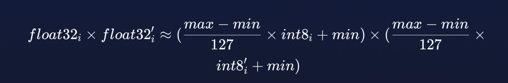
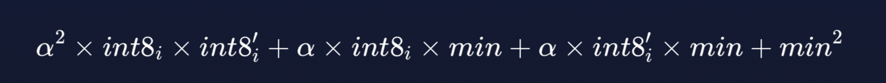
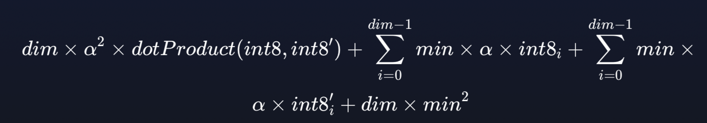

# Vector Quantization（一）（Lucene 9.10.0）

&emsp;&emsp;本篇文章介绍下截止到9.10.0版本，Lucene中向量量化（Vector Quantization）技术相关的内容。

## Lucene中为什么要引入VQ

&emsp;&emsp;Lucene中使用[HNSW](https://amazingkoala.com.cn/Lucene/Index/2024/0118/HNSW%E5%9B%BE%E7%9A%84%E6%9E%84%E5%BB%BA/) (Hierarchical Navigable Small World) 实现了高维数据的搜索，引入VQ基于以下几个方面的考虑：

- **实际数据的需求**：对于给定的一个数据集，embeddings的每一个维度并不真正需要所有可能的亿级别的可选数值，这意味着每个维度的实际变化范围远小于float32类型所能提供的范围。
- **数据的高保真（fidelity）和浪费问题**：尽管浮点数类型可以提供最高的数据保真度（即数据的准确和细腻度），但在许多实际应用中，这种高保真度是过剩的。这是因为嵌入向量中真正重要的信息通常并不需要如此高的精度和如此多的数值选项。

&emsp;&emsp;当然这通常是以“有损”的方式进行的，意味着在处理过程中会丢失一些原始数据信息，但与此同时，它能显著减少存储数据所需的空间。

## 实现原理

&emsp;&emsp;VQ的实现方式在源码中核心代码为一个名为**ScalarQuantizer**类，它提供了以下两个关键的功能：float32->int8、校正偏移（Corrective Offset）。

### float32->int8

&emsp;&emsp;float32->int8描述的是将32位的浮点型数值用一个8位的整数表示，最终用`byte`类型存储。其量化公式也不是很复杂，由于在flush阶段已知了向量数据集中的最大跟最小值，因此使用了[min-max normalization ](https://en.wikipedia.org/wiki/Feature_scaling#Rescaling_(min-max_normalization))方法。

图1：

#### 向量距离

&emsp;&emsp;我们进一步看下，当使用了上文的量化公式后，在计算向量距离时有什么新的发现。

&emsp;&emsp;下图为两个float32向量中某一个维度的两个浮点数的乘积：

图2：

&emsp;&emsp;如果我们使用`α`表示`(max - min) / 127`，那么上述算式就变为：

图3：

&emsp;&emsp;以点积（[dot_product](https://en.wikipedia.org/wiki/Dot_product)）为例，如果向量的维度为`dim`，那么向量距离就是这`dim`个浮点数的乘积的和值，如下所示：

图4：

&emsp;&emsp;从图4可以两个量化后的float32向量除了`dotProduct(int8, int8')`部分，其他部分都可以提前计算，可以直接存放在索引中，或者在查询期间只计算一次。 

### 校正偏移（Corrective Offset）