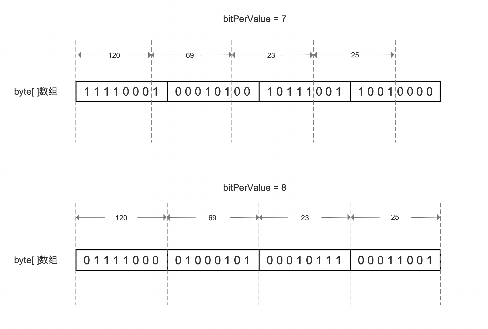
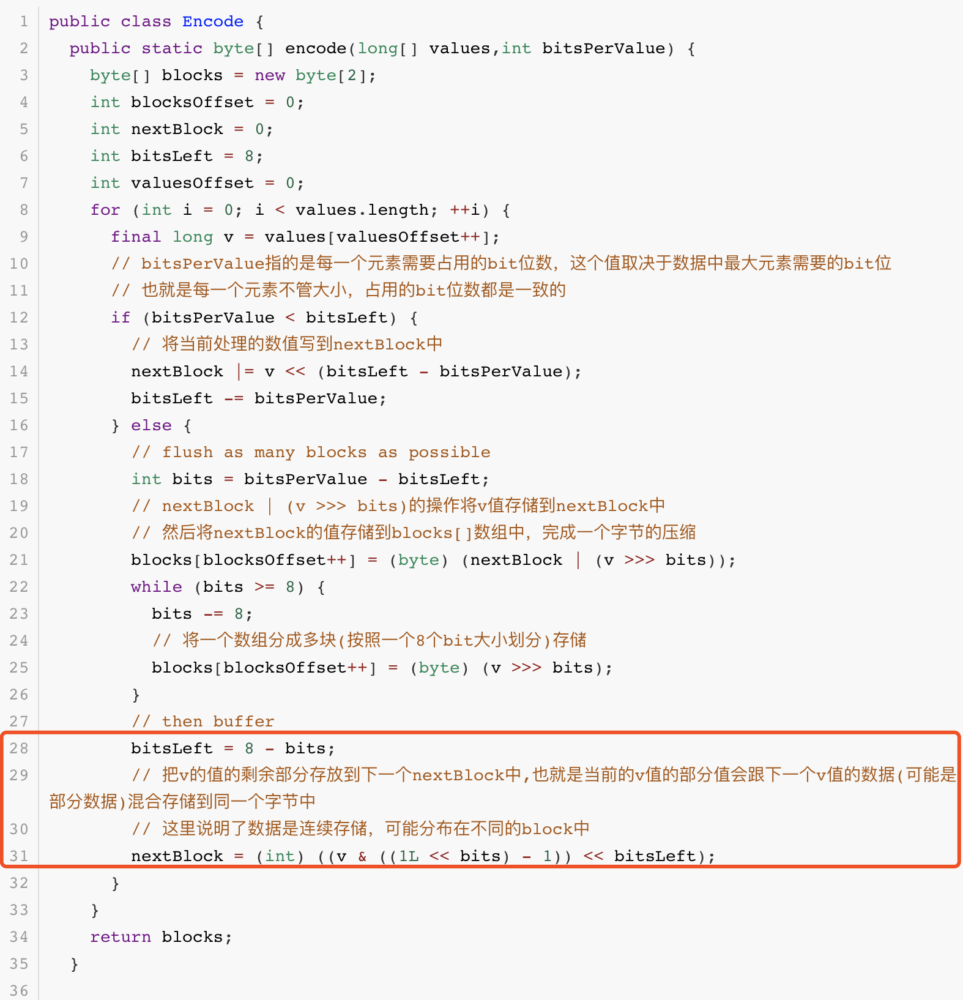
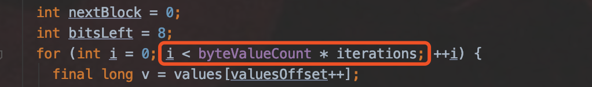

# [DirectWriter&&DirectReader](https://www.amazingkoala.com.cn/Lucene/gongjulei/)

&emsp;&emsp;**阅读本篇文章需要前置内容**：[BulkOperationPacked](https://www.amazingkoala.com.cn/Lucene/yasuocunchu/2019/0213/31.html)，下文中会列出在文章[BulkOperationPacked](https://www.amazingkoala.com.cn/Lucene/yasuocunchu/2019/0213/31.html)中涉及的代码，但是不会展开介绍。

&emsp;&emsp;DirectWriter&&DirectReader两个类用来处理long类型的数据集（数组类型），其中DirectWriter用来在写数据时使用[BulkOperationPacked](https://www.amazingkoala.com.cn/Lucene/yasuocunchu/2019/0213/31.html)将long类型的数据转换成byte类型，而DirectReader则是将byte类型的数据恢复成long类型。使用byte类型数据存储的组件都可以使用DirectWriter&&DirectReader实现压缩存储，比如以字节为单位存储索引文件内容的[Directory](https://www.amazingkoala.com.cn/Lucene/Store/2019/0613/66.html)。


## 压缩实现

&emsp;&emsp;在BulkOperation中，根据bitPerValue的值，对应的压缩实现不尽相同，但是DirectWriter只支持下列的bitPerValue：

```java
final static int SUPPORTED_BITS_PER_VALUE[] = new int[] {
    1, 2, 4, 8, 12, 16, 20, 24, 28, 32, 40, 48, 56, 64
};
```

**bitPerValue是什么**：

&emsp;&emsp;使用BulkOperation提供的压缩实现，要求数据集中的所有数据按照固定位数存储，固定位数即bitPerValue。

**bitPerValue怎么计算**：

&emsp;&emsp;选取数据集中的最大值，它的有效数据占用的bit位个数为bitPerValue。

&emsp;&emsp;例如有下面的数据集：

数组一：

```java
    long []values = {2, 278, 23};
```

&emsp;&emsp;数组一中的元素对应的二进制表示如下所示：

表一：

| 数组元素 |                            二进制                            |
| :------: | :----------------------------------------------------------: |
|    2     | 00000000_00000000_00000000_00000000_00000000_00000000_00000000_00000010 |
|   278    | 00000000_00000000_00000000_00000000_00000000_00000000\_0000000<font color=Red>1_00010110</font> |
|    23    | 00000000_00000000_00000000_00000000_00000000_00000000_00000000_00010111 |

&emsp;&emsp;数组一中的最大值为278，它的有效数据占用的bit位个数如表一中红色标注所示，共9位，故bitPerValue的值为9，并且数值2、23都使用9个bit来存储。

**待处理的数据集的bitPerValue不是SUPPORTED_BITS_PER_VALUE中的一员怎么办**：

&emsp;&emsp;如果待处理的数据集的bitPerValue不属于SUPPORTED_BITS_PER_VALUE数组中的数组元素之一，那么另下一个比bitPerValue大的数组元素作为新的bitPerValue。例如表一中，bitPerValue的值为9，那么重新另bitPerValue为12，即，数值2、278、23都使用12个bit位存储。

**为什么只支持SUPPORTED_BITS_PER_VALUE中的bitPerValue**：

&emsp;&emsp;因为这些bitPerValue对应的压缩实现是读写性能最佳的，**衡量读写性能的指标如下**：

- 写性能：写入一个数值需要涉及的block个数，越少性能越高
- 读性能：读取一个数值对应的block的个数，越少性能越高，另外字节对齐的数据读取性能越高，否则需要额外计算字节首地址

例如我们有以下的数据集：

数组二：

```java
    long []values = { 120, 69, 23, 25};
```

&emsp;&emsp;数组一中的元素对应的二进制表示如下所示：

表二：

| 数组元素 |                            二进制                            |
| :------: | :----------------------------------------------------------: |
|   120    | 00000000_00000000_00000000_00000000_00000000_00000000_00000000_0<font color=Red>1111000</font> |
|    69    | 00000000_00000000_00000000_00000000_00000000_00000000\_00000000_01000101 |
|    23    | 00000000_00000000_00000000_00000000_00000000_00000000_00000000_00010111 |
|    25    | 00000000_00000000_00000000_00000000_00000000_00000000_00000000_00011001 |

&emsp;&emsp;表二中，数组二的bitPerValue为7，如果我们使用该bitPerValue，即每个数值使用7个bit位存储，那么处理结束后如下所示，同时给出bitPerValue为8时的结果：

图1：



&emsp;&emsp;从图1可以看出，在读取阶段，如果bitPerValue为7，那么需要两个字节才能读取到69、23、25的值，另外需要计算首地址跟偏移才能找到在字节中的起始位置，而如果bitPerValue为8，那么只需要一个字节即可，并且不需要计算偏移地址。很同时也可以看出，这是空间换时间的设计。

&emsp;&emsp;我们再看下写阶段的情况，从图1同样能明显看出bitPerValue为7时，写入一个数值需要跨越2个block，我们从代码中也可以看出其性能差异的原因：

图2：



&emsp;&emsp;图2截取自[BulkOperationPacked](https://www.amazingkoala.com.cn/Lucene/yasuocunchu/2019/0213/31.html)，bitPerValue为7时，相比较bitPerValue为8时需要执行额外的位移操作，如第31行代码所示。**更重要的是当处理相同数量的数值时，需要更多的遍历次数**，在文章[BulkOperationPacked](https://www.amazingkoala.com.cn/Lucene/yasuocunchu/2019/0213/31.html)中，为了简化介绍BulkOperationPacked的原理，我们并没有介绍如何计算遍历次数，只是简单的将待处理的数据集数量作为遍历次数，即图8中第31行的values.length，在源码中，图1中的第8行代码应该是这样的：

图3：



&emsp;&emsp;**遍历次数是如何计算的**：

&emsp;&emsp;在后续介绍PackedWriter的文章中我们再讲述这个问题，本篇文章中我们只要知道bitPerValue为7时，相比较bitPerValue为8在处理相同数量的数据集时，需要更多的遍历次数。

**如何选择bitPerValue的值作为SUPPORTED_BITS_PER_VALUE中的一员**：

&emsp;&emsp;我们再次列出SUPPORTED_BITS_PER_VALUE中的成员：

```java
final static int SUPPORTED_BITS_PER_VALUE[] = new int[] {
    1, 2, 4, 8, 12, 16, 20, 24, 28, 32, 40, 48, 56, 64
};
```

&emsp;&emsp;我们先看下bitPerValue大于等于8的情况，当bitPerValue为8、16、24、32、40、48、56时，这几个值总能保证待处理的数值能按照字节对齐（8的倍数）处理，故读写性能是很快的，我们想要了解的是，bitPerValue的值不是8的倍数的情况下，为何还将12、20、28、48作为SUPPORTED_BITS_PER_VALUE的成员。

&emsp;&emsp;这是一种出于空间使用率与读写性能的折中处理，例如bitPerValue的值为9时，如果只能选择16，那么每一个数值的额外空间开销为（16 - 9）/ 16 = 0.4375，故我们需要在(8，16)的区间内找出一个空间开销与读写性能兼顾的bitPerValue，那么12是最好的选择，因为它的读写性能在这个区间内是最佳的，同时额外空间开销降低到         （12 - 9）/ 12 = 0.25。

**为什么在区间(8，16)中选取bitPerValue的值是12**:

&emsp;&emsp;首先在这个区间内bitPerValue的写性能是差不多的，因为它们的值不是8（一个字节）的倍数，都需要跨block存储，所以我们看它们在读性能的差异性，同样地，由于不能保证每个数值都是按照字节对齐存储，故我们只能通过平均读取一个数值需要计算首地址的次数来判断读的性能：

&emsp;&emsp;我们有如下的数据集数组三：

数组三：

```java
    long[] values = {69, 25, 261, 23};
```

&emsp;&emsp;数组三中的元素对应的二进制表示如下所示：

表三：

| 数组元素 |                            二进制                            |
| :------: | :----------------------------------------------------------: |
|    69    | 00000000_00000000_00000000_00000000_00000000_00000000_00000000_01000101 |
|    25    | 00000000_00000000_00000000_00000000_00000000_00000000_00000000_00011001 |
|   261    | 00000000_00000000_00000000_00000000_00000000_00000000_0000000<font color=Red>1_00000101</font> |
|    23    | 00000000_00000000_00000000_00000000_00000000_00000000_00000000_00010111 |


&emsp;&emsp;数组三中，最大值为261，故此时的bitPerValue为9，我们用bitPerValue为9以及bitPerValue为12来处理数组三的数据，如下所示：

图4：


&emsp;&emsp;从图4可见，如果需要读取261的数值，在bitPerValue=9中，由于261对应的首地址没有按照字节对齐，那么需要额外的计算出首地址的值，因为读取byte[ ]数组总是按字节读取，而在bitPerValue=12的情况下，则**不需要计算**：

- bitPerValue=9：每读取8个数值，需要计算7次首地址，平均读取一个数值需要计算0.875次首地址
- bitPerValue=12：每读取2个数值，需要计算1次首地址，平均读取一个数值需要计算0.5次首地址

&emsp;&emsp;故当bitPerValue=12时，读性能较高。

&emsp;&emsp;如果我们连续读取byte[ ]数组中的元素，在bitPerValue=9的情况下，第一个数值是不需要计算首地址的，而下一个**不需要**计算首地址的数值是第9个，所以每读取8个数值，需要计算7次首地址。其实我们只需要计算8跟bitPerValue的最小公约数就能计算出不同的bitPerValue对应的平均读取一个数值需要计算首地址的次数。

&emsp;&emsp;下图是在区间(8, 16)之间，各个bitPerValue的取值对应的平均读取一个数值需要计算首地址的次数：

表4：

| bitPerValue | 平均读取一个数值需要计算首地址的次数 |
| ----------- | ------------------------------------ |
| 9           | 7/8 = 0.875                          |
| 10          | 3/4 = 0.6                            |
| 11          | 7/8 = 0.875                          |
| 12          | 1/2 = <font color=Red>0.5</font>     |
| 13          | 7/8 = 0.85                           |
| 14          | 3/4 = 0.6                            |
| 15          | 7/8 = 0.875                          |

&emsp;&emsp;由表4可以看出，当bitPerValue=12时，平均读取一个数值需要计算首地址的次数的最少，所以读的性能最高。

# 结语

&emsp;&emsp;在应用方面，在索引阶段生成索引文件.dvm、dvd时，就使用这两个类来实现数据压缩。


[点击](http://www.amazingkoala.com.cn/attachment/Lucene/%E5%8E%8B%E7%BC%A9%E5%AD%98%E5%82%A8/DirectWriter&&DirectReader.zip)下载附件