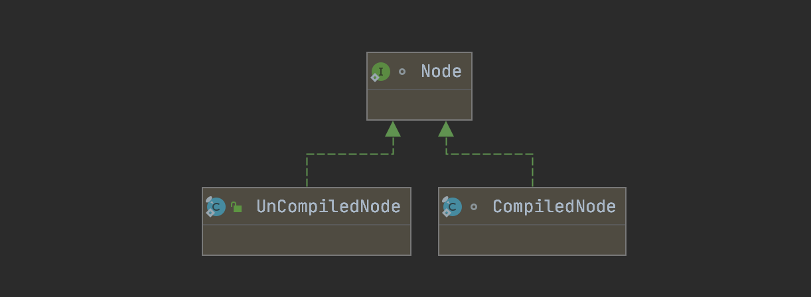
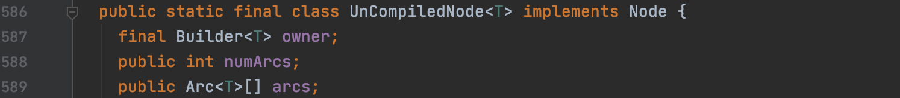
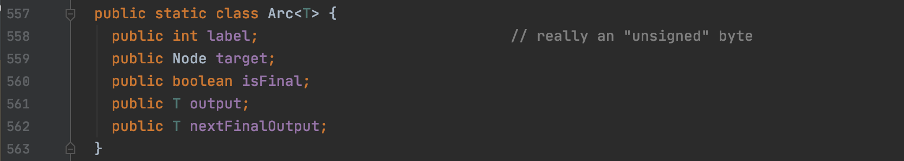
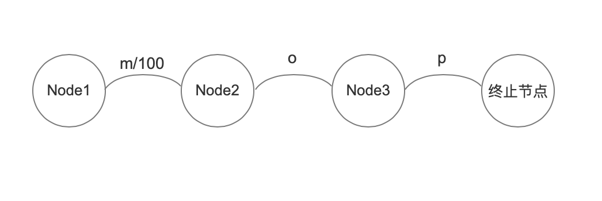
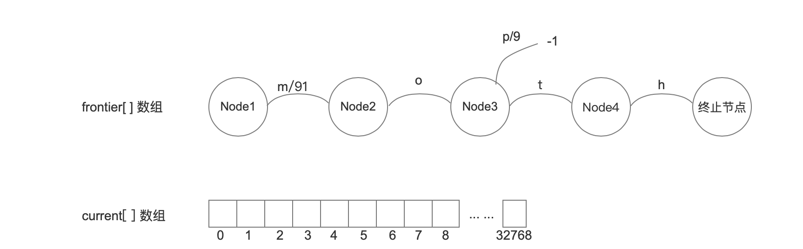
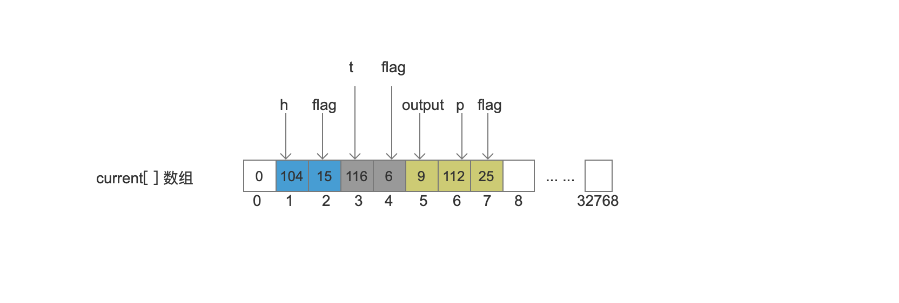
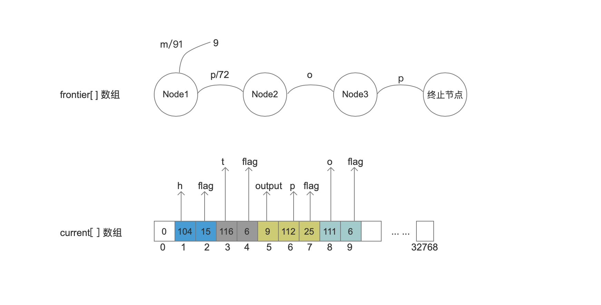
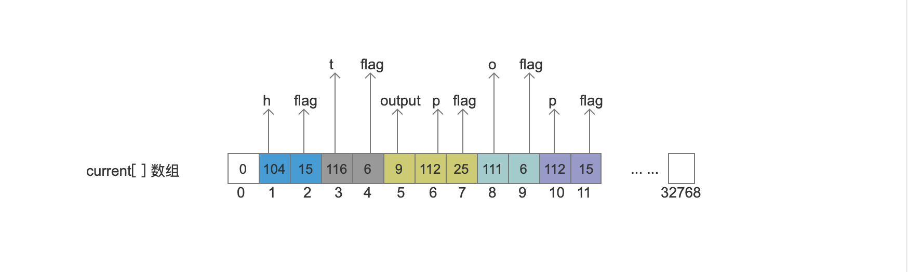
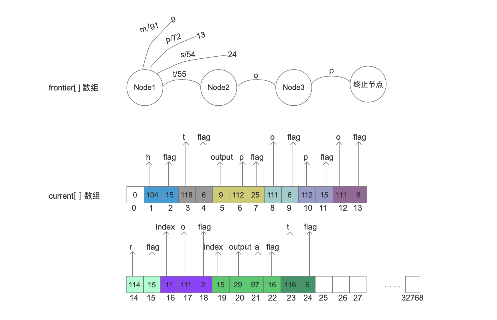

# [FST（一）](https://www.amazingkoala.com.cn/Lucene/yasuocunchu/)Lucene 8.4.0

&emsp;&emsp;FST（Finite State Transducer）算法的概念在这篇博客中并不涉及，网上有太多的资料啦，写的都非常的不错。这里推荐这位网友的介绍：https://www.shenyanchao.cn/blog/2018/12/04/lucene-fst/ 。如果链接失效了，可以看附件中的副本。本文中，我们基于一个例子来介绍在Lucene中如何构建FST。感谢网友**关新全**的分享，基于他的分享使得我在看源码的时候事半功倍，在此基础上，增加一些更加贴近源码的内容。同样的，关新全同学分享的文章在附件中。

## 准备工作

&emsp;&emsp;为了便于理解，先介绍几个概念。

#### current\[ ]数组

&emsp;&emsp;构建FST后生成的信息都最终保存到字节数组current\[ ]数组中，即生成FST的最终结果就是该数组。

#### Node（节点）、Arc（弧、边）

&emsp;&emsp;在下文的介绍中使用节点跟弧（边），即有向无环图的概念来描述生成的过程，Node之间使用**一个**Arc连接，一个Node跟**一个或多个**Node连接。

&emsp;&emsp;Node还具有两种**状态**：UnCompiledNode和CompiledNode。在源码中，使用两个对象来描述这两种状态，如下所示：

图0：



&emsp;&emsp;当开始处理某个输入值时，会将它的信息生成Node跟Arc，此时Node的状态为UnCompiledNode，当Node以及它的出度对应的Arc（出边）的信息写入到current\[ ]之后，Node的状态转变为CompiledNode。 例如图1中当开始处理的输入值为mop时，会生成4个状态为UnCompiledNode的Node以及3个Arc，其中Node1的出边为arc1，以此类推。我们给出源码中UnCompiledNode类的定义来理解Node跟Arc的关系：

图0-1：



图0-2：



&emsp;&emsp;图0-2描述的是Arc在源码中的定义，由图0-1可知，一个状态为UnCompiledNode的Node使用Arc\<T>数组来描述它的出度的值，可以见该值是大于等于0的，即一个状态为UnCompiledNode的Node中可以包含多个Arc。

&emsp;&emsp;图0-1跟图0-2中的其他变量的概念在下文中我们会根据需要一一介绍。

图1：


##### label、target

&emsp;&emsp;基于图1我们先介绍下图0-2中Arc类的两个成员域：label和target，假设有一个输入值 “mop”，会使用三个Arc\<T>对象来分别描述“m”，“o”，“p”的三个字符的信息，并且这三个对象分别是三个状态为UnCompiledNode的Node的出边。描述“m”的Arc\<T>对象arc1，它是Node1的出边，对象arc1中的label的值是 109，即“m”的ASCII值；对象arc1的target的值即Node2，这里暂时不讨论isFinal、nextFinalOutput的含义，后面会涉及。**另外如果Node没有任何的出度，那么它是一个终止节点**。

##### output

&emsp;&emsp;output值是某个输入的附加值（payload），比如有输入值”mop”，它的附加值是100，但是对于分别封装了"m"，“o”，“p”的三个arc，附加值100应该存放哪个arc的output字段呢？下面通过一个例子来说明：
```text
例子：输入为 “mop”、“mt”，附加值分别是100、91。
```
###### 处理“mop”， 100

图2：



&emsp;&emsp;只处理输入"mop"时，附加值是放在“m”的arc中。

###### 处理“mt”， 91

图3：


&emsp;&emsp;上图中我们能发现，如果后面的输入跟前一个输入有相同的前缀，那么相同前缀对应的每一个arc的output都有可能被更新，在这个例子中，"mop"的附加值100被拆分为91跟9，因为“mt”的附加值是91，取两者的较小值来更新封装了“m”的arc中的output值。
另外上图中封装了“p”的arc怎么没有了，多出了一个值2 ？这里我们暂时不用关心，下文会解释。

#### current\[ ]数组
&emsp;&emsp;上文中我们提到，构建FST后的信息都最终保存到字节数组current\[ ]数组中，该信息实际上是转为CompiledNode状态后的Node的**新的出边信息**的集合，为了便于介绍，我们称**新的出边信息**为**四元组信息**，它包含index、output、label、flag四个信息，其中index跟output可能为空。**以下对四元组信息的介绍不必马上理解，特别是flag的概念。在下文中结合构建过程再回过头来看比较合适，这点很重要**：

##### index

&emsp;&emsp;当前arc描述的字符不是输入值的最后一个字符时，会存储一个index值来指向下一个字符的四元组信息中的flag值在current[]数组中的下标值。

##### output

&emsp;&emsp;该值同图0-2中Arc类中的的output字段的值，如果output为0，那么就不用存储，在查询阶段，会对一个输入值的所有arc的output值进行整合，合成一个完整的output。例如图2中，我们查询一个"mop"时，会将"m"、"o"、"p"携带的output值进行整合，最终输出100。

##### label

&emsp;&emsp;label值即我们的输入值中的一个字符，例如图1中的“mop”，对应三个label值，其中的一个label值就是109，即“m”的ASCII值。

##### flag

&emsp;&emsp;由于构建FST后，所有的信息都存在current\[ ]数组中，这过程实际是一个编码过程，在构建阶段，需要生成flag，使得在读取阶段，能根据flag的值进行解码，在Lucene 8.4.0中， flag有以下的值，不过本篇文章并没有全部列出，在后续的几篇文章中再给出：

|        Flag        | Value |                         Description                          |
| :----------------: | :---: | :----------------------------------------------------------: |
|   BIT_FINAL_ARC    |   1   |            arc对应的label是某个term的最后一个字符            |
|    BIT_LAST_ARC    |   2   | arc是Node节点中的最后一个Arc，上文中我们说到一个UnCompiledNode状态的Node可以包含多个arc |
|  BIT_TARGET_NEXT   |   4   | 上一个由状态UnCompiledNode转为CompiledNode状态的Node是当前arc的target节点, 它实际是用来描述当前的arc中的label不是输入值的最后一个字符，例如"mop"中，“m”、"o"就不是输入值mop的最后一个字符 |
|   BIT_STOP_NODE    |   8   | arc的target是一个终止节点，例如图2中，描述"p"的arc，它的target就是一个终止节点（终止节点的概念上文中已介绍） |
| BIT_ARC_HAS_OUTPUT |  16   | arc有output值(output不为0)，例如图2中，描述"m"的arc就具有output值，而描述"o"、"p"的arc就没有output值 |


#### NodeHash\<T>类

&emsp;&emsp;NodeHash\<T>类用来对Node计算hash值，使得能实现FST的特性之一，即后缀存储，在下文中你将会知道，每个具有唯一性的Node，它包含所有的arc对应的四元组信息只需要存储一遍。

&emsp;&emsp;每当对Node执行UnCompiledNode向CompiledNode的转化时，会计算Node的hash值。

#### UnCompiledNode\<T>\[ ] frontier

&emsp;&emsp;frontier为存放状态为UnCompiledNode的Node的数组，例如图1中，frontier中就存放了Node1，Node2，Node3、终止节点四个状态为UnCompiledNode的Node。

### lastFrozenNode

&emsp;&emsp;lastFrozenNode为long类型变量，当一个Node的状态由UnCompiledNode转为CompiledNode之后，它包含的**所有的arc**对应的四元组信息会被写入到current\[ ]中，lastFrozenNode会被置为**第一个**arc的四元素信息中的flag值在current\[ ]中的下标值。另外由于终止节点没有arc信息，即没有四元组信息写入到current\[ ]中，那么终止节点在执行状态变化后，会返回一个固定值 -1。

## 算法基本步骤
&emsp;&emsp;构建FST的过程分为三个步骤：

- 步骤一：处理上一个输入与当前输入不相同Node节点，将Node节点中的所有arc的四元组信息写入到current[]数组中
  - 该过程即上文中提到的，Node由UnCompiledNode状态转变为CompiledNode状态的过程
- 步骤二：将当前输入写入到frontier[]数组中
  - 该过程即上文中提到的，当开始处理某个输入值时，会将它的信息生成Node跟Arc，并且这些Node的状态为UnCompiledNode
- 步骤三：处理上一个输入与当前输入相同的前缀值，调整output值。
  - 该过程为图3中的字符"m"携带的output值由原先的100调整为91

## 例子

&emsp;&emsp;下面通过一个例子来介绍FST的构建过程，输入跟附加值如下：

```java
String[] inputValues = {"mop", "moth", "pop", "star", "stop", "top"};
long[] outputValues = {100, 91, 72, 83, 54, 55};
```
&emsp;&emsp;注意的是输入顺序必须是有序的，这样才能获得一个最小FST，例子中的输入已经默认有序的。

### 输入mop

&emsp;&emsp;这是第一个输入，所以没有写入current[]数组的操作。将"mop"以及附加值100生成Node跟Arc即可，即步骤二。


图4：


### 输入moth

&emsp;&emsp;输入moth后的执行步骤如下：

- 步骤一：我们要处理上一个输入“mop”跟当前输入"moth"不相同的Node，可以看出不相同的Node是图4中Node3后面的终止节点，所以要将这个节点的所有arc对应的四元组信息写入到current[]数组中，并获得四元组信息中的flag值在在current[]中的下标值，即该终止节点的状态由UnCompiledNode转为CompiledNode，由于终止节点没有出度，即不包含arc，所以返回值是固定值 -1，最后更新lastFrozenNode为 -1。
- 步骤二：将当前输入写入到frontier[]数组中，由于"m"、"o"对应的Node已经存在，故只需要写入"t"、"h"对应的Node跟Arc信息即可，如图5所示。
- 步骤三：更新Node1中"m"的附加值，由100变成91。并且"p"的附加值由0变为9。


图5：



### 输入pop

&emsp;&emsp;输入pop后，与上一个值"moth"没有相同的节点，所以我们要将图5中的Node2、Node3、Node4、终止节点的所有arc信息写入到current[]数组中，即执行步骤一，**注意的是Node1中的所有arc只有在所有输入处理结束后才会处理**。

&emsp;&emsp;处理的顺序为：**节点间按照从后往前，节点内的arc按照写入到该节点的顺序**，在当前情况下，根据图5，处理的arc顺序应该是： 终止节点 --> Node4（h） --> Node3（p --> t） --> Node2(o)，我们一一介绍：

#### 处理终止节点

&emsp;&emsp;终止节点返回值为固定值-1，并更新**lastFrozenNode为 -1**，current[]数组不变。


图6：


#### 处理Node4 （h）

&emsp;&emsp;Node4中只有“h”对应的arc，根据flag的定义，该arc满足以下几个flag：

- BIT_LAST_ARC：它是Node4中的最后一个arc
- BIT_TARGET_NEXT：arc的target节点的值跟lastFrozenNode一致都为-1
- BIT_FINAL_ARC："h"为"moth"的最后一个字符
- BIT_STOP_NODE：arc的target是一个终止节点（BIT_STOP_NODE）

&emsp;&emsp;所以flag的值为  BIT_LAST_ARC（2）+ BIT_TARGET_NEXT（4） + BIT_FINAL_ARC（1） +  BIT_STOP_NODE（8） = 15，然后将flag跟“h”的ASCII值，即四元组信息的flag跟label值，写入到current[]数组中，最后更新lastFrozenNode的值为2，该值为flag在current[]数组中的下标值。


图7：


#### 处理Node3（p -> t）

&emsp;&emsp;根据上文的内容，我们知道Node3包含了两个arc，并且"p"对应的arc先于"t"对应的arc添加到frontier[ ]数组中，根据上文中提到的节点内的处理顺序，我们先处理"p"对应的arc。

##### 处理 “p”

&emsp;&emsp;"p"对应的arc，满足以下几个flag：

- BIT_FINAL_ARC："p"是"mop"的最后一个字符
- BIT_STOP_NODE：arc的target是一个终止节点
- BIT_ARC_HAS_OUTPUT：arc有output值，该值为9

&emsp;&emsp;所以flag的值为 BIT_FINAL_ARC（1）+ BIT_STOP_NODE（8）+ BIT_ARC_HAS_OUTPUT（16） = 25。**由于Node3中还有未处理的arc，所以暂时不能更新lastFronzenNode的值。**

##### 处理“t”

&emsp;&emsp;"t"对应的arc，满足以下几个flag：

- BIT_LAST_ARC：它是Node3中的最后一个arc
- BIT_TARGET_NEXT：arc的target节点的值为Node4，而最新的lastFronzenNode的值是Node4对应生成的，故满足BIT_TARGET_NEXT

&emsp;&emsp;所以flag的值为 BIT_LAST_ARC（2）+ BIT_TARGET_NEXT（4） = 6。由于Node3中所有的arc处理结束，那么更新lastFronzenNode的值为7，7是Node3的第一个arc的四元组信息的flag值在current[]数组中的下标，如图8所示。

&emsp;&emsp;**这里有个注意点就是，当按照 p -> t的顺序处理结束后，会对刚才存储的数据执行逆置操作。所以“t”跟“p”对应的arc的数据在current[]数组中的位置如下图所示，这么做的目的是为了在读取阶段能正确的解码：**

图8：



#### 处理Node2（o）

&emsp;&emsp;"o"对应的arc，满足以下几个flag：

- BIT_LAST_ARC：arc是Node2节点中的最后一个arc
- BIT_TARGET_NEXT：arc的target节点为Node3，而最新的lastFronzenNode的值是Node3对应生成的，故满足

&emsp;&emsp;所以flag的值为 BIT_LAST_ARC(2) + BIT_TARGET_NEXT(4) = 6。更新lastFronzenNode的值为9， 9是Node2的第一个arc的四元组信息的flag值在current[]数组中的下标，如图9所示。

&emsp;&emsp;最后，由于"m"对应的arc的target是Node2，Node2在处理结束后，即状态由UnCompiledNode转为CompiledNode之后，"m"对应的arc的target会被更新为9，9是Node2的第一个arc的四元组信息的flag值在current[]数组中的下标。

&emsp;&emsp;**为什么要将"m"对应的arc的target会被更新为9**

&emsp;&emsp;为了在读取阶段能正确的解码，不过具体的原因将会在下一篇文章中才会展开。


图9：


&emsp;&emsp;步骤一执行结束后，接着执行步骤二，即把"pop"以及附加值72生成Node跟Arc即可，添加到frontier\[ ]数组中，如下图：


图10：



### 输入star

&emsp;&emsp;输入star后，与上一个输入值"pop"没有相同的节点，所以我们要将Node2、Node3、终止节点的所有arc信息写入到current[]数组中。同样的，**Node1中的所有arc只有在所有输入处理结束后才会处理**。

&emsp;&emsp;处理的顺序为：节点间按照从后往前，节点内的arc按照写入到该节点时候的顺序，在当前情况下，处理的arc顺序应该是： 终止节点 --> Node3（p）-->Node2（o）

#### 处理终止节点

&emsp;&emsp;终止节点返回值为固定值-1，并更新lastFrozenNode为 -1，current[]数组不变

图9：


#### 处理Node3（p）

&emsp;&emsp;"p"对应的arc，满足以下几个flag：

- BIT_LAST_ARC：arc是Node3节点中的最后一个arc
- BIT_FINAL_ARC："p"是"pop"的最后一个字符
- BIT_TARGET_NEXT：arc的target节点为终止节点，上一个lastFrozenNode的值为终止节点对应的值，故相同
- BIT_STOP_NODE：arc的target是一个终止节点

&emsp;&emsp;所以flag的值为 BIT_FINAL_ARC(1) + BIT_LAST_ARC(2) + BIT_TARGET_NEXT(4) + BIT_STOP_NODE(8) = 15。更新lastFronzenNode的值为11， 11是Node3的第一个arc的flag在current[]数组中的下标，如图11所示。

图11：



#### 处理Node2 （o）

&emsp;&emsp;这个过程就不赘述，跟上面的逻辑没区别。

图12：


&emsp;&emsp;步骤一执行结束后，接着执行步骤二，即把"star"以及附加值83生成Node跟Arc即可，添加到frontier\[ ]数组中，如下图：

图13：


### 输入stop

&emsp;&emsp;这个过程就不赘述了，跟上面的逻辑没区别。

图14：


### 输入top

&emsp;&emsp;输入top后，与上一个值"stop"没有相同的节点，所以我们要将图14中的Node2、Node3、Node4、终止节点的所有arc信息写入到current[]数组中，同样的，**Node1中的所有arc只有在所有输入处理结束后才会处理**。

&emsp;&emsp;处理的顺序为：节点间按照从后往前，节点内的arc按照写入到该节点时候的顺序，在当前情况下，处理的arc顺序应该是： 终止节点-->Node4（p） --> Node3（a --> o） -->Node2（t）。

#### 处理终止节点

&emsp;&emsp;终止节点返回值为固定值-1，并更新lastFrozenNode为 -1，current[]数组不变。

#### 处理Node4 （p）

&emsp;&emsp;处理“p”对应的arc时，根据NodeHash，之前存储“pop”的第二个“p”对应的arc所属的Node的Hash值相同，那么Node4中的所有arc对应的四元组信息就不用重复存储到current\[ ]数组中，该四元组信息中的flag在current\[ ]数组中的下标值为11（见图14），所以current[]没有改变。

#### 处理Node3 （a -> o）
##### 处理“a”

&emsp;&emsp;"a"对应的arc，满足以下几个flag：

- BIT_ARC_HAS_OUTPUT：arc有output值(29) 

&emsp;&emsp;所以flag的值是BIT_ARC_HAS_OUTPUT(16) = 16，另外"o"的target的值是大于0的，说明“a”不是输入值（star）的最后一个字符，target的值描述下一个字符的信息在current[]数组中的读取位置，该值为15，故写入到current\[ ]数组的四元组信息为label（"a"）、flag（29）、index（15）。这里的下一个字符其实就是"t"，而"t"的对应的四元组信息中的flag在current\[ ]数组中的下标值就是15。

##### 处理“o”

&emsp;&emsp;“o”对应的arc，满足以下几个flag：

- BIT_LAST_ARC：arc为Node3节点中的最后一个arc

&emsp;&emsp;所以flag的值是2，另外"o"的target的值是大于0的，说明“o”不是输入值（stop或者top）的最后一个字符，这个值描述下一个字符（"p"）信息在current[ ]数组中的读取位置，该值为11，也就是Node4对应的四元组信息中flag在current\[ ]中的下标值。

#### 处理Node2 （t）

&emsp;&emsp;"t"对应的arc，满足以下几个flag：

- BIT_LAST_ARC：它满足 Node2节点中的最后一个arc

- BIT_TARGET_NEXT：arc的target节点的值跟lastFrozenNode是相同的

&emsp;&emsp;所以flag的值为 BIT_LAST_ARC(2) + BIT_TARGET_NEXT(4) = 6。最后更新lastFrozenNode的值为24。24是Node2的第一个arc的flag在current[]数组中的下标。

图15：


&emsp;&emsp;步骤一执行结束后，接着执行步骤二，即把"top"以及附加值55生成Node跟Arc即可，添加到frontier\[ ]数组中，如下图：


图16：



### 处理top

&emsp;&emsp;“top”是最后的输入，所以在将“top”写入到frontier[]数组后，直接处理，处理过程不赘述，跟上面的逻辑没什么区别, 由于“top”跟“pop”有2个相同的后缀值，所以处理完“top”后，current[]数组没有变化。


图17：


### 最后处理Node1节点

&emsp;&emsp;不赘述，跟前面的逻辑是差不多的。

图18：


## 结语
&emsp;&emsp;本篇博客介绍了FST的构建过程，并且只介绍了current\[ ]数组中的四元组信息的生成方式，相信看完之后，同学们还存在一的疑惑，但是在下一篇文章介绍了读取current\[ ]解码内容后，即读取过程，相信定能豁然开朗。

&emsp;&emsp;另外该例子的demo见：https://github.com/LuXugang/Lucene-7.5.0/blob/master/LuceneDemo8.4.0/src/main/java/io/util/FSTTest.java。

[点击](http://www.amazingkoala.com.cn/attachment/Lucene/utils/FST/FST.zip)下载附件