## LZ4（Lucene 7.5.0）
LZ4是一种无损数据压缩算法，着重于压缩和解压的速度，并且应用广泛。在Hadoop、Linux内核、文件系统都有应用，而在Lucene中，则是使用LZ4对倒排表的数据以及词向量（termVector）进行压缩存储。在本篇文章中，介绍LZ4Fast的压缩逻辑在Lucene中的Java实现。
## 两种实现
Lucene中提供了两种LZ4的算法实现，分别是LZ4Fast跟LZ4High：
### LZ4Fast
本文介绍的就是LZ4Fast，它是原生的LZ4算法的实现，性能跟内存开销小于LZ4High，最多使用16KB的内存。
### LZ4High
LZ4High相比较LZ4Fast，它的压缩速度较慢，并且占用更多的内存(每个线程占用~256KB)，但是它提供了更高的压缩比，处理很大的数据时更能体现压缩比的优势。可能会随后的博客中更新：）。
#### 流程简介
压缩过程分为两步
##### 步骤一：计算hash，找到相同的数据区间
##### 步骤二：将相同的数据区间进行压缩存储
### 例子
我们通过一个例子，来介绍LZ4Fast的压缩的实现：
图1：
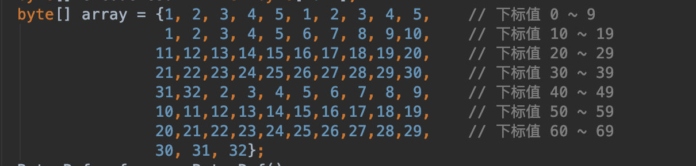
图2：
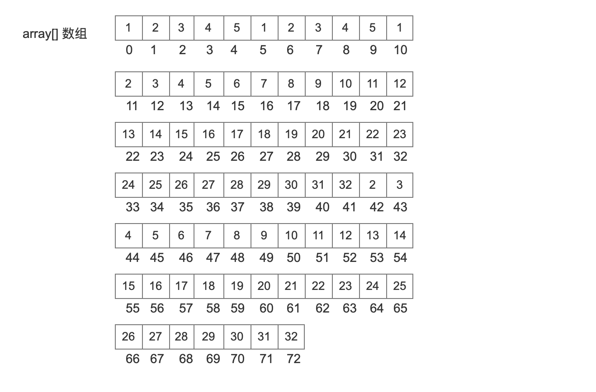
### 找到第一个锚点（anchor）
刚开始处理时，下标值为0的地方为第一个锚点
### 找到第二个锚点（anchor）
第一个锚点的值为0，我们最终目的是获得第二个锚点的值，第二个锚点跟第一个锚点之间的数据进行压缩处理。在这个区间的数据，有两个子区间的数据是一样的，那么需要对这两个子区间进行压缩存储。由于注意的是，两个字区间可能有重叠部分。

#### 处理下标值为0的数组元素
图3：
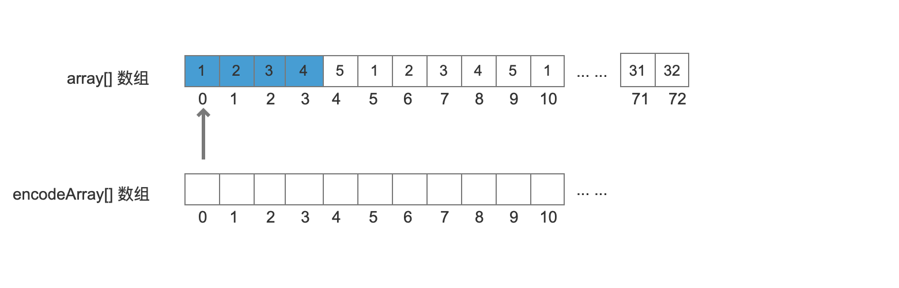
encodeArray[] 数组是经过压缩处理的数组。
取出下标值为0以及后面的三个数组元素，4个字节组成一个int类型的数值，对这个数值进行散列，如果发生冲突，说明可能之前散列过相同的值，由于这里是第一个数据，所以不会发生这种情况。

#### 处理下标值为1的数组元素
图4：
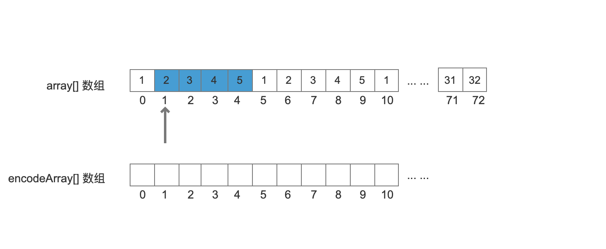
同上一步操作，类似滑动窗口的操作，窗口大小为4个字节，每一次右移一个字节，然后我们计算下标值1~下标值4的数组元素组成的int值，同样进行散列。 

#### 处理下标值为2、3、4的数组元素
同样的，还是没有发生hash冲突。
#### 处理下标值为5的数组元素
图5：
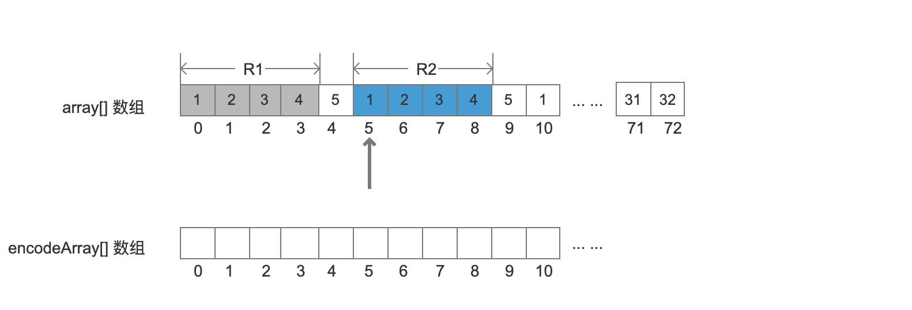
此时发生冲突，由于不同的值可能会有相同的hash值，所以这里还要继续判断下标值0~3的数组元素对应的int值是否跟下标值5~8的数组元素对应的int值是否一样。在这里，的确这两个区间R1、R2的数据是一模一样的，那么需要开始进行压缩存储。

##### 找出相同数据的最大区间
目前我们找到了 数组中下标值0~3跟 5~8两个相同的区间R1、R2，接着扩大这两个区间，直到满足两个区间数据相同，且是最大的区间。
图6：
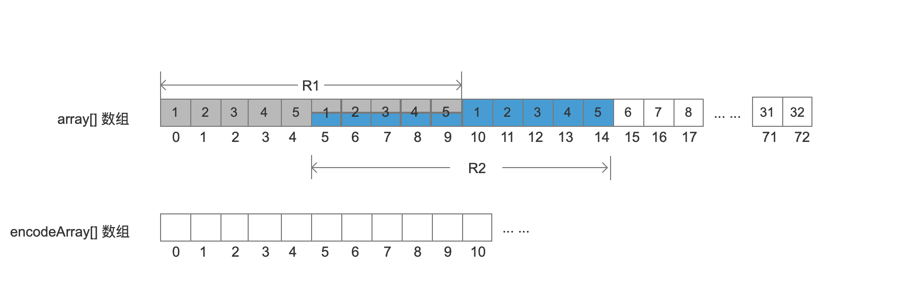
注意的是，这里两个区间有重叠的区域，即下标值5~9的区域。

##### 计算token值
matchOff：
```text
该值是相同数据区间R2的第一个元素的下标值，即5。
```
literalLen：
```text
由于直到matchOff位置才开始有相同的数据区间，所以anchor（当前值0）至matchOff的区间的数据需要原封不动的写入到encodeArray[]数组中，而literalLen代表了这段数据的长度。matchOff与anchor的差值就是literalLen，即 literalLen = matchOff- anchor，当前锚点anchor的值Wie0，所以literalLen的值为5。
```
matchLen：
```text
matchLen描述了两个相同区间R1跟R2相同数据的个数，即 10。
```
token值是literalLen跟matchLen的组合值，利用组合存储
```java
final int token = (Math.min(literalLen, 0x0F) << 4) | Math.min(matchLen - 4, 0x0F);
```
```text
当前的literalLen跟matchLen-4的值没有大于0x0F,所以token = (5 << 4) | (10 - 4), 即 86，二进制就是0b01010110。后面的处理过程中会有literalLen跟matchLen-4的值大于0x0F的情况。
```
matchDec：
```text
matchDec是R2跟R1的两个区间第一个元素所在下标值的差值，即 5 - 0 = 5。这个值在解压的时候会作为遍历的一个条件。由于matchDec是个int类型，并且这个值不会大于（1 << 16）,所以需要两个字节分别存储低8位跟高8位在解压时，根据matchDec跟matchLen的大小，恢复数据的过程略有不同，后面会介绍。
```
##### 写入token值、anchor至matchOff的数据、matchDec
图7：
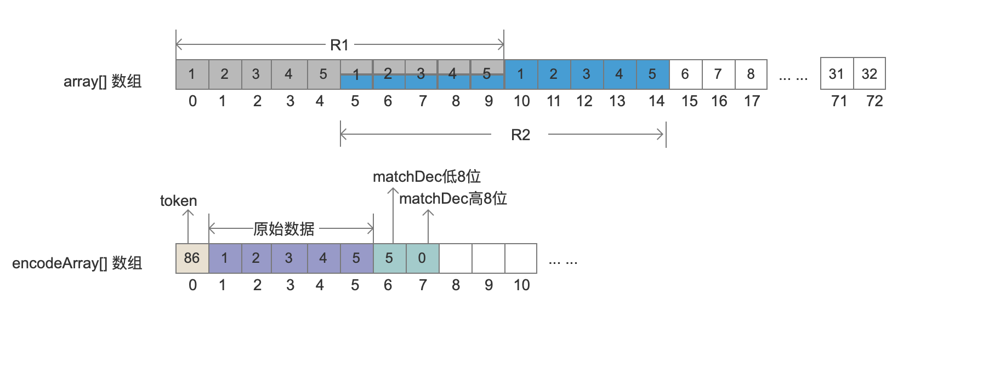
上图中 原始数据即anchor至matchOff之间的数据。
### 找到第三个锚点（anchor）
上面的流程结束后，更新第二个锚点的值为15。按照同样的逻辑找到第三个锚点。
#### 处理下标值为15~41的数组元素
都没有发生hash冲突的情况。
#### 处理下标值为42的数组元素
图8：
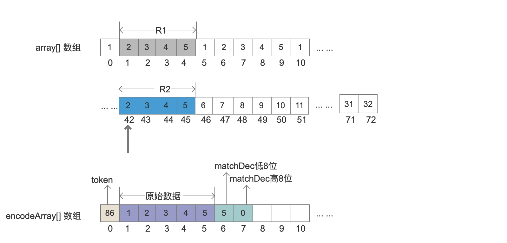
此时发生冲突，由于不同的值可能会有相同的hash值，所以这里还要继续判断下标值1~4的数组元素对应的int值是否跟下标值42~45的数组元素对应的int值是否一样。在这里，的确这两个区间R1、R2的数据是一模一样的，那么需要开始进行压缩存储。
##### 找出相同数据的最大区间
然后下标值5跟下表值46的数组元素就不相同了，所以相同数据的最大区间如下图的R1跟R2
图9：
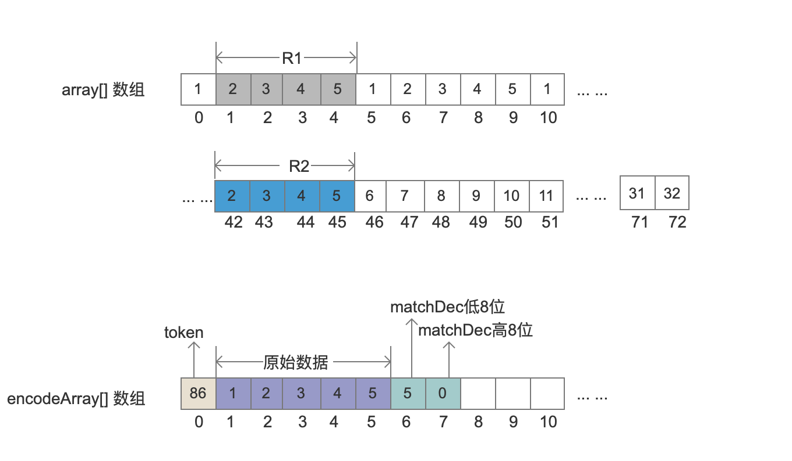
##### 计算token值
matchOff：
```text
该值是相同数据区间R2的第一个元素的下标值，即42。
```
literalLen：
```text
由于直到matchOff位置才开始有相同的数据区间，所以anchor（当前值15）至matchOff的区间的数据需要原封不动的写入到encodeArray[]数组中，而literalLen代表了这段数据的长度。matchOff与anchor的差值就是literalLen，即 literalLen = matchOff- anchor，当前锚点anchor的值为15，所以literalLen的值为27。
```
matchLen：
```text
matchLen描述了两个相同区间R1跟R2相同数据的个数，即 4。
```
token值是literalLen跟matchLen的组合值，利用组合存储
```java
final int token = (Math.min(literalLen, 0x0F) << 4) | Math.min(matchLen - 4, 0x0F);
```
```text
当前的literalLen大于0x0F ,所以token = (15 << 4) | (4 - 4), 即 240，二进制就是0b11110000。
```
matchDec：
```text
matchDec是R2跟R1的两个区间第一个元素所在下标值的差值，即 42 - 1 = 41。这个值在解压的时候会作为遍历的一个条件。由于matchDec是个int类型，并且这个值不会大于（1 << 16）,所以需要两个字节分别存储低8位跟高8位在解压时，根据matchDec跟matchLen的大小，恢复数据的过程略有不同，后面会介绍。
```
##### 写入token值、anchor至matchOff的数据、matchDec
图10：
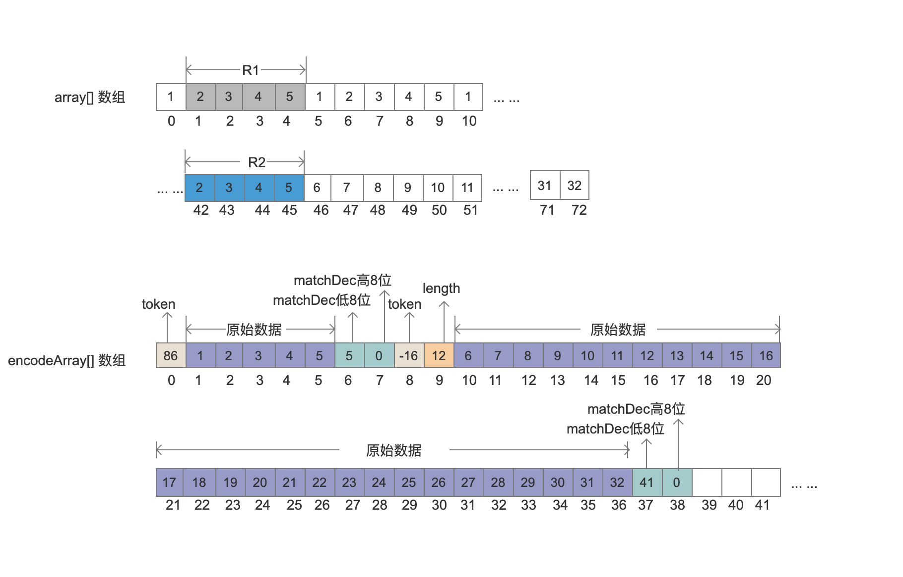
注意encodeArray[]数组中下标值为9的数组元素，由于token值只有高4位用来表示原始数据的长度，即最大值为15，所以literalLen的值超出的部分需要额外的一个字节存储，当前literalLen的值为27，所以额外的值为 27 - 15 = 12。

### 找到第四个锚点（anchor）
上面的流程结束后，更新第三个锚点的值为46。按照同样的逻辑找到第四个锚点
#### 处理下标值为46的数组元素
图11：
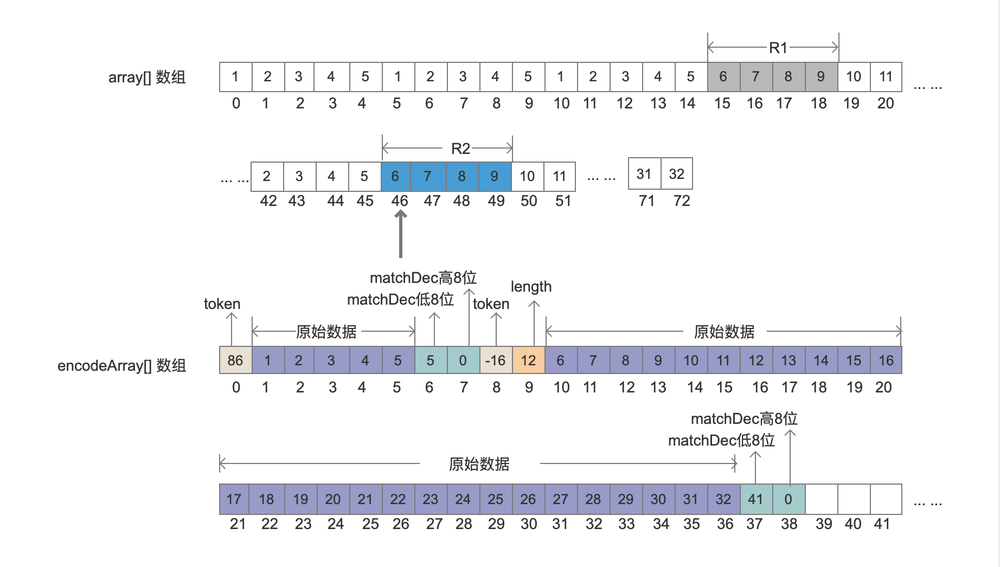
##### 找出相同数据的最大区间
图12：
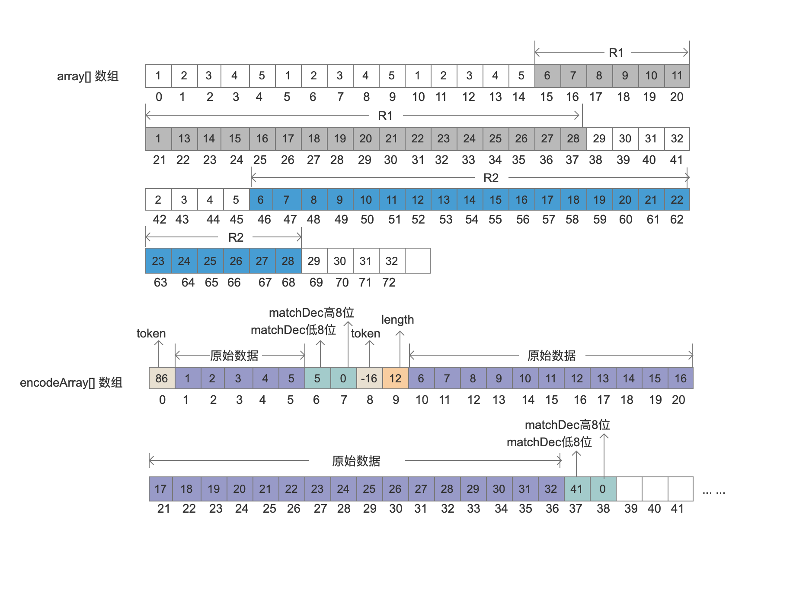
##### 计算token值
matchOff：
```text
该值是相同数据区间R2的第一个元素的下标值，即46。
```
literalLen：
```text
由于直到matchOff位置才开始有相同的数据区间，所以anchor（当前值46）至matchOff的区间的数据需要原封不动的写入到encodeArray[]数组中，而literalLen代表了这段数据的长度。matchOff与anchor的差值就是literalLen，即 literalLen = matchOff- anchor，当前锚点anchor的值为46，所以literalLen的值为0。说明不用写原始数据到encodeArray[]数组中
```
matchLen：
```text
matchLen描述了两个相同区间R1跟R2相同数据的个数，即 22。
```
token值是literalLen跟matchLen的组合值，利用组合存储
```java
final int token = (Math.min(literalLen, 0x0F) << 4) | Math.min(matchLen - 4, 0x0F);
```
```text
当前的matchLen为22，大于0x0F ,所以token = (0 << 4) | 15, 即 15，二进制就是0b00001111。matchLen多出来的部分需要再用一个字节存储。
```
matchDec：
```text
matchDec是R2跟R1的两个区间第一个元素所在下标值的差值，即 46 - 15 = 31。这个值在解压的时候会作为遍历的一个条件。由于matchDec是个int类型，并且这个值不会大于（1 << 16）,所以需要两个字节分别存储低8位跟高8位在解压时，根据matchDec跟matchLen的大小，恢复数据的过程略有不同，后面会介绍。
```
图13：
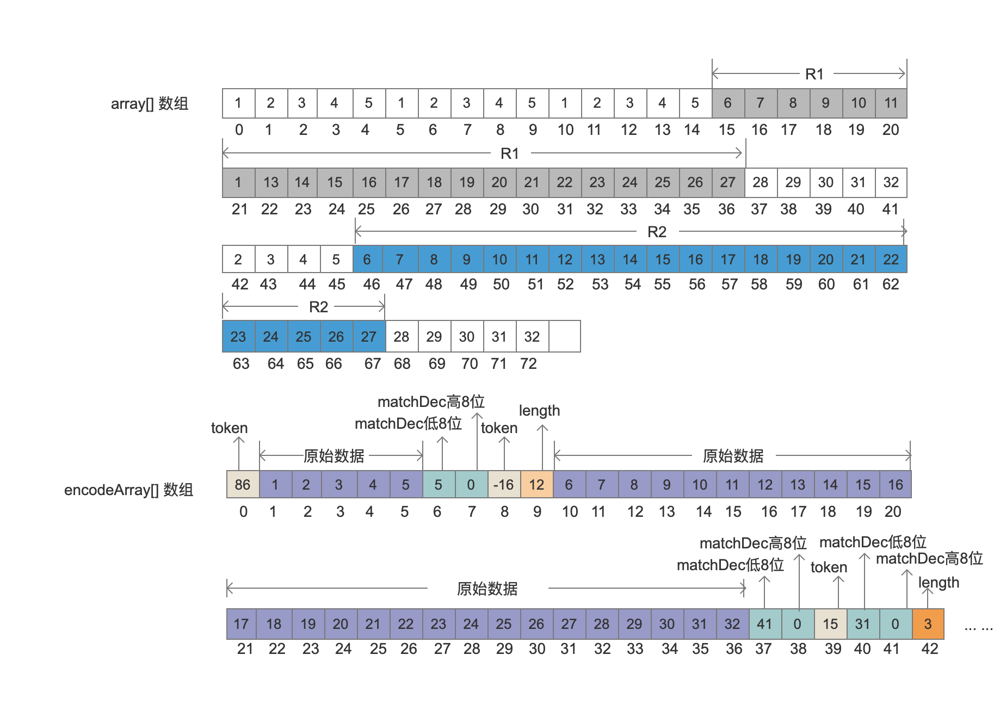
注意encodeArray[]数组中下标值为42的数组元素，由于token值只有低4位用来表示原始数据matchLen的长度，即最大值为15，所以matchLen的值超出的部分需要额外的一个字节存储，当前matchLen的值为22，所以额外的值为 22 - 15 - 4 = 3。
另外literalLen的值为0，说明这个区间内的数据已经存储过了。

### 最后5个字节的处理
最后5个字节在上面的流程中不会被处理，LZ4Fast算法会对最后5个字节单独处理。上面的流程结束后，更新第三个锚点的值为68。同样需要存储token，不过token的值的计算方式为 
```java
final int token = Math.min(literalLen, 0x0F) << 4;
```
##### 计算token值
还有最后5个字节，所以literalLen的值为5，所以token的值为 （5 << 4）= 80。
##### 写入token值、最后5个字节的原始数据
图14：
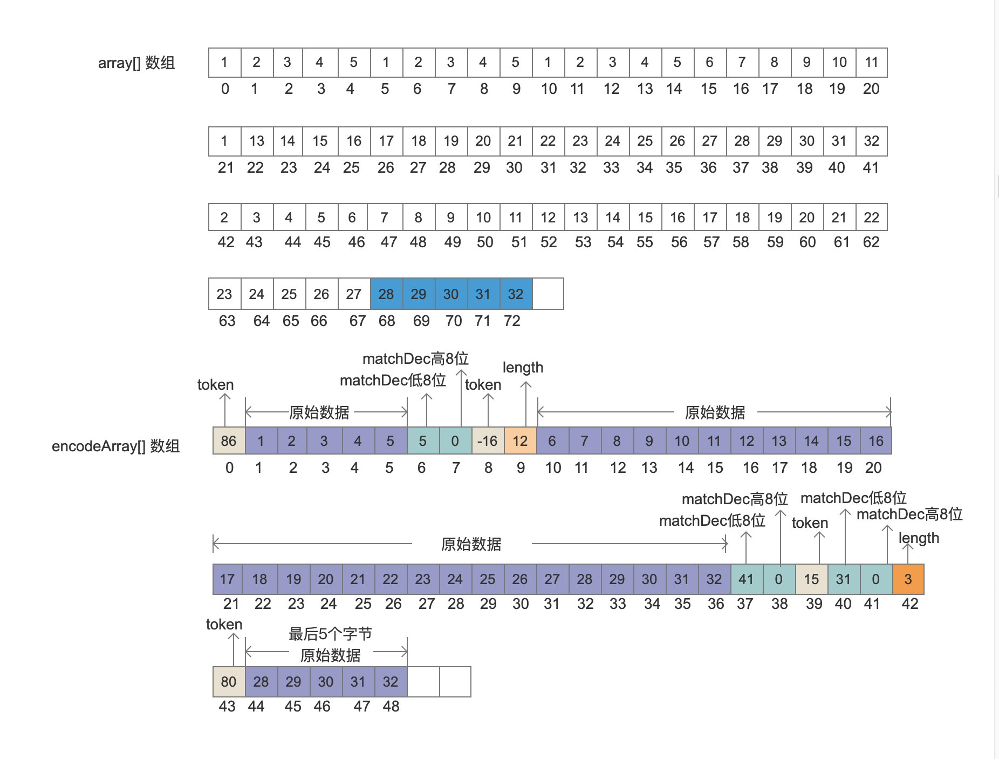
至此，array[]数组压缩成encodeArray[]数组的过程结束。

##  压缩后的数据结构如下：
图15：
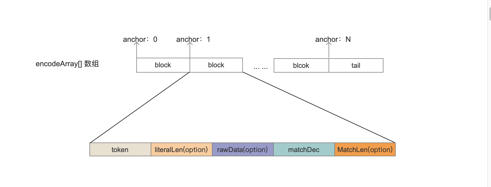

## 结语
本文通过一个例子实现了LZ4Fast的压缩过程，由于篇幅原因上文中如何计算hash的过程并没有给出，并且没有理解源码中提供的hash函数的含义，以及为什么要留最后的5个字节单独处理。在随后的博客中，会介绍解压过程。
