# dim&&dii
从Lucene6.0开始出现点数据（Point Value）的概念，通过将多维度的点数据生成KD-tree结构，来实现快速的单维度的范围查询（比如 IntPoint.newRangeQuery）以及N dimesional shape intersection filtering。
.dim中的数据结构由一系列的block组成，在内存中展现为一颗满二叉树(单维度可能不是，这块内容会在介绍数值类型的范围查询时候介绍)，并且叶子节点描述了所有的点数据。
看这篇文档之前，必须得了解多维度的点数据是如何生成一个满二叉树，否则会不理解一些本文章中的名词概念，而在本文中不会赘述这些名词。在[Bkd-Tree](https://www.amazingkoala.com.cn/Lucene/gongjulei/2019/0422/52.html)中介绍了生成树的过程，请务必先看这篇文章。
索引结构的主要逻辑在下面的Java文件中，关键逻辑都加以了注释：https://github.com/luxugang/Lucene-7.5.0/blob/master/solr-7.5.0/lucene/core/src/java/org/apache/lucene/util/bkd/BKDWriter.java。

# 预备知识
好像不看也不会对下文的理解有什么影响~
## 数值类型的存储
数值类型会通过转化为固定数量的字节。例如对int类型的数据会使用NumericUtils.intToSortableBytes(...)方法进行转化，转化过程不赘述。
## 叶子节点中的点数据是有序的
目的在于能进一步减少存储点数据占用的空间。

# dim文件的数据结构
图1：
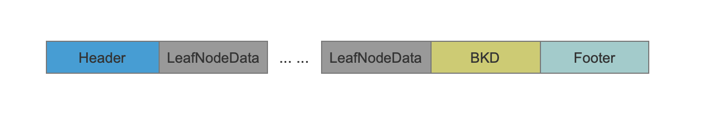
上图中是单个域的.dim文件数据结构，下图为存在多个域的数据结构图
图2：
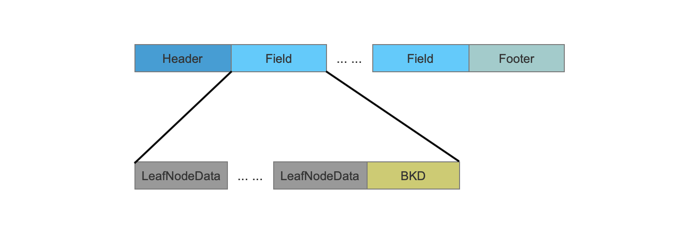

## LeafNodeData

当所有的点数据生成一颗满二叉树后，点数据会被分布到不同的叶子节点上，而LeafNodeData正是描述了一个叶子节点上的点数据的相关信息。
图3：
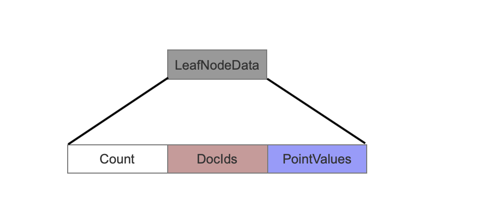

### Count
当前叶子节点中有多少个点数据。
### DocIds
当前叶子节点中的点数据所属文档（document）的文档号。
根据文档号的大小以及在叶子节点中的排序，其数据结构也各有不同，其最终目的还是尽可能的减少空间存储。

#### 文档号有序
叶子节点中的点数据是按照某个维度排序的，如果排序后的点数据对应的文档号正好也是有序的，那么会使用下面的数据结构。
图4：
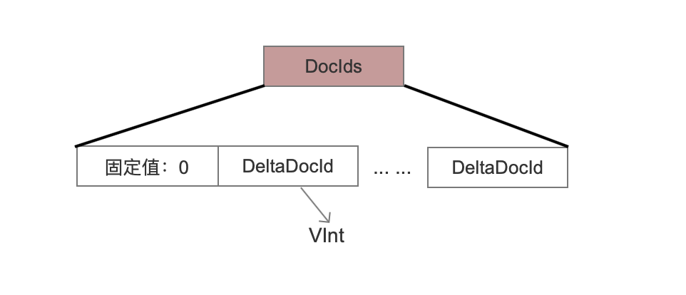

##### 固定值：0
这是一个标志位，在读取阶段可以知道当前叶子节点中的点数据对应的文档号是有序的。
##### DeltaDocId
由于文档号是有序的，所以实际存储是当前文档号都是与前一个文档号的差值，并且使用VInt存储，使得最好情况下只要1个字节就可以存储一个文档号。
#### 文档号无序
在文档号无序的前提下，先计算出最大的文档号$DocId~max$可以最少用多少个字节表示。如果$DocId~max$ ≤ 0xffffff，那么使用3个字节存储每一个文档号（图5），否则使用4个字节存储（图6）。
图5：
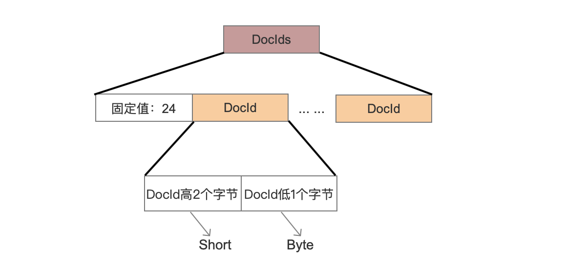

##### 固定值：24
这是一个标志位，在读取阶段可以知道当前叶子节点中的点数据对应的文档号是无序的，并且每一个文档号占用固定3个字节。
##### DocId高2个字节、DocId低1个字节
由于使用固定3个字节存储一个文档号，所以高2个字节用short类型存储，低1个字节用byte字节存储。
图6：
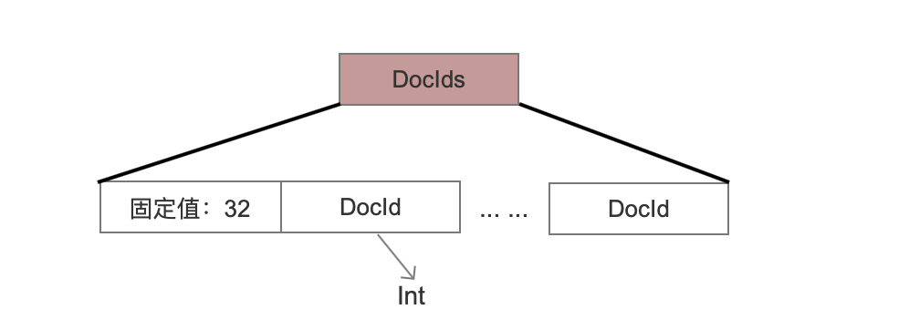

##### 固定值：32
这是一个标志位，在读取阶段可以知道当前叶子节点中的点数据对应的文档号是无序的，并且每一个文档号占用4个字节。
##### DocId
注意这里与图4中的DocId的区别，图6中使用的是int类型存储，而图4中使用的是VInt。
### PointValues
当前叶子节点中的点数据。
图7：
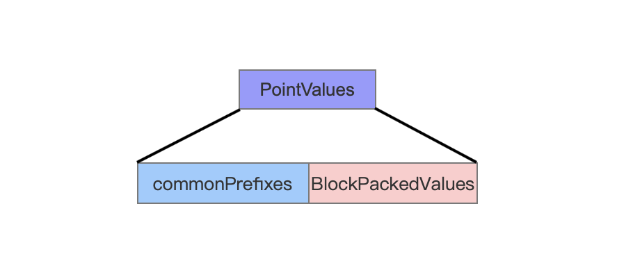
#### commonPrefixes
图8：
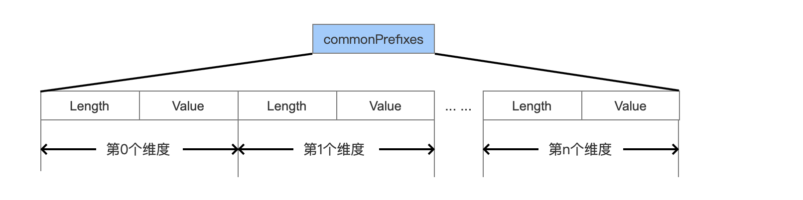
##### Length
计算出所有点数据的某个维度值的相同前缀的长度。
##### Value
前缀值。
#### BlockPackedValues
BlockPackedValues中存储了叶子节点中每个点数据的每个维度的值。
如果叶子节点中的点数据都是一样的，那么数据结构如下
图9：
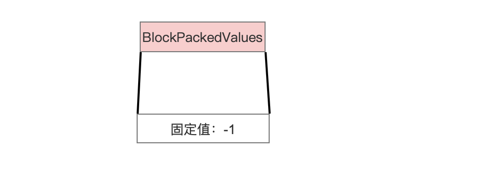

##### 固定值 -1 
这是一个标志位，在读取阶段可以知道当前叶子节点中的点数据都是一样的， 并且点数据的值可以根据commonPrefixes的数据获得。

图10：
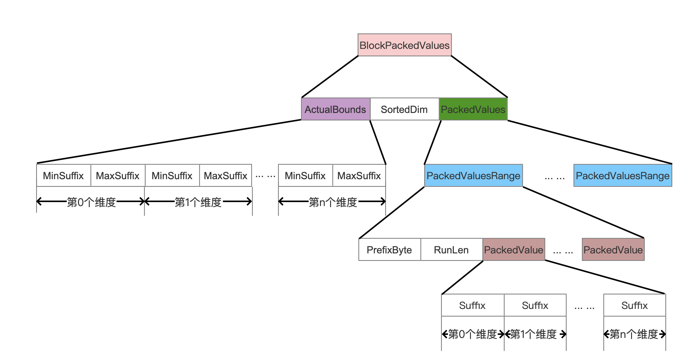

##### ActualBounds
图11：
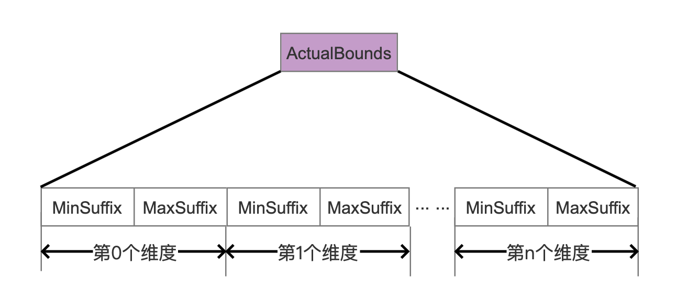
ActualBounds保存了当前叶子节点中每一种维度的最大值跟最小值，并且只保存后缀值，在读取阶段通过跟commonPrefixes就可以拼出原始值。
##### SortedDim
叶子节点中的点数据是有序，选取其中一个维度作为排序规则，这个维度就是SortedDim。

##### PackedValues
图12：
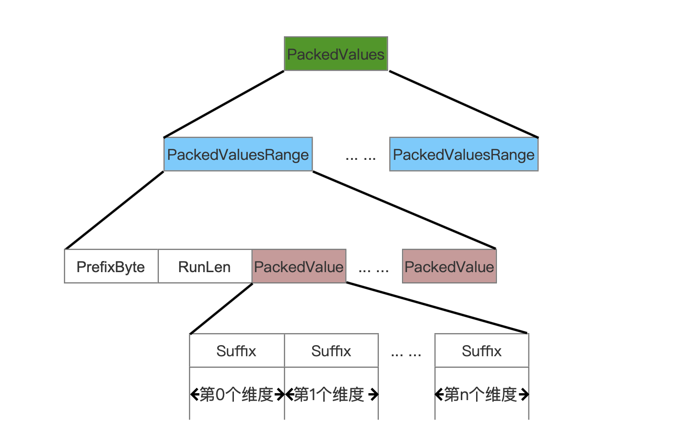
由于叶子节点中的是按照点数据的SortedDim维度排序的，源码中采取了一种方式，目的是为了能尽可能的减少空间存储。这种方式就是：遍历SortedDim维度的值，比如当前遍历到第n个维度值，然后跟第n + 1个维度值比较**一个字节**，判断这两个字节是否相同，如果是相同的，那么这两个维度值是属于同一个**PackedValuesRange**(图12)的，**而这个字节就是SortedDim维度的所有维度值的相同前缀的下一个字节，并且这个字节就是图12中的PrefixByte。**

###### PackedValuesRange、PrefixByte、RunLen、PackedValue
同一个PackedValuesRange中的点数据，它们不但拥有commonPrefixes中的SortedDim维度的长度为Length的相同前缀Value，而且还拥有一个额外的字节PrefixByte也是相同的，并且这个PrefixByte是SortedDim维度的所有维度值的相同前缀的下一个字节。
图13：
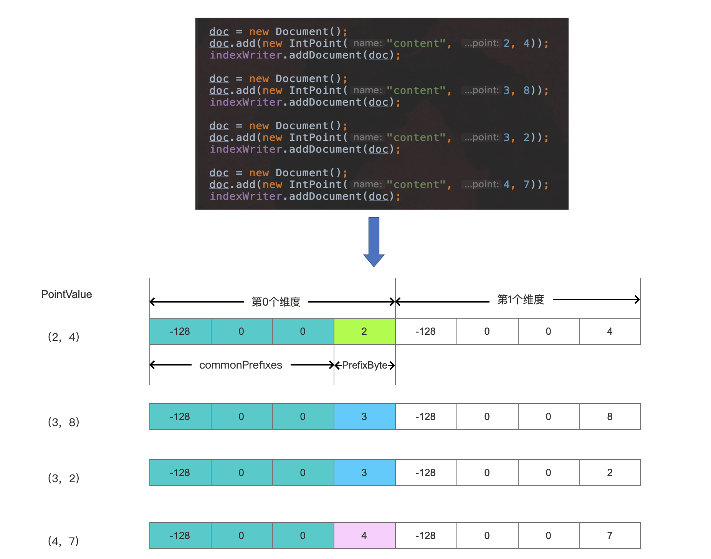
在图13中，假设一个叶子节点只有4个点数据，并且维度0为SortedDim，那么4个点数据按照SortedDim进行排序，并且生成3个PackedValuesRange：

- 点数据(2,4)为第一个PackedValuesRange
- 点数据(3，8)和点数据(3，2)为第二个PackedValuesRange
- 点数据(4，7)为第三个PackedValuesRange。

RunLen的值描述了PackedValuesRange中的点数据个数，对于第二个PackedValuesRange，RunLen的值为2，同时PrefixByte的值为3。

PackedValue即存储了某个PackedValuesRange中的所有点数据的所有维度值，当然维度值只存储后缀值。

## BDK

图14：
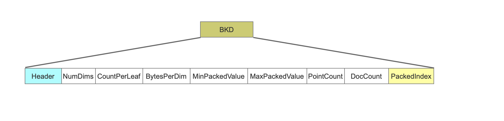
### NumDims
点数据的维度个数。
### CountPerLeaf
每个叶子节点中的点数据数量。
### BytesPerDim
数值类型转化为字节的数量。
### NumLeaves
满二叉树中的叶子节点的数量。
### MinPackedValue
MinPackedValue中的每个维度的值都是所在维度的最小值。
### MaxPackedValue
MinPackedValue中的每个维度的值都是所在维度的最大值。
### PointCount
当前域中的点数据的数量。
### DocCount
包含当前域中的点数据域的文档数量。
一篇文档中可以包含多个相同域名的点数据域，但是DocCount的计数为1。

### PackedIndex
PackedIndex存放了非叶节点的信息。
图15：

#### Length
用来描述PackedIndexValue的长度，在读取阶段用来确定从.dim文件读取的数据区间。
#### PackedIndexValue
PackedIndexValue中保存了所有非叶节点的信息。
非叶节点的信息根据它的子树是否为叶子节点有着不同的数据结构，为了方便介绍，子树为叶子节点的非叶节点的信息称为 HasLeafChild，子树不是叶子节点的非叶节点的信息称为HasNotLeafChild。PackedIndexValue的数据结构如下：
图16：
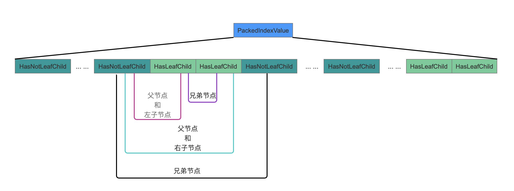
上图中对这颗满二叉树进行前序遍历，将所有的非叶节点顺序的写入到PackedIndexValue中。

##### HasNotLeafChild
HasNotLeafChild节点的子树为非叶节点，数据结构如下：
图17：
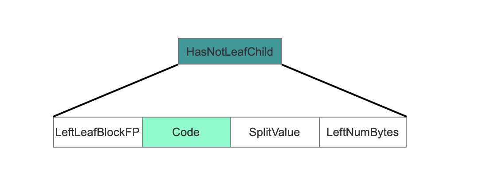

###### LeftLeafBlockFP
当前非叶节点的**最左**叶子节点的信息在.dim文件中的偏移值。
###### Code
Code值是一个int类型的值，它由多个值的组成，公式如下：
```java
int code = (firstDiffByteDelta * (1+bytesPerDim) + prefix) * numDims + splitDim
```
- prefix：当前非叶节点的划分值与上一个非叶节点的划分值相同前缀的字节数
- splitDim：非叶节点的划分维度
- firstDiffByteDelta：当前非叶节点的划分值与上一个非叶节点的划分值第一个不相同的字节位置偏移
- bytesPerDim：表示一个维度值需要的字节数
- numDims：点数据中的维度数量

###### SplitValue
当前非叶节点划分值，前缀存储。
###### LeftNumBytes
当前非叶节点的左右子树的信息占用的字节数。
##### HasLeafChild
图18：
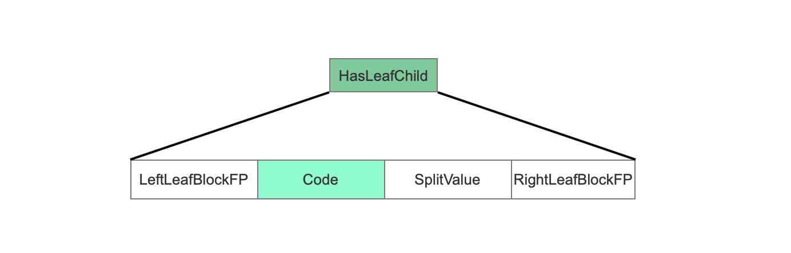

###### LeftLeafBlockFP
同HasNotLeafChild。
###### Code
同HasNotLeafChild。
###### SplitValue
同HasNotLeafChild。
###### RightLeafBlockFP
当前非叶节点右子树是一个叶子节点，RightLeafBlockFP描述了叶子节点的信息在.dim文件中的偏移值。
# dim文件总数据结构
下面的数据结构不是唯一的.dim文件结构，我们选取了其中一种
图19：
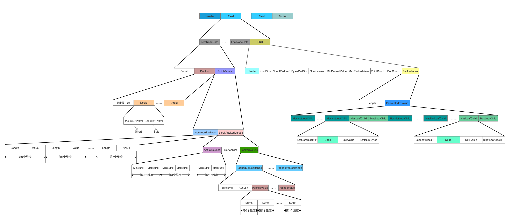
图片太大，建议[下载](123)后看。
# dii文件的数据结构
图20：
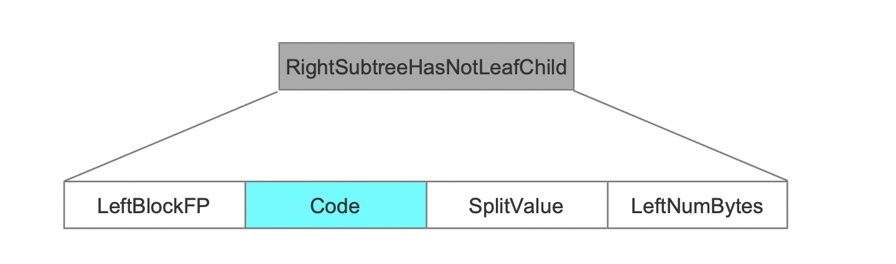
## Count
这次的IndexWriter写入的点数据域的种类数量。
## FieldNumber
域的编号。
## IndexFP
当前域的非叶节点的信息在.dim文件中的偏移位置。

# 结语
dim&&dii文件的数据结构是所有索引文件中最复杂的，但是其源码是很容易理解的，相比较[tim&&tip索引文件](https://www.amazingkoala.com.cn/Lucene/suoyinwenjian/2019/0401/43.html)，tim&&tip的数据结构不复杂，但是阅读其生成过程很痛苦。至此常见的索引文件都介绍结束了，段文件segments、.si等索引文件不是那么有意思~，可能会在以后继续介绍吧。
在后面的文章中，会继续介绍 单维度的点数据 相关的内容，其生成的索引文件跟本篇文章是一样，只是还有一些较细节但很重要的内容，我觉得还是得开一篇新的文章来介绍，毕竟最常用的数值类型的范围查找就是基于单维度的点数据 的索引文件的。

[点击下载](http://www.amazingkoala.com.cn/attachment/Lucene/索引文件/dim&&dii.zip)Markdown文件