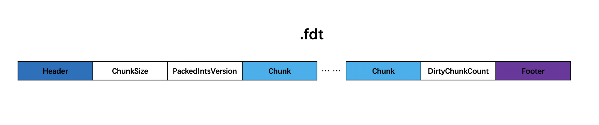
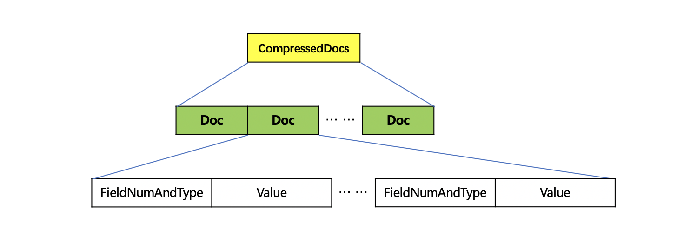
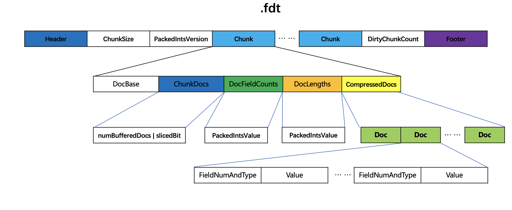
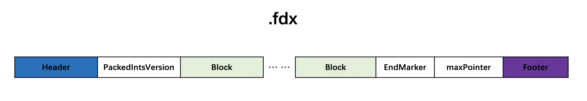
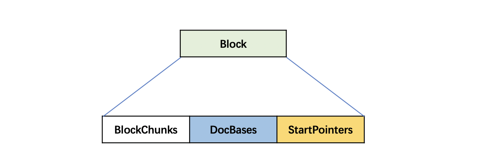
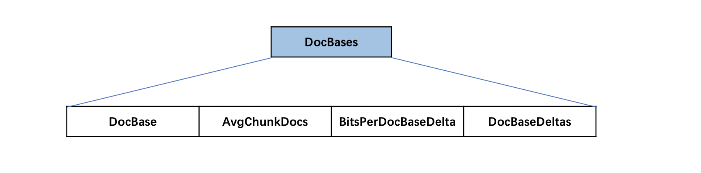
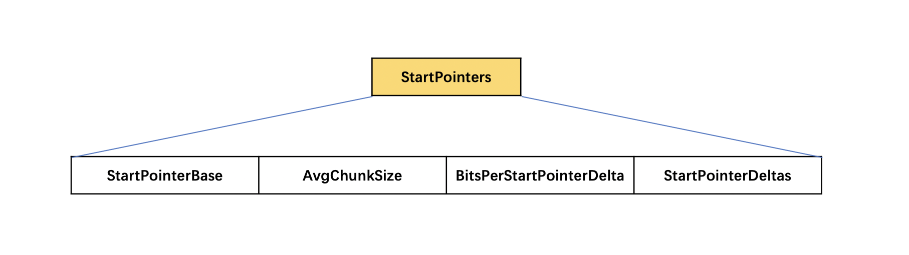
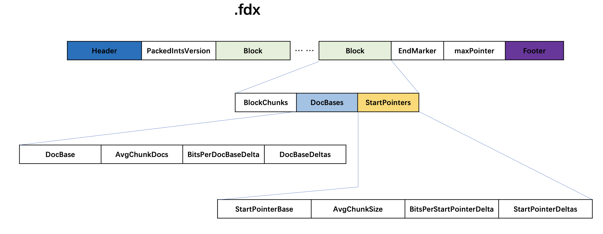

# [fdx&&fdt](https://www.amazingkoala.com.cn/Lucene/suoyinwenjian/)
当STORE.YES的域生成了[倒排表](https://www.amazingkoala.com.cn/Lucene/Index/2019/0222/36.html)以后，将文档的域值信息写入到.fdt（field data）、.fdx（field index）文件中。
# 数据结构
## .fdt
图1：

### ChunkSize
ChunkSize用来描述压缩存储域值信息的方式，后面会详细介绍。
### PackedIntsVersion
PackedIntsVersion描述了压缩使用的方式，当前版本中是VERSION_MONOTONIC_WITHOUT_ZIGZAG。

### Chunk
图2：

生成一个chunk的条件是 文档个数达到128 或者 所有文档的域值信息的总长度 达到ChunkSize。
#### DocBase
当前chunk中第一个文档的文档号，因为根据这个文档号来差值存储，在读取的阶段需要根据该值恢复其他文档号。
#### ChunkDocs
图3：

ChunkDocs是一个numBufferedDocs跟slicedBit的组合值。ChunkDocs = (numBufferedDocs |slicedBit )。
##### numBufferedDocs
numBufferedDocs描述了当前chunk中的文档数量。numBufferedDocs是一个 ≤ 128的值。
##### slicedBit
如果待处理的域值信息的长度超过2倍的chunkSize（默认值 16384），那么需要分块压缩，下文会具体介绍。
#### DocFieldCounts
根据chunk中包含的文档个数numBufferedDocs、每篇文档包含的存储域的个数numStoredFields分为不同的情况。
##### numBufferedDocs的个数为1
图4：

##### numBufferedDocs的个数＞ 1 并且每篇文档中的numStoredFields都是相同的
图5：

只要存储一个numStoredFields的值就行啦。

##### numBufferedDocs的个数＞ 1 并且每篇文档中的numStoredFields不都相同的
图6：

使用PackedInt来存储所有的numStoredFields，这里不赘述了，[点击这里](https://www.amazingkoala.com.cn/Lucene/yasuocunchu/2019/0213/31.html)可以看其中的一种压缩方式。
#### DocLengths
同DocFieldCounts类似，据chunk中包含的文档个数numBufferedDocs、每篇文档中域值信息的长度分为不同的情况。
##### numBufferedDocs的个数为1
图7：

##### numBufferedDocs的个数＞ 1 并且每篇文档中的域值信息长度都是相同的
图8：

##### numBufferedDocs的个数＞ 1 并且每篇文档中的域值信息长度不都是相同的
图9：

使用PackedInt来存储所有的域值信息长度，这里不赘述了，[点击这里](https://www.amazingkoala.com.cn/Lucene/yasuocunchu/2019/0213/31.html)可以看其中的一种压缩方式。
#### CompressedDocs
图10：

CompressedDocs中使用[LZ4](https://www.amazingkoala.com.cn/Lucene/yasuocunchu/2019/0226/37.html)算法将域值信息压缩存储。域值信息包含如下内容：
- Doc的个数为chunk中包含的文档个数
- 域的编号
- 域值的类型：String、BinaryValue、Int、Float、Long、Double
- 域值的编号跟域值的类型组合存储为FieldNumAndType
- Value：域值
### DirtyChunkCount
chunk的个数。
## .fdt整体数据结构
图11：

上图中是其中一种 .fdt文件数据结构。
图12：

### Block
图13：

在.fdt中，每当chunk的个数达到1024(blockSzie)，在.fdx文件中就会生成一个block，block中的信息作为索引来映射.fdt中的数据区间。
#### BlockChunks
block中包含的chunk的个数，即1024个。
#### DocBases
图14：

DocBases中描述了文档号的信息。
##### DocBase
block中第一个文档的文档号。用来在读取阶段，恢复所有chunk中其他被编码的文档号。
##### AvgChunkDocs
AvgChunkDocs描述了block中平均一个chunk中包含的文档数。
##### BitsPerDocBaseDelta
BitsPerDocBaseDelta描述了存储文档号的需要固定bit个数。
##### DocBaseDeltas
一个block中用docBaseDeltas[]数组来存放每个chunk中的文档个数，而每一个chunk中的文档个数是不一样的，出于最大化优化空间存储，不直接对文档数量值进行存储，而是存储差值docDelta。又因为docBaseDeltas[]数组又不能保证数组元素递增，所以不能使用相邻数组元素的差值来作为docDelta，Lucene提供的方法就是计算docBaseDeltas[]中数组元素平均值avgChunkDocs，对每一个数组元素存储一个docDelta的值，docDelta的计算公式为：docDelta = ( docBase - avgChunkDocs * i), 其中i为数组的下标值，docBase是下标值为i的数组元素前所有的数组元素之和，然后对所有docDelta使用PackedInts进行压缩编码，即DocBaseDeltas。
#### StartPointers
图15：

StartPointers中描述了.fdt文件中每一个chunk的索引映射信息。
##### StartPointerBase
当前block中第一个chunk的索引值。
##### AvgChunkSize
block中平均每一个chunk的大小。
##### BitsPerStartPointerDelta
存储每一个chunk大小需要固定bit个数。
##### StartPointerDeltas
逻辑跟DocBaseDeltas一样，不赘述。

## .fdx整体数据结构
图16：

# 结语
没啥要讲的。

[点击下载](http://www.amazingkoala.com.cn/attachment/Lucene/%E7%B4%A2%E5%BC%95%E6%96%87%E4%BB%B6/fdx&&fdt.zip)Markdown文件