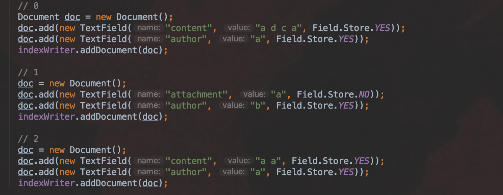
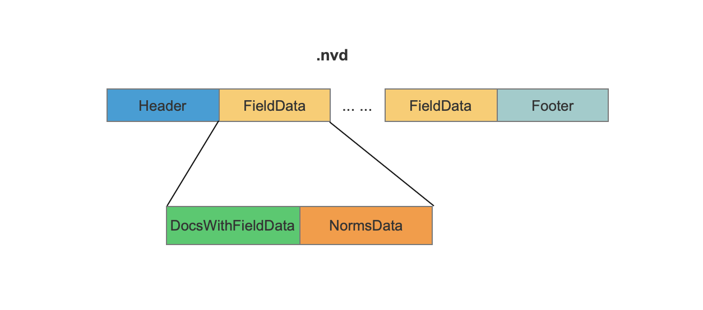
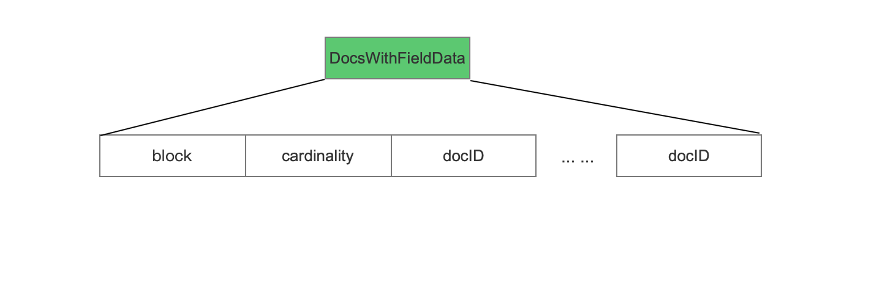
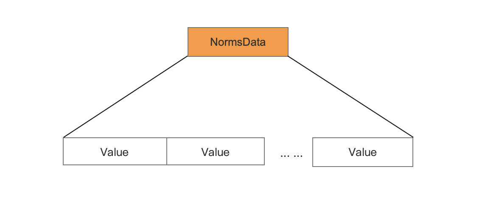
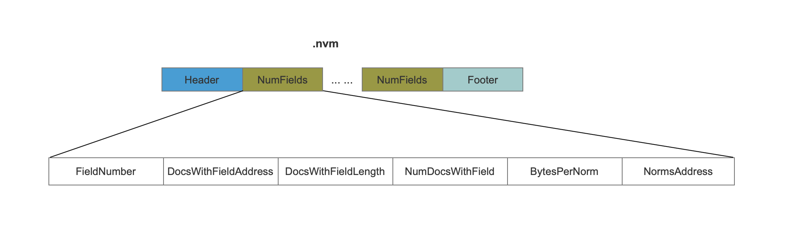
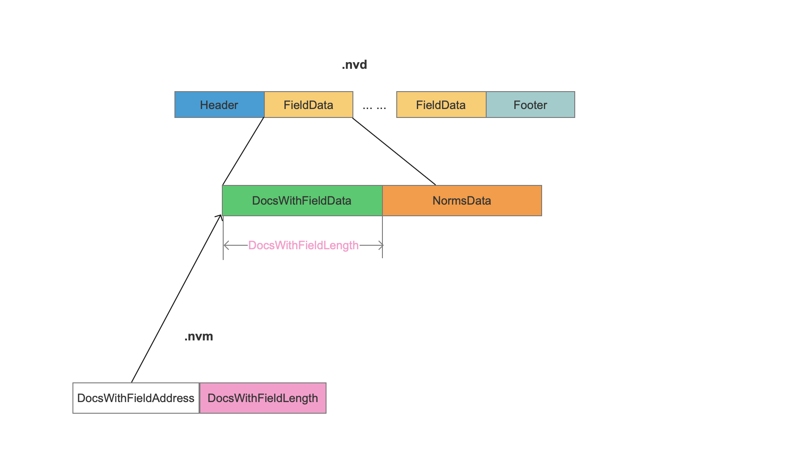
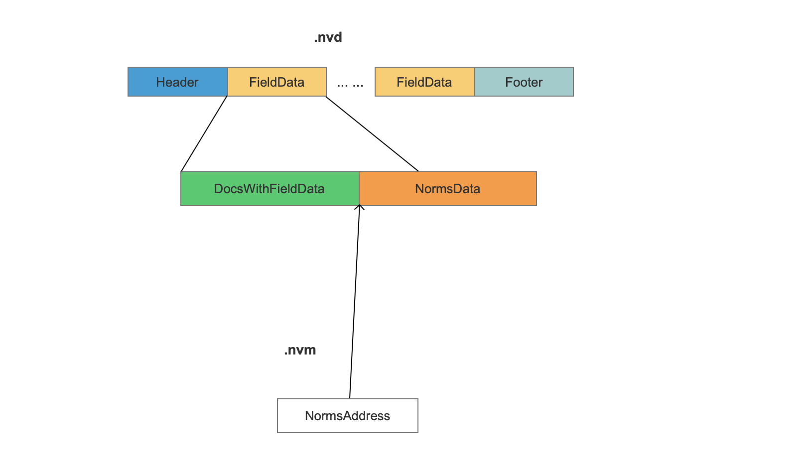
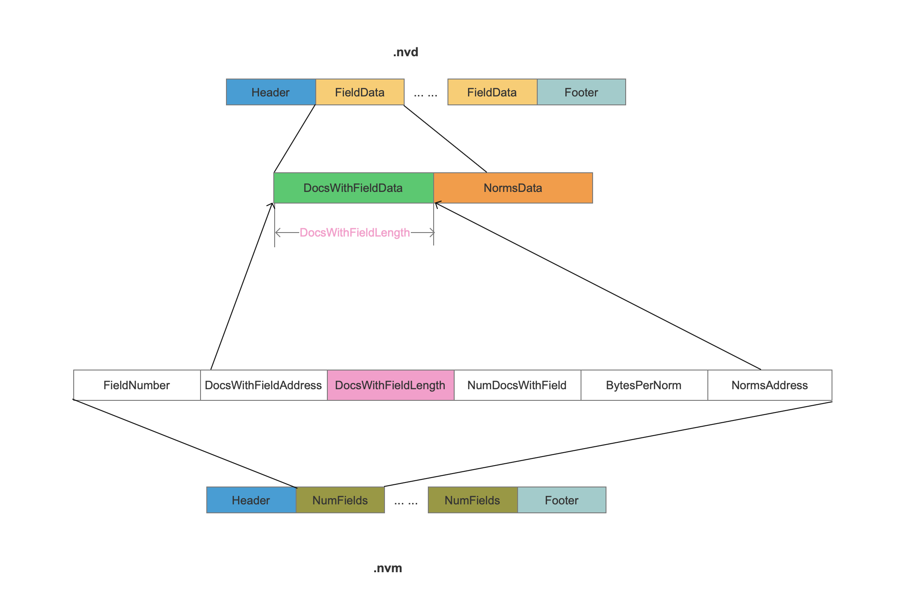

## nvd&&nvm
nvd&&nvm用来存储域的标准化值(normalization values)，这两个索引文件记录了每一篇文档中每一种域的标准化值跟索引信息。在Lucene 7.5.0中，标准化值的计算实际就是统计一篇文档中某个域的域值，这个域值经过分词器处理后生成的term的个数，最后将term的个数通过intToByte4()的方法编码为一个 byte类型的值。标准化的过程在本篇文章中不作介绍，可以查看看BM25Similarity中的computeNorm()方法。我们可以自定义自己的Similarity来实现定制化的计算域的标准化值的逻辑。

我们通过下面的例子来介绍nvd&&nvm文件的数据结构
图1：

## 数据结构
### nvd
图2：


#### FieldData
```text
nvd文件在索引阶段按照添加域的顺序地分块地存储每一种域的信息，FieldData描述了一种域的所有信息，在例子中，共有三个FieldData块，分别描述了“content”、“author”、“attachment”三种域的信息。
```
#### DocsWithFieldData
DocsWithFieldData的数据结构根据包含当前域的文档个数numDocsWithValue分为三种情况
##### numDocsWithValue == 0
```text
DocsWithFieldData无数据，通过nvm文件中存放固定值来描述当前情况。
```
##### numDocsWithValue == maxDoc
```text
maxDoc表示当前处理的文档总个数，这种情况说明所有文档都含有当前域，DocsWithFieldData无数据，通过在nvm文件中同样存放固定值来描述当前情况。
在本文的例子中，域”author“属于当前情况。
```
##### numDocsWithValue < maxDoc
```text
这种情况说明并不是所有的文档都包含当前域，所以需要存储所有包含当前域的文档号。
这里使用IndexedDISI类来实现对文档号docID的存储，IndexedDISI类会在随后的博客中介绍，在这里想说明的是，在索引阶段不同的添加document的方式会有不同数据结构的nvd文件产生，导致生成索引跟查询的性能各不相同。在本文的例子中，域"content"、”attachment“的DocsWithFieldData属于当前情况，会用当前的数据结构。
```
图3：

#### NormsData
图4：

##### Value
```text
Value为当前域在每一篇文档中的标准化值。
```
### nvm
图5：

#### FieldNumber
```text
域的编号，用来唯一标识一种域。
```
#### DocsWithFieldAddress && DocsWithFieldLength
```text
如果numDocsWithValue == maxDoc 或者numDocsWithValue == 0，那么DocsWithFieldAddress跟DocsWithFieldLength会被置为固定值。否则这两个值作为索引来映射nvd中的一块数据区域。
```
图6：

#### NumDocsWithField
```text
NumDocsWithField描述了包含当前域的文档个数。
```
#### BytesPerNorm
```text
找出当前域在所有所属文档中的最大跟最小的两个标准化值来判断存储一个标准化值最大需要的字节数，这里还是出于优化索引空间的目的。由于最小值有可能是负数，所以不能仅仅靠最大值来判断存储一个标准化值需要的字节数。比如说最小值min为 -130(需要2个字节)，最大值max为5(需要1个字节)，那么此时需要根据min来决定字节个数。
```
#### NormsAddress
```text
NormsAddress作为索引映射nvd中一块数据区域，这块数据区域即当前域在所有文档中的标准化值。
```
图7：

### nvm&&nvd映射关系图
图8：

### 集合图
```text
放一起 更直观~~
```
图9：
