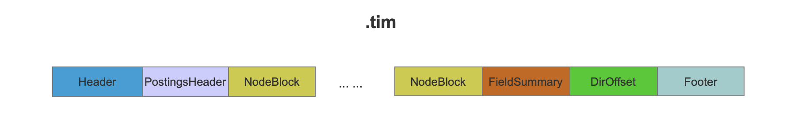
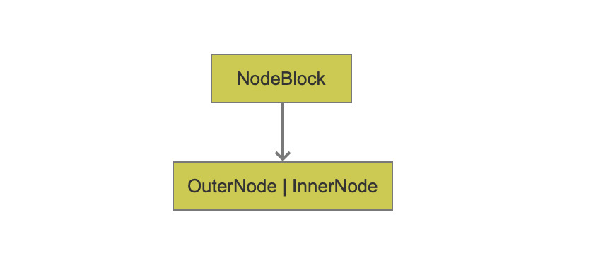
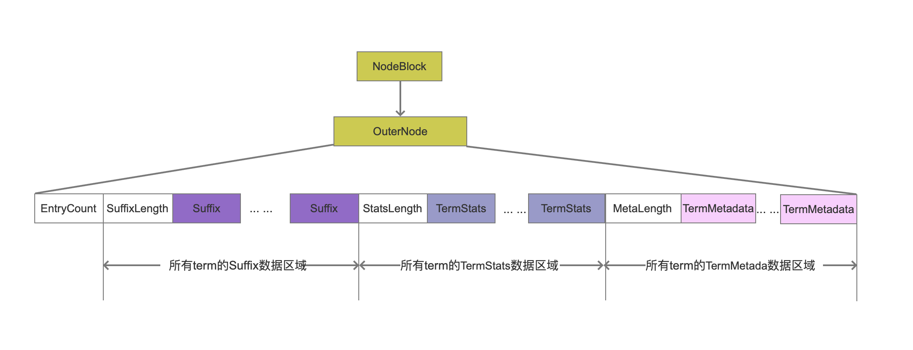
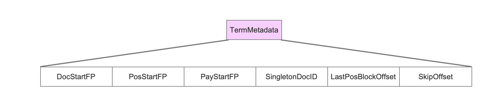
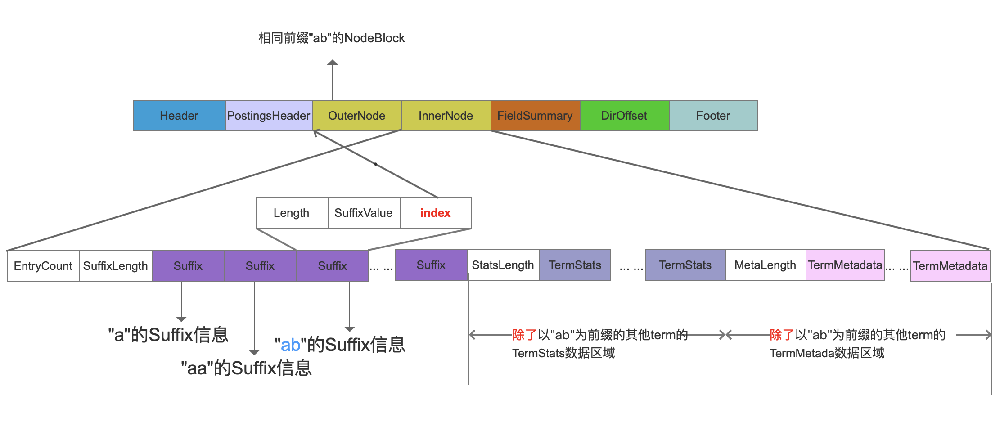
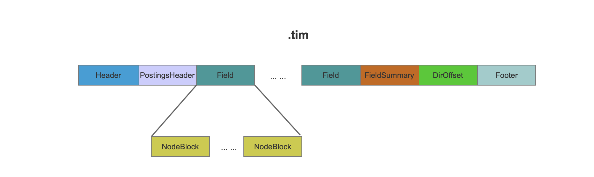
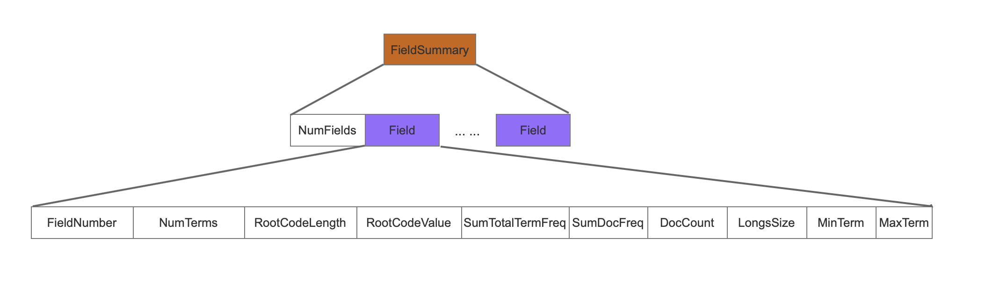
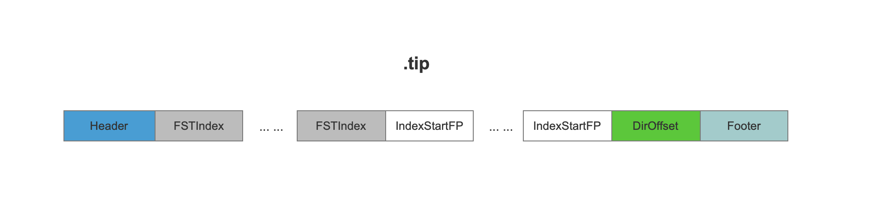

## [tim&&tip文件](https://www.amazingkoala.com.cn/Lucene/suoyinwenjian/)

&emsp;&emsp;.tim（TermDictionary）文件中存放了每一个term的TermStats，TermStats记录了包含该term的文档数量，term在这些文档中的词频总和；另外还存放了term的TermMetadata，TermMetadata记录了该term在.doc、.pos、.pay文件中的信息，这些信息即term在这些文件中的起始位置，即保存了指向这些文档的索引；还存放了term的Suffix，对于有部分相同前缀值的term，只需存放这些term不相同的后缀值，即Suffix。另外还存放了term所在域的信息等其他信息，下文中会详细介绍。

&emsp;&emsp;.tip文件中存放了指向tim文件的索引来实现随机访问tim文件中的信息，并且.tip文件还能用来快速判断某个term是否存在。

&emsp;&emsp;本文直接介绍了索引文件中每个字段的含义，其具体的生成过程见系列文章[索引文件的生成（一）](https://www.amazingkoala.com.cn/Lucene/Index/2019/1226/121.html)。

## tim文件的数据结构

图1：

&emsp;&emsp;在tim文件中NodeBlock中包含了至少25个entries，每一个entries中包含了一个term（或者有相同前缀的term集合）的相关数据，FieldSummary中记录了域的一些信息。

图2：

&emsp;&emsp;NodeBlock有两种类型，如上图所示，第一种是 OuterNode，第二种是 InnerNode。这两种类型的NodeBlock在数据结构上有细微的差别（详情见[索引文件的生成（六）](https://www.amazingkoala.com.cn/Lucene/Index/2020/0115/126.html)），我们先介绍OuterNode的数据，然后再介绍他们之间的差别以及为什么NodeBlock为什么需要两种类型。

图3：

### OuterNode

&emsp;&emsp;OuterNode中包含了所有term的一些信息(后面会详细介绍包含哪些信息)，在Lucene7.5.0版本的源码中，按照term的大小顺序处理，并且用3个RAMOutputStream对象，即suffixWriter、statsWriter、bytesWriter来记录每一个term的Suffix信息、TermStats信息、TermMetadata信息。在所有的term处理结束后，将3个RAMOutputStream对象中的内容合并写入到.tim文件中。

#### EntryCount

&emsp;&emsp;EntryCount描述了当前的OuterNode中包含多个entries，即包含了多少个term的信息。

#### SuffixLength、StatsLength、MetaLength

&emsp;&emsp;这三个值分别描述了所有term的Suffix、TermStats、TermMetadata在.tim文件中的数据长度，在读取.tim时用来确定读取Suffix、TermStats、TermMetadata的范围区间。

#### Suffix

图4：

##### Length

&emsp;&emsp;term的后缀长度。

##### SuffixValue

&emsp;&emsp;term的后缀值，之前提到按照term的大小顺序进行处理的，如果一批term具有相同的前缀并且这批term的个数超过25个，那么这批term会被处理为一个NodeBlock，并且SuffixValue只存储除去相同前缀的后缀部分。

#### TermStats

图5：

##### DocFreq

&emsp;&emsp;DocFreq描述了包含当前term的文档个数。

##### TotalTermFreq

&emsp;&emsp;TotalTermFreq描述了term在文档中出现的总数，实际存储了与DocFreq的差值，目的是尽可能压缩存储，即使用差值存储。

#### TermMetadata

图6：

##### SingletonDocID

&emsp;&emsp;如果只有一篇文档包含当前term，那么SingletonDocID被赋值这篇文档号，如果不止一篇文档包含当前term，那么SingletonDocID不会写入到.tim文件中。

##### LastPosBlockOffset

&emsp;&emsp;如果term的词频大于BLOC_SIZE,即大于128个，那么在.pos文件中就会生成一个block，LastPosBlockOffset记录最后一个block结束位置，通过这个位置就能快速定位到term的剩余的position信息，并且这些position信息的个数肯定是不满128个，可以看Lucene50PostingsWriter.java中finishTerm()的方法。

##### SkipOffset

&emsp;&emsp;SkipOffset用来描述当前term信息在.doc文件中 跳表信息的起始位置。

##### DocStartFP

&emsp;&emsp;DocStartFP是当前term信息在.doc文件中的起始位置。

##### PosStartFP

&emsp;&emsp;PosStartFP是当前term信息在.pos文件中的起始位置。

##### PayStartFP

&emsp;&emsp;payStartFP是当前term信息在.pos文件中的起始位置。

### InnerNode

&emsp;&emsp;介绍InnerNode具体的数据结构之前，我们先给出一个场景，如果我们需要处理的term值为下面的情况：

图7：

&emsp;&emsp;遍历每一个term，将具有相同前缀"ab"的，并且个数超过25个的term先处理为一个OuterNode，接着前缀值"ab"作为一个term与剩余的term处理为一个InnerNode。

图8：

&emsp;&emsp;由于InnerNode中的前缀为"ab"的所有term的Suffix、TermStats、TermMetadata已经存放在.tim文件中，所以在InnerNode只要记录在.tim文件中的偏移位置，即上图中的红色标注的index。所以通过图8与图3就可以看出InnerNode跟OuterNode的数据结构的差异。

### FieldSummary
&emsp;&emsp;介绍FieldSummary之前，先要声明的是在图1中，只是单个域的.tim文件数据结构，下面是多个域的.tim数据结构。

图9：

&emsp;&emsp;下面是FieldSummary的数据结构。

图10：

&emsp;&emsp;图10 中的Field的个数与位置图9中的Field一一对应。

##### NumFields

&emsp;&emsp;NumFields描述了.tim文件中的有多少种域。

##### FieldNumber

&emsp;&emsp;FieldNumber记录了当前域的编号，这个编号是唯一的，同时它是从0开始的递增值。数值越小，说明该域更早的被添加进了索引。

##### NumTerms

&emsp;&emsp;NumTerms记录了当前域中有多少种term。

##### RootCodeLength

&emsp;&emsp;RootCodeLength描述了当前域中的term的FST数据的长度。

##### RootCodeValue

&emsp;&emsp;RootCodeValue描述了当前域中的term的FST数据。

##### SumTotalTermFreq

&emsp;&emsp;sumTotalTermFreq描述了当前域中所有term在文档中的总词频。

##### SumDocFreq

&emsp;&emsp;SumDocFreq描述了包含当前域中的所有term的文档数量。

##### DocCount

&emsp;&emsp;DocCount描述了有多少篇文档包含了当前域。

##### LongsSize

&emsp;&emsp;longsSize的值只能是1，2，3三种，1说明了当前域只存储了doc、frequency，2说明了存储了doc、frequency，positions，3说明存储了doc、frequency，positions、offset。

##### MinTerm

&emsp;&emsp;当前域中的最小的term。

##### MaxTerm

&emsp;&emsp;当前域中的最大的term。

### DirOffset

&emsp;&emsp;DirOffset记录了FieldSummary的信息在.tim文件中的起始位置。

## tip文件的数据结构

图11：

### FSTIndex

&emsp;&emsp;FSTIndex记录了NodeBlock在.tim文件中一些信息，比如说fp为NodeBlock在.tim文件中的起始位置，hasTerms描述NodeBlock中是否包含pendingTerm对象, isFloor表示是否为floor block，然后将这些信息用FST算法存储，在前面的博客中有介绍FST的存储过程。

### IndexStartFP

&emsp;&emsp;IndexStartFP描述了当前的FSTIndex信息在.tip中的起始位置。

### DirOffset

&emsp;&emsp;DirOffset描述了第一个IndexStartFP在.tip中的位置。

## 结语

&emsp;&emsp;tim、tip文件是索引文件中最复杂的实现，加上工作较忙，看了蛮久。如果朋友们想要阅读这部分源码，必须先熟悉[FST算法](http://www.amazingkoala.com.cn/Lucene/yasuocunchu/2019/0220/35.html)，并且源码中BlockTreeTermsWriter.java中pushTerm(BytesRef text)方法在刚开始看时，始终不明白这段代码的意思，尴尬，遇到同样情况的朋友可以简单的理解为它就是为了统计相同前缀的term的个数是否达到25(minItemsInBlock)，另外tip文件的数据结构没有详细介绍，因为这一块跟FST算法紧紧关联，理解了FST算法就自然知道了FSTIndex，而在前面的文章中已经介绍了这个算法，大家可以先去了解下。

[点击下载](http://www.amazingkoala.com.cn/attachment/Lucene/%E7%B4%A2%E5%BC%95%E6%96%87%E4%BB%B6/tim&&tip.zip)Markdown文件
