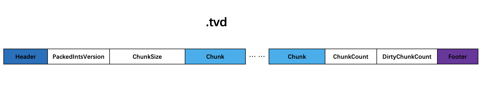
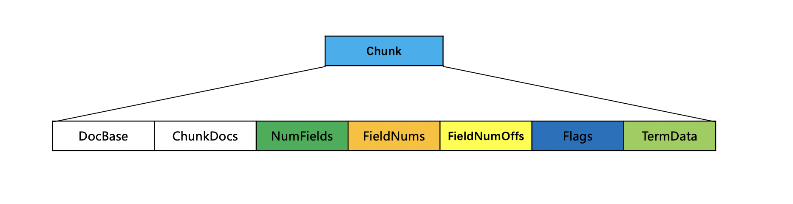
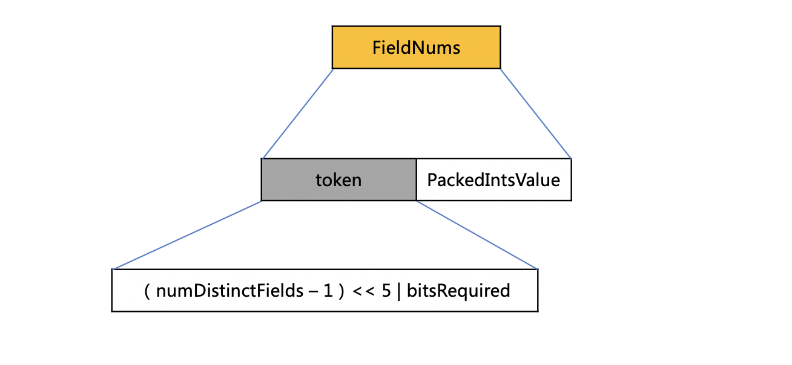
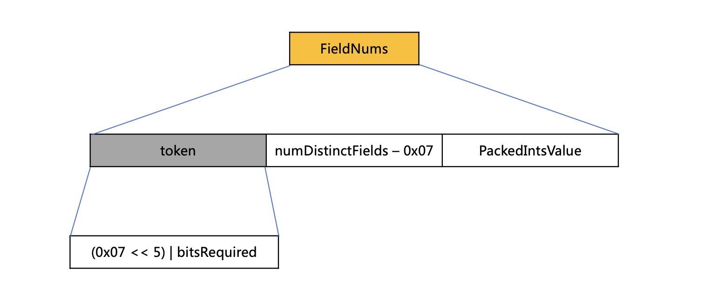
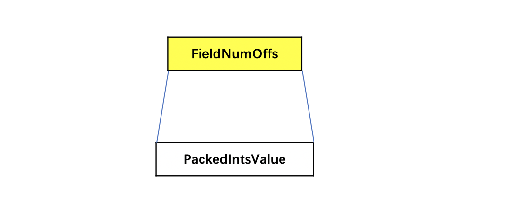
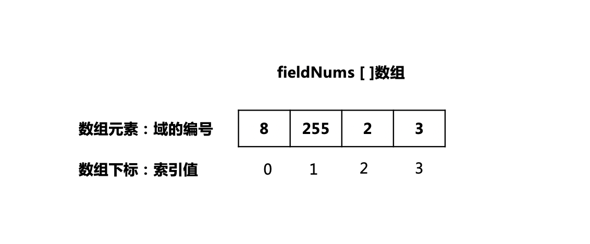
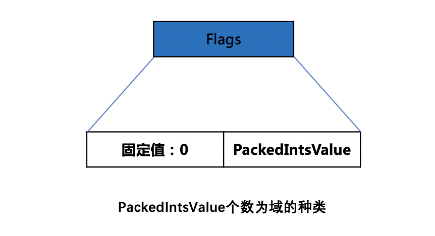
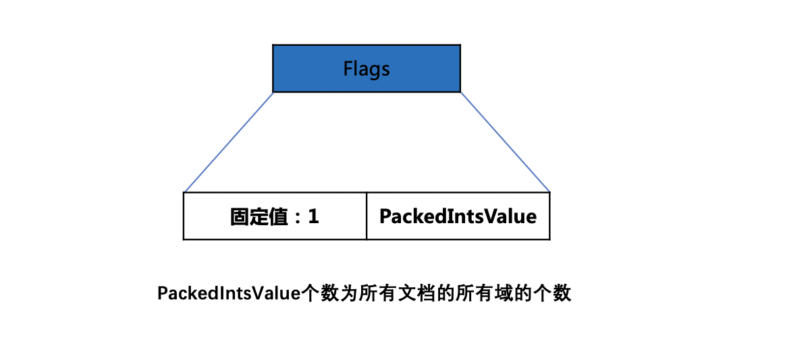
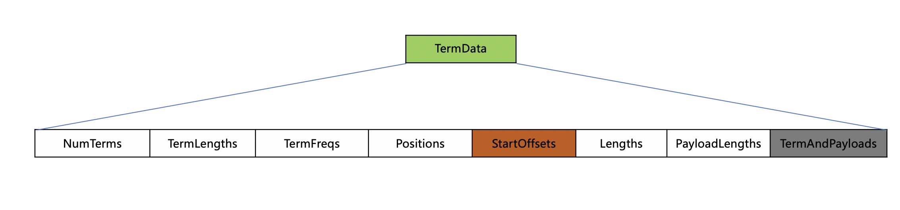
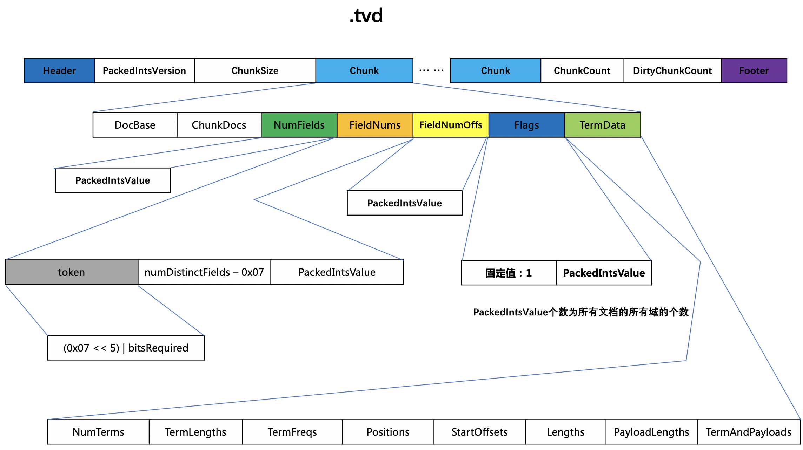

# [tvx&&tvd](https://www.amazingkoala.com.cn/Lucene/suoyinwenjian/)
当设置了TermVector的域生成了[倒排表](https://www.amazingkoala.com.cn/Lucene/Index/2019/0428/55.html)以后，将文档的词向量信息写到.tvx（vector_index）跟.tvd（vector_data）文件中。
# 数据结构
## .tvd
图1：

### PackedIntsVersion
PackedIntsVersion描述了压缩使用的方式，当前版本中是VERSION_MONOTONIC_WITHOUT_ZIGZAG。
### ChunkSize
ChunkSize用来在压缩存储域值信息的方式，后面会详细介绍。
### Chunk
图2：

在文档数达到128篇之前，如果这些文档中的所有存储域的域值长度达到4096，或者文档数达到128篇，那么就使得这些文档的信息生成一个Chunk。
#### DocBase
DocBase是chunk中第一个文档的文档号。
#### ChunkDocs
chunk中包含的文档个数。
#### NumFields
NumFields记录了每篇文档中存储域的个数NumField，根据chunk中的个文档数chunkDocs，分为不同的情况：
##### chunkDocs == 1
图3：

直接记录该片文档的存储域的个数NumField。
##### chunkDocs ≥ 1
图4：

记录chunk中的每一篇文档的存储域的个数，使用PackedInts存储。
#### FieldNums
FieldNums中存储当前chunk中域的种类，根据域的编号来获得 域的种类，根据域的种类个数分为不用的情况：
##### (域的种类 - 1) ≤ 7
图5：

###### token
token是一个组合值，并且大小是一个字节：
- numDistinctFields：当前chunk中的域的种类
- bitsRequired：存储每一个域的编号需要最少bit位个数
- 左移5位描述了bitsRequired最多可以是31
- 由于一个字节的低五位被用来描述bitsRequired，所以还剩余3个字节可以用来表示numDistinctFields，所以numDistinctFields ≤ 7时可以跟bitsRequired使用一个字节存储。
###### PackedIntsValue
把所有的域的编号用PackedInts存储。
#####  (域的种类 - 1) > 7
图6：

###### token
token是一个组合值，并且大小是一个字节：
- bitsRequired：存储每一个域的编号需要最少bit位个数
- numDistinctFields的值大于7，那么在token中就是  (7 << 5 ) | bitsRequired
- numDistinctFields - 0x07：存储剩余的差值
#### FieldNumOffs
图7：

FieldNumOffs中存放了chunk中每一篇文档包含的所有域的编号的索引，并且使用PackedInts存储，该索引其实就是fieldNums[]数组的下标值，fieldNums[]数组的数组元素是chunk中的域的编号，数组元素个数是域的种类。通过这种方式使得不直接存储域的编号，因为域的编号可能跨度很大，并且值很大，那就需要更大的存储空间，而存储下标值就可以解决这个问题。
图8：

上图中有4个域的编号，如果直接存储域的编号，那么需要 3 (8) + 8 (255) + 2 (2) + 2 (3) = 15个bit位，如存储索引即小标志时，那么需要 1 (0) + 1 (1) + 2 (2) + 2 (3) = 6个bit位。
#### Flags
Flags用来描述域是否存放位置position、偏移offset、负载payload信息，flag的值可以是下面3个值的组合：
- 0x01：包含位置position信息
- 0x02：包含偏移offset信息
- 0x04：包含负载payload信息

比如说 flag = 3，二进制即0b00000011，即包含位置跟偏移信息。
根据相同域名在不同的文档中是否有相同的Flag分为不同的情况：

##### 相同的域名有相同的flag
图9：

对于某个域名来说，无论它在哪个文档中都记录相同的flag信息，所以只要每种域名记录一次即可，并且用PackedInts存储，固定值0为标志位，在读取阶段用来区分Flags的不同数据结构。

##### 相同的域名有不相同的flag
图10：

对于一个域名来说，它在不同文档中的flag可能不一样，所以必须记录所有文档中的所有域的flag，并且用PackedInts存储，固定值1ss为标志位，在读取阶段用来区分Flags的不同数据结构。

#### TermData
TermData记录了域值信息，下文中提及的term是指域值通过分词器获得一个或多个token。
图11：

#####  NumTerms
NumTerms描述了每一篇文档的每一个域包含的term个数，使用PackedInts存储。
##### TermLengths
TermLengths描述了每一篇文档的每一个域中的每一个term的长度，使用PackedInts存储。
##### TermFreqs
TermFreqs描述了每一篇文档的每一个域中的每一个term在当前文档中的词频，使用PackedInts存储。
##### Positions
Positions描述了每一篇文档的每一个域中的每一个term在当前文档中的所有位置position信息，使用PackedInts存储。
##### StartOffset
StartOffset描述了每一篇文档的每一个域中的每一个term的startoffset，使用PackedInts存储。
##### Lengths
Lengths描述了每一篇文档的每一个域中的每一个term的偏移长度，使用PackedInts存储。
##### TermAndPayloads
使用[LZ4](https://www.amazingkoala.com.cn/Lucene/yasuocunchu/2019/0226/37.html)算法存储每一篇文档的每一个域中的每一个term值跟payload(如果有的话)。
### ChunkCount
.tvd文件中chunk的个数。
### 
## .tvd整体数据结构
图12：

## .tvx
.tvx跟[.fdx](https://www.amazingkoala.com.cn/Lucene/suoyinwenjian/2019/0301/38.html)的生成代码在源码中是一模一样的，所以不赘述了。

[点击下载](http://www.amazingkoala.com.cn/attachment/Lucene/%E7%B4%A2%E5%BC%95%E6%96%87%E4%BB%B6/tvx&&tvd.zip)Markdown文档

