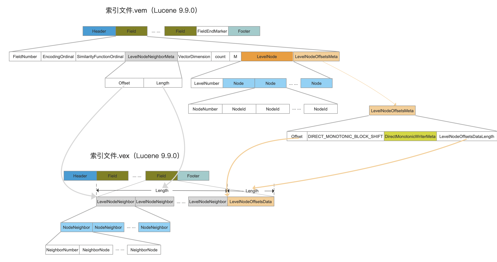
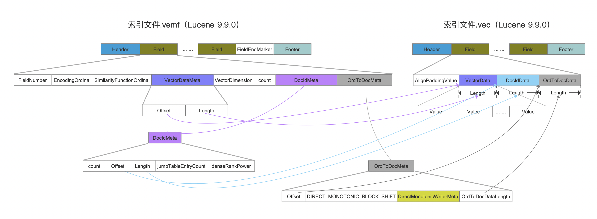
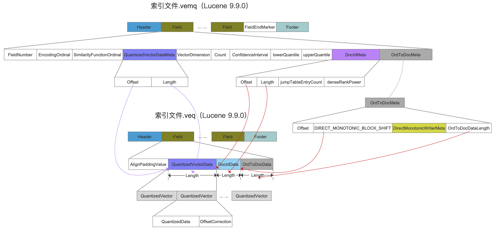

# vec&vem&vemf&vemq&veq&vex（Lucene 9.9.0）

&emsp;&emsp;在文章[索引文件之vec&vem&vex（Lucene 9.8.0）](https://amazingkoala.com.cn/Lucene/suoyinwenjian/2023/1023/索引文件之vec&vem&vex/)中介绍了Lucene 9.8.0版本向量数据相关的索引文件（建议先阅读下），由于在Lucene 9.9.0中引入了Scalar Quantization（简称SQ）技术，因此再次对索引结构进行了改造。另外加上该[issue](https://github.com/apache/lucene/pull/12729)，使得在Lucene 9.9.0中，对于向量数据的索引文件由以下6个文件组成，我们先给出简要的说明：

- .vex、.vem：HNSW信息
- .vec、.vemf：原始的向量数据，即基于SQ量化前的数据，以及文档号、文档号跟节点编号映射关系的数据
- .veq、.vemq：量化后的向量数据，以及文档号、文档号跟节点编号映射关系的数据

&emsp;&emsp;先给出这几个索引文件的数据结构之间的关联图，然后我们一一介绍这些字段的含义：

### .vex&.vem

[点击]()查看大图

### .vec&.vemf

[点击]()查看大图

### veq&.vemq

[点击]()查看大图