##  Vertica如何处理数据流
Vertica提供了一套高性能的机制来实现从第三方的消息总线（messages buses）中读取或者写入数据。Vertica可以读取任意应用写入到消息总线的数据，并且将表数据（table data）、查询结果以及数据收集表（Data Collector tables）写入到消息总线中。Data Collector tables中的数据可以提供第三方监控工具来监控数据库性能、健康等数据。

## 术语（Terminology）
介绍Vertica中跟数据流集成的相关术语，这些术语与其他工具或平台中的含义可能有些不同。
### Source
在本文中，对于Kafka集成来说，一个source指的是一个topic。
### Partition
数据流中的并行单元。在一个source中，数据流被分割到多个partition，每一个partition都可以并行的被Vertica消费。对于一个partition中的数据，数据流按照时间有序（ordered chronologically）。
### Offset
一个partition中的索引（index），这个索引指的是一个有序的数据队列的某个位置。
### Messages
通常是JSON或者Avro格式的数据。
## Data Loader Terminology
### Scheduler 
Vertica提供的一个内部工具，用来将数据流计划性（schedule）的导入到Vertica中。
### Microbatch
一个microbath描述数据流的一段数据（不仅仅是有效数据）。它包含了将一段数据导入到Vertica所需要的全部信息。
### Frame
一个scheduler执行多个microbatch的时间窗口(The window of time)。这个窗口控制了COPY操作的持续时间。
### Lane
一个scheduler实例中的一个线程，用来执行microbatch。lane的个数取决与一个scheduler中资源池（resource pool）中的并发计划（PlannedConcurrency），多个lane可以使得在一个frame中允许scheduler对不同的source执行microbatch。
## Vertica and Apache Kafka
目前9.X版本，Vertica只支持Kafka这一种数据流平台。通过跟Kafka集成，Vertica就兼容任何可以生产Kafka消息（Kafka messages）的应用。
图1：
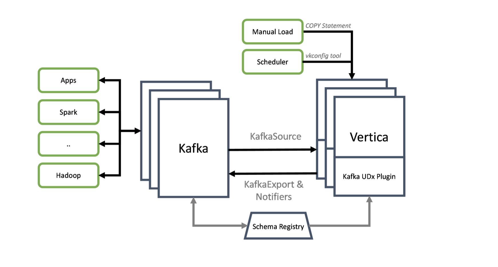
## 从Kafka中消费数据
Vertica有两种方式来消费Kafka的数据：
+ 通过执行COPY语句，手动的消费数据（Manually）,使用手动方式一般出于以下的理由：
```text
相比较scheduler能更好的控制数据消费，比如我们只需要数据流中的部分数据块，这些数据块是某个时间范围内的数据。
在使用scheduler前，先手动的消费部分数据来测试我们是否正确的进行了配置。
```
+ 使用scheduler来自动的消费数据，通过这种方式我们能获得源源不断的数据，并且能保证Kafka的数据只会被消费一次（exactly-once）。
## 生产数据到Kafka
同样的有两种方式来生产数据：
+ 利用notifiers将Data Collector tables的数据提供给第三方的监控工具。
+ 利用KafkaExport提供的函数（function）将数据导入到Kafka中。
## Kafka and Vertica Configuration Settings
### Vertica Producer Settings
queue.buffering.max.messages：
```text
指定Vertica生产队列的大小。该值越大，内存开销越大，但是会降低队列满后丢失的机会。
```
queue.buffering.max.ms：
```text
Vertica发送消息的最大时间，值越小，能降低发送消息的延迟，值越大，能增加吞吐量，但是可能导致队列满。比如设置100s，那么每次发送100s这个时间范围内的数据。
```
message.max.bytes：
```text
一个消息的最大值。
```
message.send.max.retries：
```text
指定消息传送给broker的次数。值越大，成功几率越高。
```
retry.backoff.ms：
```text
Vertica发送数据失败后，重新发送的时间间隔
```
request.required.acks：
```text
从broker收到的acknowledge的如果超过该值，那么认为数据传输成功(delivery successful)
```
request.timeout.ms：
```text
等待broker回应的超时时间。
```
### Kafka Broker Settings
message.max.bytes：
```text
一个消息的最大值，注意的是这个值必须跟Vertica Producer Settings中的message.max.bytes一样。
```
num.io.threads：
```text
指定broker中多个线程来处理请求。
```
num.network.threads：
```text
指定broker中多个线程来接受网络请求(network requests)
```
### Vertica Consumer Settings
message.max.bytes：
```text
该值必须跟Vertica Producer Settings中的message.max.bytes以及Kafka Broker Settings中的message.max.bytes一样。
```
## Manually Loading Kafka Data Example
通过一个例子来介绍手动的消费数据时候用到的选项：
图2：
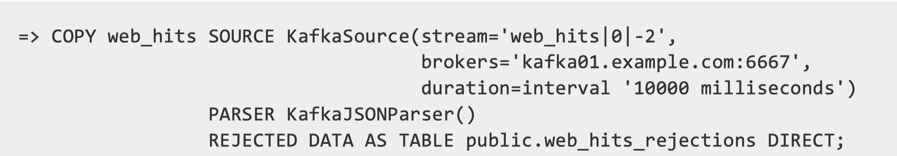
这个例子中我们需要从Kafka中消费JSON格式的数据到表web_hits中，由于是JSON格式的数据，所以我们在创建表的时候不能使用标准的Vertica表（standard Vertica table）。我们需要创建一个flex table来存储这种半结构化数据（Semi-structured Data）。在导入数据前，我们必须确定以下的信息才能正确的消费Kafka数据：

+ Kafka集群中broker的host名字或者IP地址跟端口号。在这个例子中，提供了host名字跟端口，即kafka01.example.com跟6667。
+ Kafka的topic以及partition。在这个例子中，即stream参数后的值。topic的名字是web_hits，partition是0。
+ topic的offset。同样的是stream参数后的值，即-2，offset的值为2。
+ 解析Kafka的parser。根据Kafka中的数据格式来定义一个parser，在这个例子中，使用KafkaJSONParser。
+ Rejected表。如果Kafka数据不能被parse，那么这条数据就会被入到到Rejected表中。
+ COPY语句的持续时间，即duration参数。由于数据流一直源源不断的写到topic中，我们需要指定COPY语句执行的时间。有四种方式可以选择：
    + 设置一个消费时间，超过该值后，停止COPY操作。
    + 设置一个超时时间，当没有新的数据可以消费后开始计时，超时后停止COPY操作。
    + 一旦消费队列为空则马上停止COPY操作。
    + 设置starting offset跟ending offset，在消费完指定的数据段后，停止COPY操作。

​        在这个例子中，属于上面的第一种情况，执行10000毫秒的COPY操作后，停止COPY操作，如果只花费8秒就消费了所有的数据，那么如果2秒内还有新的数据，同样也会消费。
还有一个参数是executionparallelism，它用来描述Vertica用多少个线程去消费。在这里没有设置这个参数的值，那么Vertica会根据partition的个数自动的开启对应线程去消费。
## Automatically Copying Data From Kafka
相比较手动方式，使用scheduler来实现从一个或多个topic中自动的消费数据，有下面的优点：

+ 数据流可以源源不断、自动的入到数据库中，导入的频率可以通过设置scheduler中frame的duration来控制。
+ scheduler能保证对相同的数据只会消费一次，也就是scheduler能替我们来管理offset。
+ 我们可以配置备用scheduler（backup scheduler），使得当主scheduler（primary scheduler）由于某些原因失效后，备用scheduler能自动的接管读取数据的任务，实现高可用。
+ scheduler能管理消费数据时的资源。我们只要在resource pool中指定用量（usage）。在手动模式中，我们必须自己考虑资源问题。

### Setting up a Scheduler
下面介绍配置一个scheduler的需要的步骤：
#### Create a Config File (Optional)
有些配置是固定不变的，比如Vertica地址、端口号、用户名密码等等。我们可以将这些数据写到一个配置文件中。
#### Add the vkconfig Directory to Your Path (Optional)
将vkconfig这个脚本设置为环境变量。
#### Create a Resource Pool for Your Scheduler
Vertica建议为scheduler创建一个专有的resource pool，能让你更好的调整（fine-tune）对Vertica集群的影响。创建resource pool需要很多的选项，这里介绍几个关键的选项：
##### PLANNEDCONCURRENCY
该值定义了COPY语句的并发度，每一个COPY语句对应一个topic。建议设置为比topic个数稍微大一点的值。（Setting it slightly higher than the number of topics is a good practice）。
##### EXECUTIONPARALLELISM
该值定义了读取一个topic开启的线程个数，线程个数反应了这个topic中的partition个数。建议该值能使得每一个线程都能读取相同个数的partition（you should set the EXECUTIONPARALLELISM to a value so the threads have an equal number of partitions to read from）。例如假设有100个partition，那么设置10个线程的话，就能使得每个线程都从10个partition中读取数据。
#### Create the Scheduler
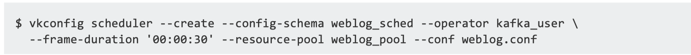
其中只有--create --config-schema这两个是必选项。
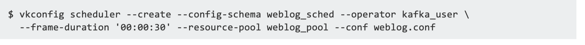
这里可以使用我们定义的配置文件configFIle跟resource pool。
#### Create a Cluster
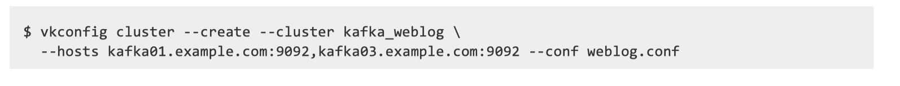
指定Kafka集群的信息，在这个例子中包含了Kafka的host名字、端口号，并且一些固定信息可以写在config file中，即weblog.conf文件。
#### Create a Source
我们定义source来让scheduler去消费数据
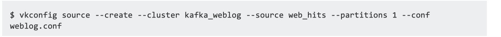
这个例子中，topic名字是web_hits，注意的是如果 - -partitions参数的值为3，那么会读取0，1，2，3的partition数据。
#### Create a Data Table
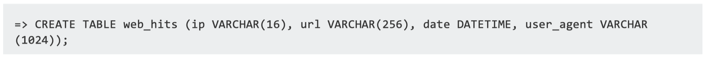
用于存储数据的表，根据数据格式来建立标准Vertica表（standard Vertica table）还是 flex table。
#### Create a Target
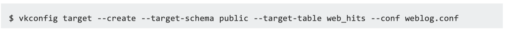
—taret-table参数表示往这个表中写入消费的数据
#### Create a Load Spec
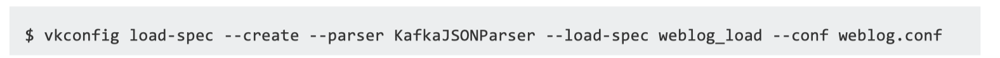
根据Kafka中的数据来定义一个解析规则，在这里消费队列中的数据是JSON类型，所以使用KafkaJSONParser，weblog_load用来给次create这个操作定义一个名字，这个名字必须与update、delete的操作名字不一样。
#### Create a Microbatch
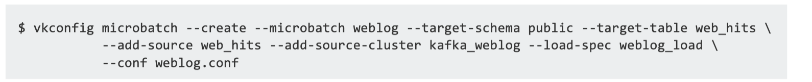
上图中的参数包含之前所有步骤中出现的数据。
### Launch the Scheduler
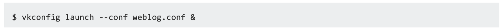
执行此命令来运行scheduler。
### Checking that the Scheduler is Running
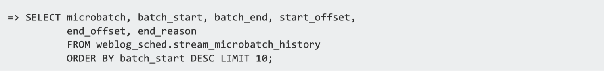
使用上面的命令来检查scheduler是否运行成功。weblog_sched是创建scheduler时候指定的名字。


