## Vertica数据库的特点
### 列式存储（Column Storage）
Vertica利用列式存储方式，使得在查询数据时能提供最好的性能。相比较基于行（row-base）的存储，列式存储能在较高负载下能显著降低磁盘I/O，因为在Vertica只需要读取部分在查询语句中指定的列的数据。
```mysql
SELECT avg(price) FROM tickstore WHERE symbol = 'AAPL' and date = '5/31/13';
```
对于上面的查询语句，列式存储只需要读取3列的数据，而基于行的存储的数据库则需要读取所有的列数据：
图1：
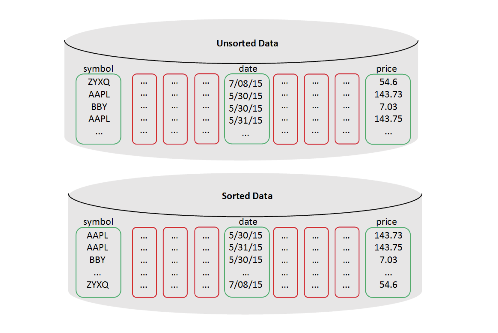
### 数据编码跟压缩（data Encoding and Compressing）
Vertica使用编码跟压缩来优化查询性能以及节省存储空间。编码能使得数据转化为标准的格式，并且针对不同的原始数据格式来使用不同的编码策略。对数据进行编码能提高性能，是因为在查询能显著的降低I/O。
图2：
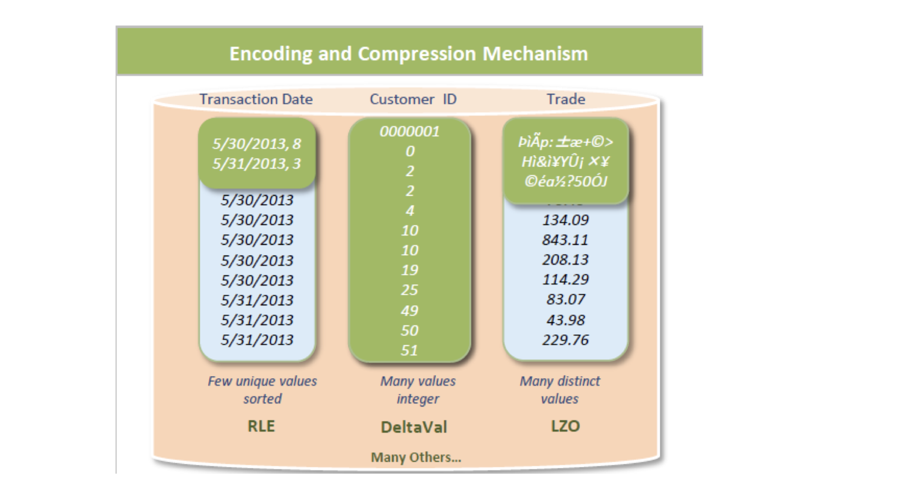
提供的压缩算法有 GZIP、BZIP、LZ4等。。。
### 集群（Clustering）
Vertica通过在集群中增加结点来扩展数据库集群，并且分布式存储冗余数据来实现高可用。
图3：
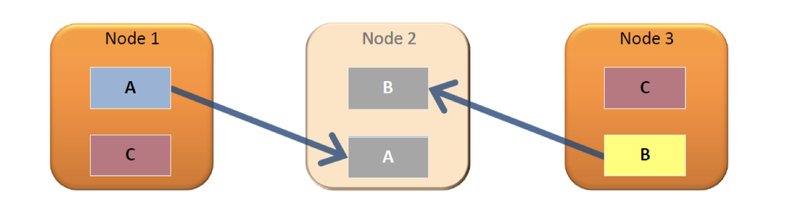
当新增一个结点到集群中，或者失效的结点重新变的可用，这些结点能自动去别的结点进行查询操作并更新本地的数据。
### 投影（Projections）
Projections由多个列的子集组成，这些子集有相同的排序规则，我们对原始数据(整张表)的查询，实际会被转化为查询Projections来返回查询结果。
图4：
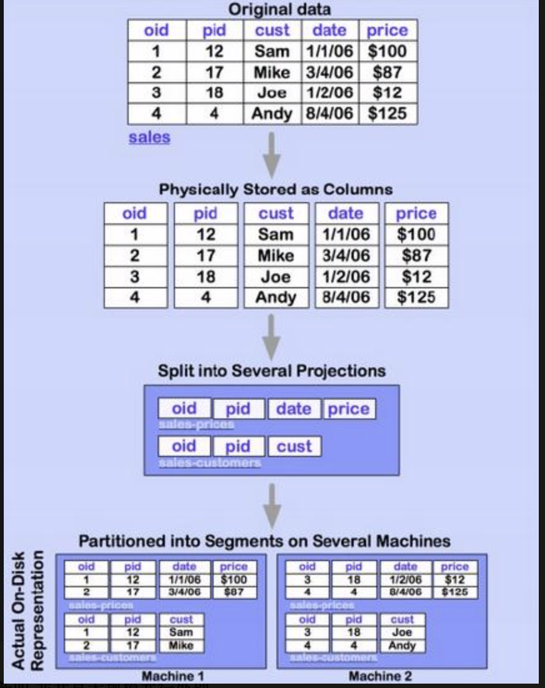
Projections中的数据同样的分布在不同的结点上，来保证一个结点的Projections失效后，其他的结点能提供副本数据。

## Vertica数据库模式（Datebase Mode）
在Vertica中可以创建两种数据库模式：Enterprise Mode和Eon Mode。我们在安装Vertica的时必须选取其中一种模式，并且安装完成后并不支持数据库模式的切换操作。
### Enterprise Mode 简述
图5：
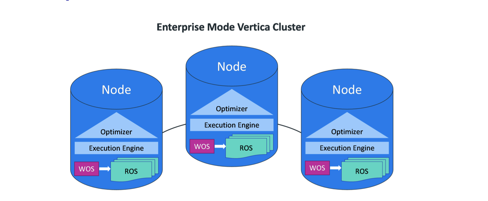
Enterprise Mode是默认的安装模式，这种模式下数据分布在所有的结点的ROS (Read-Optimized Store)容器中。
Enterprise Mode的扩展性能差于Eon Mode，从Enterprise Mode中移除一个结点或者增加一个结点都是比较困难(harder)的，因为Vertica需要在结点间重新分配(redistribute)本地已经存储的数据。
Enterprise Mode相比较Eon Mode优点在于它支持更多的平台，它能安装在物理机、虚拟机、以及能提供云服务的厂商（Amazon AWS, Google Cloud Platform, or Microsoft Azure）。

### Eon Mode 简述
图6：
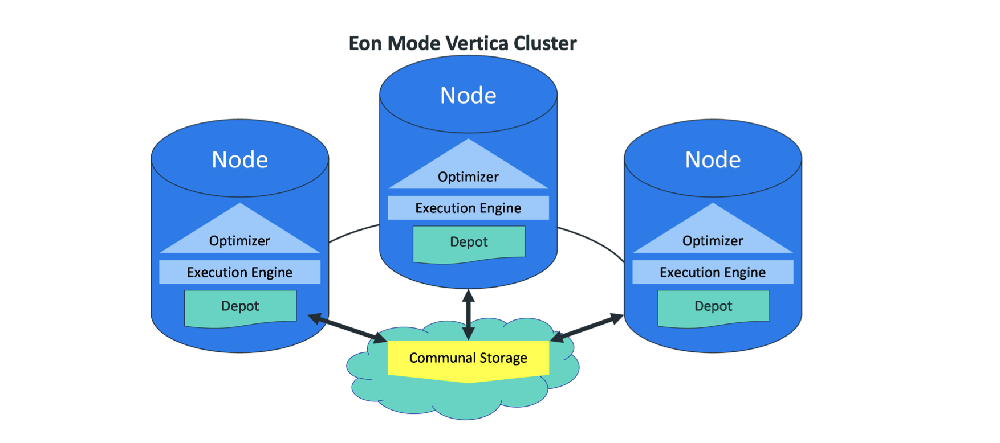
Eon Mode优化了数据库的扩展能力，这种模式能基于当前的数据库工作负载情况自动的更改结点的数量，并且数据都存放在一个集中公用仓库（communal repository）中，由于集群中的结点不存储数据，所以很容易增加或者移除结点。
当数据库的工作负载增大时，能够自动的增加结点到集群中来提高计算能力。由于数据的中心化存储，所以发生结点个数变化时，Vertica不需要花费额外的时间去平衡结点之间数据。对于新增一个结点，这个结点只要从公用仓库中读取数据即可。
在工作负载较低时，可以随时的关闭某个结点，并且不用担心数据不可见的问题。
Eon Mode在当前版本9.x中只支持在Amazon's AWS上运行。
## Enterprise Mode和Eon Mode对数据库架构（Architecture）的影响
数据库模式决定了Vertica如何存储数据，Enterprise Mode将数据存储在结点的文件系统中，而Eon Mode则是将数据集中存储在公用仓库（communal repository）中。由于两种模式存储的本质不同，一旦确定了一种模式，就能切换到另一个中模式。
### Enterprise Mode Concepts
图5：


#### Hybrid Data Store
在Enterprise Mode中，有两种容器（containers）来存储数据：
+ WOS: Write Optimized Store，在这个容器中，数据没有被压缩跟索引，并且存储在内存中，可以使用INSERT、UPDATE、COPY操作将数据写入到WOS中。
+ ROS: Read Optimized Store，在这个容器中，数据经过编码压缩处理存储在磁盘上，可以使用COPY将数据写入到ROS中。

WOS可以防止 trickle load来产生体积较小的ROS容器，数量大的那些较小ROS容器处理的性能低于一个较大的ROS容器。在WOS的数据写入到ROS的过程中，使用Tuple Mover来实现，Tuple Mover主要执行下面的操作：
+ 将WOS的数据写入到ROS中，在这个过程对数据进行排序，编码，压缩。
+ 将较小的ROS容器进行合并（Merge）。
通常我们使用COPY来实现数据的载入，因为这个操作实现了块的传输。
图7：
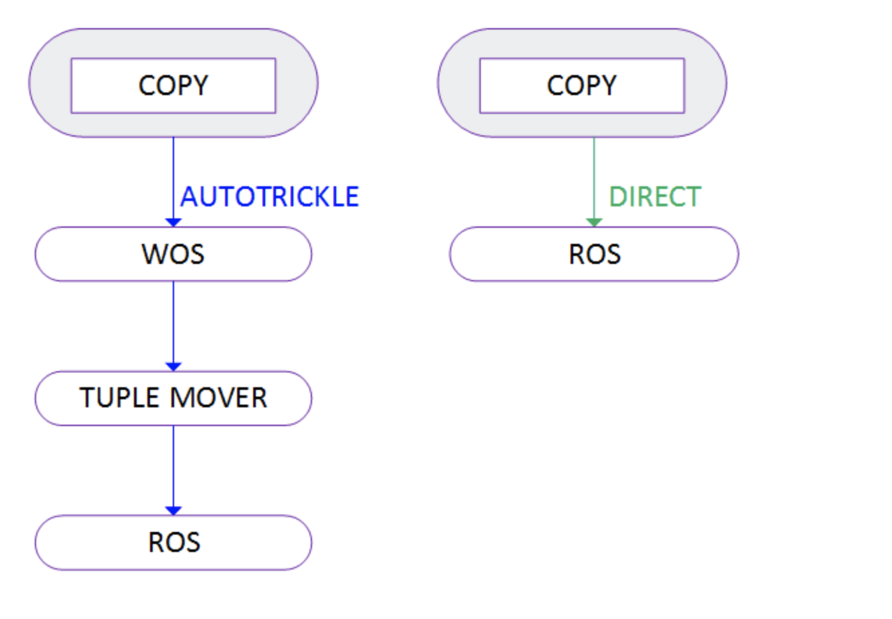
#### Data Redundancy
在Enterprise Mode模式中，数据分布在不同的结点，当出现结点失效，并且这个结点的冗余数据（Data Redundancy）无法从别的结点获取，出于安全考虑，Vertica会自动关闭数据库，因为有些数据不可见了。
#### K-Safety
K-Safety描述了在数据库集群中的故障容差（fault tolerance），值K描述了在集群中数据备份的份数。这些数据备份即Data Redundancy，使得结点失效后，其他结点能接任失效节点的工作。
在Vertica中，K-Safety的值K可以被设置为0、1、2。如果K值为1，那么说明集群中有一个结点失效，数据库照样能正常运行，当集群中又一个结点发生失效，运气好的话（下文会介绍什么是运气好的情况），数据库还是能正确运行，只要保证这个失效结点上的数据在其他运行正常的结点上有Data Redundancy。同样地，如果值K为2，意思就是集群中可以有两个结点失效，并且还能保证数据库正常运行。

```text
当失效的结点个数超过集群中的半数，那么即使所有数据在集群中可见，Vertica也会关闭数据库。
```
#### Buddy Projections
Buddy Projections即数据分片的副本，K-Safey正是使用Buddy Projections来处理结点失效问题。
#### K-Safety Example
##### K = 1
图8：
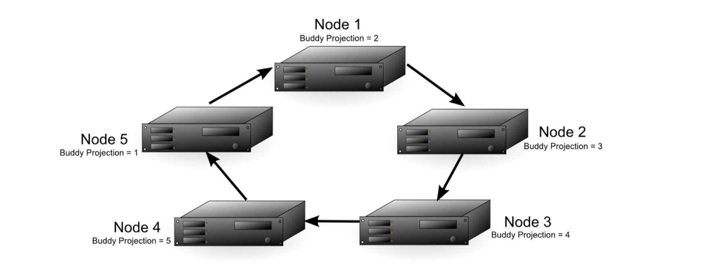
上图中，集群中有5个结点，并且K-Safety的值K为1，另外Node1的Buddy Projections的值是2，表示Node1中本分Node2的数据。如果任意一个结点失效，那么数据库仍能正确运行，但是在失效节点重新恢复功能前，接管失效结点的结点的性能会有所下降，因为它增加了一个结点的工作量。
图9：
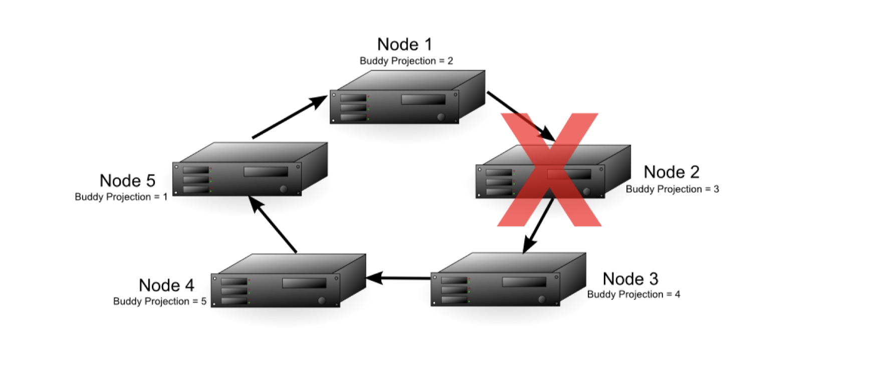
上图中Node2失效了，由于Node1中有Node2的Data Redundancy，即Buddy Projections，所以数据库仍能正确运行。此时数据库的故障容差从1降至0，即此时如果再出现一个结点失效，就可能导致不安全(有些查询获得的数据是不完整的)。在这个例子中，如果Node1或者Node3失效，那么就会出现数据缺失问题。如果Node1失效，那么集群中缺少Node2的数据，如果Node3失效，那么集群中缺少Node2，Node3的数据。
Node1跟Node3在Node2失效后被称为 临界节点（critical nodes）。注意的是，如果在Node2失效后，Node4或Node5其中一个失效，集群中的数据仍然是完整的，所以数据库仍然能正常运行。比如下图中Node4失效：
图10：
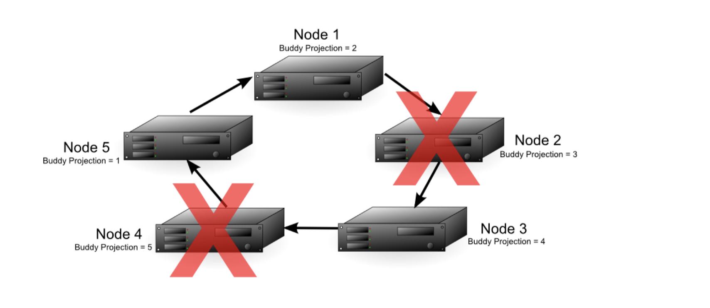
此时Node1、Node3、Node5都成为了 临界节点，此时任意一个结点失效都会导致数据不完整，数据库会被自动关闭。
##### K = 2
当值K为2时，如下图
图11：
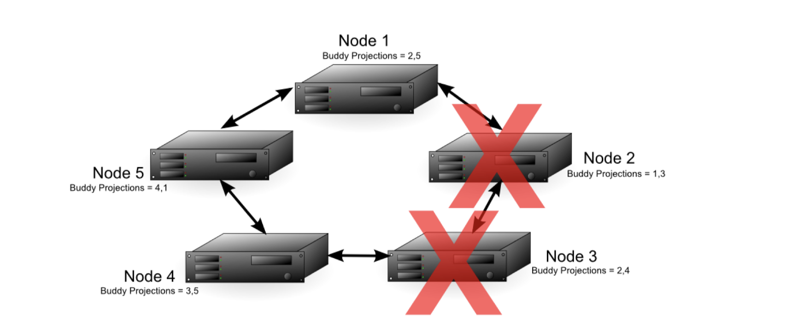
即使Node2跟Node3失效，它们两个的数据的备份可以从Node1、Node4中获得，所以数据库仍能正确运行。注意的是如果此时Node5失效了，尽管Node1有Node5的数据备份，即集群中仍有完整的数据，由于失效结点的个数已经超过了集群结点半数，所以此时数据库仍然会被视为不安全，即自动关闭。

#### High Availability With Projections
为保证高可用跟数据恢复，Vertica提供了两种投影（Projections）方式
##### Replication (Unsegmented Projections)
将那些较小的，未分段(Unsegmented)的数据存储到所有的结点上。这种方式能保证跨结点分布式查询，并且利用K-Safety来提供跟Buddy Projections一样的功能，从所有结点都可以恢复数据。
下图中 投影B跟投影C 作为Data Redundancy存储在所有结点上。
图12：

##### Buddy Projections (Segmented Projections)
对于数据较大的情况，某个结点的数据会被分段，然后存储到多个结点中。
图13：
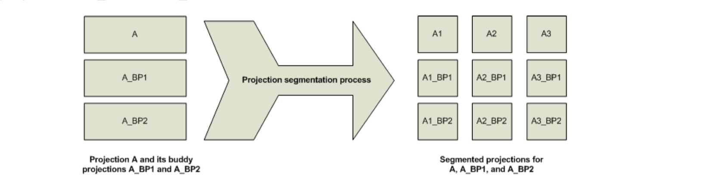
上图中，数据A被分为三段，即A1、A2、A3，每一段被分成两个Buddy Projections，比如A1_BP1、A2_BP2。
图14：
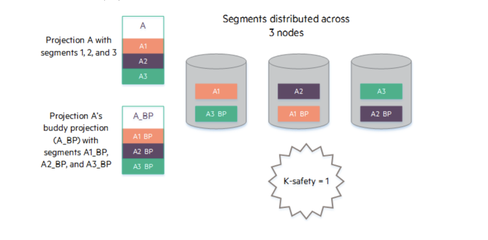
上图中，数据A被分为3段，每一段作为一个Buddy Projections，被存储到不同的结点上。

### Eon Mode Concepts
图5：

Eon Mode将计算跟存储功能进行分离，使得存储可以存放到一个单独的区域，比如说云端(Amazon AWS)，并且根据计算能力需求方便的更改计算节点数量。完整的Eon Mode集群，包含计算跟存储，并且部署在云端的，目前只有Amazon AWS提供。
图15：
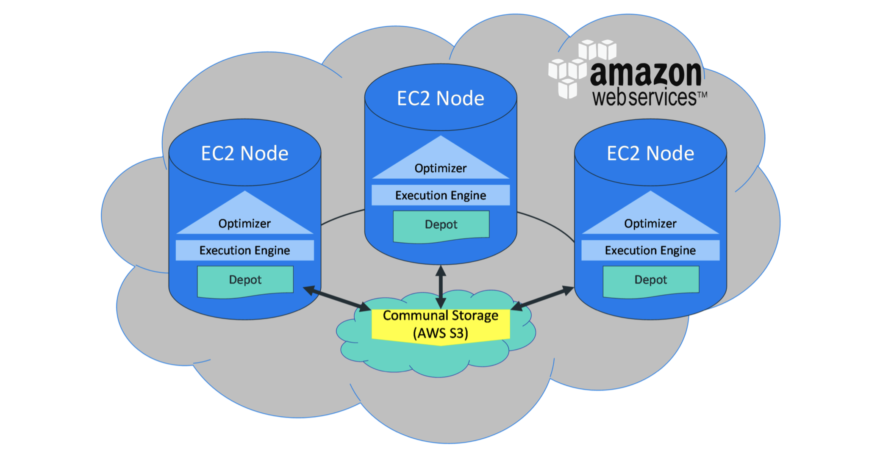
Eon Mode满足不同的需求跟数据量，由于计算跟存储的分离，所以可以根据实际需求进行不同的扩展
图16：
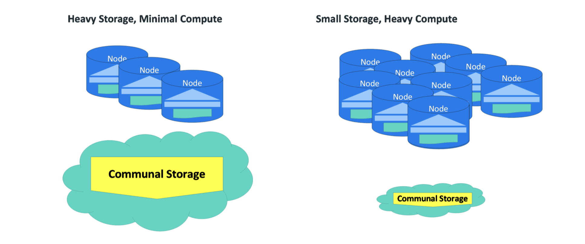

#### Communal Storage
跟Enterprise Mode中的本地存储不一样的是，Eon Mode使用Communal Storage来统一存储数据，Communal Storage被所有的结点共享，在Communal Storage中，数据被划分为不同的分区，每一个分区成为一个shards。
#### Compute Nodes
Compute Nodes负责数据的计算处理，一个compute node存储一个频次最高查询的结果和它从Communal Storage中订阅的shards的副本。每一个compute node可以订阅多个shards，这些shards中的数据被存储在compute node的depot中，depot是一个类似Cache的组件。当处理的数据不在depot中时，compute node会去Communal Storage中读取数据。depot组件使得减少了与Communal Storage的交互，提高了查询性能。
#### Loading Data
当一个compute node载入新的数据时，无需先将数据写入到Communal Storage中，并且其他订阅了相同shards的compute node能同时更新新载入的数据，同样的不需要等待Communal Storage的数据同步。通过这种点对点的数据同步，使得当compute node失效后，另一个结点能接任它的工作，并且处理的数据已经被热加载了。
图17：
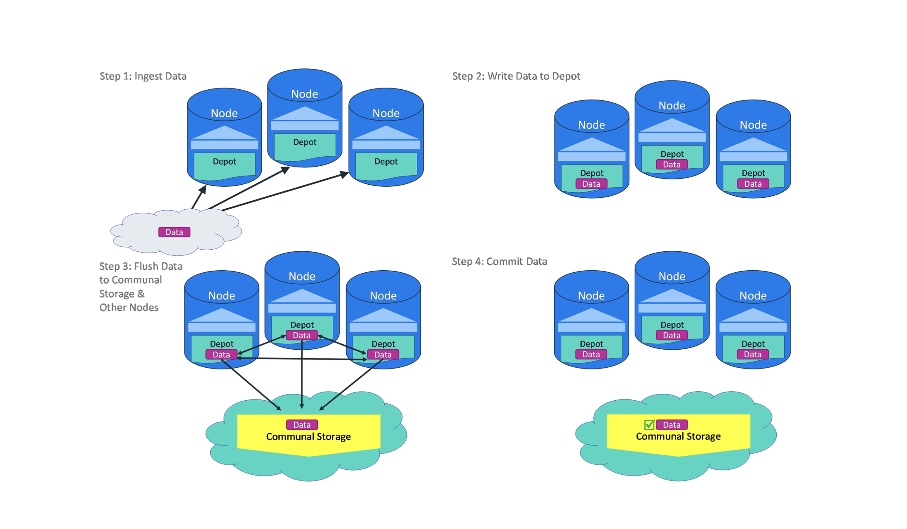

#### Querying Data
在查询数据时，先使用depot中的数据来尝试处理当前的查询，如果当前depot无法处理时才会去Communal Storage中读取数据。当这个问题发生时，要考虑re-sizing depot中的数据。
#### Shards and Subscriptions
在Eon Mode中，数据被分段（segment）处理为多个shards，compute node订阅一个或多个shard，这样保证了当一个结点失效后，其他的结点仍然能提供完整的数据。
图18：
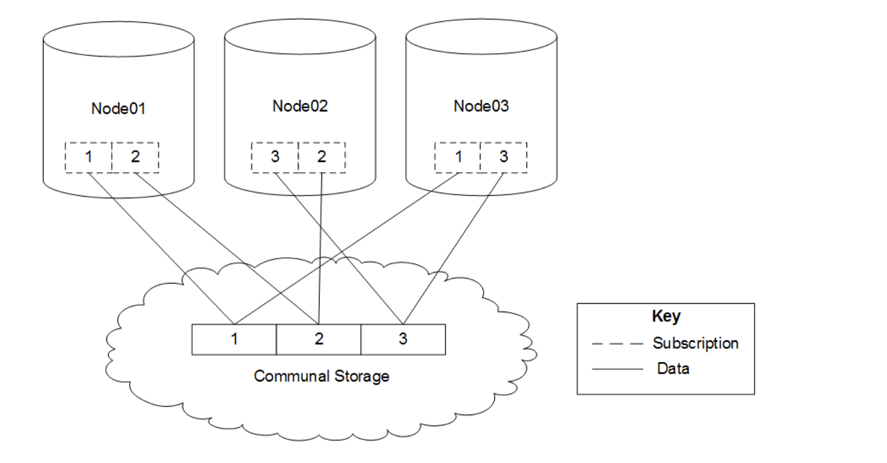

#### Expanding Your Cluster
图19：
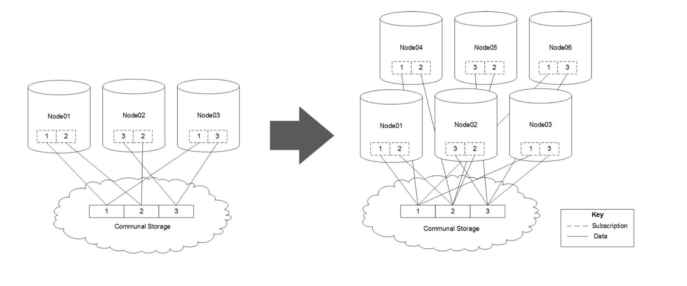
上图又原先的 3-node，3-shards扩容到 6node，3-shards。

```text
如果收缩（scale down）集群, Vertica会自动的调整数据的分布，但如果是扩容集群，就必须手动调整。
```
#### Elasticity
Elasticity或者说是Elastic Throughput Scaling（ETS），使得Vertica提高查询并发量，即提高了吞吐量。Vertica通过冗余的shards订阅来实现并行查询。比如说3-shards，6-nodes，每一个shards被两个node订阅， 那么这时候就可以实现2个并行查询，如果是3-shards，9-nodes，那么就可以实现3个并行查询。
图20：
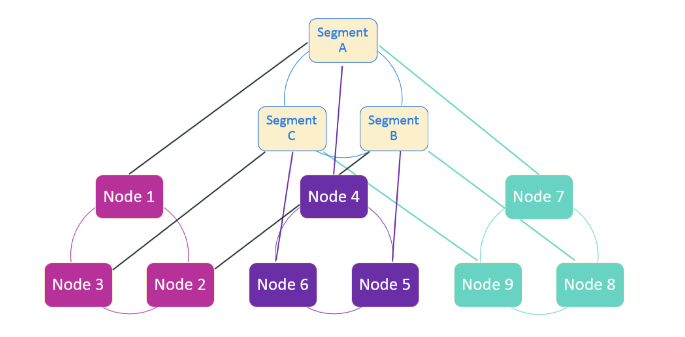
上图中是 3-shards，9-nodes的例子。我们可以通过Node1、Node2、Node3我们可以实现一个查询query1；Node4、Node5、Node6实现另一个查询query2；Node7、Node8、Node9实现查询query3。query1、query2、query3能实现并行查询。
### Common Vertica Concepts
#### Data Types
Vertica支持的数据类型
##### Structured Data
结构化数据，在关系系数据中最常见的数据类型，这些数据被存储在以行跟列的表中，并且能直接存放已经被定义好的域（field）中，即最常见的表结构。
##### Semi-structured Data
半结构化数据，即不驻留(reside in )在数据库中的数据。比如XML、JSON。
##### Unstructured Data
非结构化数据。这类数据没有一个固定的数据结构，比如说视频文件、文本文件、Email等，在Vertica中使用Flex Tables来处理。
## Partitioning Tables
分区表（Partitioning Tables）将表中的数据根据某个列名分布到不同的ROS容器（containers）中，一般情况下都是根据时间片（time slices）进行分区，如果数据中的时间跨度有几十年，一般按照年进行分区，如果是一年的数据，一般按照月进行分区。对数据进行逻辑分区能明显的提高查询性能，比如说查询的数据分布在3个分区，那么查询优化器（query optimizer）能隔离出这3个分区，并且只在这些分区上执行查询任务。
分区同样的能提高DML（INSERT、UPDATE、COPY、DELETE）操作，比如说表中的数据按照月进行分区，并且当有新的数据查询时，旧的数据需要删除，那么通过分区功能，Vertica能快速的定位旧数据所在的ROS容器，并执行删除操作。

### Defining Partitions
+ 在CREATE TABLE时定义分区。
+ 通过ALERT TABLE来对已经存在的表进行分区。
+ 创建partition groups来减少ROS容器数量。
### Hierarchical Partitioning
层级分区（Hierarchical Partitioning）可以让表中的数据按照我们定义的区间来进行分区，比如数据好几年前的那些数据可以按照年进行分区，而最近几年可以按照月进行分区，最近的可以按照天进行分区，即根据当天的时间来对数据进行不同层级的划分，并且随着时间的推移，原先按照天进行分区的数据会被重新按照月分区，而原先按照月进行分区的数据会被重新按照年分区，即层级分区是动态的分区。
如果我们只是静态的按照天、月、年进行分区，随着时间的推移，ROS容器的数量会不断的增加，从而降低查询的性能。Vertica建议每一个projection中ROS容器数量不要超过50。例子如下：

```mysql
ALTER TABLE public.store_orders PARTITION BY order_date::DATE GROUP BY CALENDAR_HIERARCHY_DAY(order_date::DATE, 2, 2) REORGANIZE
GROUP BY ( CASE WHEN DATEDIFF('YEAR', partition-expression, NOW()::TIMESTAMPTZ(6)) >= active-years
THEN DATE_TRUNC('YEAR', partition-expression::DATE) WHEN DATEDIFF('MONTH', partition-expression, NOW()::TIMESTAMPTZ(6)) >= active-months
THEN DATE_TRUNC('MONTH', partition-expression::DATE) ELSE DATE_TRUNC('DAY', partition-expression::DATE) END);
```
上面的例子中，将所有的数据的时间戳跟当天的时间戳进行比较，如果时间差值超过2年，那么这些数据按照年进行分区，如果不超过2年，但是时间差超过2个月，那么这些数据按照月进行分区，其余的数据按照天进行分区。
比如今天的时间如果是2017-09-26，那么分区后如下图：
图21：
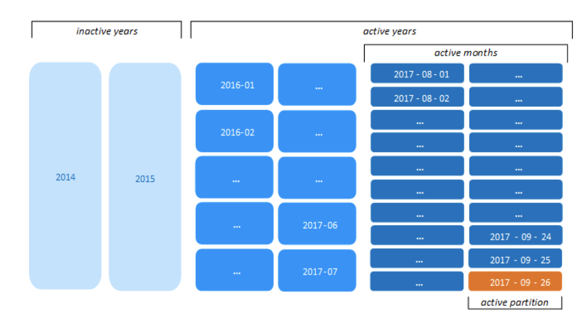
上图中 ROS容器的数量只有40个，没有超过Vertica的建议值50。
如果今天的时间到了2017-10-01，那么Vertica会对分区进行自动调整，如下图：
图22：
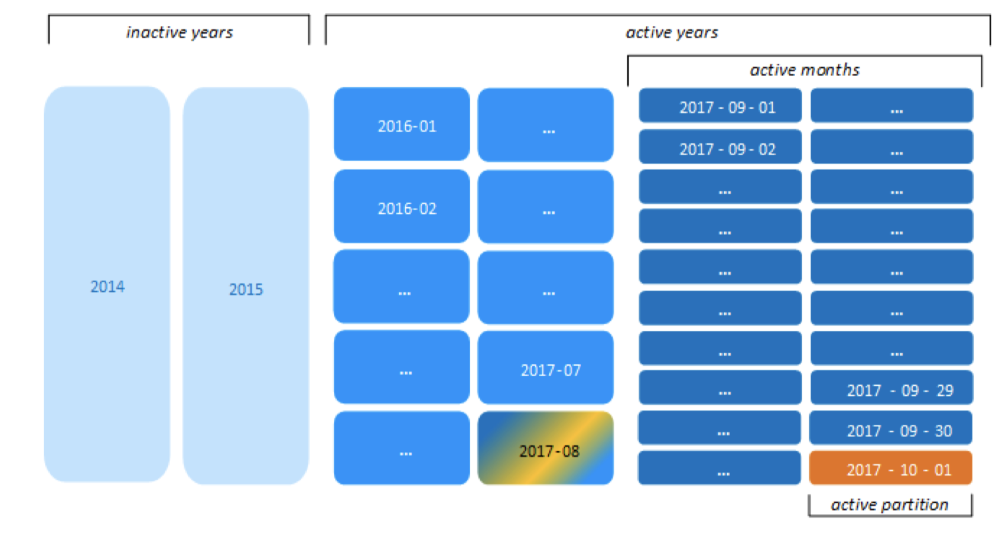
注意的是由于2017年8月份有部分天的数据跟当天时间2017-10-01相比超过了2个月，所以8月份所有的数据都按照月进行分区。
如果今天的时间到了2018-01-01，调整后的分区如下图：
图23：
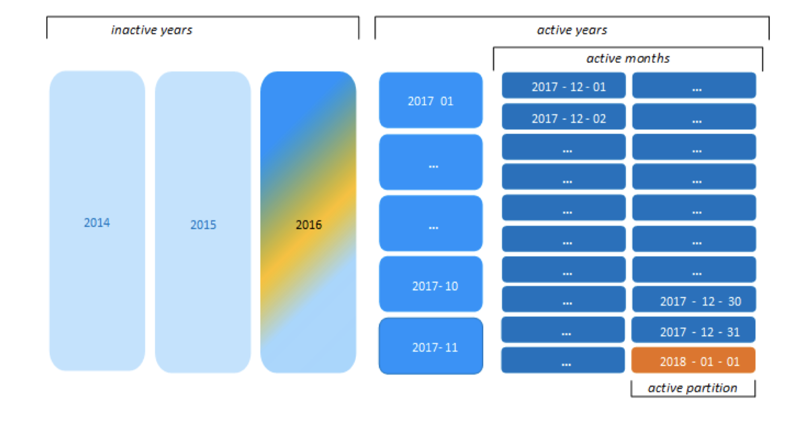

### Partitioning and Segmentation
Partitioning和Segmentation在Vertica中不同的两个概念：
+ Segmentation：它将数据分布在集群的不同结点上，目的是为了多个结点都能参与同一个query任务
+ Partitioning：它是将一个结点上的数据进行分区来实现分布式计算，结点分区主要目的是帮助你很容易的处理想要丢掉的数据并且能重新利用磁盘空间。下图中解释了它们之间的关系：
图24：
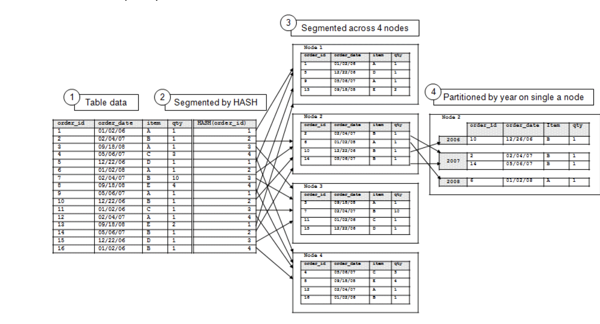
其中：
1. Example table data。
2. Data segmented by HASH(order_id)。
3. Data segmented by hash across four nodes。
4. Data partitioned by year on a single node。
## Database Design
一个设计（design）描述的是物理存储计划（physical storage plan），它用来提高查询性能。Vertica的数据以投影（Projections）的方式的物理存储，当我们执行INSERT、COPY时，Vertica为一个表默认生成一个superprojection，即Auto-Projections。这个superprojection能保证表中的所有数据对所有的查询可见，但是它没有优化数据库性能，导致查询性能、数据压缩性能较差，所以Vertica提供了数据库设计（Database Design）使得我们可以通过它来优化数据库性能。
Database Design可以随着实际工作负载随时进行重新设计，并且Database Design在运行时耗时较长，但由于可以在后台运行，所以重新设计后的Database Design可以选择在一个恰当的时间运行。

### General Design Options
当我们创建一个design时，可以选择下面几个选项：
+ 创建一个comprehensive design或者incremental design。
+ 选择优化目标：Load、Performance、两者兼顾。
+ K-Safety。
+ projections是否分段。
+ 创建design前是否先分析数据。
### Design Input
design的输入即优化的目标，分为两种：
#### Design queries
待优化的query，一般选取最常用，或者开销较大的query。
#### Design tables
待优化的表。
### Design Restrictions
不能用于live aggregate跟Top-K projections，不能用于LONG VARBINARY跟LONG VARCHAR类型的值。

